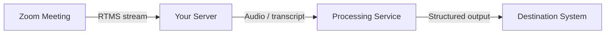

---
# ── Required — validation fails without these ───────────────────────────────
title: "Outcome-oriented title — what the reader ends up with"
slug: "your-blueprint-slug"        # MUST match this directory's name
description: >-
  One to two sentences: capture X with [product], do Y, deliver [outcome].
  Shown on cards and used for SEO — write how a customer would search.
products: ["rtms"]                 # ids from /taxonomy.json → products
verticals: ["enterprise"]          # ids from /taxonomy.json → verticals
difficulty: "intermediate"         # beginner | intermediate | advanced
estimated_time: "2-4 hours"        # honest wall-clock estimate to implement
author: "Your Name"
status: "draft"                    # draft | review | published
updated: 2026-08-04                # YYYY-MM-DD, bump on every edit

# ── Strongly encouraged — the site hides blueprints without a repo ──────────
github_repo: ""                    # sample code lives in its own repo, linked here

# ── Optional — delete what you don't use ────────────────────────────────────
# solution_types: ["transcription-summarization"]   # ids from /taxonomy.json
# tags: ["real-time", "hipaa"]                      # free-form
# seo_title: "What someone would Google to find this"
# seo_keywords: ["zoom something integration", "two to four phrases"]
# partners: ["anthropic"]                          # ids from /taxonomy.json → partners
# demo_url: ""
# license_required: false
# license_note: "Requires RTMS add-on license"
# stack: "Node · TypeScript · Postgres"
# deploy:
#   - { label: "Vercel", url: "" }
---

<!-- HTML comments like these are invisible on GitHub and on the site.
     Delete them as you fill in each section.

     Body rules:
     - GitHub-flavored markdown ONLY. No JSX/MDX components.
     - Diagrams are ```mermaid fences (keep architecture.mmd in sync).
     - Long code blocks may be wrapped in <details> collapsibles.
     - The four H2 sections below are REQUIRED and validated by CI.
     - Do NOT write an Agent Skill Export section — it is auto-generated
       from this content by the build pipeline. -->

## Problem Statement

<!-- Write from the customer's perspective, not Zoom's. What business outcome
     are they after? Ground it in a real use-case pattern — no hypotheticals.
     2–4 paragraphs of continuous prose. Bold Zoom products on first mention. -->

## Architecture

<!-- Open with 1–2 paragraphs explaining the data flow, then the diagram.
     Label every component and connection. -->



## Implementation Guide

<!-- Numbered steps a developer (or coding agent) can follow WITHOUT external
     docs. Show real code with imports, configuration, and error handling —
     not isolated snippets. Include API calls, env setup, and deployment. -->

## App Manifest

<!-- Explain what the manifest.json in this directory configures (scopes,
     event subscriptions, redirect URLs) and how to use it for one-click app
     creation via the Zoom Marketplace manifests API. -->

<!-- Optional sections — add after the required four if you have them:
     ## Demo | ## Deployment Guide | ## Video Walkthrough
     ## Related Blueprints | ## Customer Stories -->
