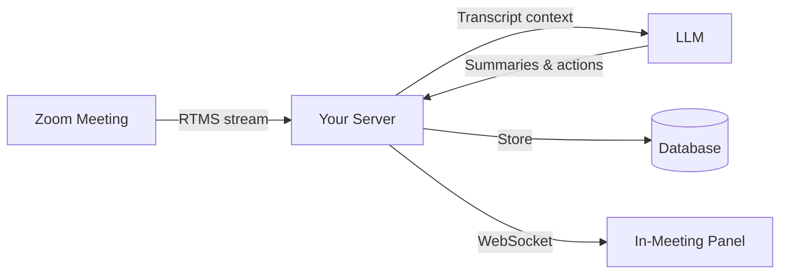

## Problem Statement

Meeting notes are a tax on attention. Someone scribbles while half-listening. Key decisions slip through. Action items get assigned but not captured. And when the meeting ends, the scramble begins: "What did we actually agree on?"

Recording helps, but watching a 60-minute replay to find a 30-second decision isn't practical. AI summaries generated after the meeting are better, but they still arrive too late. By the time you read the recap, you've already context-switched to the next thing.

The underlying problem is timing. **Meeting intelligence should arrive while you're still in the meeting** — when you can clarify, correct, and act on it.

This blueprint puts AI note-taking inside the meeting.

**RTMS** streams the live transcript to your backend with sub-second latency. No bot joins the call. No awkward third-party name in the participant list. Your application processes the conversation as it unfolds and surfaces summaries, action items, and key moments in a panel that participants can reference in real time.

The result: participants stay engaged (no one has to be the designated note-taker), action items are captured as they're spoken, and post-meeting follow-up starts before the meeting ends.

### What You'll Build

An AI-powered meeting notetaker that:

- Streams live transcripts from Zoom meetings using RTMS
- Generates rolling summaries as the conversation progresses
- Extracts action items with owners and deadlines
- Highlights key moments (decisions, announcements, open questions)
- Displays everything in a Surface App panel visible to participants

<div align="center">
  
  
</div>

### See It In Action

Watch a demo of the meeting notetaker experience:

[](https://www.youtube.com/watch?v=4N-g5TgGRz0)

---

## Architecture

### The No-Bot Advantage

Traditional meeting assistants join as participants. A third-party name appears in your roster. Attendees notice. For internal meetings, it's a distraction. For customer calls, it can feel invasive.

This architecture takes a different approach. **RTMS streams the transcript directly from Zoom's infrastructure** — no bot participant, no unfamiliar name, no "who invited that?" moment. The standard transcription notice still appears. The difference is in how it feels: focused on the conversation, not the tooling.

### Real-Time, Not Post-Call

RTMS delivers transcript segments over WebSocket with sub-second latency. Your backend receives each phrase as it's spoken — typically within 300-500ms. That's fast enough for live summaries and action item extraction.



**Arlo runs as a Zoom Surface App.** All participants see a sidebar panel with the live transcript, AI summaries, and action items.

### The Intelligence Layer

Your backend is the orchestration point — and it's yours to customize. Swap LLM providers. Add calendar integrations. Push action items to your task manager. The RTMS stream is the input; what you do with it is up to you.

The core flow:

1. **Ingest** — Receive RTMS transcript segments, buffer for out-of-order delivery, persist to Postgres
2. **Analyze** — Build prompts with conversation context, call your LLM of choice, extract insights
3. **Deliver** — Push summaries and action items to the frontend over WebSocket in real time

### Component Walkthrough

**RTMS Transcript Stream**

When a meeting starts and the user enables Arlo, the Zoom client calls `startRTMS` through the Zoom Apps SDK. This triggers a webhook to your backend with connection details. Your backend then opens a WebSocket to receive transcript segments.

Each segment includes:
- Speaker ID and display name
- Transcript text
- Start and end timestamps (milliseconds)
- Sequence number for ordering

**Backend Processing (Node/Express)**

The backend maintains a WebSocket connection to RTMS for each active meeting. As segments arrive, it:

- Buffers segments for 2-3 seconds to handle out-of-order delivery
- Normalizes speaker labels
- Persists to Postgres for post-meeting retrieval
- Broadcasts to connected frontend clients

**AI Orchestration**

The meeting intelligence logic lives in the Intelligence Layer. When enough conversation context accumulates (or on explicit request), the backend:

- Builds a prompt with recent transcript context
- Calls an LLM (OpenRouter, Anthropic, or OpenAI)
- Parses the response for summaries, action items, decisions, and open questions
- Pushes results to the frontend via WebSocket

**In-Meeting Surface App (React)**

The frontend is a React application embedded in the Zoom client via the Zoom Apps SDK. It connects to the backend over WebSocket and renders:

- Live transcript with speaker labels
- Rolling AI-generated summary
- Action items with owners
- Key moments and decisions
- Open questions to revisit

The panel updates in real time as the conversation progresses.

---

## Implementation Guide

This guide walks through setting up Arlo's notetaker functionality locally. By the end, you'll have a working in-meeting assistant connected to live Zoom meetings.

### One-Click Deploy

Want to skip local setup? Deploy the full stack to the cloud with one click:

| Platform | What You Get |
|----------|--------------|
| [**Deploy to Render**](https://render.com/deploy?repo=https://github.com/zoom/arlo) | Backend, Frontend, RTMS service, Postgres database |
| [**Deploy to Railway**](https://railway.app/new?repo=https://github.com/zoom/arlo) | Backend, Frontend, RTMS service, Postgres database |

Both platforms offer free tiers. You'll need to create an account if you don't have one.

After deploying, you'll need to:
1. Create a Zoom App in the [Marketplace](https://marketplace.zoom.us/)
2. Add your `ZOOM_CLIENT_ID`, `ZOOM_CLIENT_SECRET`, and `ZOOM_WEBHOOK_TOKEN` to the environment variables
3. Update your Zoom App's OAuth redirect URL to point to your deployed backend

Both platforms auto-provision the database and wire up the services. Secrets are generated automatically.

### Local Development

If you prefer to run locally (recommended for development and customization):

### Prerequisites

Before starting, ensure you have:

| Requirement | Purpose |
|-------------|---------|
| [Node.js 20+](https://nodejs.org/) | Runtime for backend services |
| [Docker Desktop](https://www.docker.com/products/docker-desktop/) | Runs Postgres and all services |
| [ngrok](https://ngrok.com/) | Exposes local server for Zoom webhooks |
| [Zoom Account](https://marketplace.zoom.us/) | To create and configure your Zoom App |
| RTMS Access | [Request access](https://www.zoom.com/en/realtime-media-streams/#form) if you don't have it |

### Step 1: Clone and Configure

Clone the Arlo repository:

```bash
git clone https://github.com/zoom/arlo.git
cd arlo
```

Copy the environment template:

```bash
cp .env.example .env
```

### Step 2: Set Up ngrok

Start ngrok to create a public URL for Zoom webhooks:

```bash
ngrok http 3000 --domain=your-subdomain.ngrok-free.app
```

If you don't have a static domain, get one free at [ngrok dashboard](https://dashboard.ngrok.com/domains). Static domains prevent reconfiguration every time ngrok restarts.

Keep this terminal running and note your URL.

### Step 3: Create Your Zoom App

1. Go to [Zoom Marketplace](https://marketplace.zoom.us/) and sign in
2. Click **Develop** > **Build App**
3. Select **General App** and name it (e.g., "Meeting Notetaker")
4. Copy your **Client ID** and **Client Secret**

<details>
<summary><strong>Step 4: Configure Environment Variables</strong></summary>

Edit `.env` with your values:

```bash
# From Zoom Marketplace
ZOOM_CLIENT_ID=your_client_id
ZOOM_CLIENT_SECRET=your_client_secret

# Your ngrok URL
PUBLIC_URL=https://your-subdomain.ngrok-free.app

# Generate these (run the commands, paste the output)
SESSION_SECRET=       # node -e "console.log(require('crypto').randomBytes(32).toString('hex'))"
REDIS_ENCRYPTION_KEY= # node -e "console.log(require('crypto').randomBytes(16).toString('hex'))"
```

</details>

<details>
<summary><strong>Step 5: Configure Zoom App Settings</strong></summary>

In the Zoom Marketplace, configure your app:

**Basic Information:**
- OAuth Redirect URL: `https://YOUR-NGROK-URL/api/auth/callback`
- OAuth Allow List: `https://YOUR-NGROK-URL`

**Scopes:**
- `meeting:read` (read meeting details)
- `user:read` (read user profile)

**Zoom App SDK:**
- Click **Add APIs** and enable required capabilities
- Enable **RTMS > Transcripts**

**Surface:**
- Home URL: `https://YOUR-NGROK-URL`
- Domain Allow List: `https://YOUR-NGROK-URL`

**Event Subscriptions:**
- Event notification endpoint: `https://YOUR-NGROK-URL/api/rtms/webhook`
- Events: `meeting.rtms_started`, `meeting.rtms_stopped`

</details>

### Step 6: Start the Application

```bash
docker-compose up --build
```

Wait for all services to start:
- Postgres database (port 5432)
- Backend API (port 3000)
- Frontend (port 3001)
- RTMS service (port 3002)

### Step 7: Test in a Meeting

1. Start or join a Zoom meeting
2. Click **Apps** in the meeting toolbar
3. Find and open your app
4. Select the **Notes** vertical when prompted
5. Click **Start Arlo** to begin transcription
6. Watch the live transcript appear and AI summaries generate as you speak

### Selecting the Notes Vertical

Arlo supports multiple verticals (Healthcare, Legal, Sales, Support, Notes). Each vertical customizes the UI and AI prompts for its domain.

To use the general notetaker:

1. Open Arlo in a meeting
2. Click the **Settings** icon
3. Select **Notes** from the vertical picker
4. The interface shows live transcript, meeting summary, action items, and key moments

### Customizing Summary Prompts

The notetaker prompts live in the backend. You can customize them for your meeting style (standups, all-hands, brainstorms, etc.).

Key files to modify:

| File | Purpose |
|------|---------|
| `backend/prompts/meeting-summary.js` | Defines how summaries are generated |
| `backend/prompts/action-items.js` | Configures action item extraction |
| `backend/prompts/key-moments.js` | Shapes what counts as a "key moment" |

The prompts receive recent transcript context and return structured JSON that the frontend renders.

---

## App Manifest

The `manifest.json` in this directory defines a Zoom App with in-meeting panel capabilities and RTMS transcription access. Use it as a starting point for your own meeting notetaker.

### Required Scopes

| Scope | Purpose |
|-------|---------|
| `meeting:read` | Access meeting metadata (ID, host, participants) |
| `user:read` | Read authenticated user's profile |
| `zoomapp:inmeeting` | Render the Surface App panel inside meetings |

### RTMS Configuration

RTMS access is configured separately from OAuth scopes. In your Zoom App settings:

1. Navigate to **Features** > **Zoom App SDK**
2. Enable **Real-Time Media Streams**
3. Select **Transcripts** (audio streaming is also available but not required for this blueprint)

### Event Subscriptions

The app subscribes to two webhook events:

| Event | When It Fires |
|-------|---------------|
| `meeting.rtms_started` | RTMS transcription begins in a meeting |
| `meeting.rtms_stopped` | RTMS transcription ends |

Your webhook endpoint receives these events and manages the WebSocket connections accordingly.

### Manifest Structure

```json
{
  "name": "Meeting Notetaker",
  "version": "1.0.0",
  "appType": "generalApp",
  "scopes": ["meeting:read", "user:read"],
  "surfaces": {
    "inMeeting": {
      "main": {
        "defaultWindowSize": { "width": 400, "height": 600 }
      }
    }
  },
  "rtms": {
    "transcripts": true
  },
  "webhooks": {
    "events": ["meeting.rtms_started", "meeting.rtms_stopped"],
    "endpoint": "https://your-domain.com/api/rtms/webhook"
  }
}
```

This is a simplified representation. See the full manifest in [`manifest.json`](./manifest.json) or the complete Zoom App manifest in the [Arlo repository](https://github.com/zoom/arlo/blob/main/zoom-app-manifest.json).

---

<details>
<summary><strong>Production Considerations</strong></summary>

Arlo is a reference implementation designed for learning and prototyping. Before deploying to production, consider:

| Area | Development | Production |
|------|-------------|------------|
| **Credentials** | `.env` file | Secrets manager (AWS, Vault, Azure) |
| **Token Storage** | Postgres with AES | Add encryption at rest |
| **Sessions** | In-memory | Redis or database-backed |
| **WebSockets** | Single instance | Redis pub/sub for horizontal scaling |
| **HTTPS** | ngrok tunnel | Load balancer with TLS termination |

**Scaling WebSocket Connections**

Each active meeting maintains a WebSocket connection for RTMS streaming. For high-volume deployments:

- Use Redis pub/sub to broadcast transcript segments across multiple backend instances
- Implement connection affinity or sticky sessions at the load balancer
- Monitor connection counts and implement graceful degradation

**Data Retention**

Transcript data may contain sensitive meeting information. Consider:

- Retention policies aligned with your compliance requirements
- User controls for deleting meeting data
- Encryption for data at rest and in transit

</details>

---

## Related Resources

- [Arlo Repository](https://github.com/zoom/arlo) - Full source code and documentation
- [RTMS Documentation](https://developers.zoom.us/docs/rtms/) - API reference for Real-Time Media Streams
- [Zoom Apps SDK](https://developers.zoom.us/docs/zoom-apps/) - Building in-meeting experiences
- [Zoom Developer Forum](https://devforum.zoom.us/) - Community support and discussions

---

## What Will You Build?

This blueprint shows one path: real-time meeting notes delivered through a Surface App. The same architecture supports many variations:

- Push action items to Asana, Jira, or Linear as they're captured
- Send meeting summaries to Slack or email before participants leave the call
- Build a searchable knowledge base from your organization's meeting transcripts
- Create a manager dashboard that shows meeting health across teams

RTMS provides the stream. The Intelligence Layer belongs to you.
