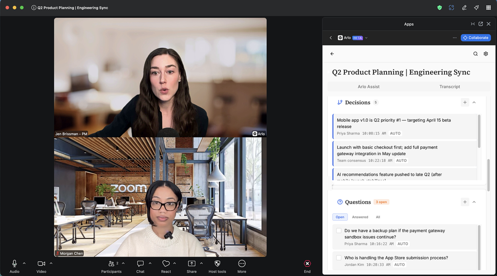
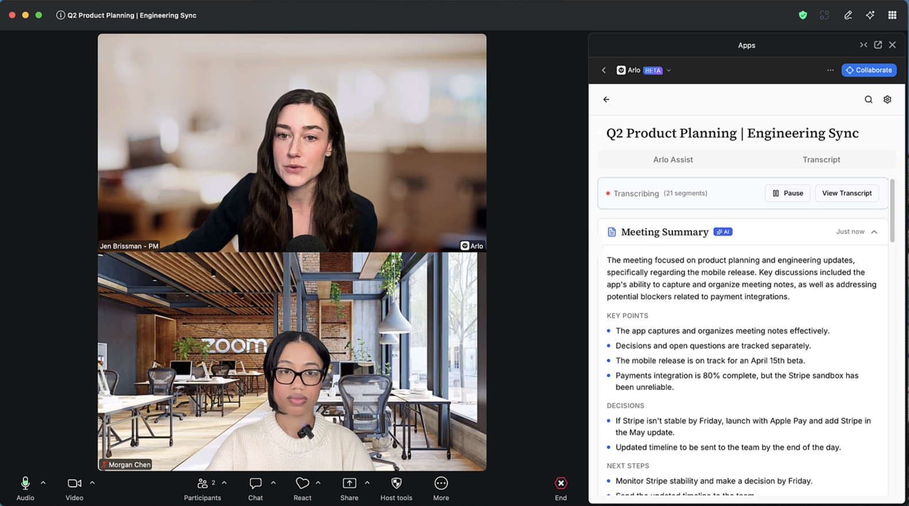
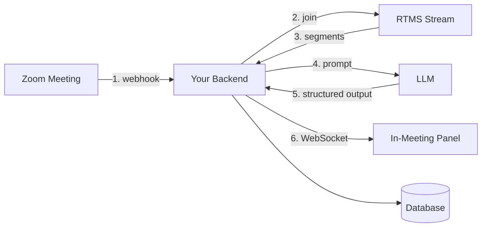

A meeting notetaker streams live transcripts from RTMS, passes them to an LLM, and displays rolling summaries, action items, and key moments in a panel visible to participants. Notes update while the meeting is still happening.

Most meeting notes happen after the call. Someone reviews the recording, writes up a summary, shares it the next day. By then everyone has moved on. A real-time notetaker captures decisions and action items while people can still correct them.

**What you'll need:**

- Transcript access via [RTMS](https://developers.zoom.us/docs/rtms/) ([pricing](https://zoom.us/pricing/developer))
- A backend to receive webhooks, persist transcripts, and call an LLM (Node/Express in this guide; any stack works)
- A [Zoom Surface App](https://developers.zoom.us/docs/zoom-apps/guides/building-a-surface/) to render the notes panel in-meeting
- An LLM for extraction (OpenRouter, OpenAI, Anthropic, or self-hosted)

**Features:**

- **Live transcription**: Stream transcripts from Zoom meetings using RTMS
- **Rolling summaries**: Generate summaries as the conversation progresses, not after
- **Action item extraction**: Capture action items with owners and deadlines as they're spoken
- **Key moments**: Highlight decisions, announcements, and open questions
- **In-meeting panel**: Surface everything in a sidebar visible to all participants

If you'd rather buy than build, Zoom offers [AI Companion](https://zoom.us/ai) with similar note-taking capabilities.

Follow along as we walk through the architecture.

<div align="center">
  
  
</div>

**See it in action:** [Demo video](https://www.youtube.com/watch?v=4N-g5TgGRz0)

## Architecture

RTMS delivers transcript segments over WebSocket with sub-second latency. Your backend receives each phrase as it's spoken, typically within 300-500ms. That's fast enough for live summaries and action item extraction while participants can still act on them.

### Components

| Component | Responsibility | Our stack (yours may differ) |
|-----------|----------------|------------------------------|
| **Transcript access** | Receive RTMS webhooks, join streams, normalize segments | Node service using `@zoom/rtms` SDK |
| **Backend** | Persist transcripts, orchestrate AI calls, broadcast to clients | Express + Prisma (MySQL) + OpenRouter |
| **Frontend** | Display transcript, summaries, action items in real time | React Surface App via Zoom Apps SDK |



When RTMS starts in a meeting, Zoom sends a webhook with stream credentials. Your backend verifies it, joins the stream, and receives transcript segments as each phrase is spoken. Segments flow through your AI layer for extraction, then broadcast to the in-meeting panel. End-to-end latency is under a second.

**Our stack vs. your options:** We use Node/Express, but Python/FastAPI, Go, or Ruby work the same way. The requirements are a webhook endpoint Zoom can reach, a WebSocket client for RTMS, an LLM, and a way to push updates to the frontend.

### How extraction works

The backend collects recent transcript context, sends it to an LLM with a structured-output prompt, parses the JSON response, and pushes the result to the panel. We use [OpenRouter](https://openrouter.ai/) (free models work without an API key; Claude or GPT-4o need one). All extraction features follow the same pattern:

1. **Collect**: Accumulate recent transcript context (last N segments or last M minutes)
2. **Extract**: Send to an LLM with a structured-output prompt that returns JSON
3. **Deliver**: Push the parsed result to connected clients over WebSocket

---

## Implementation Guide

This guide has three parts: the transcript pipeline (how to receive and process RTMS streams), the intelligence layer (how to extract meeting notes with AI), and a quickstart to run the reference implementation.

The patterns apply regardless of your stack. Code examples are from [Arlo](https://github.com/zoom/arlo), but the concepts transfer to any language or framework.

### Part 1: Building the Transcript Pipeline

#### Verify the webhook

When a user starts transcription, Zoom sends `meeting.rtms_started` to your webhook endpoint. Before acting on it, verify the request came from Zoom: compute an HMAC-SHA256 signature over `v0:{timestamp}:{rawBody}` using your app's webhook secret token, enforce a five-minute replay window, and use timing-safe comparison.

```javascript
function verifyWebhookSignature(rawBody, timestamp, signature, secret) {
  // Reject if timestamp is stale (replay protection)
  const now = Math.floor(Date.now() / 1000);
  if (Math.abs(now - parseInt(timestamp, 10)) > 300) return false;

  const message = `v0:${timestamp}:${rawBody.toString('utf8')}`;
  const expected = 'v0=' + crypto
    .createHmac('sha256', secret)
    .update(message)
    .digest('hex');

  return crypto.timingSafeEqual(Buffer.from(signature), Buffer.from(expected));
}
```

Two implementation details matter: use the raw request body (don't re-serialize JSON; the signature is over the exact bytes Zoom sent), and handle Zoom's `endpoint.url_validation` challenge separately since validation requests carry no signature.

**Other languages:** In Python, use `hmac.compare_digest`; in Go, use `crypto/subtle.ConstantTimeCompare`.

#### Join the stream

The webhook payload includes `meeting_uuid`, `rtms_stream_id`, and `server_urls`. Create an RTMS client, register your transcript handler, then join:

```javascript
const rtms = require('@zoom/rtms').default;

async function handleRTMSStarted(payload) {
  const { meeting_uuid, rtms_stream_id, server_urls } = payload;

  // Deduplicate: same stream ID means duplicate webhook
  if (activeSessions.has(rtms_stream_id)) return;

  const client = new rtms.Client();

  // Register handlers BEFORE joining
  client.onTranscriptData((data, size, timestamp, metadata) => {
    handleTranscript(meeting_uuid, {
      text: data.toString('utf-8'),
      timestamp,                  // microseconds from Zoom
      userId: metadata?.userId,
      userName: metadata?.userName,
    });
  });

  client.onLeave(() => activeSessions.delete(rtms_stream_id));

  activeSessions.set(rtms_stream_id, { client, meetingUuid: meeting_uuid });
  client.join({ meeting_uuid, rtms_stream_id, server_urls });
}
```

Sessions are keyed by `rtms_stream_id`, not `meeting_uuid`. If Zoom's media server fails over, the same meeting arrives with a new stream ID. Tear down the old session and join the new one. A repeated stream ID is a duplicate webhook; ignore it.

**Other languages:** The `@zoom/rtms` SDK is Node-only. For other languages, implement the WebSocket protocol directly; the [RTMS documentation](https://developers.zoom.us/docs/rtms/) covers the wire format.

#### Handle incoming transcripts

Each transcript callback becomes a segment with a sequence number and millisecond timestamps. Push to connected panels immediately; persist asynchronously so you don't block the real-time path:

```javascript
async function handleTranscript(meetingId, transcript) {
  const session = activeSessions.get(meetingId);
  const seqNo = session ? ++session.seqCounter : Date.now();

  const segment = {
    speakerId: transcript.userId || 'unknown',
    speakerLabel: transcript.userName || 'Speaker',
    text: transcript.text || '',
    tStartMs: Math.floor(transcript.timestamp / 1000),
    seqNo,
  };

  // Broadcast first, then persist in background
  broadcastToClients(meetingId, segment);
  saveSegment(meetingId, segment).catch(console.error);
}
```

The unique constraint on `(meetingId, seqNo)` with upsert writes makes retries idempotent.

**Other databases:** Works with Postgres, MongoDB, or a time-series database.

### Part 2: Building the Intelligence Layer

With the transcript pipeline in place, you have a live stream of what's being said. Now extract meeting intelligence from it.

#### The extraction loop

Meeting notes extraction runs on a debounce. You don't want to call the LLM on every segment, but you do want updates frequently enough to feel live. A 30-second interval works well: frequent enough to capture decisions as they happen, sparse enough to keep costs reasonable.

```javascript
// Pseudocode for the extraction loop
const ANALYZE_INTERVAL_MS = 30000;

function startExtractionLoop(meetingId) {
  let lastProcessedSeqNo = 0;

  setInterval(async () => {
    const segments = await getSegmentsSince(meetingId, lastProcessedSeqNo);
    if (segments.length === 0) return;

    const transcript = formatForPrompt(segments);
    const notes = await extractMeetingNotes(transcript);

    broadcastToClients(meetingId, { type: 'notes_update', data: notes });
    lastProcessedSeqNo = segments[segments.length - 1].seqNo;
  }, ANALYZE_INTERVAL_MS);
}
```

**Tuning:** Shorter intervals (15s) feel more responsive but cost more. Longer intervals (60s) reduce costs but lag behind the conversation. For action items, you might trigger extraction when you detect phrases like "I'll" or "let's" rather than on a fixed interval.

#### Extract meeting notes

The extraction prompt asks the LLM to return structured JSON with summaries, action items, and key moments. Use a system prompt that defines the output schema, and a user prompt with the recent transcript:

```javascript
async function extractMeetingNotes(transcript, currentState = {}) {
  const systemPrompt = `You are a meeting assistant analyzing a live transcript.
Extract three things:

1. Summary: 2-3 sentences capturing the current discussion topic and any conclusions.

2. Action items: Tasks assigned during the meeting.
   Format: { "task": "what", "owner": "who", "due": "when or null" }

3. Key moments: Decisions made, questions raised, announcements.
   Format: { "type": "decision|question|announcement", "text": "what was said" }

Return JSON only:
{
  "summary": "...",
  "actionItems": [...],
  "keyMoments": [...]
}`;

  const userPrompt = `Recent transcript:\n\n${transcript}`;

  const response = await callLLM(systemPrompt, userPrompt);
  return parseJSON(response);
}
```

The prompt structure matters:
- **System prompt** defines the schema and constraints (no markdown, JSON only)
- **User prompt** provides the transcript context
- **Output parsing** strips code fences and handles malformed responses gracefully

**Other LLMs:** Works with OpenAI, Anthropic, or self-hosted models. For reliability, use the provider's JSON mode or function calling. The prompt is the customization point. Adjust for your meeting types (standups, all-hands, 1:1s).

#### Frontend connection

The frontend subscribes to a WebSocket and renders updates as they arrive. The protocol is simple:

```
Client → Server: { type: 'subscribe', meetingId: '...' }
Server → Client: { type: 'transcript_segment', data: { ... } }
Server → Client: { type: 'notes_update', data: { summary, actionItems, keyMoments } }
```

On the frontend, maintain state for each extraction type and merge updates incrementally:

```javascript
// React hook pseudocode
function useMeetingNotes(meetingId) {
  const [notes, setNotes] = useState({ summary: '', actionItems: [], keyMoments: [] });

  useEffect(() => {
    const ws = connectWebSocket(meetingId);

    ws.onmessage = (event) => {
      const msg = JSON.parse(event.data);
      if (msg.type === 'notes_update') {
        setNotes(prev => ({
          summary: msg.data.summary || prev.summary,
          actionItems: dedupeByTask(prev.actionItems, msg.data.actionItems),
          keyMoments: dedupeByText(prev.keyMoments, msg.data.keyMoments),
        }));
      }
    };

    return () => ws.close();
  }, [meetingId]);

  return notes;
}
```

Dedupe action items by task text to avoid duplicates when the same item is mentioned twice. Key moments dedupe by text similarity.

**Other frameworks:** Works with Vue, Svelte, or vanilla JS. The Surface App runs inside the Zoom client via iframe; standard web tech applies.

#### Customizing prompts

The extraction prompt is your main customization point. Different meeting types benefit from different prompts:

| Meeting Type | Prompt Adjustments |
|--------------|-------------------|
| **Standups** | Focus on blockers and commitments; ignore small talk |
| **All-hands** | Capture announcements and Q&A; summarize by topic |
| **1:1s** | Track feedback given, career discussion points, follow-ups |
| **Brainstorms** | Cluster ideas by theme; note which got energy vs. dropped |

You can also add domain-specific extraction. For engineering meetings, detect technical decisions and architecture changes. For sales calls, track objections and next steps (see the [Sales Coach blueprint](../realtime-sales-coach/)).

### Part 3: Running the Reference Implementation ([Arlo](https://github.com/zoom/arlo))

Arlo implements everything above as a working application. Use it to see the patterns in action, then fork and customize or use as a reference for your own build.

#### One-click deploy

| Platform | What you get |
|----------|--------------|
| [**Deploy to Render**](https://render.com/deploy?repo=https://github.com/zoom/arlo) | Backend, frontend, RTMS service, managed database |
| [**Deploy to Railway**](https://railway.app/new?repo=https://github.com/zoom/arlo) | Backend, frontend, RTMS service, managed database |

Both platforms offer free tiers. After deploying, create a Zoom App in the [Marketplace](https://marketplace.zoom.us/), add `ZOOM_CLIENT_ID`, `ZOOM_CLIENT_SECRET`, and `ZOOM_WEBHOOK_TOKEN` to the environment, and point your app's OAuth redirect URL at the deployed backend.

#### Local setup

| Requirement | Purpose |
|-------------|---------|
| [Node.js 20+](https://nodejs.org/) | Runtime for all services |
| [Docker Desktop](https://www.docker.com/products/docker-desktop/) | Runs MySQL, Redis, and the services |
| [ngrok](https://ngrok.com/) | Public HTTPS URL for Zoom webhooks |
| [Zoom account](https://marketplace.zoom.us/) | To create and configure your Zoom App |
| RTMS access | [Request access](https://www.zoom.com/en/realtime-media-streams/#form) if you don't have it |

<details>
<summary><strong>Step-by-step local setup</strong></summary>

1. **Clone and configure**

   ```bash
   git clone https://github.com/zoom/arlo.git
   cd arlo
   cp .env.example .env
   ```

2. **Start ngrok** with a [free static domain](https://dashboard.ngrok.com/domains):

   ```bash
   ngrok http 3000 --domain=your-subdomain.ngrok-free.app
   ```

3. **Create your Zoom App** at [marketplace.zoom.us](https://marketplace.zoom.us/):
   - **Develop** > **Build App** > **General App**
   - Copy your **Client ID** and **Client Secret**

4. **Configure the Zoom App:**
   - OAuth Redirect URL: `https://YOUR-NGROK-URL/api/auth/callback`
   - Scopes: `meeting:read:meeting`, optionally `user:read`
   - Zoom App SDK: enable **RTMS** > **Transcripts**
   - Surface: Home URL `https://YOUR-NGROK-URL`
   - Event Subscriptions: endpoint `https://YOUR-NGROK-URL/api/rtms/webhook`, events `meeting.rtms_started` and `meeting.rtms_stopped`

5. **Fill in `.env`:**

   ```bash
   ZOOM_CLIENT_ID=your_client_id
   ZOOM_CLIENT_SECRET=your_client_secret
   ZOOM_WEBHOOK_TOKEN=your_webhook_secret_token
   PUBLIC_URL=https://your-subdomain.ngrok-free.app

   # Generate these:
   SESSION_SECRET=$(node -e "console.log(require('crypto').randomBytes(32).toString('hex'))")
   TOKEN_ENCRYPTION_KEY=$(node -e "console.log(require('crypto').randomBytes(32).toString('hex'))")
   ```

6. **Start everything:**

   ```bash
   docker-compose up --build
   ```

7. **Test:** Start a Zoom meeting, open **Apps** > your app, select the **Notes** vertical, and start transcription.

</details>

Arlo supports multiple verticals (Notes, Healthcare, Legal, Sales, Support). The Notes vertical is the general-purpose notetaker. Switch verticals anytime from Settings.

---

## App Manifest

The [`manifest.json`](./manifest.json) in this directory pre-configures a Zoom App with Surface App capabilities and RTMS transcript access. Upload it when creating your app to skip manual configuration.

### Scopes

| Scope | Required | Purpose |
|-------|----------|---------|
| `zoomapp:inmeeting` | Yes | Render the panel inside meetings |
| `meeting:read:meeting` | Yes | Meeting metadata |
| `user:read` | Optional | User profile info |

### RTMS Configuration

RTMS is a Zoom App SDK feature, configured separately from OAuth scopes:

1. In your app settings, go to **Features** > **Zoom App SDK**
2. Enable **Real-Time Media Streams**
3. Select **Transcripts**

RTMS requires access approval from Zoom. [Request access here](https://www.zoom.com/en/realtime-media-streams/#form).

### Event Subscriptions

| Event | When it fires |
|-------|---------------|
| `meeting.rtms_started` | Transcription begins; payload has stream credentials |
| `meeting.rtms_stopped` | Transcription ends |

Your webhook endpoint receives these events and manages stream connections accordingly.

---

<details>
<summary><strong>Production Considerations</strong></summary>

The patterns above work for development and moderate scale. For production deployments, consider:

| Area | Development | Production |
|------|-------------|------------|
| **Credentials** | `.env` file | Secrets manager (AWS, Vault, etc.) |
| **Token storage** | Database | Add encryption at rest, key rotation |
| **Sessions** | In-memory | Redis (survives restarts, scales horizontally) |
| **WebSockets** | Single instance | Redis pub/sub for multi-instance broadcast |
| **HTTPS** | ngrok | Load balancer with TLS termination |

**Data retention:** Transcript data may contain sensitive information. Plan retention policies aligned with your compliance requirements and provide user controls for deletion.

**Scaling:** Each active meeting maintains an RTMS WebSocket connection. For high-volume deployments, run multiple RTMS service instances with connection distribution.

</details>

---

## Related Resources

- [Arlo Repository](https://github.com/zoom/arlo) - Reference implementation
- [RTMS Documentation](https://developers.zoom.us/docs/rtms/) - Real-Time Media Streams API reference
- [Zoom Apps SDK](https://developers.zoom.us/docs/zoom-apps/) - Building in-meeting experiences
- [Zoom Developer Forum](https://devforum.zoom.us/) - Community support

