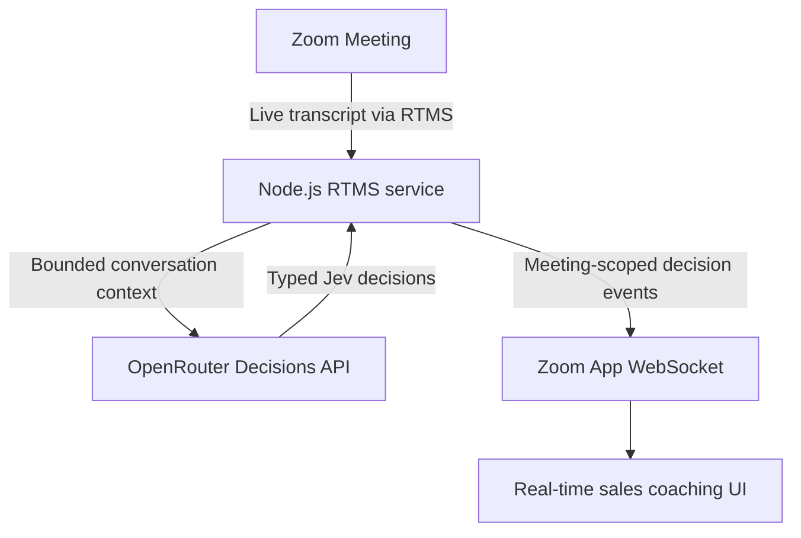

Build a real-time sales coaching app that receives **Zoom Realtime Media Streams (RTMS)** transcripts, sends bounded conversation context to [Jev](https://openrouter.ai/typesafe/jev-1.13), and shows typed coaching decisions in a Zoom App. The app can identify buyer intent, objections, deal stage, purchase signals, deal risk, and a recommended next action while the meeting is active.

Jev returns decisions and confidence values rather than arbitrary response text. The Blueprint uses those decisions to rank reviewed coaching choices, so the seller can choose how to respond. The reference implementation does not send messages or take external actions automatically.

This is an initial draft based on the [Jev transcript analysis reference implementation](https://github.com/zoom/rtms-samples/tree/main/zoom_apps/jev_transcript_analysis_js). The complete screenshots, demo video, verified manifest, and source-grounded implementation guide will be added before review.

## Features

- Receive live transcript turns from a Zoom Meeting through RTMS.
- Keep bounded conversation history per RTMS stream.
- Send typed decision questions to Jev through the OpenRouter Decisions API.
- Show buyer intent, objection, deal stage, purchase signal, deal risk, and ranked next-action choices in a Zoom App.
- Keep suggested coaching language in application-owned, reviewed text.

## Architecture

The reference implementation receives transcript events through RTMS and keeps session state keyed by `rtms_stream_id`. It sends recent context to Jev through OpenRouter, then broadcasts the normalized decision to the meeting-scoped Zoom App over WebSocket.

## Implementation Guide

This section is a stub for the source-grounded implementation steps. It will cover the Zoom Marketplace configuration, RTMS transcript subscription, OpenRouter and Jev settings, local startup, Zoom App testing, and production considerations.

## App Manifest

The `manifest.json` in this directory is an initial template placeholder. Verify its Zoom Apps SDK capabilities, RTMS event subscriptions, URLs, and scopes against the reference implementation before opening a PR.
