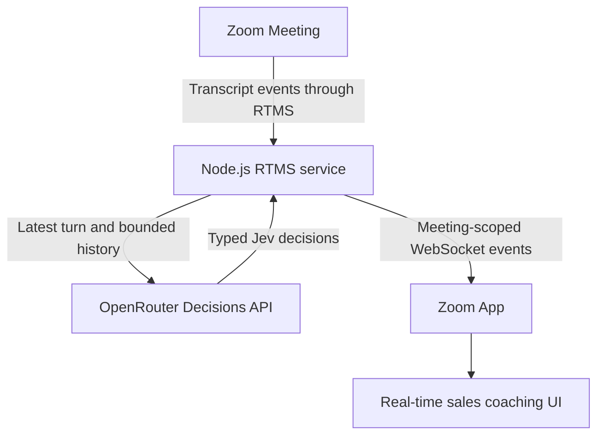
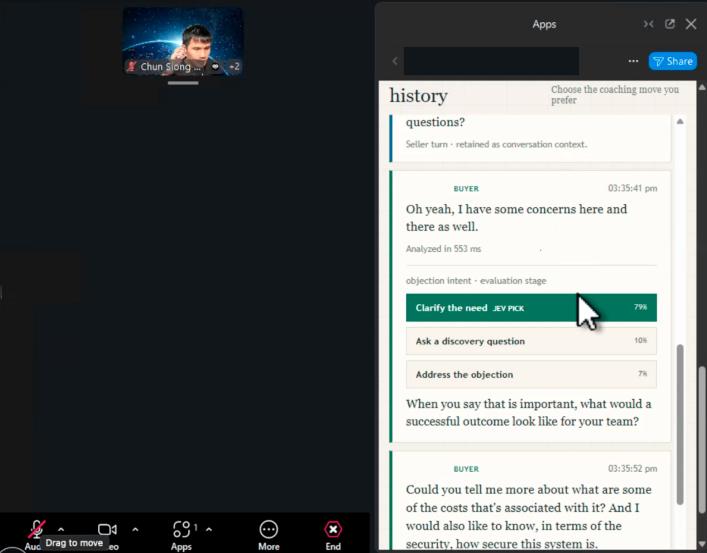
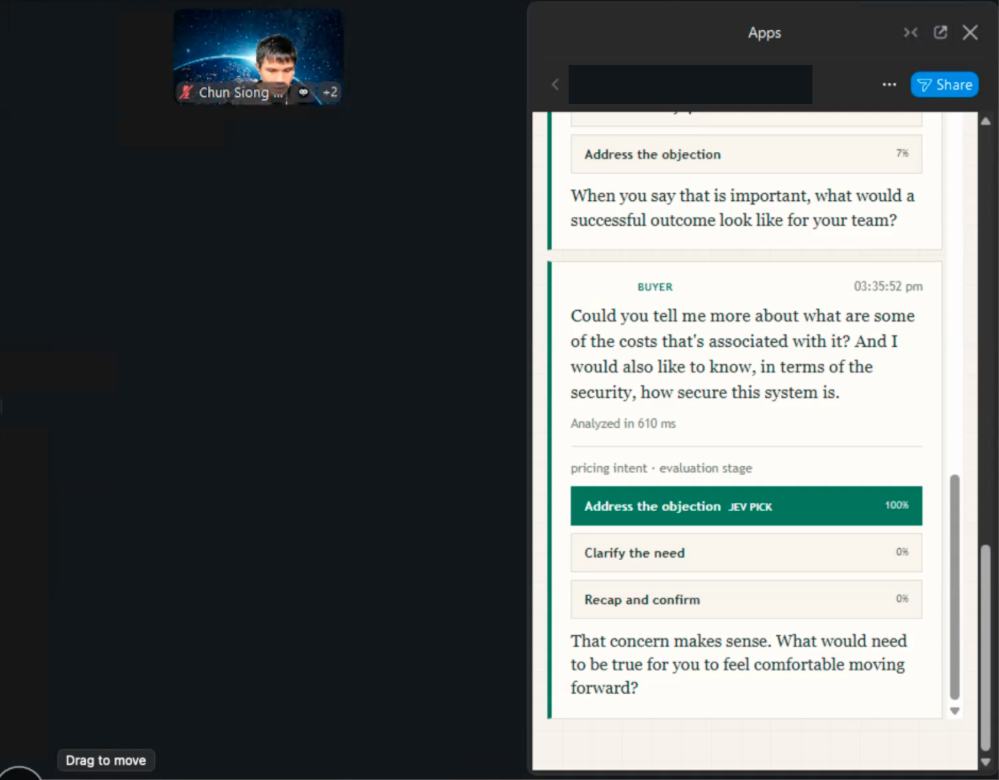
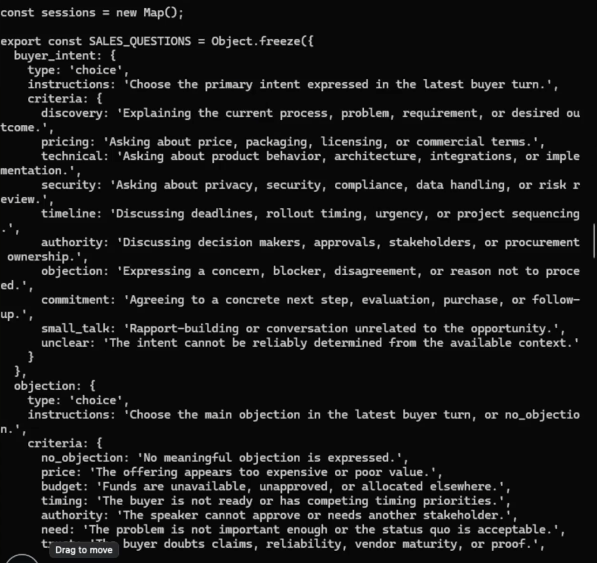

Build a real-time sales coaching app that receives [Zoom Realtime Media Streams (RTMS)](https://developers.zoom.us/docs/rtms/) transcripts, sends bounded conversation context to [Jev](https://openrouter.ai/typesafe/jev-1.13) through the [OpenRouter Decisions API](https://openrouter.ai/docs/api-reference/overview), and shows typed coaching decisions in a Zoom App. The app can identify buyer intent, objections, deal stage, purchase signals, deal risk, and a recommended next action while the meeting is active.

Jev returns decisions and confidence values rather than arbitrary response text. The reference implementation uses those decisions to rank application-owned coaching choices, so the seller can choose how to respond. It does not send messages or take external actions automatically.

This Blueprint is based on the [Jev transcript analysis reference implementation](https://github.com/zoom/rtms-samples/tree/main/zoom_apps/jev_transcript_analysis_js). It shows how to connect RTMS transcript events to a typed decision model and a meeting-scoped coaching interface. Add your own sales context, question criteria, coaching language, and output integrations for the environment where the app will run.

**See it in action:** [Demo video](https://success.zoom.us/clips/share/fOfIFPEMSnmMzuNKKBsShw)

## Features

- Receive live transcript turns from a Zoom Meeting through RTMS.
- Keep bounded conversation history per `rtms_stream_id`.
- Send six typed decision questions to Jev through the OpenRouter Decisions API.
- Show buyer intent, objection, deal stage, purchase signal, deal risk, and ranked next-action choices in a Zoom App.
- Let each app user choose whether they are viewing the meeting as the seller or buyer.
- Keep suggested coaching language in reviewed application-owned text.
- Keep transcript and decision state in memory for the active meeting session.

## Architecture

The reference implementation listens for authenticated RTMS lifecycle webhooks, then receives transcript media through RTMSManager. Each transcript turn is shown in the Zoom App immediately. Turns that meet the minimum character threshold are queued per RTMS stream and sent to Jev with the latest turn and a bounded history of recent turns.

Jev answers six questions in one Decisions API request. The backend normalizes the typed answers, ranks up to three next-action choices, and sends the result to the meeting-scoped frontend WebSocket using the same turn ID as the transcript event. This lets the interface attach a completed decision to the correct turn when several requests are in flight.



## Screenshots

The Zoom App keeps the live transcript history visible while Jev returns ranked coaching choices for each buyer turn.





The reference implementation also keeps the typed Jev decision questions in application-owned code.



### Components

| Component | Responsibility | Reference implementation |
| --- | --- | --- |
| Zoom App | Provides the in-meeting coaching view and the viewer's seller or buyer role | `public/index.ejs` |
| Webhook receiver | Verifies Zoom lifecycle events and passes them to RTMSManager | `WebhookManager` in `index.js` |
| RTMS receiver | Connects to transcript media and emits transcript turns | `RTMSManager` in `index.js` |
| Session queue | Serializes requests and keeps recent turns per stream | `sessionFor` and `analyzeSalesTurn` in `jevSalesAnalyzer.js` |
| Decision client | Sends typed questions and sales context to Jev | `postDecision` in `jevSalesAnalyzer.js` |
| Coaching policy | Maps the selected next action to reviewed phrases | `ACTION_GUIDANCE` in `jevSalesAnalyzer.js` |
| Frontend WebSocket | Authorizes the meeting and broadcasts transcript and decision events | `FrontendWssManager` in `index.js` |

### Decision contract

The application sends one bounded state object and six questions. The questions use Jev's `choice`, `noul`, and `score` decision types.

| Question | Jev type | Example output |
| --- | --- | --- |
| Buyer intent | `choice` | Pricing, technical, security, timeline, or commitment |
| Objection | `choice` | Price, budget, timing, authority, trust, or technical |
| Deal stage | `choice` | Discovery, solution fit, evaluation, negotiation, or closing |
| Next action | `choice` | Clarify need, quantify impact, address objection, or propose next step |
| Purchase signal | `noul` | Probability that the buyer expressed a purchase signal |
| Deal risk | `score` | Risk score on the application's five-level rubric |

Jev is a decision layer, not a general-purpose response generator. The sample selects the visible coaching phrase from `ACTION_GUIDANCE` after Jev chooses the next action. Add a separate generative model only when the application needs custom prose.

## Implementation Guide

### 1. Prepare the Zoom and OpenRouter accounts

You need a Zoom General App with Zoom Apps and RTMS enabled, a public HTTPS origin for the app and webhook, live meeting transcription, and an OpenRouter API key with access to `typesafe/jev-1.13`. The source uses Node.js 20 or newer.

The app does not call `zoomSdk.startRTMS()`. RTMS must already be started by the host, another Zoom App workflow, or an account-side process. The backend begins its transcript connection after Zoom delivers `meeting.rtms_started`.

### 2. Create the application and configure capabilities

Create or open a General App in the [Zoom App Marketplace](https://marketplace.zoom.us/). Set the Home URL to the public HTTPS origin and add that origin plus `https://appssdk.zoom.us` to the Domain Allow List.

Enable these Zoom Apps SDK capabilities:

| Capability | Why the app uses it |
| --- | --- |
| `getRunningContext` | Confirm that the app is open inside a meeting |
| `getMeetingUUID` | Register the frontend WebSocket for the correct meeting |
| `getUserContext` | Match the current viewer to transcript speakers and apply the selected role |

Subscribe the webhook endpoint to `meeting.rtms_started` and `meeting.rtms_stopped`. Set the notification URL to `https://YOUR_DOMAIN_HERE/webhook` during development, then replace it with the production URL.

### 3. Clone and configure the reference implementation

Clone [rtms-samples](https://github.com/zoom/rtms-samples) and enter the sample directory:

```bash
git clone https://github.com/zoom/rtms-samples.git
cd rtms-samples/zoom_apps/jev_transcript_analysis_js
cp .env.example .env
npm install
```

Set the required server-side values in `.env`:

| Variable | Purpose |
| --- | --- |
| `ZOOM_CLIENT_ID` | Zoom Marketplace app client ID |
| `ZOOM_CLIENT_SECRET` | Signs RTMS signaling and media handshakes |
| `ZOOM_SECRET_TOKEN` | Verifies Zoom webhook signatures |
| `OPENROUTER_API_KEY` | Authenticates the Decisions API request |
| `PUBLIC_BASE_URL` | Public HTTPS origin for the app |
| `FRONTEND_WSS_URL_TO_CONNECT_TO` | Public `wss://` URL ending in `/ws` |

Configure the Jev behavior with `JEV_MODEL`, `JEV_DECISIONS_URL`, `JEV_TIMEOUT_MS`, `JEV_HISTORY_TURNS`, `JEV_MIN_TRANSCRIPT_CHARACTERS`, and `SALES_CONTEXT`. Keep `.env` private. Commit only `.env.example` and use placeholders such as `YOUR_OPENROUTER_API_KEY_HERE` in documentation.

### 4. Expose the app and webhook over HTTPS

For local testing, expose the Node.js port through a development tunnel or reverse proxy. Use the resulting HTTPS origin for the Marketplace Home URL, Domain Allow List, webhook notification URL, and `PUBLIC_BASE_URL`. Use the corresponding secure WebSocket URL for `FRONTEND_WSS_URL_TO_CONNECT_TO`.

The webhook layer verifies the `x-zm-signature` header and rejects stale timestamps. Keep the webhook public and keep the server-side OpenRouter key out of the browser.

### 5. Start the service and test the meeting flow

Run the source checks and start the service:

```bash
npm test
npm run check
npm start
```

Open the app inside an active Zoom Meeting. Start RTMS through the host workflow, enable live transcription, and confirm that the app shows a connected state. Speak a buyer turn with at least eight characters. The app should show the transcript immediately, then attach the Jev decision when the backend receives the response.

Choose `Seller` or `Buyer` under **My role**. The app stores that choice in the current browser session. It labels turns using participant IDs when available and display names as a fallback. Different app users can use different viewer roles without changing another user's browser.

### 6. Adapt the decision contract and coaching language

Edit `SALES_QUESTIONS` in `jevSalesAnalyzer.js` when your sales process needs different categories or criteria. Keep the question type aligned with the value you need:

- Use `choice` for a controlled category or action.
- Use `noul` for a yes/no probability such as purchase intent.
- Use `score` for a numeric rubric such as deal risk.

Edit `ACTION_GUIDANCE` when your organization uses different reviewed phrases. Keep those phrases in application-owned code so the interface remains predictable and Jev is responsible for selecting a decision, not inventing a message.

The request includes the latest turn, up to `JEV_HISTORY_TURNS` recent turns, the meeting ID, and `SALES_CONTEXT`. Reduce the history limit or transcript character limit when latency, cost, or data minimization requires it.

### 7. Deploy the service for your environment

The linked repository includes a platform-agnostic multi-stage `Dockerfile` that copies the shared RTMS JavaScript library, installs production dependencies, runs as the non-root `node` user, and exposes port 3000. Build it from the `rtms-samples` repository root:

```bash
docker build \
  -f zoom_apps/jev_transcript_analysis_js/Dockerfile \
  -t rtms-jev-sales-copilot .
```

Run it with a secret-managed environment file or platform secret store. Configure HTTPS termination, the public webhook path, the secure frontend WebSocket path, and a restart policy. The source repository does not include Render or Railway configuration, so add those definitions only after testing the service in the target platform.

## Production considerations

- Keep Zoom credentials and the OpenRouter key in a secret manager. Do not expose them to the Zoom App frontend.
- Use explicit Zoom participant UUID to RTMS user ID mapping when duplicate display names or renamed participants are possible.
- Keep one request queue per RTMS stream and add monitoring for model latency, timeouts, rejected webhook events, and analysis failures.
- Treat Jev decisions as guidance rather than ground truth. Test the rubric on representative calls and keep consequential actions under the organization's review process.
- Review OpenRouter and the underlying model provider's data-handling terms before sending confidential meeting transcripts.
- The sample keeps backend context in memory and shows up to 100 turns in the browser. Add durable storage only when the product requires history, audit, or post-meeting review.
- Use a bounded history, transcript character limit, timeout, and retry policy appropriate for the latency and data-retention requirements of the deployment.

## App Manifest

The `manifest.json` in this directory describes the Zoom App surface, the RTMS transcript scope, the SDK capabilities, and the RTMS lifecycle events. Replace the example domains with the development and production origins for your deployment before creating the Marketplace app.

### Required scopes

| Scope | Required | Purpose |
| --- | --- | --- |
| `zoomapp:inmeeting` | Yes | Run the coaching interface inside a Zoom Meeting |
| `meeting:read:meeting_transcript` | Yes | Receive meeting transcript data through RTMS |

The Jev and OpenRouter permissions are not Zoom Marketplace scopes. They are configured with the server-side `OPENROUTER_API_KEY` and model settings.

### Event subscriptions

| Event | Purpose |
| --- | --- |
| `meeting.rtms_started` | Begin the RTMS transcript connection |
| `meeting.rtms_stopped` | Clear the stream's in-memory session |

The manifest uses placeholder HTTPS domains because the final URLs depend on the deployment environment. Verify the manifest in the Zoom App Marketplace before publishing.

## Related resources

- [Jev transcript analysis source](https://github.com/zoom/rtms-samples/tree/main/zoom_apps/jev_transcript_analysis_js)
- [Zoom RTMS documentation](https://developers.zoom.us/docs/rtms/)
- [Zoom Apps SDK documentation](https://developers.zoom.us/docs/zoom-apps/)
- [OpenRouter Decisions API](https://openrouter.ai/docs/api-reference/overview)
- [TypeSafe AI Jev model](https://openrouter.ai/typesafe/jev-1.13)
