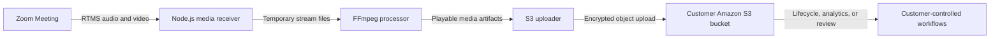

## Problem Statement

Some organizations need to keep meeting media in their own storage for retention rules, quality review, media processing, or an existing data platform. Saving recordings on one application server does not scale well and makes files easier to lose. It also makes company-wide access and deletion rules harder to enforce.

**Zoom Realtime Media Streams (RTMS)** sends live audio and video to your backend. The sample saves the stream, uses FFmpeg to create playable files, and uploads the finished files to Amazon S3. You control the bucket, encryption, access, retention period, and anything that happens to the files later.

Archive only the meetings and media your use case requires. Tell participants, get any required consent, and follow your organization's approval process.

## Architecture

Zoom calls your webhook when RTMS starts. The service connects to the audio and video streams and writes temporary files with size limits. FFmpeg converts or combines those files. The service then uploads the finished media to an S3 path for that meeting and stream.



## Implementation Guide

### 1. Prepare the runtime

Install the Node.js version required by the sample and install FFmpeg. Make sure the server has enough encrypted temporary storage for your longest expected meeting.

```bash
git clone https://github.com/zoom/rtms-samples.git
cd rtms-samples/storage/save_audio_and_video_to_aws_s3_storage_js
npm install
ffmpeg -version
```

### 2. Create the S3 destination

Create a dedicated bucket or prefix for RTMS media. Configure:

- Default encryption with a customer-approved key policy.
- Block Public Access.
- Least-privilege write access for the workload.
- Lifecycle expiration or archival tiers matching the retention policy.
- Access logging and alerts for policy changes.

Use an IAM role or workload identity when possible. Use access keys only for a limited local test, and never commit them.

### 3. Create the Zoom app

Create a Zoom General App and configure the RTMS lifecycle webhook.

| Setting | Value |
| --- | --- |
| Scopes | `meeting:read:meeting_audio`, `meeting:read:meeting_video` |
| Events | `meeting.rtms_started`, `meeting.rtms_stopped` |
| Webhook URL | `https://YOUR_DOMAIN.example.com/webhook` |

Enable RTMS for the account and meeting. Import `manifest.json` as a candidate configuration and verify it in Marketplace.

### 4. Configure the service

Use environment values equivalent to the following. When the workload has an IAM role, omit static AWS credential variables.

```dotenv
ZOOM_CLIENT_ID=YOUR_ZOOM_CLIENT_ID
ZOOM_CLIENT_SECRET=YOUR_ZOOM_CLIENT_SECRET
ZOOM_SECRET_TOKEN=YOUR_ZOOM_WEBHOOK_SECRET_TOKEN
AWS_REGION=YOUR_AWS_REGION
S3_BUCKET=YOUR_S3_BUCKET
AWS_ACCESS_KEY_ID=YOUR_AWS_ACCESS_KEY_ID
AWS_SECRET_ACCESS_KEY=YOUR_AWS_SECRET_ACCESS_KEY
```

Use a private temporary folder and set a maximum size. You can use the meeting UUID and stream ID in file paths, but do not put participant names in S3 object names.

### 5. Receive and package media

Check the webhook request and reply quickly. Open the RTMS connections in the background. Save audio and video separately, handle heartbeats and reconnects, and close each file before running FFmpeg.

The reference sample uploads objects under a structure similar to:

```text
rtms/<meeting-uuid>/<stream-id>/<filename>
```

Pass FFmpeg a fixed list of arguments. Do not build a shell command from meeting details. Check whether FFmpeg succeeded, and never upload a broken file as a successful recording.

### 6. Upload and clean up

Upload each finished file with the right content type, encryption settings, and non-sensitive metadata. Confirm that S3 saved it before deleting the local copy. A retry must never delete a file that has not been stored safely.

Use multipart uploads for large files, and clean up uploads that never finish.

### 7. Verify the archive workflow

Test short and long meetings, interrupted RTMS sessions, an unavailable S3 endpoint, FFmpeg failure, and an application restart. Confirm that:

- Objects are private and encrypted.
- Audio and video are synchronized and playable.
- Duplicate lifecycle events do not create conflicting objects.
- Failed uploads remain recoverable or are retried from a durable queue.
- Lifecycle rules expire test objects as expected.

### Production considerations

- Obtain legal, privacy, security, and records-management approval for the intended meetings.
- Display or deliver the required participant notification and consent experience.
- Use regional buckets and keys that satisfy data-residency requirements.
- Scan generated files and isolate untrusted downstream media processing.
- Monitor temporary-disk usage, RTMS gaps, FFmpeg duration, upload failures, and storage cost.

## App Manifest

[`manifest.json`](manifest.json) is a candidate General App manifest requesting RTMS audio and video access and subscribing to the RTMS lifecycle events. Replace `YOUR_DOMAIN` before import.

A human app owner must verify the current Marketplace schema and exact scopes, justify the collection of both media types, validate the webhook, and test account-level RTMS settings. Security and compliance owners must approve the bucket, key, consent, access, and retention policies before any production meeting is archived.
