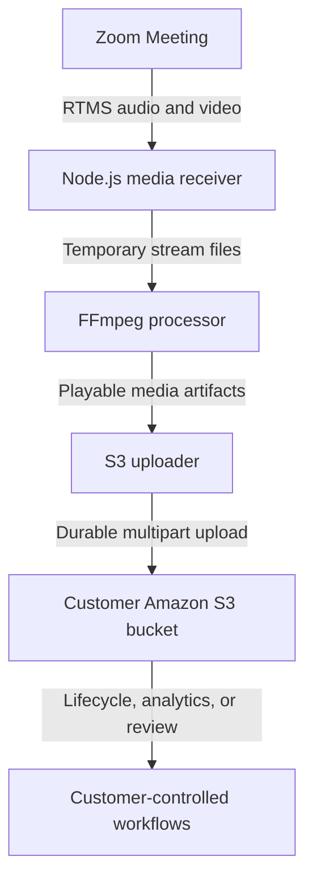

Build a customer-controlled meeting archive that turns live RTMS audio and video into playable files in Amazon S3. The archive can feed retention, quality review, media processing, or an existing data platform while the customer controls access and lifecycle policy.

[Zoom Realtime Media Streams (RTMS)](https://developers.zoom.us/docs/rtms/) sends live audio and video to your backend. The reference implementation saves the stream, uses [FFmpeg](https://ffmpeg.org/documentation.html) to create playable files, and uploads the finished files to [Amazon S3](https://docs.aws.amazon.com/AmazonS3/latest/userguide/Welcome.html). You control the bucket, encryption, access, retention period, and anything that happens to the files later.

Archive only the meetings and media your use case requires. Tell participants, get any required consent, and follow your organization's approval process.

**What you'll need:**

- A [Zoom Developer Pack](https://zoom.us/pricing/developer) with RTMS audio and video access
- A backend with enough temporary storage for expected meeting lengths
- [FFmpeg](https://ffmpeg.org/documentation.html) on the media worker
- An Amazon S3 bucket and approved AWS workload identity
- Retention, access, encryption, and participant-notice policies

**Features:**

- Capture mixed meeting audio and the configured RTMS video stream.
- Produce playable media after RTMS stops.
- Store each object under a stable meeting and stream path.
- Leave local media recoverable when an upload fails.
- Upload objects into a bucket where the customer configures access, encryption, and retention.

If Zoom-managed storage and retention meet your requirements, [Zoom cloud recording](https://support.zoom.com/hc/en/article?id=zm_kb&sysparm_article=KB0062627) may avoid a custom media pipeline. Build this archive when you need customer-controlled object storage, keys, paths, processing, or retention policy.

Follow along as we walk through the architecture.

The reference implementation produces playable media and uploads the finalized
objects to the configured customer-controlled S3 bucket.


## Architecture

### The reusable pattern

Zoom calls your webhook when RTMS starts. A media worker receives audio and video, writes bounded temporary artifacts, packages them into playable formats, uploads them to durable object storage, and records whether the upload completed before cleaning up local files.

### How the reference implementation handles it

The linked [Node.js reference implementation](https://github.com/zoom/rtms-samples/tree/main/storage/save_audio_and_video_to_aws_s3_storage_js) uses Express, RTMSManager, FFmpeg, and the AWS SDK. It captures mixed 16 kHz mono audio and a single active H.264 video stream at 25 frames per second. After `meeting.rtms_stopped`, it finalizes the local media and adds the stream directory to a durable upload queue.

The upload worker streams each file through the AWS multipart upload helper, retries temporary failures, restores unfinished jobs after restart, and supports configurable cleanup. It sets server-side encryption on each object and uses the AWS SDK credential chain. The deployment still needs an approved workload identity, persistent queue storage, bucket policy, and tested retention settings.



### Agent integration map

Check what your application already provides before adding components:

| Required capability | Reuse when present | Add when missing |
| --- | --- | --- |
| Webhook endpoint | Existing public API route | HTTPS endpoint for RTMS lifecycle events |
| Signature verification | Existing Zoom webhook middleware | Raw-body HMAC verification and replay protection |
| RTMS media receiver | Existing stream service | Audio and video handlers keyed by stream |
| Temporary storage | Existing encrypted workspace | Size-bounded per-stream media directory |
| Media packaging | Existing transcoding workers | FFmpeg job with fixed arguments |
| Object storage | Existing approved archive | S3 uploader with workload identity |
| Recovery | Existing durable job system | Upload state, retries, and cleanup records |

## Implementation Guide

### Part 1: Capture and package meeting media

#### 1. Capture audio and video separately

[`index.js`](https://github.com/zoom/rtms-samples/blob/main/storage/save_audio_and_video_to_aws_s3_storage_js/index.js) configures mixed 16 kHz mono audio and one active H.264 video stream at 25 frames per second. Its handlers keep raw audio and video separate until conversion. The video handler creates a `VideoGapFiller` when the first frame arrives. Keep temporary storage large enough for the longest expected meeting and encrypt it according to the customer's media policy.

**Input:** RTMS audio or video frame with meeting ID, stream ID, and timestamp

**Output:** Ordered temporary media written beneath the matching stream workspace

**Invariants:**

- Audio and video state is isolated by `rtms_stream_id`
- Frame ordering and timestamps are preserved for packaging
- Temporary paths are generated from safe internal identifiers
- Disk limits and backpressure prevent one stream from exhausting the worker
- A reconnect cannot overwrite completed media from another stream

#### 2. Create the S3 destination

Create a dedicated bucket or prefix for RTMS media. Configure:

- Default encryption with a customer-approved key policy.
- Block Public Access.
- Least-privilege write access for the workload.
- Lifecycle expiration or archival tiers matching the retention policy.
- Access logging and alerts for policy changes.

The reference implementation uses AWS credentials from environment variables. For production, adapt `S3StorageHelper.js` to use the credential provider approved by your platform, such as an IAM role or workload identity. Use access keys only for a limited local test, and never commit them.

#### 3. Create the Zoom app

Create a Zoom General App in the [Zoom App Marketplace](https://marketplace.zoom.us/) and configure the RTMS lifecycle webhook.

| Setting | Value |
| --- | --- |
| Scopes | `meeting:read:meeting_audio`, `meeting:read:meeting_video` |
| Events | `meeting.rtms_started`, `meeting.rtms_stopped` |
| Webhook URL | `https://YOUR-NGROK-URL/webhook` |

Enable RTMS for the account and meeting. Import `manifest.json` as a candidate configuration and verify it in Marketplace.

#### 4. Receive and package media

Check the webhook request and reply quickly. Open the RTMS connections in the background. Save audio and video separately, handle heartbeats and reconnects, and close each file before running FFmpeg.

The reference implementation uploads objects under a structure similar to:

```text
rtms/<meeting-uuid>/<stream-id>/<filename>
```

Pass FFmpeg a fixed list of arguments. Do not build a shell command from meeting details. Check whether FFmpeg succeeded, and never upload a broken file as a successful recording.

Verify the webhook signature over the raw request body, enforce a replay window, and use a timing-safe comparison. Reply before opening media sockets or starting file work.

```javascript
import crypto from 'node:crypto';

function verifyZoomWebhook(rawBody, timestamp, signature, secret) {
  if (Math.abs(Math.floor(Date.now() / 1000) - Number(timestamp)) > 300) return false;
  const message = `v0:${timestamp}:${rawBody.toString('utf8')}`;
  const expected = `v0=${crypto.createHmac('sha256', secret).update(message).digest('hex')}`;
  const received = Buffer.from(signature);
  const computed = Buffer.from(expected);
  return received.length === computed.length && crypto.timingSafeEqual(received, computed);
}
```

Handle Zoom endpoint validation separately because that request follows a different path.

**Input:** Closed raw audio and video artifacts plus trusted format settings

**Output:** Playable media artifacts and a packaging result record

**Invariants:**

- FFmpeg arguments are fixed or allowlisted, never assembled from untrusted text
- Packaging starts only after writers are closed or a durable boundary is reached
- A nonzero FFmpeg exit code marks the job failed
- Output is probed before it is eligible for upload
- Retrying packaging does not destroy the source artifacts

### Part 2: Store media safely

#### 5. Upload and recover

[`S3StorageHelper.js`](https://github.com/zoom/rtms-samples/blob/main/storage/save_audio_and_video_to_aws_s3_storage_js/S3StorageHelper.js) uploads WAV, MP4, VTT, SRT, and TXT files with streaming multipart upload. It builds keys beneath the configured prefix, sets content type and server-side encryption, and aborts incomplete multipart uploads on error. [`DurableUploadQueue.js`](https://github.com/zoom/rtms-samples/blob/main/storage/save_audio_and_video_to_aws_s3_storage_js/DurableUploadQueue.js) persists job state, retries with bounded backoff, restores interrupted jobs, and applies configurable cleanup periods.

Mount the recordings and queue directory on persistent storage. Use an IAM role or another approved workload identity instead of long-lived access keys. Test restart recovery and confirm the configured cleanup period never removes media before upload succeeds.

**Input:** Verified artifact, destination bucket, safe object key, and content type

**Output:** Confirmed private object plus durable upload status

**Invariants:**

- Object keys are deterministic for a meeting stream and artifact
- Retries do not create conflicting archives
- Local source files remain until object existence and integrity are confirmed
- Bucket access, encryption, and retention come from customer policy
- Failed multipart uploads are recorded and eventually removed

### Part 3: Run the reference implementation

#### 6. Install, configure, and start

```bash
git clone https://github.com/zoom/rtms-samples.git
cd rtms-samples/storage/save_audio_and_video_to_aws_s3_storage_js
npm install
ffmpeg -version
cp .env.example .env
```

Set the Zoom, media, and AWS values in `.env`. When the workload has an IAM role, adapt `S3StorageHelper.js` to use that credential provider and omit static access keys.

```dotenv
ZOOM_CLIENT_ID=YOUR_ZOOM_CLIENT_ID
ZOOM_CLIENT_SECRET=YOUR_ZOOM_CLIENT_SECRET
ZOOM_SECRET_TOKEN=YOUR_ZOOM_WEBHOOK_SECRET_TOKEN
MEDIA_SOCKET_CONNECTION_MODE=split
MEDIA_TYPES_FLAG=3
AWS_REGION=YOUR_AWS_REGION
S3_BUCKET=YOUR_S3_BUCKET
AWS_ACCESS_KEY_ID=YOUR_AWS_ACCESS_KEY_ID
AWS_SECRET_ACCESS_KEY=YOUR_AWS_SECRET_ACCESS_KEY
PORT=3000
WEBHOOK_PATH=/webhook
```

Use a private temporary folder with a size limit. Do not put participant names in object keys. Then run:

```bash
node index.js
```

Expose the configured webhook path over HTTPS.

#### Hosted deployment

[The source deployment PR](https://github.com/zoom/rtms-samples/pull/11) adds a Render Blueprint and Railway service configuration. The Docker image includes FFmpeg. The Render definition also creates a 20 GB disk for unfinished media and durable upload-queue state. Railway requires a volume mounted at the path declared by its service configuration. Treat these definitions as pending until the source PR is merged and tested.

Supply the Zoom credentials, public webhook domain, S3 bucket and region, and an AWS identity limited to the required bucket operations. Test container replacement while an upload is pending before publishing a one-click deployment button. These definitions deploy the application and working storage; they do not create the S3 bucket, keys, lifecycle rules, or IAM policies.

#### 7. Verify the archive workflow

Test short and long meetings, interrupted RTMS sessions, an unavailable S3 endpoint, FFmpeg failure, and an application restart. Confirm that:

- Objects are private and encrypted.
- Audio and video are synchronized and playable.
- Duplicate lifecycle events do not create conflicting objects.
- Failed uploads remain recoverable or are retried from a durable queue.
- Lifecycle rules expire test objects as expected.

### Production considerations

- Obtain legal, privacy, security, and records-management approval for the intended meetings.
- Display or deliver the required participant notification and consent experience.
- Use regional buckets and keys that satisfy data-residency requirements.
- Scan generated files and isolate untrusted downstream media processing.
- Monitor temporary-disk usage, RTMS gaps, FFmpeg duration, upload failures, and storage cost.

## App Manifest

The [`manifest.json`](manifest.json) in this directory follows the current Zoom Marketplace manifest structure and pre-configures the media archive: audio and video scopes, development and production OAuth callback placeholders, and RTMS lifecycle subscriptions. Replace `YOUR-NGROK-URL` and `YOUR-PRODUCTION-URL` before importing it.

### Scopes

- `meeting:read:meeting_audio`
- `meeting:read:meeting_video`

### Event subscriptions

- `meeting.rtms_started`
- `meeting.rtms_stopped`

### Structure

The manifest configures Zoom media access and the lifecycle webhook. S3 bucket, region, IAM, encryption, and retention settings stay in the customer environment.

The app owner must verify the current Marketplace schema and exact scopes, justify the collection of both media types, validate the webhook, and test account-level RTMS settings. Security and compliance owners must approve the bucket, key, consent, access, and retention policies before any production meeting is archived.

## Acceptance Criteria

- [ ] Invalid or stale webhook signatures are rejected before media capture begins.
- [ ] Simultaneous meetings use separate temporary paths and stream state.
- [ ] A test meeting produces synchronized, playable audio and video artifacts.
- [ ] FFmpeg failure prevents the artifact from being marked ready or uploaded as successful.
- [ ] Uploaded objects are private, encrypted, and stored under deterministic keys.
- [ ] Duplicate lifecycle events and upload retries do not create conflicting objects.
- [ ] An S3 outage leaves media recoverable through durable retry state.
- [ ] Local media is removed only after verified upload and according to the approved cleanup policy.
- [ ] Participant notice, access, retention, deletion, and regional storage behavior are approved for the target environment.

## Related Resources

- [Zoom RTMS documentation](https://developers.zoom.us/docs/rtms/)
- [Amazon S3 User Guide](https://docs.aws.amazon.com/AmazonS3/latest/userguide/Welcome.html)
- [FFmpeg documentation](https://ffmpeg.org/documentation.html)
- [Archive-to-S3 reference implementation](https://github.com/zoom/rtms-samples/tree/main/storage/save_audio_and_video_to_aws_s3_storage_js)
