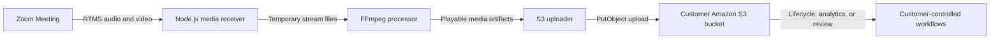

Some organizations need to keep meeting media in their own storage for retention rules, quality review, media processing, or an existing data platform. Saving recordings on one application server does not scale well and makes files easier to lose. It also makes company-wide access and deletion rules harder to enforce.

[Zoom Realtime Media Streams (RTMS)](https://developers.zoom.us/docs/rtms/) sends live audio and video to your backend. The reference implementation saves the stream, uses [FFmpeg](https://ffmpeg.org/documentation.html) to create playable files, and uploads the finished files to [Amazon S3](https://docs.aws.amazon.com/AmazonS3/latest/userguide/Welcome.html). You control the bucket, encryption, access, retention period, and anything that happens to the files later.

Archive only the meetings and media your use case requires. Tell participants, get any required consent, and follow your organization's approval process.

## Features

A successful archive run should:

- Capture mixed meeting audio and the configured RTMS video stream.
- Produce playable media after RTMS stops.
- Store each object under a stable meeting and stream path.
- Leave local media recoverable when an upload fails.
- Apply the customer's access, encryption, and retention policy in S3.

## Architecture

### The reusable pattern

Zoom calls your webhook when RTMS starts. A media worker receives audio and video, writes bounded temporary artifacts, packages them into playable formats, uploads them to durable object storage, and records whether the upload completed before cleaning up local files.

### How the reference implementation handles it

The linked [Node.js reference implementation](https://github.com/zoom/rtms-samples/tree/main/storage/save_audio_and_video_to_aws_s3_storage_js) uses Express, RTMSManager, FFmpeg, and the AWS SDK. It captures mixed 16 kHz mono audio and a single active H.264 video stream at 25 frames per second. After `meeting.rtms_stopped`, it waits two seconds, converts and muxes the local media, then uploads allowed file types with `PutObject`.

The reference implementation reads each file into memory, uses static AWS credentials from environment variables, and leaves local files in place. It does not implement multipart upload, a durable job queue, upload recovery after a restart, automatic cleanup, or per-object encryption settings.



## Implementation Guide

### Part 1: Capture and package meeting media

#### 1. Prepare the runtime

Install the Node.js version required by the reference implementation and install FFmpeg. Make sure the server has enough encrypted temporary storage for your longest expected meeting.

```bash
git clone https://github.com/zoom/rtms-samples.git
cd rtms-samples/storage/save_audio_and_video_to_aws_s3_storage_js
npm install
ffmpeg -version
```

#### 2. Create the S3 destination

Create a dedicated bucket or prefix for RTMS media. Configure:

- Default encryption with a customer-approved key policy.
- Block Public Access.
- Least-privilege write access for the workload.
- Lifecycle expiration or archival tiers matching the retention policy.
- Access logging and alerts for policy changes.

The reference implementation uses AWS credentials from environment variables. For production, adapt `S3StorageHelper.js` to use the credential provider approved by your platform, such as an IAM role or workload identity. Use access keys only for a limited local test, and never commit them.

#### 3. Create the Zoom app

Create a Zoom General App in the [Zoom App Marketplace](https://marketplace.zoom.us/) and configure the RTMS lifecycle webhook.

| Setting | Value |
| --- | --- |
| Scopes | `meeting:read:meeting_audio`, `meeting:read:meeting_video` |
| Events | `meeting.rtms_started`, `meeting.rtms_stopped` |
| Webhook URL | `https://YOUR_DOMAIN.example.com/webhook` |

Enable RTMS for the account and meeting. Import `manifest.json` as a candidate configuration and verify it in Marketplace.

#### 4. Configure the service

<details>
<summary><strong>Environment variables</strong></summary>

Use environment values equivalent to the following. When the workload has an IAM role, omit static AWS credential variables.

```dotenv
ZOOM_CLIENT_ID=YOUR_ZOOM_CLIENT_ID
ZOOM_CLIENT_SECRET=YOUR_ZOOM_CLIENT_SECRET
ZOOM_SECRET_TOKEN=YOUR_ZOOM_WEBHOOK_SECRET_TOKEN
AWS_REGION=YOUR_AWS_REGION
S3_BUCKET=YOUR_S3_BUCKET
AWS_ACCESS_KEY_ID=YOUR_AWS_ACCESS_KEY_ID
AWS_SECRET_ACCESS_KEY=YOUR_AWS_SECRET_ACCESS_KEY
PORT=3000
WEBHOOK_PATH=/webhook
```

Use a private temporary folder and set a maximum size. You can use the meeting UUID and stream ID in file paths, but do not put participant names in S3 object names.

</details>

#### 5. Receive and package media

Check the webhook request and reply quickly. Open the RTMS connections in the background. Save audio and video separately, handle heartbeats and reconnects, and close each file before running FFmpeg.

The reference implementation uploads objects under a structure similar to:

```text
rtms/<meeting-uuid>/<stream-id>/<filename>
```

Pass FFmpeg a fixed list of arguments. Do not build a shell command from meeting details. Check whether FFmpeg succeeded, and never upload a broken file as a successful recording.

### Part 2: Store media safely

#### 6. Upload and recover

The reference implementation uploads WAV, MP4, VTT, SRT, and TXT files and sets a content type for each. It relies on the bucket's default encryption and does not delete local files. Confirm the object exists before adding cleanup. A retry must never delete a file that has not been stored safely.

For large files, replace the reference implementation's whole-file `PutObject` path with streaming or multipart upload. Add a durable queue and clean up multipart uploads that never finish.

### Part 3: Run the reference implementation

#### 7. Start the service

Copy `.env.example` to `.env`, set the Zoom and AWS values, and run:

```bash
node index.js
```

Expose the configured webhook path over HTTPS. The repository does not include a tested CloudFormation, Terraform, or one-click deployment template for this reference implementation. Your deployment must provide FFmpeg, persistent temporary storage, a public webhook domain, AWS identity, and restart handling.

#### 8. Verify the archive workflow

Test short and long meetings, interrupted RTMS sessions, an unavailable S3 endpoint, FFmpeg failure, and an application restart. Confirm that:

- Objects are private and encrypted.
- Audio and video are synchronized and playable.
- Duplicate lifecycle events do not create conflicting objects.
- Failed uploads remain recoverable or are retried from a durable queue.
- Lifecycle rules expire test objects as expected.

### Production considerations

- Obtain legal, privacy, security, and records-management approval for the intended meetings.
- Display or deliver the required participant notification and consent experience.
- Use regional buckets and keys that satisfy data-residency requirements.
- Scan generated files and isolate untrusted downstream media processing.
- Monitor temporary-disk usage, RTMS gaps, FFmpeg duration, upload failures, and storage cost.

## App Manifest

The [`manifest.json`](manifest.json) in this directory is a candidate Zoom General App manifest and pre-configures the media archive: audio and video scopes, an OAuth callback placeholder, and RTMS lifecycle subscriptions. Import it when creating the app, replacing `YOUR_DOMAIN` first.

### Scopes

- `meeting:read:meeting_audio`
- `meeting:read:meeting_video`

### Event subscriptions

- `meeting.rtms_started`
- `meeting.rtms_stopped`

### Structure

The manifest configures Zoom media access and the lifecycle webhook. S3 bucket, region, IAM, encryption, and retention settings stay in the customer environment.

The app owner must verify the current Marketplace schema and exact scopes, justify the collection of both media types, validate the webhook, and test account-level RTMS settings. Security and compliance owners must approve the bucket, key, consent, access, and retention policies before any production meeting is archived.

## Related Resources

- [Zoom RTMS documentation](https://developers.zoom.us/docs/rtms/)
- [Amazon S3 User Guide](https://docs.aws.amazon.com/AmazonS3/latest/userguide/Welcome.html)
- [FFmpeg documentation](https://ffmpeg.org/documentation.html)
- [Archive-to-S3 reference implementation](https://github.com/zoom/rtms-samples/tree/main/storage/save_audio_and_video_to_aws_s3_storage_js)

## What Will You Build?

This Blueprint shows one path: mixed audio and active-speaker video packaged by FFmpeg and uploaded to Amazon S3. The same architecture supports many variations:

- Connect object creation to a catalog, review, or analytics workflow.
- Replace Amazon S3 with another durable object store.
- Add a durable queue and multipart upload for large files.
- Archive only the media types required by the use case.

RTMS provides the live media. The storage, retention, and processing workflow are yours to build.
