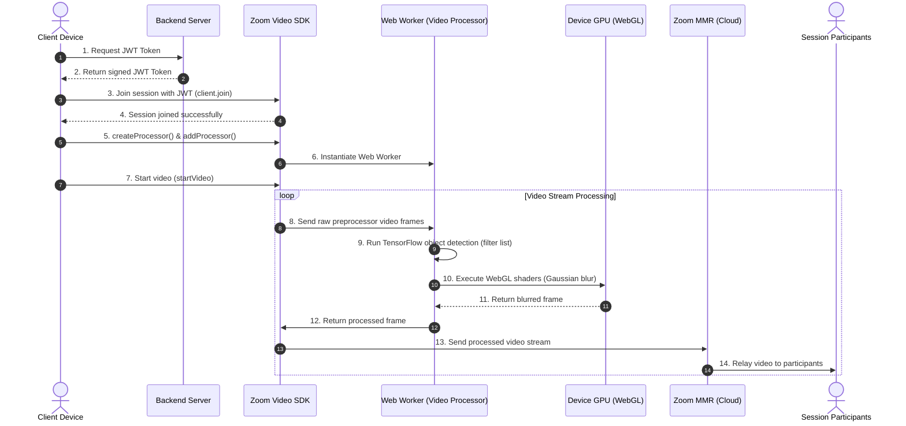
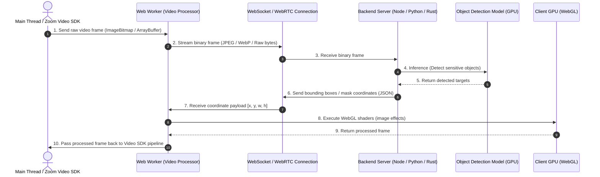

The Zoom Video SDK uses its Video Processor feature to launch the Web
Worker and pass raw video frames to the model, client-side.
This Web Worker runs an object detection model and Webgl is used to apply effects 
on the identified filter list objects to the image (classification, blurring, masking, etc).

**Scenario 1:**
Platforms that feature video and audio streams such as social media and conferencing apps
rely on quick detection of offensive gestures, harmful imagery, sexually exploitative content to 
enforce their TOS guidelines. The inability to identify these actions in real-time can 
decrease application trust, increase harmful behavior, and introduce liability for the
application owners. 

**Scenario 2:**
Companies require anonymous 3rd-party Auditors to join their Zoom Sessions. This is especially 
valuable in privacy-sensitive environments where outside auditors need visibility into the session 
without identifying or exposing participants, meeting locations, or sensitive objects in the frame. 
 
**What you'll need:**
- Zoom Video SDK credentials [Get credentials](https://developers.zoom.us/docs/video-sdk/get-credentials/)
- A backend to receive webhooks, persist transcripts, and call an LLM (Node/Express in this guide; any stack works)
- An LLM trained for Object Detection (OpenRouter, OpenAI, Anthropic, or self-hosted)

**Features:**
- Real-Time Objection in a multi-thread environment
- Project structure offers Plug-and-play with of your own LLM

<Image src="images/unblurreddetection.png"/>
<Image src="images/blurreddetection.png"/>

## Architecture
The client device requests for a JWT Token to a secure backend Server. The client receives the JWT Token and passed it to the Zoom Video SDK to start the session. On successful join into the session, `mediaStream.createProcessor()` is used to create the 
Web Worker running our Video Processor. Once the client video is started, the SDK sends the preprocessor raw video frames to the web worker. The web worker runs a pre-trained object detection model via Tensorflow on the image to detect any objects listed on the filter list. Any detected objects are then covered by a gaussian blur using the WebGL library to run shaders on the devive gpu. The processed image is then sent to the Zoom MMR which relays to each participant in the session. 



## Implementation Guide

Reference this [Content Moderation Walkthrough](https://developers.zoom.us/blog/content-moderator-with-videosdk-web-processor/) to access the GitHub repository and set up the app.

### Frontend - Video SDK Configuration
Implement the Video SDK with at least video capabilities for the host and session participants. You will need to request a JWT Token from your backend service prior to calling the `client.join()` function. After successful join, use the `createProcessor()` function to create a video processor and `addProcessor` to start the processor.
```js
const client = ZoomVideo.createClient();
await client.init("en-US", "Global", { patchJsMedia: true });

const startCall = async () => {
    // ask the server which token endpoint to use, since it is the one reading the .env file
    const configResponse = await fetch("/api/config");
    const { endpointUrl } = await configResponse.json();

    // get a token to join the session from the backend, or prompt for one if no endpoint is configured
    let token: string;
    if (endpointUrl) {
        const response = await fetch(endpointUrl, {
            method: "POST",
            headers: { "Content-Type": "application/json" },
            body: JSON.stringify({ sessionName, role }),
        });
        const data = await response.json();
        token = data.token;
    } else {
        token = window.prompt("Enter JWT Token") ?? "";
    }
    // call the renderVideo function whenever a user joins or leaves
    client.on("peer-video-state-change", renderVideo);
    await client.join(sessionName, token, username);
    const mediaStream = client.getMediaStream();
    await mediaStream.startVideo();

    const processor = await mediaStream.createProcessor({
        name: "gl-processor",
        type: "video",
        url: window.location.origin + "/od-quad.js",
    });
    // Add a processor
    await mediaStream.addProcessor(processor);
    // render the video of the current user
    await renderVideo({ action: 'Start', userId: client.getCurrentUserInfo().userId });
};
```
**For production deployments, ensure you are passing a secure https url that you own to the url field in `createProcessor()`**

### Model Integration via Web Worker
The model used in the demo app is a TensorFlow.js port of the COCO-SSD model. This model detects objects defined in the COCO dataset, which is a large-scale object detection, segmentation, and captioning dataset. Any Object Detection model can be used within the web worker but it is recommended to use a high-FPS vision model (YOLOv8/v10/v11 nano/small, MobileNet-SSD, etc) for lower latency performance. In the Web Worker, WebGL is used to offload image processing to the GPU. 


### Server-side implementation strategy
For a server-side approach, one can also offload this processing to a backend server by using a WebSocket or WebRTC connection to send and receive image data. You can also keep the blurring logic on the web worker by having the server only send the bounding boxes / mask JSON coordinates of the detected objects in the processed image. This drastically frees up bandwidth and round-trip latency on the websocket connection. 



### JWT Generation
Use the [Video SDK key and secret](https://developers.zoom.us/docs/video-sdk/get-credentials/) only in the server runtime. The required claims for this application are as follows:

| Claim       | Required value                                                   |
| ----------- | ---------------------------------------------------------------- |
| `app_key`   | Your Zoom Video SDK key                                          |
| `tpc`       | The topic matching the specified 'tpc' in SDK join function      |
| `role_type` | Server-derived `1` for host or `0` for participant               |
| `version`   | `1`                                                              |
| `iat`       | Current server time with a small clock-skew allowance            |
| `exp`       | No more than two hours after issue in this architecture          |

This JWT is generated with functions similar to the below:
```js
function generateSignature(
	sessionName: string,
	role: number,
	expiresInHours: number = 2,
): string {
	const iat = Math.round(new Date().getTime() / 1000) - 30;
	const exp = iat + 60 * 60 * expiresInHours;
	const oHeader = { alg: "HS256", typ: "JWT" };
	const oPayload = {
		app_key: sdkKey,
		tpc: sessionName,
		role_type: role,
		version: 1,
		iat: iat,
		exp: exp,
	};
	const sHeader = JSON.stringify(oHeader);
	const sPayload = JSON.stringify(oPayload);
	const sdkJWT = KJUR.KJUR.jws.JWS.sign("HS256", sHeader, sPayload, sdkSecret!);
	return sdkJWT;
}
```
**Do not expose your credentials to the client. When using the Video SDK in production, use a backend service to sign tokens. Do not store credentials in plain text. The sample app uses a `.env` file for simplicity.**

### Model Training
The sample app trains a simple model on server startup using TensorFlow.js, based on this [object detection example](https://github.com/tensorflow/tfjs-models/tree/master/coco-ssd).


## Related Resources
- [Content Moderation using Video SDK Processors](https://github.com/zoom/videosdk-web-videoprocessor-contentmoderation)
- [Zoom Video SDK for Web](https://developers.zoom.us/docs/video-sdk/web/) - SDK documentation
- [Zoom Video SDK Agent Skills](https://github.com/zoom/skills/tree/main/skills/video-sdk)
- [Zoom Developer Forum](https://devforum.zoom.us/)
- [Video SDK Session Lifecycle](https://developers.zoom.us/docs/video-sdk/web/sessions/)
  
## App Manifest

Skip this section. Video SDK Product does not support Marketplace Manifests

## Acceptance Criteria

**General**
- [ ] Ensure SDK credentials are not exposed when producing a JWT. Keep token generation off the frontend; store credentials only on the backend and never in plain text.
- [ ] Do not log credentials or JWTs.
- [ ] Properly implement the [Video SDK Session Lifecycle](https://developers.zoom.us/docs/video-sdk/web/sessions/).
- [ ] Release and tear down the web worker.

