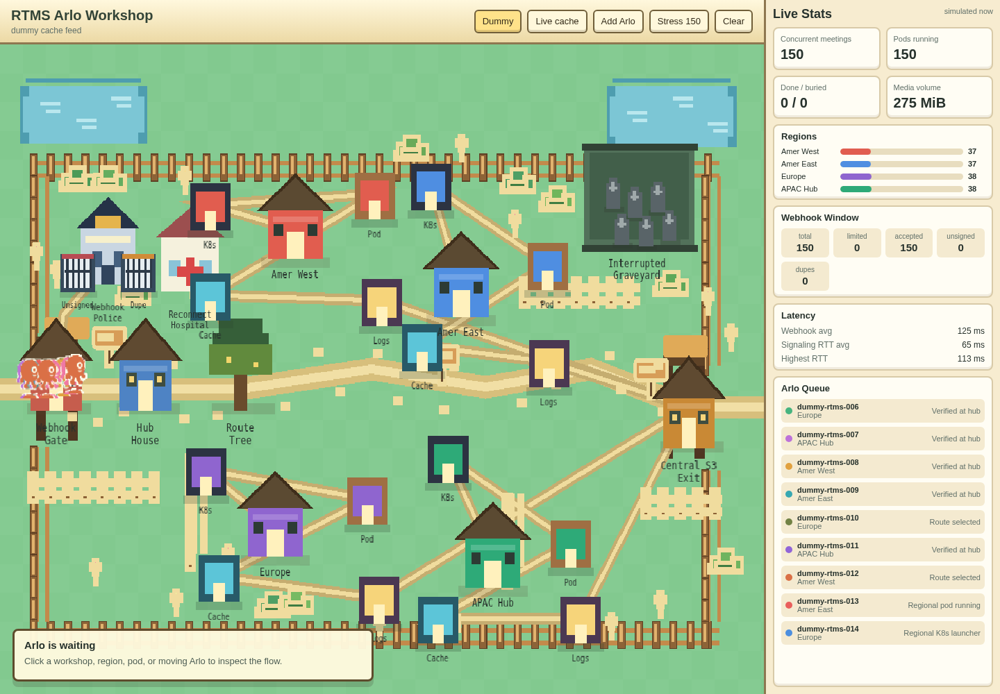
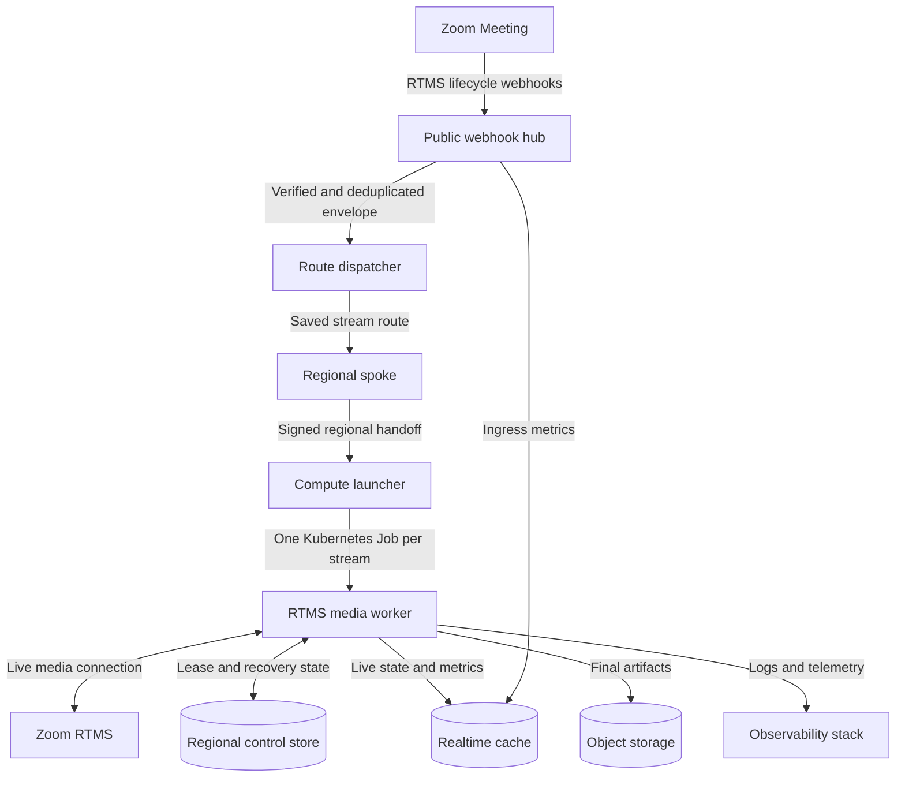

Build a backend that accepts Zoom RTMS lifecycle webhooks, assigns each media stream to one worker, and stores live state and completed artifacts outside the worker. Deploy the same design in one region first, then add regional spokes without changing the stream-processing contract.

RTMS workloads grow with concurrent streams and the media each stream requests. Isolating streams prevents one busy or failed stream from affecting the rest, while saved ownership and leases keep retries, stop events, and recovery events with the correct worker.

**What you'll need:**

- A paid Zoom Workplace plan with [Zoom Realtime Media Streams (RTMS)](https://developers.zoom.us/docs/rtms/) access ([Developer Pricing](https://zoom.us/pricing/developer))
- A public HTTPS endpoint for Zoom webhooks
- A container platform that can run one bounded worker per active stream. The reference implementation uses Kubernetes or k3s
- A low-latency cache for disposable live state and an object store for completed media artifacts
- Central and regional durable stores for routing, ownership, and recovery state
- Monitoring for webhook latency, signaling latency, stream state, resource use, and failed jobs

**Features:**

- Verify, deduplicate, and acknowledge Zoom RTMS webhooks at one public ingress
- Run one resource-limited Kubernetes Job for each active RTMS stream
- Keep start, stop, and recovery events on the same stream owner
- Scale from one region to optional regional spokes using the RTMS signaling region hint
- Store live counters in a disposable cache and final media in object storage
- Observe webhook ingress latency, signaling round-trip time, media volume, logs, and worker state

Zoom provides the RTMS media connection and lifecycle events. This Blueprint covers the customer-managed backend that receives and processes those streams when a single long-running service is no longer the right deployment shape.

Follow along as we walk through the architecture.

## Features

The reference implementation includes a local Docker Compose environment, Kubernetes Job launcher, control stores, Redis-backed live state, object storage adapters, and an observability stack. Its PixiJS operations view can simulate 150 concurrent streams before live Zoom traffic is connected.



## Architecture

The smallest production shape uses one webhook hub, one dispatcher, one regional spoke, and one Kubernetes cluster. The dispatcher still saves a route for every `rtms_stream_id`, so the same deployment can add more regions later. Do not introduce multi-region routing until capacity tests, data residency, recovery objectives, or network locality justify the additional control plane.

For a distributed deployment, the dispatcher reads the RTMS signaling URL region hint and selects a regional spoke. The selected route is durable. Later stop and interrupted events return to the same region even when those events do not contain a signaling URL. Inside that region, a launcher creates one deterministic Kubernetes Job per stream. The Job claims a lease, connects to RTMS, processes media, publishes live state, and uploads final artifacts.

### Components

| Component | Responsibility | Reference implementation | Replaceable with |
| --- | --- | --- | --- |
| Public ingress | Validate Zoom signatures, reject stale requests, deduplicate retries, and acknowledge quickly | Node.js and Express | Any HTTPS service with raw-body HMAC verification |
| Route dispatcher | Select and save one regional owner per `rtms_stream_id` | Node.js and SQLite | A service backed by a transactional database |
| Regional spoke | Verify signed internal handoffs and write regional control state | Node.js and Express | A regional API or queue consumer |
| Compute launcher | Create one deterministic worker with resource limits per stream | Kubernetes Job launcher | A container scheduler with equivalent isolation and fencing |
| Media worker | Claim a lease, run RTMSManager, receive media, and finalize artifacts | Node.js, RTMSManager, and FFmpeg-compatible media helpers | A worker using the RTMS protocol or supported SDK |
| Control stores | Save routing, envelopes, leases, recovery state, and artifact pointers | SQLite in the reference implementation | Postgres, DynamoDB, Cosmos DB, or another durable store |
| Live-state cache | Hold short-lived status, transcript tails, counters, and latency data | Redis | Any TTL cache; it is not the source of truth |
| Artifact storage | Store completed audio, video, manifests, and generated documents | Local disk, MinIO/S3, Azure Blob, or Google Cloud Storage | Any durable object store |
| Observability | Collect metrics, traces, and structured logs | OpenTelemetry, Prometheus, Loki, and Grafana | The customer's monitoring platform |



### Agent integration map

Map these responsibilities into the existing platform before adding new services:

| Required capability | Reuse when present | Add when missing |
| --- | --- | --- |
| Public webhook ingress | Existing API gateway or webhook service | Raw-body endpoint with Zoom verification and fast acknowledgement |
| Idempotency | Existing durable request ledger | Unique key store with expiry for RTMS lifecycle retries |
| Stream routing | Existing scheduler or regional router | Durable `rtms_stream_id` to region mapping |
| Internal authentication | Service mesh identity or signed internal requests | HMAC signature, timestamp check, and secret rotation |
| Worker scheduling | Existing Kubernetes cluster | Deterministic Job creation with requests, limits, and cleanup |
| Ownership | Existing distributed lock or lease service | Versioned stream lease with expiry and renewal |
| Live state | Existing cache | TTL-based records that can be rebuilt from active workers |
| Final storage | Existing object store | Provider adapter and stable artifact paths |
| Operations | Existing telemetry platform | Stream-level metrics, logs, alerts, and capacity dashboards |

## Implementation Guide

Build the single-region path first. Keep the route key and signed handoff contracts from the beginning, even when every stream maps to one region. This avoids redesigning worker ownership when another region is added.

### 1. Verify and deduplicate webhook ingress

[`shared/zoomSignature.js`](https://github.com/zoom/rtms-samples/blob/main/rtms-distributed-sample/shared/zoomSignature.js) verifies `x-zm-signature` against the exact request body and rejects timestamps outside the configured tolerance. [`01-centralized-webhook-hub/server.js`](https://github.com/zoom/rtms-samples/blob/main/rtms-distributed-sample/01-centralized-webhook-hub/server.js) handles endpoint validation, records an idempotency key, and returns before downstream processing completes.

Webhook signature verification is security-critical. Preserve the raw bytes, compute HMAC-SHA256 over `v0:{timestamp}:{rawBody}`, compare with a timing-safe function, and reject stale timestamps. The reference implementation uses a 300-second timestamp tolerance.

**Input:** Raw Zoom webhook body and `x-zm-request-timestamp` and `x-zm-signature` headers

**Output:** One normalized lifecycle envelope accepted for downstream routing

**Invariants:**

- Signature verification happens before routing or state changes
- URL validation uses the matching Zoom secret token
- A repeated lifecycle event with the same idempotency key is acknowledged but not routed twice
- An idempotency record is removed when the downstream handoff fails synchronously, allowing Zoom to retry
- The public endpoint returns quickly and never waits for media processing

The reference implementation can hand off directly over HTTP or publish to RabbitMQ. The queue exists for replay and backpressure testing. It is optional for the direct single-region path.

### 2. Save one route for each stream

[`02-central-route-dispatcher/server.js`](https://github.com/zoom/rtms-samples/blob/main/rtms-distributed-sample/02-central-route-dispatcher/server.js) derives a spoke group from the RTMS signaling URL region hint and saves the decision by `rtms_stream_id`. In one region, configure the fallback and every region code to the same spoke. In a distributed deployment, configure explicit regional spoke URLs and an approved fallback.

**Input:** Verified lifecycle envelope containing `event`, `rtms_stream_id`, product type, and an optional signaling region hint

**Output:** A saved stream route and a signed handoff to the selected regional spoke

**Invariants:**

- The first accepted start event selects the owner
- A repeated start for an active stream reuses its saved owner
- Stop and interrupted events use the saved route because they may not include a signaling URL
- Unknown region codes use an explicit fallback and generate an operational signal
- Routing state is durable for longer than the longest expected stream and retry window

### 3. Authenticate the regional handoff

The dispatcher signs the internal request. [`03-regional-webhook-spoke/server.js`](https://github.com/zoom/rtms-samples/blob/main/rtms-distributed-sample/03-regional-webhook-spoke/server.js) verifies the signature and timestamp before writing regional state or dispatching work.

**Input:** JSON envelope, internal signature, and timestamp

**Output:** Authenticated regional control record and compute request

**Invariants:**

- Public Zoom secrets are not reused as internal service secrets
- Internal signatures cover the exact request body
- Regional endpoints reject unsigned, stale, and invalid requests
- Services use private networking or mutual TLS in addition to request signing where available

### 4. Launch one deterministic worker per stream

[`04-regional-compute-launcher/server.js`](https://github.com/zoom/rtms-samples/blob/main/rtms-distributed-sample/04-regional-compute-launcher/server.js) and [`shared/kubernetesJobLauncher.js`](https://github.com/zoom/rtms-samples/blob/main/rtms-distributed-sample/shared/kubernetesJobLauncher.js) hash the stream ID into a stable Job name. The launcher creates a per-Job envelope Secret, mounts shared credentials separately, and sets resource requests and limits.

**Input:** Authenticated start envelope and regional deployment configuration

**Output:** One Kubernetes Job for that stream attempt

**Invariants:**

- The same stream ID produces the same Job name, so retries do not create unbounded duplicate workers
- Every Job receives only the envelope and credentials it requires
- CPU and memory requests and limits come from capacity tests for the selected media types
- Finished Jobs and envelope Secrets have bounded retention
- Stop events trigger graceful shutdown before delayed Job deletion

The reference values request `0.25` CPU and `200Mi` memory, with limits of `0.5` CPU and `1Gi`. Treat these as starting values for a development environment. Video resolution, frame rate, simultaneous media types, codecs, and downstream processing can change the worker profile substantially.

### 5. Fence stream ownership with a lease

[`04-regional-compute-job/server.js`](https://github.com/zoom/rtms-samples/blob/main/rtms-distributed-sample/04-regional-compute-job/server.js) claims the stream in the regional store before joining RTMS. It renews the lease every 15 seconds against a 45-second lease TTL. If renewal reports that ownership was lost, the Job closes its RTMS connection.

**Input:** Stream ID, worker identity, and expected lease version

**Output:** An exclusive, renewable ownership record

**Invariants:**

- Only the current lease holder processes a stream
- Renewal uses a version or fencing token, not only a timestamp
- A worker that loses its lease stops processing and writing artifacts
- Lease TTL remains inside the permitted RTMS recovery window
- Replacement workers cannot race the previous owner for the same output path

The reference implementation keeps interrupted-event recovery with the current owner. It does not launch a replacement worker from an interrupted webhook alone. Add takeover only after defining lease expiry, fencing, partial artifact handling, and reconnect behavior.

### 6. Connect to RTMS and isolate stream state

The media Job loads its stream envelope and credentials, constructs RTMSManager, registers media handlers, and joins the stream. `MEDIA_TYPES_FLAG` selects the requested media: `32` requests all available media, `3` requests audio and video, and `9` requests audio and transcript.

**Input:** Accepted stream envelope, Zoom credentials, media flags, and stream modes

**Output:** Live media events scoped to one worker and one stream

**Invariants:**

- Handlers are registered before joining the stream
- Stream state, temporary files, counters, and logs are keyed by `rtms_stream_id`
- Packet processing does not make a synchronous network write for every media packet
- Shutdown finalizes media once and releases the lease
- Requested scopes in the Zoom app match the configured media types

Use the smallest media set the application needs. Audio and transcript workloads have a different network and compute profile from multiple video or screen-share streams.

### 7. Separate control state, live state, and artifacts

The reference implementation uses three storage responsibilities:

- Central and regional SQLite databases hold routes, accepted envelopes, leases, recovery state, and artifact pointers
- Redis holds disposable live summaries, transcript tails, counters, and latency values with a 300-second TTL
- The artifact service uploads completed files to local storage, MinIO/S3, Azure Blob, or Google Cloud Storage

**Input:** Worker lifecycle updates, media counters, logs, and finalized files

**Output:** Durable control records, rebuildable live views, and durable artifacts

**Invariants:**

- Raw media is not stored in the control database
- Cache loss does not lose routing or ownership state
- Final uploads use stable stream-specific object keys
- Artifact pointers are written only after the upload result is known
- Retention, encryption, regional storage, and access controls follow customer policy

Replace SQLite with a production database before running multiple replicas that need shared state. Choose a database that supports the required conditional lease and uniqueness operations.

### 8. Measure capacity and recovery

[`06-realtime-cache`](https://github.com/zoom/rtms-samples/tree/main/rtms-distributed-sample/06-realtime-cache) and [`07-observability-dashboarding`](https://github.com/zoom/rtms-samples/tree/main/rtms-distributed-sample/07-observability-dashboarding) expose live stream state and observability data. The hub records webhook ingress latency. RTMSManager records signaling ping round-trip time. Workers batch media byte counters before flushing them.

Capacity tests should vary concurrent streams, requested media, packet rate, meeting duration, artifact size, reconnects, and downstream latency. Record p50, p95, and p99 latency; worker startup time; CPU and memory per stream; upload duration; lease-renew failures; and dropped or duplicate events. Scale from measured limits rather than a fixed number of streams per node.

### Run the reference implementation

Clone the repository and enter the distributed implementation:

```bash
git clone https://github.com/zoom/rtms-samples.git
cd rtms-samples/rtms-distributed-sample
npm install
cp .env.example .env
```

Start the local infrastructure:

```bash
docker compose up -d realtime-cache object-storage prometheus loki otel-collector grafana
```

Run the control stores, artifact service, cache, dispatcher, one spoke, and the public hub in separate terminals. Follow the current commands in the [reference implementation README](https://github.com/zoom/rtms-samples/tree/main/rtms-distributed-sample#quick-start), then build the compute image with its [multi-stage Dockerfile](https://github.com/zoom/rtms-samples/blob/main/rtms-distributed-sample/Dockerfile.compute).

Before connecting Zoom traffic, run the syntax check and component tests documented in [`tests/readme.md`](https://github.com/zoom/rtms-samples/blob/main/rtms-distributed-sample/tests/readme.md):

```bash
npm run check
npm run test:04 -- --secret YOUR_TEST_SECRET_HERE
npm run test:08
npm run test:12:realtime-cache
npm run test:14:phaser-arlo
```

The Compose environment is for local integration. The compute Dockerfile packages the per-stream worker. The repository does not include tested Render or Railway configurations, and those platforms are not presented as one-click targets for this Kubernetes Job architecture.

## App Manifest

The `manifest.json` in this directory follows the Zoom Marketplace manifest format for a user-managed Zoom Meeting app. It configures RTMS lifecycle webhooks and the media scopes used by the reference implementation's default all-media mode.

| Scope | Purpose |
| --- | --- |
| `meeting:read:meeting_audio` | Receive live meeting audio through RTMS |
| `meeting:read:meeting_video` | Receive live meeting video through RTMS |
| `meeting:read:meeting_transcript` | Receive live meeting transcript data through RTMS |
| `meeting:read:meeting_screenshare` | Receive live meeting screen-share media through RTMS |
| `meeting:read:meeting_chat` | Receive live meeting chat through RTMS |

| Event | Purpose |
| --- | --- |
| `meeting.rtms_started` | Select a route and start the stream worker |
| `meeting.rtms_stopped` | Finalize artifacts, release ownership, and stop the worker |
| `meeting.rtms_interrupted` | Deliver recovery state to the current owner |
| `rtms.concurrency_limited` | Alert when the account reaches its RTMS concurrency limit |

Replace the development and production URLs before importing or validating the manifest. Remove media scopes that the deployment does not request. The linked implementation can also process Video SDK RTMS events, but this Blueprint and manifest deliberately cover Zoom Meetings. Use a separate app configuration for Video SDK credentials and events.

## Acceptance Criteria

- [ ] Invalid, stale, and unsigned webhooks are rejected before any state change
- [ ] A retried start event produces one route and one active worker
- [ ] Stop and interrupted events reach the region that owns the stream
- [ ] Two workers cannot hold a valid lease for the same stream
- [ ] A worker that loses its lease closes its RTMS connection
- [ ] Worker resources remain within tested requests and limits at target concurrency
- [ ] Cache loss does not remove durable routing, ownership, or artifact records
- [ ] Completed artifacts are readable from the configured object store
- [ ] Dashboards show active streams, latency, media volume, failures, and regional distribution
- [ ] A region or worker failure follows the documented recovery policy without duplicate artifact writes
- [ ] Zoom app scopes match the media requested by `MEDIA_TYPES_FLAG`

<details>
<summary><strong>Production considerations</strong></summary>

- Replace local SQLite with a shared durable database before horizontally scaling a control-plane service.
- Keep the webhook hub stateless apart from a durable idempotency store. Run it behind a highly available load balancer.
- Rotate Zoom and internal signing secrets. Mount credentials from the platform's secret manager rather than environment files in images.
- Use private service networking, TLS, and workload identity between the dispatcher, spokes, stores, launchers, and artifact service.
- Define regional fallback behavior explicitly. Data residency policy may require failing closed instead of routing to another region.
- Apply quotas to Kubernetes Jobs, temporary storage, object uploads, and downstream processors.
- Alert before the account reaches its RTMS concurrency limit. Infrastructure scaling cannot raise the Zoom account entitlement.
- Test graceful termination, pod eviction, regional control-store loss, artifact upload failure, RTMS interruption, and delayed stop events.
- Document participant notice, consent, retention, deletion, and access-control requirements for every requested media type.

</details>

## Related Resources

- [Distributed RTMS reference implementation](https://github.com/zoom/rtms-samples/tree/main/rtms-distributed-sample)
- [Zoom RTMS documentation](https://developers.zoom.us/docs/rtms/)
- [Zoom Developer Pricing](https://zoom.us/pricing/developer)
- [Kubernetes Jobs](https://kubernetes.io/docs/concepts/workloads/controllers/job/)
- [OpenTelemetry documentation](https://opentelemetry.io/docs/)
