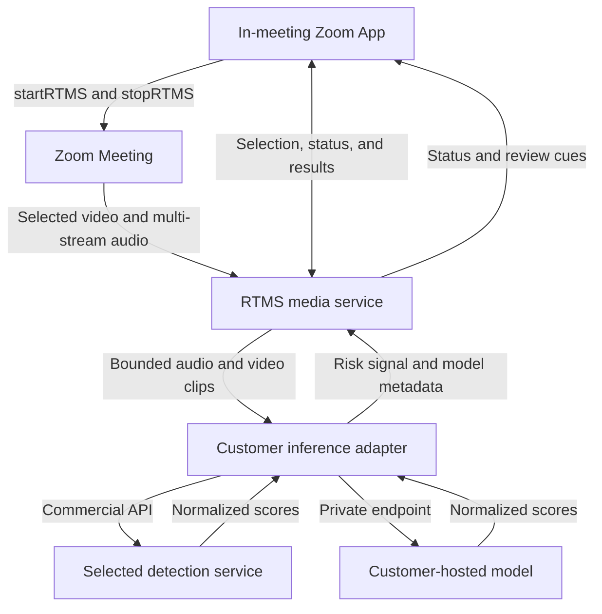

Build an in-meeting review experience that sends selected audio and video to a customer-controlled detection service and shows the resulting risk signal in a Zoom App. Fraud and security teams can investigate suspicious media while the meeting is still active.

This Blueprint sends [Zoom Realtime Media Streams (RTMS)](https://developers.zoom.us/docs/rtms/) audio and video to a detection service that you choose. You can use a commercial API or host your own model from [Hugging Face](https://huggingface.co/docs/inference-endpoints/). A [Zoom App](https://developers.zoom.us/docs/zoom-apps/) shows the result to an authorized reviewer in the meeting.

Deepfake detection is not certain. A high score is not proof that someone is trying to deceive you. Results can change with the language, microphone, camera, connection quality, lighting, participant, or type of attack. Use the result as one signal in a documented fraud-review process. Do not use the score as an automatic decision.

**What you'll need:**

- A [Zoom Developer Pack](https://zoom.us/pricing/developer) with RTMS audio and video access
- A [Zoom App](https://developers.zoom.us/docs/zoom-apps/) for the in-meeting review experience
- A commercial detection service or customer-hosted audio and video models
- FFmpeg and temporary media storage on the backend
- An approved review, notice, retention, and escalation policy

**Features:**

- Allow an authorized Zoom App user to choose the participant to review.
- Send only that participant's configured audio and video windows to inference.
- Show video and audio results separately with model and service status.
- Distinguish an unavailable model from a low-confidence result.
- Keep final decisions within the approved fraud-review policy.

This use case requires a customer-selected inference service and review policy. The Zoom components provide live media access and the in-meeting review surface; they do not determine whether media is authentic.

For hiring interviews, [BrightHire](https://www.zoom.com/en/blog/zoom-and-brighthire-take-on-rising-candidate-fraud/), a Zoom company, offers candidate fraud detection with deepfake signals built into Zoom interviews. Build this workflow when you need customer-selected inference models, a use case outside hiring, or control over thresholds and result handling.

Follow along as we walk through the architecture.

The in-meeting Zoom App shows the selected participant, separate audio and
video service states, and the latest normalized inference result.


## Architecture

### The reusable pattern

A Zoom App starts RTMS from inside the meeting. The backend receives selected media, creates bounded clips, and sends them to a customer-owned inference adapter. The adapter turns each provider's response into one result contract. The backend sends service health and review cues back to the Zoom App. The reference implementation does not enforce a reviewer role; add that authorization before production use.

### How the reference implementation handles it

The linked [Node.js reference implementation](https://github.com/zoom/rtms-samples/tree/main/zoom_apps/stream_audio_and_video_deepfake_detection_js) uses the [Zoom Apps SDK](https://appssdk.zoom.us/), Express, Socket.IO, RTMSManager, FFmpeg, and HLS. It requests one participant's individual video stream, receives multi-stream audio, and filters the audio packets to the same selected RTMS user ID.

By default, the reference implementation cuts video into two-second clips at five frames per second and audio into four-second PCM windows. It expects a separate inference service. The linked README names `Naman712/Deep-fake-detection` for video and `MelodyMachine/Deepfake-audio-detection-V2` for audio as examples. The customer owns the model or commercial service, hosting, credentials, evaluation, threshold, and data policy. Neither model service is included in this Blueprint repository.



### Agent integration map

Check what your application already provides before adding components:

| Required capability | Reuse when present | Add when missing |
| --- | --- | --- |
| Zoom App shell | Existing in-meeting application | Apps SDK configuration and review panel |
| Reviewer authorization | Existing roles and policy engine | Explicit permission check before participant selection |
| Webhook verification | Existing Zoom middleware | Raw-body HMAC verification and replay protection |
| RTMS media service | Existing stream receiver | Selected video and filtered audio capture |
| Clip processor | Existing media workers | Bounded FFmpeg audio and video jobs |
| Inference adapter | Existing model gateway | Provider-neutral classify and health contracts |
| Audit trail | Existing security case system | Model, media window, result, and reviewer record |

## Implementation Guide

### Part 1: Define the review and inference layer

#### 1. Establish the review policy first

Before connecting a live meeting, decide:

- Which meetings and roles may use detection.
- What participant notice and consent are required.
- Which media is sent to the inference service and for how long it is retained.
- Which score should show a warning and what the reviewer should do next.
- How false positives, appeals, audit records, and model changes are handled.

Security, privacy, legal, and AI-risk owners should approve these decisions. Do not use the reference implementation's default score as your production threshold.

#### 2. Provide a customer-owned inference endpoint

Create a small adapter for your commercial service or self-hosted model. Give the rest of the app these consistent endpoints:

| Endpoint | Input | Normalized result |
| --- | --- | --- |
| `POST /video/classify` | MP4 clip and metadata headers | Label plus real/fake scores |
| `POST /audio/classify` | PCM L16, 16 kHz, mono | Label plus real/fake scores |
| `GET /video/health` | None | Readiness status |
| `GET /audio/health` | None | Optional readiness status |

The following is an abbreviated response contract. The adapter may return additional provider fields, but the application must be able to normalize real and fake scores:

```json
{
  "label": "review",
  "scores": {
    "real": 0.42,
    "fake": 0.58
  }
}
```

Keep the API credential on the server and use HTTPS. Limit the request size and response time. The reference result records `vendorName`, `modelName`, threshold, normalized scores, decision, timestamp, and metadata. It does not have a separate model-version field. Add one to the adapter and result schema if the selected provider exposes a stable version identifier. Decide what the adapter should return when the model is down, does not support the media, has low confidence, or receives only part of a clip.

The endpoint contract stays the same whether the adapter calls a commercial service, a managed inference endpoint, or a model in your own environment. Do not copy the reference model names into production without evaluating them on approved data from the intended meeting conditions.

**Input:** Bounded audio or video clip plus non-identifying media metadata

**Output:** Normalized result with service status, model identity, scores, threshold, decision, and timestamp

**Invariants:**

- Service failure is distinct from a low-risk or low-confidence result
- Scores are finite values in the documented range
- Provider-specific fields stay inside the adapter
- Model name and version are recorded when the provider exposes them
- Thresholds come from an approved evaluation, not the provider default
- A model result never becomes an automatic accusation or access decision

### Part 2: Connect Zoom media to the reviewer

#### 3. Create the Zoom app

Create a General App in the [Zoom App Marketplace](https://marketplace.zoom.us/) that includes the Zoom App in-meeting experience. Configure the domains used by the frontend, backend, and inference service.

| Setting | Value |
| --- | --- |
| Scopes | `zoomapp:inmeeting`, `meeting:read:meeting_audio`, `meeting:read:meeting_video` |
| Events | `meeting.rtms_started`, `meeting.rtms_stopped` |
| Zoom Apps APIs | `getMeetingContext`, `getMeetingUUID`, `getMeetingParticipants`, `getRunningContext`, `startRTMS`, `stopRTMS`, `showNotification` |

Use `manifest.json` as a starting point for the scopes and events. You still need to configure and check the Zoom App APIs and allowed domains in Marketplace.

Verify RTMS lifecycle webhooks over the raw request body, enforce a replay window, and use a timing-safe comparison.

```javascript
import crypto from 'node:crypto';

function verifyZoomWebhook(rawBody, timestamp, signature, secret) {
  if (Math.abs(Math.floor(Date.now() / 1000) - Number(timestamp)) > 300) return false;
  const message = `v0:${timestamp}:${rawBody.toString('utf8')}`;
  const expected = `v0=${crypto.createHmac('sha256', secret).update(message).digest('hex')}`;
  const received = Buffer.from(signature);
  const computed = Buffer.from(expected);
  return received.length === computed.length && crypto.timingSafeEqual(received, computed);
}
```

Handle Zoom endpoint validation separately. The Zoom App must also call `config()` before other Apps SDK methods and list every capability it uses.

#### 4. Bound and classify media

Send short clips instead of an endless stream. Process audio and video separately so one can keep working if the other fails. Limit how many requests run at once, and drop old work when the result would arrive too late to help.

[`deepfakeClient.js`](https://github.com/zoom/rtms-samples/blob/main/zoom_apps/stream_audio_and_video_deepfake_detection_js/deepfakeClient.js) selects either the service or local CLI path, normalizes the provider response, applies the configured threshold, and returns model metadata with the decision. The audio client follows the same boundary with its own clip duration and threshold. This separation keeps provider-specific parsing inside the inference adapter and allows either model to change without changing RTMS ingestion or the Zoom App.

Check that every response has the expected fields and valid scores. Show which model ran, which part of the meeting it checked, how confident it was, and whether the service is healthy. Never turn a score directly into an accusation.

**Input:** Authorized participant selection and timestamped RTMS media frames

**Output:** Bounded audio and video clips associated with one review window

**Invariants:**

- Reviewer authorization is checked before media selection begins
- Video and audio processing fail independently
- Clips have explicit duration, size, and concurrency limits
- Old queued clips are dropped when their result would arrive too late
- Temporary media follows the approved encryption and deletion policy
- Participant names and email addresses are excluded unless required and approved

### Part 3: Run the reference implementation

#### 5. Install, configure, and start

```bash
git clone https://github.com/zoom/rtms-samples.git
cd rtms-samples/zoom_apps/stream_audio_and_video_deepfake_detection_js
npm install
ffmpeg -version
cp .env.example .env
```

Configure the Zoom app, media modes, inference URLs, credentials, and evaluated thresholds in `.env`. The application requires `VIDEO_STREAM_MODE=individual` and `AUDIO_STREAM_MODE=multi` for its selected-participant flow:

```dotenv
ZOOM_CLIENT_ID=YOUR_ZOOM_CLIENT_ID
ZOOM_CLIENT_SECRET=YOUR_ZOOM_CLIENT_SECRET
ZOOM_SECRET_TOKEN=YOUR_ZOOM_WEBHOOK_SECRET_TOKEN
VIDEO_STREAM_MODE=individual
AUDIO_STREAM_MODE=multi
DEEPFAKE_SERVICE_URL=https://YOUR_INFERENCE_DOMAIN.example.com/video/classify
DEEPFAKE_API_KEY=YOUR_INFERENCE_API_KEY
DEEPFAKE_REAL_THRESHOLD=YOUR_APPROVED_VIDEO_THRESHOLD
AUDIO_DEEPFAKE_SERVICE_URL=https://YOUR_INFERENCE_DOMAIN.example.com/audio/classify
AUDIO_DEEPFAKE_REAL_THRESHOLD=YOUR_APPROVED_AUDIO_THRESHOLD
PORT=5050
PUBLIC_BASE_URL=https://example.ngrok.app
```

Do not send names or email addresses to the detection provider unless the service requires them and the data use is approved. Use a private internal participant ID instead when possible.

Then run:

```bash
npm start
```

Open the app inside a Zoom Meeting. Start RTMS, choose a participant whose video is on, load that participant's video, and start video or audio verification. The HLS preview requires FFmpeg on the backend host.

#### Hosted deployment

The Render and Railway deployment cards deploy the Zoom App backend, RTMS media processing, HLS preview, and inference adapters as one Docker service. They do not deploy the customer-owned inference services. Supply the Zoom credentials, public app domain, and reachable video and audio inference endpoints.

The deployment definitions are ready for platform testing but have not been verified with a production Zoom account. They do not provision a commercial detection service, a Hugging Face model endpoint, production reviewer authorization, or an audit system. Test the chosen inference services, Zoom App URLs, WebSocket delivery, HLS output, and data-deletion behavior before using them for production.

#### 6. Test under realistic conditions

Create an approved test set. Include normal participants, approved synthetic media, different devices and languages, poor lighting, weak connections, and compressed media. Measure how often the model is wrong at your proposed threshold. Also test slow responses and service outages.

Choose the production threshold from those test results and your organization's risk policy. Do not choose it from this document or from one successful demo.

### Production considerations

- Pin and review model versions; a silent provider model change can alter behavior.
- Encrypt clips, minimize retention, and delete temporary files after the approved interval.
- Separate informational warnings from access-control or fraud decisions.
- Make the service health visible so reviewers know when no classification occurred.
- Complete bias, accessibility, security, privacy, and legal reviews before rollout.

## App Manifest

The [`manifest.json`](manifest.json) in this directory follows the current Zoom Marketplace manifest structure and pre-configures the in-meeting review: Zoom App, audio, and video scopes; the SDK APIs used by the frontend; domain placeholders; and RTMS lifecycle subscriptions. Replace `example.ngrok.app` and `blueprint.example.ngrok.app` before importing it. The manifest cannot encode the complete organizational approval, inference-provider contract, or model-risk policy.

### Scopes

- `zoomapp:inmeeting`
- `meeting:read:meeting_audio`
- `meeting:read:meeting_video`

### Event subscriptions

- `meeting.rtms_started`
- `meeting.rtms_stopped`

### Zoom Apps configuration

Enable the SDK capabilities used by the frontend and allow the app domain plus `https://appssdk.zoom.us/`. The configured APIs are `getSupportedJsApis`, `getAppContext`, `getMeetingContext`, `getMeetingUUID`, `getMeetingParticipants`, `getRunningContext`, `getUserContext`, `onRTMSStatusChange`, `startRTMS`, `stopRTMS`, `showNotification`, `onParticipantChange`, and `clearWebView`. Marketplace capability and domain settings still require verification after import.

The app owner must verify the current Marketplace schema, exact scopes, in-client APIs, redirect and webhook URLs, and domain allowlist. Security, privacy, legal, and AI-risk reviewers must approve participant disclosures, inference data handling, evaluation results, threshold, escalation language, and intended use before publication or production deployment.

## Acceptance Criteria

- [ ] Only an authorized reviewer can start a participant review.
- [ ] Invalid or stale RTMS lifecycle webhooks are rejected.
- [ ] The selected video stream and matching participant audio produce bounded clips.
- [ ] Audio and video results identify the service and model and remain separate.
- [ ] An inference outage is displayed differently from a low-risk result.
- [ ] Invalid scores or malformed provider responses are rejected by the adapter.
- [ ] No model score automatically accuses a participant or changes meeting access.
- [ ] Temporary clips and audit records follow the approved retention and deletion policy.
- [ ] The chosen model, threshold, meeting conditions, and known error rates are documented from an approved evaluation.

## Related Resources

- [Zoom RTMS documentation](https://developers.zoom.us/docs/rtms/)
- [Zoom Apps SDK reference](https://appssdk.zoom.us/)
- [Deepfake review reference implementation](https://github.com/zoom/rtms-samples/tree/main/zoom_apps/stream_audio_and_video_deepfake_detection_js)
- [Hugging Face Inference Endpoints](https://huggingface.co/docs/inference-endpoints/)
