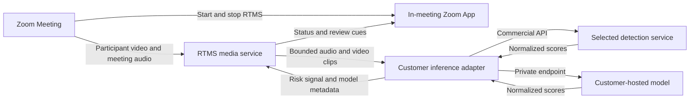

## Problem Statement

Fraud and security teams may need to spot suspicious audio or video while an important meeting is still happening. A review after the meeting may come too late to stop an impersonation attempt or a harmful instruction.

This blueprint sends **Zoom Realtime Media Streams (RTMS)** audio and video to a detection service that you choose. You can use a commercial API or host your own model from Hugging Face. A **Zoom App** shows the result to an authorized person in the meeting.

Deepfake detection is not certain. A high score is not proof that someone is trying to deceive you. Results can change with the language, microphone, camera, connection quality, lighting, person, or type of attack. Use the result as one clue in a human review. Do not let it make serious decisions by itself.

## Architecture

An authorized Zoom App starts RTMS from inside the meeting. The backend receives video and audio, creates short clips, and sends them to your detection adapter. The adapter turns each provider's answer into the same simple score format. The backend sends the service status and result back to the Zoom App. The sample can also create an HLS preview.

The sample does not include a detection model. You choose where the model runs, how it handles data, which credentials it uses, and what score should trigger a review.



## Implementation Guide

### 1. Establish the review policy first

Before connecting a live meeting, decide:

- Which meetings and roles may use detection.
- What participant notice and consent are required.
- Which media is sent to the inference service and for how long it is retained.
- Which score should show a warning and what the reviewer should do next.
- How false positives, appeals, audit records, and model changes are handled.

Security, privacy, legal, and AI-risk owners should approve these decisions. Do not use the sample's default score as your production threshold.

### 2. Install the reference application

Use the Node.js version required by the sample. Install FFmpeg if the selected media flow needs it.

```bash
git clone https://github.com/zoom/rtms-samples.git
cd rtms-samples/zoom_apps/stream_audio_and_video_deepfake_detection_js
npm install
```

### 3. Provide a customer-owned inference endpoint

Create a small adapter for your commercial service or self-hosted model. Give the rest of the app these consistent endpoints:

| Endpoint | Input | Normalized result |
| --- | --- | --- |
| `POST /video/classify` | MP4 clip and metadata headers | Label plus real/fake scores |
| `POST /audio/classify` | PCM L16, 16 kHz, mono | Label plus real/fake scores |
| `GET /video/health` | None | Readiness status |
| `GET /audio/health` | None | Optional readiness status |

Return a bounded JSON shape such as:

```json
{
  "label": "review",
  "scores": {
    "real": 0.42,
    "fake": 0.58
  }
}
```

Keep the API credential on the server and use HTTPS. Limit the request size and response time. Save the model name and version with each result. Decide what the adapter should return when the model is down, does not support the media, has low confidence, or receives only part of a clip.

### 4. Create the Zoom app

Create a General App that includes the Zoom App in-meeting experience. Configure the domains used by the frontend, backend, and inference service.

| Setting | Value |
| --- | --- |
| Scopes | `zoomapp:inmeeting`, `meeting:read:meeting_audio`, `meeting:read:meeting_video` |
| Events | `meeting.rtms_started`, `meeting.rtms_stopped` |
| Zoom Apps APIs | `getMeetingContext`, `getMeetingUUID`, `getMeetingParticipants`, `getRunningContext`, `startRTMS`, `stopRTMS`, `showNotification` |

Use `manifest.json` as a starting point for the scopes and events. You still need to configure and check the Zoom App APIs and allowed domains in Marketplace.

### 5. Configure the application

Use placeholders in local configuration and managed secrets in deployment.

```dotenv
ZOOM_CLIENT_ID=YOUR_ZOOM_CLIENT_ID
ZOOM_CLIENT_SECRET=YOUR_ZOOM_CLIENT_SECRET
ZOOM_SECRET_TOKEN=YOUR_ZOOM_WEBHOOK_SECRET_TOKEN
INFERENCE_BASE_URL=https://YOUR_INFERENCE_DOMAIN.example.com
INFERENCE_API_KEY=YOUR_INFERENCE_API_KEY
DEEPFAKE_REVIEW_THRESHOLD=YOUR_APPROVED_THRESHOLD
```

Do not send names or email addresses to the detection provider unless they are truly needed and approved. Use a private internal participant ID instead when possible.

### 6. Bound and classify media

Send short clips instead of an endless stream. Process audio and video separately so one can keep working if the other fails. Limit how many requests run at once, and drop old work when the result would arrive too late to help.

Check that every response has the expected fields and valid scores. Show which model ran, which part of the meeting it checked, how confident it was, and whether the service is healthy. Never turn a score directly into an accusation.

### 7. Test under realistic conditions

Create a test set that people have agreed you can use. Include normal participants, approved synthetic media, different devices and languages, poor lighting, weak connections, and compressed media. Measure how often the model is wrong at your proposed threshold. Also test slow responses and service outages.

Choose the production threshold from those test results and your organization's risk policy. Do not choose it from this document or from one successful demo.

### Production considerations

- Pin and review model versions; a silent provider model change can alter behavior.
- Encrypt clips, minimize retention, and delete temporary files after the approved interval.
- Separate informational warnings from access-control or fraud decisions.
- Make the service health visible so reviewers know when no classification occurred.
- Complete bias, accessibility, security, privacy, and legal reviews before rollout.

## App Manifest

[`manifest.json`](manifest.json) is a candidate manifest listing the in-meeting, audio, and video permissions plus RTMS lifecycle events. It cannot encode the complete organizational approval, Zoom App capability configuration, inference-provider contract, or model-risk policy.

A human app owner must verify the current Marketplace schema, exact scopes, in-client APIs, redirect and webhook URLs, and domain allowlist. Qualified reviewers must approve participant disclosures, inference data handling, evaluation results, threshold, escalation language, and intended use before publication or production deployment.
