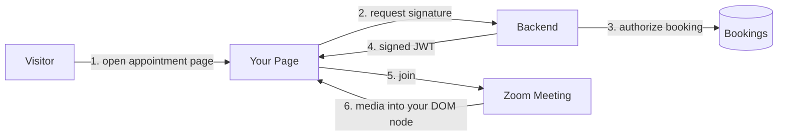

An appointment page embeds a live Zoom meeting directly in your own layout using the [Meeting SDK](https://developers.zoom.us/docs/meeting-sdk/web/) Component View. Your header, sidebar, and booking details stay on screen; the meeting renders into an element you control.

Sending a customer a Zoom link takes them off your site, often into a download prompt, sometimes into a sign-in wall. Every step between "I'm ready" and "I'm in the meeting" loses people. Embedding removes all of them: the visitor clicks once on the page they are already on.

**What you'll need:**

- A Meeting SDK app in the [Zoom Marketplace](https://marketplace.zoom.us/) for the SDK Key and Secret (free to create on any Zoom account; see [Meeting SDK authorization](https://developers.zoom.us/docs/meeting-sdk/auth/))
- The [`@zoom/meetingsdk`](https://developers.zoom.us/docs/meeting-sdk/web/) package (6.2.0 at the time of writing, MIT). It declares an exact peer dependency on `react@18.2.0`, so a React 19 project will not install it.
- A backend that can sign an HS256 JWT (Node/Express in this guide; any stack works)
- A scheduled meeting for the appointment, plus its meeting number and passcode
- A browser that supports WebAssembly, which every current browser does

**Features:**

- Meeting renders inside your page, next to your own content, not in place of it
- One-click join: no download, no Zoom account, no meeting number typed by hand
- Signature minted server-side per appointment and scoped to a single meeting
- Attendee role by default; the same page joins your staff as host
- Pre-join state shows the booking until the meeting is live, so the page is never empty
- Leave returns the visitor to your page, not to a Zoom-hosted screen

If you'd rather not build this, [Zoom Scheduler](https://zoom.us/scheduler) handles booking and sends standard join links.

Follow along as we walk through the architecture.

<!-- TODO(images): capture and commit before review.
     1. images/appointment-page.png - the embed inside your layout, sidebar visible
     2. images/pre-join.png - booking details before the meeting is live
     3. images/sdk-app-credentials.png - Meeting SDK app credentials screen
     Then restore the block below:

<div align="center">
  
  
</div>

[Watch a 2-minute demo](https://www.youtube.com/watch?v=YOUR_VIDEO_ID)
-->

---

## Architecture

Component View mounts the meeting into a DOM node your page owns. That is the whole difference from Client View, which replaces your page with the full Zoom experience. Component View is the right choice when the surrounding page still matters during the call: the booking details, the intake form, the order being discussed.

One rule shapes everything else. The Meeting SDK Secret never reaches the browser. The browser asks your backend for a signature, and the backend returns a short-lived JWT naming exactly one meeting and one role. A signature in client-side code is a signature anyone can mint.

### Components

| Component | Responsibility | Our stack (yours may differ) |
|-----------|----------------|------------------------------|
| **Appointment page** | Render your own layout and mount the meeting into it | React + Vite using `@zoom/meetingsdk/embedded` |
| **Signature endpoint** | Authorize the visitor, then sign a scoped JWT | Express + `jsonwebtoken` |
| **Booking source** | Decide which meeting this visitor may join, and as which role | In-memory map in the sample; your database |



The visitor opens a page that already knows which appointment it is showing. The page asks the backend for a signature, identifying the booking rather than the meeting. The backend decides whether this visitor may join that booking, then signs a JWT for the meeting behind it. The page calls `init()` with the element to render into, then `join()` with the signature.

**Our stack vs. your options:** We use Node/Express and React, but the backend only needs to sign an HS256 JWT, which every stack can do. The frontend only needs a DOM node and the SDK; Vue, Svelte, or plain JavaScript work the same way. The canonical [`meetingsdk-web-sample`](https://github.com/zoom/meetingsdk-web-sample) ships React, Webpack, and CDN variants.

### How the signature works

The payload shape is fixed by Zoom. Your backend fills it in and signs with the SDK Secret:

| Claim | Value |
|-------|-------|
| `appKey`, `sdkKey` | Your Meeting SDK Key, in both fields |
| `mn` | The meeting number |
| `role` | `0` for attendee, `1` for host |
| `iat`, `exp` | Issued-at and expiry, in seconds |
| `tokenExp` | Same value as `exp` |

Expiry must sit between 1800 and 172800 seconds from issue, so 30 minutes at the shortest and 48 hours at the longest. Sign shorter rather than longer: a signature is a bearer credential for one meeting, and an appointment page can always ask for a fresh one.

### Agent integration map

If you're grafting this into an existing codebase, check what you already have before adding anything:

| Required capability | Reuse when present | Add when missing |
|--------------------|--------------------|------------------|
| HTTP server | Existing API routes | Express route for the signature |
| Session or auth | Existing login and session | Whatever identifies the visitor for a booking |
| Booking lookup | Existing appointments table | In-memory map keyed by booking ID |
| JWT signing | Existing token utility | `jsonwebtoken`, HS256 |
| Secret storage | Existing secrets manager | `.env` for local development |
| Frontend mount point | Existing page layout | One `div` you control |

---

## Implementation Guide

Three parts: minting the signature, mounting the meeting, and running the reference implementations.

This blueprint deliberately does not restate the Meeting SDK. Zoom maintains two canonical samples that already do that well, and both are linked throughout:

| Repo | What it demonstrates |
|------|---------------------|
| [`meetingsdk-web-sample`](https://github.com/zoom/meetingsdk-web-sample) | Component View, Client View, and CDN variants of the raw SDK integration |
| [`meetingsdk-auth-endpoint-sample`](https://github.com/zoom/meetingsdk-auth-endpoint-sample) | The signature endpoint on its own, with request validation |

What this blueprint adds is the part those samples deliberately leave out: turning a meeting-number input box into an appointment page, where the visitor never sees a meeting number and the backend decides what they may join. [`meetingsdk-appointment-sample-js`](https://github.com/zoom/meetingsdk-appointment-sample-js) is the small companion app that shows only that.

### Part 1: Minting the Signature

#### Never sign in the browser

The SDK Secret is the credential that lets anyone join any meeting on your account as host. It belongs on the server, and nowhere else. This is the whole of the signing code:

```javascript
import jwt from 'jsonwebtoken';

function createSignature({ meetingNumber, role, sdkKey, sdkSecret, expiresInSeconds = 1800 }) {
  const iat = Math.floor(Date.now() / 1000);
  const exp = iat + expiresInSeconds;

  // Zoom rejects an expiry outside this window.
  if (expiresInSeconds < 1800 || expiresInSeconds > 172800) {
    throw new Error('expiresInSeconds must be between 1800 and 172800');
  }

  return jwt.sign(
    {
      appKey: sdkKey,
      sdkKey,
      mn: String(meetingNumber),
      role,
      iat,
      exp,
      tokenExp: exp,
    },
    sdkSecret,
    { algorithm: 'HS256' },
  );
}
```

**Other languages:** Any HS256 JWT library works. In Python use `PyJWT`; in Go use `golang-jwt`. The canonical endpoint sample uses `jsrsasign`; `jsonwebtoken` produces the same token with one less dependency.

#### Signature endpoint

**Input:** A booking identifier from the page, plus whatever identifies the visitor (session cookie, signed link token, logged-in user)

**Output:** `{ signature, sdkKey, meetingNumber }` for exactly one meeting

**Invariants:**

- Take a booking ID from the client, never a meeting number. A client that can name its own meeting number can join any meeting on your account.
- Authorize before signing. Resolve the booking, confirm this visitor is party to it, and only then look up the meeting number.
- Default `role` to `0`. Grant `1` only to the staff member the booking says is the host.
- Return the SDK Key alongside the signature. It is public; the Secret is not.
- Never log the signature or the Secret.
- Reject a request for a booking whose appointment window has passed.

See [the signature route](https://github.com/zoom/meetingsdk-appointment-sample-js/blob/main/src/signature.js) in the companion sample, and [`meetingsdk-auth-endpoint-sample`](https://github.com/zoom/meetingsdk-auth-endpoint-sample) for the standalone version with full request validation.

#### Scoping a signature to a booking

**Input:** Booking record with `meetingNumber`, `passcode`, `startsAt`, `hostUserId`, `attendeeName`

**Output:** A decision: which meeting, which role, how long the signature lives

**Invariants:**

- Signature lifetime tracks the appointment, not a fixed constant. An appointment at 3pm does not need a token minted at 9am.
- The passcode travels with the join call, not inside the signature. It is a separate parameter.
- One booking, one meeting. Reusing a single standing meeting across bookings means any past attendee can rejoin any future appointment.
- Treat the booking lookup as the authorization boundary. Everything downstream trusts it.

### Part 2: Mounting the Meeting

#### Give the SDK an element to render into

Component View renders into whatever node you hand it. Your layout decides where that node sits and how large it is:

```javascript
import ZoomMtgEmbedded from '@zoom/meetingsdk/embedded';

const client = ZoomMtgEmbedded.createClient();

await client.init({
  zoomAppRoot: document.getElementById('meeting-root'),
  language: 'en-US',
  patchJsMedia: true,
});

await client.join({
  signature,
  meetingNumber,
  userName,
  password: passcode,
});
```

`zoomAppRoot` is the only part that makes this Component View rather than Client View. In React, hold the node in a ref and call `init()` after the element has mounted, not during render.

**Pin React to 18.2.0.** `@zoom/meetingsdk` 6.2.0 declares an exact peer dependency, not a range, so `npm install` fails outright against React 19. The canonical [`meetingsdk-web-sample/Components`](https://github.com/zoom/meetingsdk-web-sample/tree/main/Components) pins the same version. Reaching for `--legacy-peer-deps` to get around it means shipping the SDK against a React it was never tested with.

**Budget for the bundle.** A production build of the page in the companion sample is 3.25 MB, or 976 KB gzipped, almost all of it the SDK. That is fine behind a CDN with caching and slow on a first cold load, so it is worth knowing before someone reports the page as broken.

#### Init and join

**Input:** A mounted DOM node, and `{ signature, sdkKey, meetingNumber, passcode, userName }` from your backend

**Output:** A joined meeting rendering inside your layout

**Invariants:**

- Call `init()` once per page load. Calling it twice on the same root leaves two clients fighting over the node.
- `init()` must resolve before `join()`. Both return promises; await them in order.
- The element must exist and have a non-zero size before `init()`. A hidden or zero-height container renders nothing and reports no error.
- Pass the passcode as `password` on `join()`, not in the signature.
- Handle `join()` rejection as a user-facing state. An expired signature and a meeting that has not started fail differently and read identically if you only log them.
- Tear down on unmount, so a client-side route change does not leave a live meeting attached to a removed node.

**Other frameworks:** Vue, Svelte, and plain JavaScript work identically; the SDK only needs an element. The canonical [`meetingsdk-web-sample/Components`](https://github.com/zoom/meetingsdk-web-sample/tree/main/Components) is React with TypeScript and Vite.

#### Pre-join and leave states

**Input:** The booking record and the SDK client lifecycle

**Output:** A page that is useful before, during, and after the meeting

**Invariants:**

- Render the booking before requesting a signature. A page that is blank until the SDK loads looks broken.
- Request the signature on the visitor's click, not on page load. A signature minted on load is expiring while the visitor reads the page.
- On leave, return to your own page. Component View leaves your layout intact, so there is no `leaveUrl` redirect to manage as there is in Client View.
- Keep the meeting element mounted for the whole session. Unmounting mid-call drops the meeting.

### Part 3: Running the Reference Implementations

#### The companion sample

[`meetingsdk-appointment-sample-js`](https://github.com/zoom/meetingsdk-appointment-sample-js) is deliberately small: a signature endpoint, a fake bookings table, and one page that embeds the meeting. It exists to show the appointment framing, not to re-teach the SDK.

| Platform | What you get |
|----------|--------------|
| [Deploy to Render](https://render.com/deploy?repo=https://github.com/zoom/meetingsdk-appointment-sample-js) | Backend and page |
| [Deploy to Railway](https://railway.app/new?repo=https://github.com/zoom/meetingsdk-appointment-sample-js) | Backend and page |

**Deploy anywhere:** the repo includes a platform-agnostic [Dockerfile](https://github.com/zoom/meetingsdk-appointment-sample-js/blob/main/Dockerfile).

#### Local setup

| Requirement | Purpose |
|-------------|---------|
| [Node.js 20+](https://nodejs.org/) | Runtime |
| [Zoom account](https://marketplace.zoom.us/) | Create the Meeting SDK app |
| A scheduled meeting | Something to join |

<details>
<summary><strong>Step-by-step local setup</strong></summary>

1. Create a **Meeting SDK** app at [marketplace.zoom.us](https://marketplace.zoom.us/): **Develop** > **Build App** > **Meeting SDK**. Copy the **SDK Key** and **SDK Secret**.

2. Clone and configure:

   ```bash
   git clone https://github.com/zoom/meetingsdk-appointment-sample-js.git
   cd meetingsdk-appointment-sample-js
   npm install
   cp .env.example .env
   ```

3. Fill `.env`:

   ```bash
   ZOOM_MEETING_SDK_KEY=your_sdk_key
   ZOOM_MEETING_SDK_SECRET=your_sdk_secret
   ```

4. Schedule a meeting in your Zoom client and put its number and passcode into `bookings.js`, which stands in for your database.

5. Start:

   ```bash
   npm run dev
   ```

6. Open the appointment link the console prints, and click **Join**.

</details>

#### When to use the canonical samples instead

Reach for [`meetingsdk-web-sample`](https://github.com/zoom/meetingsdk-web-sample) when you want to compare Component View against Client View, or need the CDN build rather than npm. Reach for [`meetingsdk-auth-endpoint-sample`](https://github.com/zoom/meetingsdk-auth-endpoint-sample) when you only need the signature service and already have a frontend.

---

## App Manifest

The [`manifest.json`](./manifest.json) in this directory records the Meeting SDK app configuration this blueprint assumes. A Meeting SDK app is simpler than a Zoom App: it has no OAuth scopes and no event subscriptions, because the credential it issues is used to sign meeting signatures rather than to call APIs on a user's behalf.

### Credentials

| Value | Where it lives | Notes |
|-------|----------------|-------|
| **SDK Key** | Server and browser | Public. Returned to the page alongside the signature. |
| **SDK Secret** | Server only | Signs the JWT. Never ship it to the browser or commit it. |

### App type

In the Marketplace, choose **Develop** > **Build App** > **Meeting SDK**. This is a different app type from the General App used for Zoom Apps and OAuth integrations. A Meeting SDK app is what issues an SDK Key and Secret.

### Domains

Add every origin that will embed the meeting to your app's domain allow list, including your local tunnel or `localhost` port during development. A missing origin fails at `join()` rather than at `init()`, which makes it look like a signature problem.

---

<details>
<summary><strong>Production Considerations</strong></summary>

| Area | Development | Production |
|------|-------------|------------|
| SDK Secret | `.env` file | Secrets manager |
| Bookings | In-memory map | Your database, with the visitor authorization check |
| Signature lifetime | 30 minutes | Scoped to the appointment window |
| Signature endpoint | Open | Behind whatever authenticates the visitor |
| Serving | Vite dev server | Static build behind your CDN |

**Authorization is the whole security model.** The signature endpoint is the only thing standing between a visitor and every meeting on your account. If it accepts a meeting number from the client, or signs without checking who is asking, the embed is an open door. Everything else in this blueprint is presentation.

**Cross-origin isolation.** Some Meeting SDK features need `Cross-Origin-Opener-Policy` and `Cross-Origin-Embedder-Policy` headers set on the page. Check the [Component View documentation](https://developers.zoom.us/docs/meeting-sdk/web/component-view/) for the current list before assuming a feature is broken.

**Zoom for Government.** The SDK targets a web endpoint that differs on government accounts. Configure it rather than accepting the commercial default, and confirm the current parameter in the [Meeting SDK documentation](https://developers.zoom.us/docs/meeting-sdk/web/).

**Browser support and bundle size.** Component View is WebAssembly. It works in current browsers, but the SDK dominates your bundle: 3.25 MB, 976 KB gzipped, in the companion sample. Serve it from a CDN, let it cache, and consider loading the SDK only on the appointment route rather than in your main bundle.

</details>

---

## Acceptance Criteria

Use this checklist to verify the implementation:

- [ ] The SDK Secret appears in no client bundle, no log line, and no API response
- [ ] The signature endpoint accepts a booking identifier, never a meeting number
- [ ] A request for a booking the visitor is not party to is rejected before any signing happens
- [ ] `role` defaults to `0`; `1` is granted only to the booking's host
- [ ] Signature expiry is between 1800 and 172800 seconds and is scoped to the appointment
- [ ] The signature is requested on the visitor's click, not on page load
- [ ] `init()` resolves before `join()` is called
- [ ] `init()` is called exactly once per page load
- [ ] The mount element exists and has non-zero size before `init()`
- [ ] The passcode is passed as `password` on `join()`, not embedded in the signature
- [ ] An expired signature and a not-yet-started meeting produce different user-facing messages
- [ ] Leaving the meeting returns the visitor to your page with the layout intact
- [ ] Unmounting the page tears the client down rather than orphaning it
- [ ] Every embedding origin is on the app's domain allow list
- [ ] React is pinned to 18.2.0 rather than installed with `--legacy-peer-deps`

---

## Related Resources

- [meetingsdk-appointment-sample-js](https://github.com/zoom/meetingsdk-appointment-sample-js) - The companion sample for this blueprint
- [meetingsdk-web-sample](https://github.com/zoom/meetingsdk-web-sample) - Canonical Component View, Client View, and CDN samples
- [meetingsdk-auth-endpoint-sample](https://github.com/zoom/meetingsdk-auth-endpoint-sample) - Canonical signature endpoint
- [Meeting SDK for Web](https://developers.zoom.us/docs/meeting-sdk/web/) - SDK documentation
- [Component View reference](https://developers.zoom.us/docs/meeting-sdk/web/component-view/) - The API used here
- [Client View reference](https://developers.zoom.us/docs/meeting-sdk/web/client-view/) - The full-page alternative
- [Meeting SDK authorization](https://developers.zoom.us/docs/meeting-sdk/auth/) - Signature format and credentials
- [Zoom Developer Forum](https://devforum.zoom.us/) - Community support
