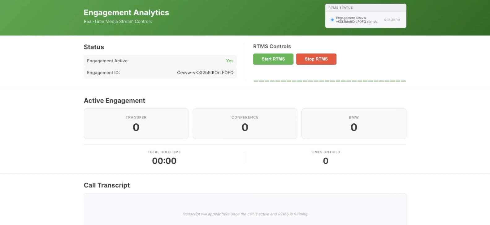
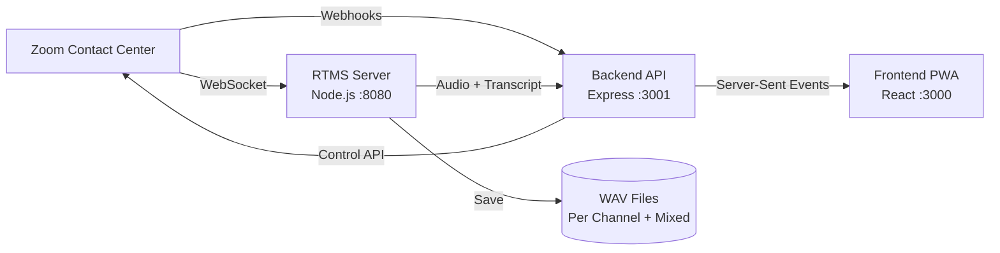

---
# ── Required — validation fails without these ───────────────────────────────
title: "Remote Access to Live Engagements"
slug: "engagement-remote-access"
description: >-
  Gain remote access to real-time engagement streams to monitor agent activity and control media streams. Capture live audio and transcripts from Zoom Contact Center voice engagements for supervisor monitoring and quality assurance.
products: ["rtms", "contact-center"]
verticals: ["customer-support"]
estimated_time: "1-2 hours"
author: "Rehema Armorer"
status: "draft"
updated: 2026-09-08

# ── Strongly encouraged — the site hides blueprints without a repo ──────────
github_repo: "https://github.com/zoom/zcc-rtms-PWA_sample-js"
demo_url: "https://youtu.be/cQ5eT_UbMIY?si=7TwtTTzF0EHwJOCi"

# ── Optional — delete what you don't use ────────────────────────────────────
solution_types: ["transcription-summarization", "analytics"]
tags: ["real-time", "rtms", "contact-center", "audio-capture", "monitoring"]
seo_title: "Real-Time Contact Center Engagement Monitoring with Zoom RTMS"
seo_keywords: ["zoom contact center rtms", "real-time media streams", "contact center monitoring", "supervisor dashboard"]
license_required: true
license_note: "Requires RTMS add-on license for Zoom Contact Center"
stack: "Node.js · React · Express · WebSocket · ffmpeg"
---

Contact Center admins can monitor active engagements by streaming live audio and transcripts from Zoom Contact Center voice calls to a browser-based dashboard. Quality monitoring typically requires admins to join calls or wait for recordings. Real-time access lets admins catch issues while agents can still course-correct.


<div align="center">
  
</div>


**What you'll need:**

- Zoom Contact Center license with admin privileges
- RTMS access via Zoom Contact Center (requires Contact Center license with RTMS add-on entitlement)
- A backend to receive webhooks
- An RTMS media processor to handle WebSocket connections and audio encoding (Node.js)
- A frontend dashboard for supervisors to control capture (React PWA)
- ffmpeg for audio file conversion

**Features:**

- **Remote RTMS control**: Supervisor-initiated Start/Stop controls from the browser PWA for active engagements
- **Real-time audio playback**: Live audio streamed to browser via Server-Sent Events with sub-200ms latency
- **Real-time transcript**: Live scrolling transcript display updated every 2 seconds
- **Event tracking**: Real-time counters for transfer, conference, and BMW (Barge/Monitor/Whisper) events
- **Hold tracking**: Live hold time display with total hold count and cumulative hold duration
- **Per-channel WAV files**: Audio saved as 16kHz 16-bit mono WAV per participant channel, merged to stereo on call end

Zoom Contact Center includes native supervisor features for live monitoring. Build custom when you need remote access without joining calls, custom metrics tracking, or integration with your quality assurance tools.

This blueprint uses [Zoom Contact Center RTMS](https://developers.zoom.us/docs/contact-center/real-time-media-streams/) to access live media streams. Follow along as we walk through the architecture.

## Architecture

The application operates as three independent Node.js processes that communicate via HTTP APIs and Server-Sent Events:

### Components

| Component | Responsibility | Stack |
|-----------|----------------|-------|
| **RTMS Server** | Connect to Zoom WebSocket servers, receive audio frames and transcripts, save raw PCM to disk, convert to WAV files, forward live data to backend | Node.js (ES modules) + `ws` + `ffmpeg` + `express` |
| **Backend API** | Handle OAuth 2.0 flow, receive Zoom webhooks, control RTMS start/stop, relay audio via SSE, track engagement events, serve frontend | Node.js (CommonJS) + Express + `axios` |
| **Frontend PWA** | Display live dashboard with RTMS controls, play audio via Web Audio API, show real-time transcript, render engagement metrics | React + Zoom Apps SDK + EventSource + Web Audio API |

**Engagement flow:**

1. Zoom fires `contact_center.engagement_started` webhook to the backend, which enables the Start/Stop buttons in the PWA
2. Supervisor clicks "Start RTMS" in the frontend, which calls the backend API
3. Backend invokes Zoom's RTMS control endpoint
4. Zoom responds with `contact_center.voice_rtms_started` webhook containing signaling server URL, engagement ID, and stream ID
5. Backend forwards this to the RTMS server
6. RTMS server generates an HMAC-SHA256 signature using client credentials and establishes a WebSocket connection to Zoom's signaling server
7. After handshake, Zoom provides a media server URL where the RTMS server opens a second WebSocket
8. RTMS server negotiates audio format (16kHz mono L16) and transcript preferences
9. RTMS server receives real-time audio frames and transcript messages

**Audio processing:**

- Audio is saved to per-channel raw PCM files
- Audio is forwarded as base64 to the backend for SSE broadcast to browsers
- Audio is converted to WAV on engagement end

**Transcript processing:**

- Transcripts are appended to rolling buffers and files
- Transcripts are forwarded to the backend for polling
- Frontend displays transcript in real time



## Implementation Guide

This guide walks through building the three core services and their integration points: the backend (OAuth and webhook processing), the RTMS server (WebSocket media connections and audio capture), and the frontend (live audio playback and supervisor controls). Each section references actual code from the repository to demonstrate authentication, WebSocket handling, and audio processing patterns.

### Project Structure

The monorepo contains three independent Node.js applications with a shared `.env` file:

```
rtms-zcc-pwa/
├── backend/              # Express API server (port 3001)
│   ├── server.js        # Main server with OAuth, webhooks, SSE
│   ├── controllers/
│   │   └── zoomController.js  # RTMS control logic
│   ├── helpers/
│   │   ├── zoom-api.js       # Authenticated Zoom API client
│   │   └── token-store.js    # In-memory OAuth token storage
│   └── middleware/
│       └── security.js       # Security headers
├── rtms/                # RTMS media processor (port 8080)
│   ├── server.js        # WebSocket client for Zoom RTMS
│   └── audioHelper.js   # WAV file generation and audio processing
├── frontend/            # React PWA (port 3000)
│   └── src/
│       ├── App.js              # Router
│       ├── pages/
│       │   └── DashboardPage.js   # Main control panel
│       └── hooks/
│           ├── useEngagement.js   # Active engagement polling
│           ├── useRtms.js         # RTMS control + live audio
│           ├── useTranscript.js   # Transcript polling
│           └── useHoldData.js     # Hold tracking
└── .env                 # Shared environment configuration
```

### 1. Backend: OAuth and Webhook Processing

The backend handles two critical authentication flows: the OAuth 2.0 authorization code exchange that grants API access, and webhook signature validation that ensures events actually come from Zoom. Both use HMAC-SHA256 cryptography and must handle timing attacks and replay attacks.

#### OAuth token exchange

**Input:** Authorization code from OAuth redirect, client ID, client secret, redirect URI

**Output:** Access token and refresh token stored in memory, user redirected to frontend

**Invariants:**

- Exchange code within 5 minutes of redirect (codes expire)
- Store both access token and refresh token for automatic renewal
- Use Basic Auth header with client credentials for token exchange
- Redirect to frontend URL after successful exchange


**Implementation:**

```javascript
// backend/server.js (OAuth callback)
app.get('/api/auth/callback', async (req, res) => {
  const { code } = req.query;
  
  if (!code) {
    return res.status(400).send('Missing authorization code');
  }

  try {
    const tokenResponse = await axios.post('https://zoom.us/oauth/token', 
      new URLSearchParams({
        grant_type: 'authorization_code',
        code,
        redirect_uri: process.env.ZOOM_REDIRECT_URL
      }), {
        headers: { 'Content-Type': 'application/x-www-form-urlencoded' },
        auth: {
          username: process.env.ZOOM_APP_CLIENT_ID,
          password: process.env.ZOOM_APP_CLIENT_SECRET
        }
      });

    await setTokens(tokenResponse.data.access_token, tokenResponse.data.refresh_token);
    
    // Redirect to frontend
    res.redirect(process.env.FRONTEND_URL || 'http://localhost:3000');
  } catch (error) {
    console.error('OAuth error:', error.response?.data || error.message);
    res.status(500).send('Authentication failed');
  }
});
```

#### Webhook signature validation

**Input:** Webhook payload with `plainToken` field, secret token from Zoom Marketplace

**Output:** Encrypted token using HMAC-SHA256, returned in response to validate webhook endpoint

**Invariants:**

- Use same secret token configured in Zoom Marketplace webhook settings
- Generate HMAC-SHA256 hash of the plainToken
- Return both plainToken and encryptedToken in response
- This validates your endpoint can receive webhooks from Zoom

**Implementation:**

```javascript
// backend/server.js (webhook validation)
app.post('/api/webhooks/zoom', (req, res) => {
  const { event, payload } = req.body;

  // Handle URL validation
  if (event === 'endpoint.url_validation') {
    if (!payload?.plainToken) {
      return res.status(400).json({ error: 'Missing plainToken' });
    }

    const encryptedToken = crypto
      .createHmac('sha256', process.env.ZOOM_SECRET_TOKEN)
      .update(payload.plainToken)
      .digest('hex');

    return res.json({
      plainToken: payload.plainToken,
      encryptedToken
    });
  }

  // Process other webhook events here
  res.status(200).send('OK');
});
```

### 2. RTMS Server: WebSocket Media Connections

RTMS uses a two-stage WebSocket handshake: first authenticate with a signaling server using HMAC credentials, then connect to a media server to receive audio frames and transcript messages. Each engagement requires fresh connections that must be cleaned up when the call ends.

#### Signaling WebSocket authentication

**Input:** `contact_center.voice_rtms_started` webhook payload with `engagement_id`, `rtms_stream_id`, `signaling_server_url`, client ID, and client secret

**Output:** Authenticated WebSocket connection to signaling server, media server URL received in handshake response

**Invariants:**

- Generate HMAC-SHA256 signature using `${CLIENT_ID},${engagement_id},${rtms_stream_id}` as message
- Send handshake message immediately on WebSocket open (msg_type: 1)
- Wait for msg_type: 2 response before connecting to media server
- Store WebSocket reference for cleanup on engagement end

**Implementation:**

```javascript
// rtms/server.js (Signaling WebSocket)
function generateSignature(engagementId, rtmsStreamId) {
  const message = `${CLIENT_ID},${engagementId},${rtmsStreamId}`;
  return crypto
    .createHmac('sha256', CLIENT_SECRET)
    .update(message)
    .digest('hex');
}

function connectToSignalingWebSocket(engagementId, rtmsStreamId, serverUrl, engagementData) {
  const ws = new WebSocket(serverUrl);
  engagementData.signalingWs = ws;

  ws.on('open', () => {
    const handshake = {
      msg_type: 1,
      protocol_version: 1,
      engagement_id: engagementId,
      rtms_stream_id: rtmsStreamId,
      sequence: 0,
      signature: generateSignature(engagementId, rtmsStreamId)
    };
    
    ws.send(JSON.stringify(handshake));
  });

  ws.on('message', (data) => {
    const message = JSON.parse(data.toString());
    
    if (message.msg_type === 2) {
      // Signaling ACK with media server URL
      const mediaServerUrl = message.media_server_url;
      connectToMediaWebSocket(engagementId, mediaServerUrl, engagementData);
    }
  });
}
```

#### Manual RTMS start and stop control

RTMS capture is admin-initiated, not automatic, and triggered when the Start/Stop buttons are clicked by the user.

**Input:** Engagement ID, action ("start" or "stop"), OAuth access token

**Output:** RTMS state updated in Zoom, `contact_center.voice_rtms_started` or `contact_center.voice_rtms_stopped` webhook fired

**Invariants:**

- Only call RTMS control when engagement is active (frontend checks `isActive` state)
- Include `client_id` in settings object (Zoom uses this to route RTMS data)
- Handle 401 responses by refreshing OAuth token and retrying
- Wait for webhook confirmation before attempting WebSocket connection
- Close existing WebSocket connections before starting new RTMS session for same engagement

**Control flow:**

1. Supervisor clicks "Start RTMS" or "Stop RTMS" button in frontend PWA
2. Frontend sends POST to backend `/api/zoom/rtms/control` with the engagement ID and appropriate action
3. Backend calls Zoom API `PUT /v2/contact_center/{engagementId}/rtms_app/status` with authenticated request
4. Zoom responds with 200 OK if successful
5. Zoom fires the appropriate ZCC RTMS webhook to backend within 1-2 seconds

**Implementation:**

Frontend implementation:

```javascript
// frontend/src/hooks/useRtms.js
export function useRtms(engagementId) {
  const [isRtmsRunning, setIsRtmsRunning] = useState(false);
  const [loading, setLoading] = useState(false);
  const [error, setError] = useState('');

  const handleStart = async () => {
    setLoading(true);
    setError('');
    
    try {
      const res = await fetch('/api/zoom/rtms/control', {
        method: 'POST',
        headers: { 'Content-Type': 'application/json' },
        credentials: 'include',
        body: JSON.stringify({ engagementId, action: 'start' }),
      });
      
      const data = await res.json();
      
      if (res.ok) {
        setIsRtmsRunning(true);
        // Audio stream setup happens here
      } else {
        setError(data.error || 'Failed to start RTMS');
      }
    } catch (err) {
      setError(`Error starting RTMS: ${err.message}`);
    } finally {
      setLoading(false);
    }
  };

  return { isRtmsRunning, loading, error, handleStart, handleStop };
}
```

Backend implementation:

```javascript
// backend/controllers/zoomController.js
async function handleRtmsControl(req, res) {
  const { engagementId, action } = req.body;

  if (!engagementId || !action) {
    return res.status(400).json({ error: 'Missing engagementId or action' });
  }

  if (action !== 'start' && action !== 'stop') {
    return res.status(400).json({ error: 'Action must be "start" or "stop"' });
  }

  try {
    const data = await zoomApiRequest({
      method: 'PUT',
      url: `https://zoom.us/v2/contact_center/${engagementId}/rtms_app/status`,
      data: {
        action,
        settings: { client_id: process.env.ZOOM_APP_CLIENT_ID }
      }
    });

    res.json({ success: true, action, engagementId, data });
  } catch (error) {
    console.error(`RTMS ${action} failed:`, error.response?.data || error.message);
    res.status(error.response?.status || 500).json({
      error: `Failed to ${action} RTMS`,
      code: error.response?.data?.code
    });
  }
}
```

#### Media WebSocket audio processing

**Input:** Media server WebSocket URL, audio format preferences, transcript language preferences

**Output:** Real-time audio frames and transcript messages processed, saved to disk, and forwarded to backend

**Invariants:**

- Send media handshake immediately on WebSocket open
- Process msg_type 14 (RTMS audio) and msg_type 15 (consumer audio) separately by channel_id
- Forward only primary channel audio to backend for live playback (avoid multiple streams)
- Append all audio to per-channel raw PCM files
- Append all transcripts to rolling buffer
- Base64-decode audio data before saving to raw PCM files

**Implementation:**

```javascript
// rtms/server.js (media WebSocket handler)
ws.on('message', (data) => {
  const message = JSON.parse(data.toString());
  
  if (message.msg_type === 14 || message.msg_type === 15) {
    // Audio frame (14 = agent, 15 = consumer)
    const audioData = Buffer.from(message.data, 'base64');
    const channelId = message.channel_id;
    
    // Save to raw PCM file
    saveRawAudio(engagementId, channelId, audioData, engagementData);
    
    // Forward to backend for live playback (first channel only)
    if (!engagementData.primaryChannel) {
      engagementData.primaryChannel = channelId;
    }
    
    if (channelId === engagementData.primaryChannel) {
      sendAudioChunk(message.data);  // Forward base64 to backend
    }
  } else if (message.msg_type === 17) {
    // Transcript
    const text = message.text;
    saveTranscript(engagementId, message);
    sendTranscriptLine(engagementId, text);
  }
});
```

### 3. Audio File Generation

Audio arrives as raw PCM data that must be saved incrementally during streaming, then converted to WAV format after the engagement ends. ffmpeg handles format conversion and stereo interleaving when multiple channels are captured.

#### Raw PCM to WAV conversion

**Input:** Raw PCM files per channel, engagement session directory, channel IDs

**Output:** Per-channel WAV files, interleaved stereo `mixed.wav` file combining all channels

**Invariants:**

- Create unique session directory per engagement using timestamp
- Append audio data to raw PCM files during streaming (don't buffer in memory)
- Convert raw PCM to WAV only after engagement ends (prevents file corruption)
- For stereo interleaving, use `join:inputs=2:channel_layout=stereo` filter
- If only one channel exists, copy to mixed.wav without interleaving
- Delete raw PCM files after successful WAV conversion (optional)

**Implementation:**

```javascript
// rtms/audioHelper.js
export function saveRawAudio(engagementId, channelId, audioData, engagementData) {
  if (!engagementData.sessionDir) {
    engagementData.sessionDir = join(audioDir, makeSessionTimestamp());
    mkdirSync(engagementData.sessionDir, { recursive: true });
  }
  
  const rawPath = getChannelRawPath(engagementData.sessionDir, channelId);
  appendFileSync(rawPath, audioData);
}

export function convertRawToWav(sessionDir, channelId) {
  const rawPath = getChannelRawPath(sessionDir, channelId);
  const wavPath = getChannelWavPath(sessionDir, channelId);
  
  // ffmpeg: raw 16kHz 16-bit mono L16 → WAV
  execSync(`ffmpeg -f s16le -ar 16000 -ac 1 -i "${rawPath}" "${wavPath}"`);
}

export function finalizeInterleavedWav(sessionDir, channelIds) {
  const mixedPath = join(sessionDir, 'mixed.wav');
  
  if (channelIds.length === 1) {
    // Mono → copy as-is
    execSync(`ffmpeg -i "${getChannelWavPath(sessionDir, channelIds[0])}" "${mixedPath}"`);
  } else {
    // Stereo interleave (L = channel 0, R = channel 1)
    const inputs = channelIds.map(id => `-i "${getChannelWavPath(sessionDir, id)}"`).join(' ');
    execSync(`ffmpeg ${inputs} -filter_complex "[0:a][1:a]join=inputs=2:channel_layout=stereo[a]" -map "[a]" "${mixedPath}"`);
  }
}
```

### 4. Frontend: Live Media Rendering

Supervisors need to experience the engagement as it happens. This means hearing the conversation in real time, reading the transcript as words are spoken, and watching metrics update live. The frontend achieves this through three independent data streams: Server-Sent Events for audio, HTTP polling for transcript and metrics, and client-side calculations for smooth visual updates.

#### Server-Sent Events audio streaming

Audio playback requires the lowest latency of all live data streams. Server-Sent Events (SSE) provide a one-way persistent connection from backend to browser, perfect for streaming audio chunks as they arrive from the RTMS server. The Web Audio API handles playback scheduling, ensuring smooth audio without gaps even when chunks arrive with slight timing variations. This approach achieves sub-200ms latency.

**Input:** Base64-encoded L16 audio chunks via SSE, Web Audio API context

**Output:** Real-time audio playback in browser with sub-200ms latency

**Invariants:**

- Initialize AudioContext only when RTMS starts (avoids autoplay policy issues)
- Decode base64 to Uint8Array, then to Int16Array (L16 format)
- Normalize Int16 samples to Float32 range [-1, 1] by dividing by 32768
- Create new AudioBuffer for each chunk with correct sample rate (16000 Hz)
- Schedule audio playback immediately via `source.start()` (Web Audio handles buffering)
- Close EventSource connection when RTMS stops (prevents memory leaks)
- Handle EventSource `onerror` to detect disconnections and update UI

**Implementation:**

```javascript
// frontend/src/hooks/useRtms.js (audio streaming)
const startAudioStream = () => {
  // Initialize Web Audio API
  audioContextRef.current = new (window.AudioContext || window.webkitAudioContext)();
  
  // Open Server-Sent Events connection
  const eventSource = new EventSource(`/api/rtms/audio/stream`);
  eventSourceRef.current = eventSource;

  eventSource.onmessage = (event) => {
    const { data } = JSON.parse(event.data);
    
    // Decode base64 → Int16Array → Float32Array
    const binaryString = atob(data);
    const len = binaryString.length;
    const bytes = new Uint8Array(len);
    for (let i = 0; i < len; i++) {
      bytes[i] = binaryString.charCodeAt(i);
    }
    
    const int16Array = new Int16Array(bytes.buffer);
    const float32Array = new Float32Array(int16Array.length);
    for (let i = 0; i < int16Array.length; i++) {
      float32Array[i] = int16Array[i] / 32768.0;  // Normalize to [-1, 1]
    }
    
    // Create audio buffer and play
    const audioBuffer = audioContextRef.current.createBuffer(1, float32Array.length, 16000);
    audioBuffer.getChannelData(0).set(float32Array);
    
    const source = audioContextRef.current.createBufferSource();
    source.buffer = audioBuffer;
    source.connect(audioContextRef.current.destination);
    source.start();
  };

  eventSource.onerror = () => setAudioConnected(false);
};
```

#### Live transcript display with auto-scroll

Transcript data arrives from Zoom in segments every 2-3 seconds, gets forwarded from the RTMS server to the backend, and needs to appear in the browser with minimal delay. Transcripts use simple HTTP polling every 2 seconds. The auto-scroll behavior keeps the most recent text visible.

**Input:** Transcript endpoint that returns array of transcript objects

**Output:** Real-time transcript display with auto-scroll behavior

**Invariants:**

- Poll backend every 2 seconds (balances responsiveness with API load)
- Auto-scroll to bottom only when new transcript lines arrive
- Store transcript lines in state array
- Clear transcript lines when engagement ends
- Use `useRef` for scroll container to access DOM node

**Implementation:**

```javascript
// frontend/src/hooks/useTranscript.js
export function useTranscript() {
  const [transcript, setTranscript] = useState([]);
  const transcriptBoxRef = useRef(null);

  useEffect(() => {
    const fetchTranscript = async () => {
      try {
        const res = await fetch('/api/engagement/transcript');
        const data = await res.json();
        setTranscript(data.lines);
      } catch (err) {
        console.error('Error fetching transcript:', err);
      }
    };
    
    fetchTranscript();
    const interval = setInterval(fetchTranscript, 2000);
    return () => clearInterval(interval);
  }, []);

  // Auto-scroll to bottom when transcript updates
  useEffect(() => {
    if (transcriptBoxRef.current) {
      transcriptBoxRef.current.scrollTop = transcriptBoxRef.current.scrollHeight;
    }
  }, [transcript]);

  return { transcript, transcriptBoxRef };
}
```

#### Live hold tracking and event counters

Engagement metrics like hold duration, transfer count, and BMW events provide monitoring context. Hold tracking is the most time-sensitive: when an agent places a customer on hold, the supervisor needs to see a live ticking timer. This is achieved through backend state (total hold time) and client-side calculations (elapsed time since last poll). The timer updates every 100ms in the browser for smooth visual feedback, while actual hold data polls every 1-2 seconds.

**Input:** Contact Center webhook events, HTTP polling endpoints for frontend retrieval

**Output:** Live updating metrics displayed in dashboard

**Invariants:**

- Poll hold endpoint every 1 second when on hold (shows live ticking timer)
- Poll hold endpoint every 2 seconds when not on hold (reduces API load)
- Calculate current hold duration client-side by adding elapsed time to total hold time
- Display hold timer in MM:SS format for readability
- Poll event counts every 2 seconds (transfers, conferences, BMW events)
- Reset all counters when engagement ends

**Implementation:**

```javascript
// frontend/src/hooks/useHoldData.js
export function useHoldData() {
  const [holdCount, setHoldCount] = useState(0);
  const [totalHoldMs, setTotalHoldMs] = useState(0);
  const [isOnHold, setIsOnHold] = useState(false);
  const [liveHoldMs, setLiveHoldMs] = useState(0);
  const holdStartRef = useRef(null);

  useEffect(() => {
    const fetchHoldData = async () => {
      try {
        const res = await fetch('/api/engagement/hold');
        const data = await res.json();
        setHoldCount(data.holdCount);
        setTotalHoldMs(data.totalHoldMs);
        setIsOnHold(data.isOnHold);
        
        if (data.isOnHold) {
          holdStartRef.current = Date.now() - (data.totalHoldMs % 60000);
        } else {
          holdStartRef.current = null;
          setLiveHoldMs(0);
        }
      } catch (err) {
        console.error('Error fetching hold data:', err);
      }
    };
    
    fetchHoldData();
    const interval = setInterval(fetchHoldData, isOnHold ? 1000 : 2000);
    return () => clearInterval(interval);
  }, [isOnHold]);

  // Live tick when on hold
  useEffect(() => {
    if (!isOnHold) return;
    
    const ticker = setInterval(() => {
      if (holdStartRef.current) {
        setLiveHoldMs(Date.now() - holdStartRef.current);
      }
    }, 100);
    
    return () => clearInterval(ticker);
  }, [isOnHold]);

  return { holdCount, totalHoldMs, isOnHold, liveHoldMs };
}
```

### 5. Run the Sample

This section walks through starting all three services (frontend, backend, RTMS server) locally, exposing the backend via ngrok for webhook delivery, and configuring the Zoom Marketplace app.

**Prerequisites:**

- Node.js ≥ 18.0.0
- ffmpeg installed (`brew install ffmpeg` on macOS)
- ngrok account for webhook delivery
- Zoom Contact Center account with RTMS license

**Quick Start:**

```bash
# Clone and install
git clone https://github.com/zoom/zcc-rtms-PWA_sample-js
cd zcc-rtms-PWA_sample-js
npm run install:all

# Configure environment
cp .env.example .env
# Edit .env with your Zoom app credentials

# Start all services
npm start
# Frontend: http://localhost:3000
# Backend: http://localhost:3001
# RTMS: http://localhost:8080

# In separate terminal, expose backend with ngrok
npm run ngrok
# Copy the HTTPS URL and update .env:
#   PUBLIC_URL=https://YOUR_ID_HERE.ngrok-free.app
#   ZOOM_REDIRECT_URL=https://YOUR_ID_HERE.ngrok-free.app/api/auth/callback
# Restart: Ctrl+C, then npm start

# Configure Zoom Marketplace app with ngrok URL
# Install app via OAuth to authorize
# Start a Contact Center voice call
# Click "Start RTMS" in the PWA
```

**Environment Variables:**

Required in `.env`:

- `ZOOM_APP_CLIENT_ID` — from Zoom Marketplace app credentials
- `ZOOM_APP_CLIENT_SECRET` — from Zoom Marketplace app credentials
- `ZOOM_SECRET_TOKEN` — from Zoom Marketplace webhook settings
- `PUBLIC_URL` — ngrok HTTPS URL (e.g. `https://YOUR_ID_HERE.ngrok-free.app`)
- `ZOOM_REDIRECT_URL` — `${PUBLIC_URL}/api/auth/callback`

## App Manifest

This application requires a Zoom Marketplace **General App** configured as **admin-managed** to receive Contact Center engagement lifecycle events. For quick set-up, use the manifest.json file. 

**Webhook Configuration:**

- Notification URL: `https://YOUR_NGROK_URL_HERE.ngrok-free.app/api/webhooks/zoom`
- Method: **Webhook** (not Event subscription HTTP endpoint)
- Secret Token: Copy to `.env` as `ZOOM_SECRET_TOKEN` for signature validation

**RTMS Configuration:**

- Enable RTMS under the **RTMS** tab in Zoom Marketplace
- In Contact Center Admin (zoom.us/myhome → Admin → Contact Center Management → Integrations → Zoom Apps → RTMS):
  - Disable auto-start (capture is supervisor-initiated via PWA)
  - Assign app to appropriate queues
  - Ensure app is **admin-managed** for engagement events to fire

**OAuth Flow:**

The app uses authorization code flow with automatic token refresh:

1. User clicks "Add App" in Zoom Marketplace Local Test menu
2. Zoom redirects to app with authorization code
3. Backend exchanges code for access + refresh tokens at `POST https://zoom.us/oauth/token`
4. Tokens stored in memory (cleared on backend restart)
5. Tokens automatically refreshed when access token expires
