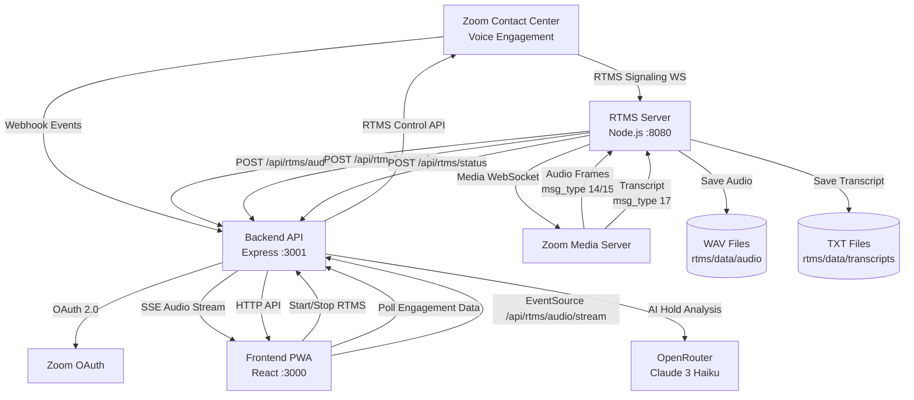

---
# ── Required — validation fails without these ───────────────────────────────
title: "Remote Access for Contact Center Engagements"
slug: "engagement-remote-access"
description: >-
  Gain remote access to real-time engagement streams to monitor agent activity and control media streams. Capture live audio and transcripts from Zoom Contact Center voice engagements with AI-powered insights and coaching analytics.
products: ["rtms", "contact-center"]
verticals: ["customer-support"]
estimated_time: "2-4 hours"
author: "Rehema Armorer"
status: "draft"
updated: 2026-09-02

# ── Strongly encouraged — the site hides blueprints without a repo ──────────
github_repo: "https://github.com/zoom/zcc-rtms-PWA_sample-js"
demo_url: "https://youtu.be/cQ5eT_UbMIY?si=7TwtTTzF0EHwJOCi"

# ── Optional — delete what you don't use ────────────────────────────────────
solution_types: ["transcription-summarization", "analytics"]
tags: ["real-time", "rtms", "contact-center", "ai-coaching", "audio-capture"]
seo_title: "Real-Time Contact Center Engagement Monitoring with Zoom RTMS"
seo_keywords: ["zoom contact center rtms", "real-time media streams", "contact center monitoring", "ai coaching analytics"]
license_required: true
license_note: "Requires RTMS add-on license for Zoom Contact Center"
stack: "Node.js · React · Express · WebSocket · OpenRouter · ffmpeg"
---

In contact center and customer support environments, calls and engagements are typically reviewed after they've finished. But what if you could gain insight into an engagement *while* it's in progress? Instead of attempting to connect the dots of a created summary, you could catch the pauses, questions, and events of the conversation in real time. 

This application creates an engagement analysis system that gives remote access to engagements as they're happening for live monitoring or quick drop-ins. More than that, it uses the media streams captured from the engagement to create AI-powered analytics, summaries, and next steps for admin-agent coaching. 

**What you'll need:**

- Zoom Contact Center license with admin privelages 
- Audio and transcript access via Zoom Contact Center RTMS 
- A backend to receive webhooks 
- An RTMS media processor to handle WebSocket connections and audio encoding (Node.js in this guide)
- A frontend dashboard for admins to control capture (React PWA in this guide)
- ffmpeg for audio file conversion
- An LLM for hold reason analysis (OpenRouter with Claude 3 Haiku in this guide; OpenAI, Anthropic, or self-hosted also work)

**Features:**

- **Remote RTMS control**: Admin-initiated Start/Stop controls from the browser PWA for active engagements
- **Real-time audio playback**: Live audio streamed to browser via Server-Sent Events with sub-200ms latency
- **Real-time transcript**: Live scrolling transcript display updated in real time
- **AI hold reason generation**: AI-generated reason for call hold based on 10 seconds of transcript prefacing the action
- **Engagement Snapshot page**: Post-call summary with call statistics, AI-generated narrative summary, coaching notes, and timestamped event timeline
- **Event tracking**: Real-time counters for transfer, conference, and BMW (Barge/Monitor/Whisper) events
- **Hold tracking**: Live hold time display with total hold count and cumulative hold duration

Follow along as we walk through the architecture.

## Architecture

The application operates as three independent Node.js processes that communicate via HTTP APIs and Server-Sent Events:

### Components
| Component | Responsibility | Stack |
|-----------|----------------|-------|
| **RTMS Server** | Connect to Zoom WebSocket servers, receive audio frames and transcripts, save raw PCM to disk, convert to WAV files, forward live data to backend | Node.js (ES modules) + `ws` + `ffmpeg` + `express` |
| **Backend API** | Handle OAuth 2.0 flow, receive Zoom webhooks, control RTMS start/stop, relay audio via SSE, generate AI hold reasons, track engagement events, serve frontend | Node.js (CommonJS) + Express + `axios` + OpenRouter API |
| **Frontend PWA** | Display live dashboard with RTMS controls, play audio via Web Audio API, show real-time transcript, render post-call engagement snapshots with coaching analytics | React + Zoom Apps SDK + EventSource + Web Audio API |


**Engagement flow:**

1. Zoom fires `contact_center.engagement_started` webhook to the backend, which enables the Start/Stop buttons in the PWA
2. Agent clicks "Start RTMS" in the frontend, which calls the backend API
3. Backend invokes Zoom's RTMS control endpoint
4. Zoom responds with `contact_center.voice_rtms_started` webhook containing signaling server URL, engagement ID, and stream ID
5. Backend forwards this to the RTMS server
6. RTMS server generates an HMAC-SHA256 signature using client credentials and establishes a WebSocket connection to Zoom's signaling server
7. After handshake, Zoom provides a media server URL where the RTMS server opens a second WebSocket
8. RTMS server negotiates audio format (16kHz mono L16) and transcript preferences
9. RTMS server receives real-time audio frames and transcript messages

**Audio processing:**

- Audio is saved to per-channel raw PCM files
- Audio is forwarded as base64 to the backend for SSE broadcast to browsers
- Audio is converted to WAV on engagement end

**Transcript processing:**

- Transcripts are appended to rolling buffers and files
- Transcripts are forwarded to the backend for polling
- Transcripts are used for AI hold reason generation when hold events occur



## Implementation Guide

This guide walks through building the three core services and their integration points. Each section references actual code from the repository to demonstrate authentication, WebSocket handling, audio processing, and AI integration patterns.

### Project Structure

The monorepo contains three independent Node.js applications with a shared `.env` file:

```
rtms-zcc-pwa/
├── backend/              # Express API server (port 3001)
│   ├── server.js        # Main server with OAuth, webhooks, SSE
│   ├── controllers/
│   │   └── zoomController.js  # RTMS control logic
│   ├── helpers/
│   │   ├── zoom-api.js       # Authenticated Zoom API client
│   │   └── token-store.js    # In-memory OAuth token storage
│   └── middleware/
│       └── security.js       # Security headers
├── rtms/                # RTMS media processor (port 8080)
│   ├── server.js        # WebSocket client for Zoom RTMS
│   └── audioHelper.js   # WAV file generation and audio processing
├── frontend/            # React PWA (port 3000)
│   └── src/
│       ├── App.js              # Router with Dashboard and Snapshot pages
│       ├── pages/
│       │   ├── DashboardPage.js   # Main control panel
│       │   └── SnapshotPage.js    # Post-call analytics
│       └── hooks/
│           ├── useEngagement.js   # Active engagement polling
│           ├── useRtms.js         # RTMS control + live audio
│           ├── useTranscript.js   # Transcript polling
│           └── useHoldData.js     # Hold tracking
└── .env                 # Shared environment configuration
```

### 1. Backend: OAuth and Webhook Processing

#### OAuth token exchange

**Input:** Authorization code from OAuth redirect, client ID, client secret, redirect URI

**Output:** Access token and refresh token stored in memory, user redirected to frontend

**Invariants:**

- Exchange code within 5 minutes of redirect (codes expire)
- Store both access token and refresh token for automatic renewal
- Use Basic Auth header with client credentials for token exchange
- Redirect to frontend URL after successful exchange

**Implementation:**
```javascript
// backend/server.js (lines 100-130 approx)
app.get('/api/auth/callback', async (req, res) => {
  const { code } = req.query;
  
  if (!code) {
    return res.status(400).send('Missing authorization code');
  }

  try {
    const tokenResponse = await axios.post('https://zoom.us/oauth/token', 
      new URLSearchParams({
        grant_type: 'authorization_code',
        code,
        redirect_uri: process.env.ZOOM_REDIRECT_URL
      }), {
        headers: { 'Content-Type': 'application/x-www-form-urlencoded' },
        auth: {
          username: process.env.ZOOM_APP_CLIENT_ID,
          password: process.env.ZOOM_APP_CLIENT_SECRET
        }
      });

    await setTokens(tokenResponse.data.access_token, tokenResponse.data.refresh_token);
    
    // Redirect to frontend
    res.redirect(process.env.FRONTEND_URL || 'http://localhost:3000');
  } catch (error) {
    console.error('OAuth error:', error.response?.data || error.message);
    res.status(500).send('Authentication failed');
  }
});
```

#### Webhook signature validation and deduplication

**Input:** Webhook request with `x-zm-signature` header, `x-zm-request-timestamp` header, raw JSON body, and secret token

**Output:** Validated event processed once, duplicates rejected, invalid signatures rejected

**Invariants:**

- Reject requests with timestamps older than 5 minutes (replay attack protection)
- Use timing-safe comparison for HMAC validation (prevents timing attacks)
- Deduplicate by composite key: `${event.event}_${event.payload.object.id}_${timestamp}`
- Retain deduplication cache for 5 minutes per event

**Implementation:**

```javascript
// backend/server.js (webhook handler section)
const processedEvents = new Map(); // eventId -> timestamp

app.post('/api/webhooks/zoom', express.raw({ type: 'application/json' }), (req, res) => {
  // Validate webhook signature
  const signature = req.headers['x-zm-signature'];
  const timestamp = req.headers['x-zm-request-timestamp'];
  const message = `v0:${timestamp}:${req.body}`;
  
  const hmac = crypto.createHmac('sha256', process.env.ZOOM_SECRET_TOKEN);
  const expectedSignature = `v0=${hmac.update(message).digest('hex')}`;
  
  if (signature !== expectedSignature) {
    return res.status(401).send('Invalid signature');
  }

  const event = JSON.parse(req.body);
  const eventId = `${event.event}_${event.payload.object.id}_${timestamp}`;
  
  // Deduplicate within 5 minutes
  if (processedEvents.has(eventId)) {
    return res.status(200).send('Duplicate event');
  }
  
  processedEvents.set(eventId, Date.now());
  setTimeout(() => processedEvents.delete(eventId), 5 * 60 * 1000);

  // Handle specific events
  switch (event.event) {
    case 'contact_center.engagement_started':
      engagementState.engagementId = event.payload.object.id;
      engagementState.isActive = true;
      break;
    case 'contact_center.engagement_ended':
      generateEngagementSnapshot();
      break;
    case 'contact_center.engagement_user_hold':
      handleHoldEvent(event.payload.object.id);
      break;
    case 'contact_center.voice_rtms_started':
      forwardToRtmsServer(event.payload);
      break;
    // ... other event handlers
  }
  
  res.status(200).send('OK');
});
```

### 2. RTMS Server: WebSocket Media Connections

#### Signaling WebSocket authentication

**Input:** `contact_center.voice_rtms_started` webhook payload with `engagement_id`, `rtms_stream_id`, `signaling_server_url`, client ID, and client secret

**Output:** Authenticated WebSocket connection to signaling server, media server URL received in handshake response

**Invariants:**

- Generate HMAC-SHA256 signature using `${CLIENT_ID},${engagement_id},${rtms_stream_id}` as message
- Send handshake message immediately on WebSocket open (msg_type: 1)
- Wait for msg_type: 2 response before connecting to media server
- Store WebSocket reference for cleanup on engagement end

**Implementation:**
```javascript
// rtms/server.js (lines 68-96)
function generateSignature(engagementId, rtmsStreamId) {
  const message = `${CLIENT_ID},${engagementId},${rtmsStreamId}`;
  return crypto
    .createHmac('sha256', CLIENT_SECRET)
    .update(message)
    .digest('hex');
}

function connectToSignalingWebSocket(engagementId, rtmsStreamId, serverUrl, engagementData) {
  const ws = new WebSocket(serverUrl);
  engagementData.signalingWs = ws;

  ws.on('open', () => {
    const handshake = {
      msg_type: 1,
      protocol_version: 1,
      engagement_id: engagementId,
      rtms_stream_id: rtmsStreamId,
      sequence: 0,
      signature: generateSignature(engagementId, rtmsStreamId)
    };
    
    ws.send(JSON.stringify(handshake));
  });

  ws.on('message', (data) => {
    const message = JSON.parse(data.toString());
    
    if (message.msg_type === 2) {
      // Signaling ACK with media server URL
      const mediaServerUrl = message.media_server_url;
      connectToMediaWebSocket(engagementId, mediaServerUrl, engagementData);
    }
  });
}
```

#### Media WebSocket audio processing

**Input:** Media server WebSocket URL, audio format preferences (16kHz, mono, L16), transcript language preferences

**Output:** Real-time audio frames (msg_type 14/15) and transcript messages (msg_type 17) processed, saved to disk, and forwarded to backend

**Invariants:**

- Send media handshake (msg_type: 11) immediately on WebSocket open
- Request 16kHz sample rate, 1 channel (mono), L16 format, 20ms interval
- Process msg_type 14 (RTMS audio) and msg_type 15 (consumer audio) separately by channel_id
- Forward only primary channel audio to backend for live playback (avoid multiple streams)
- Append all audio to per-channel raw PCM files
- Append all transcripts to rolling buffer for hold analysis
- Base64-decode audio data before saving to raw PCM files

**Implementation:**
```javascript
// rtms/server.js (media WebSocket handler)
function connectToMediaWebSocket(engagementId, serverUrl, engagementData) {
  const ws = new WebSocket(serverUrl);
  engagementData.mediaWs = ws;

  ws.on('open', () => {
    // Send media handshake
    const handshake = {
      msg_type: 11,
      sequence: 0,
      audio: {
        sample_rate: 16000,  // 16kHz
        channels: 1,         // Mono
        format: 'L16',       // Linear PCM
        interval_ms: 20      // 20ms frames
      },
      transcript: {
        language: 'en-US',
        enable_language_detection: true
      }
    };
    
    ws.send(JSON.stringify(handshake));
  });

  ws.on('message', (data) => {
    const message = JSON.parse(data.toString());
    
    if (message.msg_type === 14 || message.msg_type === 15) {
      // Audio frame (14 = agent, 15 = consumer)
      const audioData = Buffer.from(message.data, 'base64');
      const channelId = message.channel_id;
      
      // Save to raw PCM file
      saveRawAudio(engagementId, channelId, audioData, engagementData);
      
      // Forward to backend for live playback (first channel only)
      if (!engagementData.primaryChannel) {
        engagementData.primaryChannel = channelId;
      }
      
      if (channelId === engagementData.primaryChannel) {
        sendAudioChunk(message.data);  // Forward base64 to backend
      }
    } else if (message.msg_type === 17) {
      // Transcript
      const text = message.text;
      saveTranscript(engagementId, message);
      sendTranscriptLine(engagementId, text);
      
      // Add to rolling 30s buffer for hold analysis
      updateTranscriptBuffer(engagementId, text);
    }
  });
}
```

### 3. Audio File Generation

#### Raw PCM to WAV conversion

**Input:** Raw PCM files per channel (16-bit signed, little-endian, 16kHz, mono), engagement session directory, channel IDs

**Output:** Per-channel WAV files, interleaved stereo `mixed.wav` file combining all channels

**Invariants:**

- Create unique session directory per engagement using timestamp
- Append audio data to raw PCM files during streaming (don't buffer in memory)
- Convert raw PCM to WAV only after engagement ends (prevents file corruption)
- Use ffmpeg with `-f s16le -ar 16000 -ac 1` for raw-to-WAV conversion
- For stereo interleaving, use `join=inputs=2:channel_layout=stereo` filter
- If only one channel exists, copy to mixed.wav without interleaving
- Delete raw PCM files after successful WAV conversion (optional)

**Implementation:**

```javascript
// rtms/audioHelper.js
export function saveRawAudio(engagementId, channelId, audioData, engagementData) {
  if (!engagementData.sessionDir) {
    engagementData.sessionDir = join(audioDir, makeSessionTimestamp());
    mkdirSync(engagementData.sessionDir, { recursive: true });
  }
  
  const rawPath = getChannelRawPath(engagementData.sessionDir, channelId);
  appendFileSync(rawPath, audioData);
}

export function convertRawToWav(sessionDir, channelId) {
  const rawPath = getChannelRawPath(sessionDir, channelId);
  const wavPath = getChannelWavPath(sessionDir, channelId);
  
  // ffmpeg: raw 16kHz 16-bit mono L16 → WAV
  execSync(`ffmpeg -f s16le -ar 16000 -ac 1 -i "${rawPath}" "${wavPath}"`);
}

export function finalizeInterleavedWav(sessionDir, channelIds) {
  // Merge all channel WAVs into stereo mixed.wav
  const inputs = channelIds.map(id => `-i "${getChannelWavPath(sessionDir, id)}"`).join(' ');
  const mixedPath = join(sessionDir, 'mixed.wav');
  
  if (channelIds.length === 1) {
    // Mono → copy as-is
    execSync(`ffmpeg -i "${getChannelWavPath(sessionDir, channelIds[0])}" "${mixedPath}"`);
  } else {
    // Stereo interleave (L = channel 0, R = channel 1)
    execSync(`ffmpeg ${inputs} -filter_complex "[0:a][1:a]join=inputs=2:channel_layout=stereo[a]" -map "[a]" "${mixedPath}"`);
  }
}
```

### 4. Frontend: Live Audio Playback

#### Server-Sent Events audio streaming

**Input:** Base64-encoded L16 audio chunks via SSE, Web Audio API context

**Output:** Real-time audio playback in browser with sub-200ms latency

**Invariants:**

- Initialize AudioContext only when RTMS starts (avoids autoplay policy issues)
- Decode base64 to Uint8Array, then to Int16Array (L16 format)
- Normalize Int16 samples to Float32 range [-1, 1] by dividing by 32768
- Create new AudioBuffer for each chunk with correct sample rate (16000 Hz)
- Schedule audio playback immediately via `source.start()` (Web Audio handles buffering)
- Close EventSource connection when RTMS stops (prevents memory leaks)
- Handle EventSource `onerror` to detect disconnections and update UI

**Implementation:**

```javascript
// frontend/src/hooks/useRtms.js
export function useRtms(engagementId) {
  const audioContextRef = useRef(null);
  const eventSourceRef = useRef(null);
  const [audioConnected, setAudioConnected] = useState(false);

  const startAudioStream = () => {
    // Initialize Web Audio API
    audioContextRef.current = new (window.AudioContext || window.webkitAudioContext)();
    
    // Open Server-Sent Events connection
    const eventSource = new EventSource(`${BACKEND_URL}/api/rtms/audio/stream`);
    eventSourceRef.current = eventSource;

    eventSource.onmessage = (event) => {
      const { data } = JSON.parse(event.data);
      
      // Decode base64 → Int16Array → Float32Array
      const binaryString = atob(data);
      const len = binaryString.length;
      const bytes = new Uint8Array(len);
      for (let i = 0; i < len; i++) {
        bytes[i] = binaryString.charCodeAt(i);
      }
      
      const int16Array = new Int16Array(bytes.buffer);
      const float32Array = new Float32Array(int16Array.length);
      for (let i = 0; i < int16Array.length; i++) {
        float32Array[i] = int16Array[i] / 32768.0;  // Normalize to [-1, 1]
      }
      
      // Create audio buffer and play
      const audioBuffer = audioContextRef.current.createBuffer(1, float32Array.length, 16000);
      audioBuffer.getChannelData(0).set(float32Array);
      
      const source = audioContextRef.current.createBufferSource();
      source.buffer = audioBuffer;
      source.connect(audioContextRef.current.destination);
      source.start();
    };

    eventSource.onopen = () => setAudioConnected(true);
    eventSource.onerror = () => setAudioConnected(false);
  };

  const handleStart = async () => {
    const response = await fetch(`${BACKEND_URL}/api/zoom/rtms/control`, {
      method: 'POST',
      headers: { 'Content-Type': 'application/json' },
      body: JSON.stringify({ action: 'start', engagementId })
    });
    
    if (response.ok) {
      startAudioStream();
    }
  };

  return { audioConnected, handleStart, handleStop };
}
```

### 5. AI Hold Reason Generation

#### Hold event analysis with LLM

**Input:** `contact_center.engagement_user_hold` webhook, last 10 seconds of transcript from RTMS server, LLM API credentials

**Output:** One-sentence explanation of why agent placed customer on hold, logged in event timeline

**Invariants:**

- Fetch recent transcript from RTMS server before calling LLM (transcript may not have reached backend yet)
- Use last 10 seconds only (keeps LLM cost low, focuses on immediate context)
- Prompt LLM to generate one concise sentence (prevents verbose responses)
- Log fallback reason if transcript is empty or LLM call fails (ensures event log integrity)
- Record hold start time before async LLM call to calculate accurate duration
- Store hold reason in `engagementState.eventLog` with timestamp and event type

**Implementation:**

```javascript
// backend/server.js (hold event handler)
async function handleHoldEvent(engagementId) {
  const holdStartTime = Date.now();
  engagementState.holdCount++;
  
  try {
    // Fetch last 10 seconds of transcript from RTMS server
    const response = await axios.get(
      `${process.env.RTMS_SERVER_URL}/transcript/recent/${engagementId}`
    );
    
    const recentTranscript = response.data.transcript || '';
    
    if (!recentTranscript) {
      engagementState.eventLog.push({
        time: new Date().toISOString(),
        event: 'Hold',
        reason: 'Agent placed customer on hold (no transcript available)'
      });
      return;
    }
    
    // Send to OpenRouter with Claude 3 Haiku
    const aiResponse = await axios.post(
      'https://openrouter.ai/api/v1/chat/completions',
      {
        model: process.env.AI_MODEL || 'anthropic/claude-3-haiku',
        messages: [{
          role: 'user',
          content: `Based on this conversation transcript, in one concise sentence, why did the agent likely put the customer on hold?\n\nTranscript:\n${recentTranscript}`
        }]
      },
      {
        headers: {
          'Authorization': `Bearer ${process.env.OPENROUTER_API_KEY}`,
          'Content-Type': 'application/json'
        }
      }
    );
    
    const reason = aiResponse.data.choices[0].message.content;
    
    engagementState.eventLog.push({
      time: new Date().toISOString(),
      event: 'Hold',
      reason,
      duration: Date.now() - holdStartTime
    });
  } catch (error) {
    console.error('[Hold reason] Failed:', error.message);
    // Fallback to static reason
    engagementState.eventLog.push({
      time: new Date().toISOString(),
      event: 'Hold',
      reason: 'Agent placed customer on hold'
    });
  }
}
```

### 6. Run the Sample

**Prerequisites:**
- Node.js ≥ 18.0.0
- ffmpeg installed (`brew install ffmpeg` on macOS)
- ngrok account for webhook delivery
- Zoom Contact Center account with RTMS license

**Quick Start:**

```bash
# Clone and install
git clone https://github.com/zoom/zcc-rtms-PWA_sample-js
cd zcc-rtms-PWA_sample-js
npm run install:all

# Configure environment
cp .env.example .env
# Edit .env with your Zoom app credentials

# Start all services
npm start
# Frontend: http://localhost:3000
# Backend: http://localhost:3001
# RTMS: http://localhost:8080

# In separate terminal, expose backend with ngrok
npm run ngrok
# Copy the HTTPS URL and update .env:
#   PUBLIC_URL=https://your-id.ngrok-free.app
#   ZOOM_REDIRECT_URL=https://your-id.ngrok-free.app/api/auth/callback
# Restart: Ctrl+C, then npm start

# Configure Zoom Marketplace app with ngrok URL
# Install app via OAuth to authorize
# Start a Contact Center voice call
# Click "Start RTMS" in the PWA
```

**Environment Variables:**

Required in `.env`:
- `ZOOM_APP_CLIENT_ID` — from Zoom Marketplace app credentials
- `ZOOM_APP_CLIENT_SECRET` — from Zoom Marketplace app credentials
- `ZOOM_SECRET_TOKEN` — from Zoom Marketplace webhook settings
- `PUBLIC_URL` — ngrok HTTPS URL (e.g. `https://abc123.ngrok-free.app`)
- `ZOOM_REDIRECT_URL` — `${PUBLIC_URL}/api/auth/callback`
- `OPENROUTER_API_KEY` — (optional) for AI hold reason generation

**Development Scripts:**
- `npm start` — Start all three services with hot reload
- `npm stop` — Kill processes on ports 3000, 3001, 8080
- `npm run health` — Check backend health endpoint
- `npm run clean:data` — Delete all captured audio/transcript files

## App Manifest

This application requires a Zoom Marketplace **General App** configured as **admin-managed** to receive Contact Center engagement lifecycle events. The app manifest defines OAuth scopes, event subscriptions, and RTMS capabilities.

**Required Scopes:**
- `contact_center:read:zcc_voice_audio` — Read real-time audio streams from voice engagements
- `contact_center:update:engagement_rtms_app_status` — Start/stop RTMS for specific engagements
- `contact_center:read:zcc_voice_transcript` — Read real-time transcripts from voice engagements

**Required Event Subscriptions:**

Subscribe to these events under **Access → Event Subscriptions** in Zoom Marketplace:

| Event | Purpose |
|-------|---------|
| `contact_center.engagement_started` | Activates Start/Stop buttons in PWA when engagement begins |
| `contact_center.engagement_ended` | Triggers engagement snapshot generation and data finalization |
| `contact_center.engagement_user_hold` | Initiates AI hold reason analysis using recent transcript |
| `contact_center.engagement_user_unhold` | Updates live hold timer and calculates hold duration |
| `contact_center.voice_rtms_started` | Triggers RTMS WebSocket connection to signaling server |
| `contact_center.voice_rtms_stopped` | Triggers WAV conversion, cleanup, and session finalization |
| `contact_center.engagement_transfer_initiated` | Tracked in event counts and displayed in engagement snapshot |

**Webhook Configuration:**
- Notification URL: `https://your-ngrok-url.ngrok-free.app/api/webhooks/zoom`
- Method: **Webhook** (not Event subscription HTTP endpoint)
- Secret Token: Copy to `.env` as `ZOOM_SECRET_TOKEN` for signature validation

**RTMS Configuration:**
- Enable RTMS under the **RTMS** tab in Zoom Marketplace
- In Contact Center Admin (zoom.us/myhome → Admin → Contact Center Management → Integrations → Zoom Apps → RTMS):
  - Disable auto-start (capture is admin-initiated via PWA)
  - Assign app to appropriate queues
  - Ensure app is **admin-managed** for engagement events to fire

**OAuth Flow:**

The app uses authorization code flow with automatic token refresh:
1. User clicks "Add App" in Zoom Marketplace Local Test menu
2. Zoom redirects to app with authorization code
3. Backend exchanges code for access + refresh tokens at `POST https://zoom.us/oauth/token`
4. Tokens stored in memory (cleared on backend restart)
5. Tokens automatically refreshed when access token expires

**Manifest API (Optional):**

For one-click app creation, create a `manifest.json` file with the configuration above and use the Zoom Marketplace Manifests API to upload it programmatically. This is useful for deployment automation or distributing pre-configured apps to multiple Zoom accounts.
