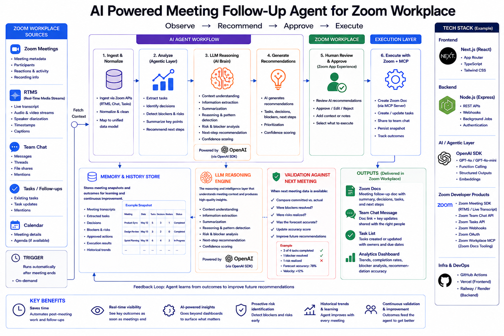

Build a workplace agent that uses Zoom meeting and chat context to recommend follow-up actions without removing human oversight. This guide shows developers how to build an agentic workflow that observes what happened, recommends the next steps, requests approval, and takes action only after approval is provided.


**What you'll need:**

* [RTMS access](https://developers.zoom.us/docs/rtms/) ([pricing](https://zoom.us/pricing/developer)). RTMS requires a paid Zoom Workplace plan with the appropriate entitlement.
* A [Zoom Developer Account](https://developers.zoom.us) and a **General OAuth App** created in the [Zoom App Marketplace](https://marketplace.zoom.us/).
* A backend that can receive webhooks, join the RTMS media stream, store meeting context, and call an LLM.
* A [Zoom App](https://developers.zoom.us/docs/zoom-apps/) that displays the dashboard and provides in-meeting controls for starting and stopping RTMS.
* An [OpenAI API key](https://platform.openai.com/api-keys) for task extraction, meeting summaries, and Zoom Doc creation through the Responses API and [Zoom MCP](https://mcp.zoom.us).
* An [Anthropic API key](https://console.anthropic.com/) for the Zoom Chat Research Assistant bot.
* [ngrok](https://ngrok.com). A free static domain is recommended so your Marketplace URLs do not change each time ngrok restarts.

## Features:

* **Live transcription (Observe):** Stream meeting transcripts through RTMS using the `meeting.rtms_started` and `meeting.rtms_stopped` lifecycle webhooks. Transcript segments are sent to the browser over server-sent events (SSE) for a live in-meeting view.
* **AI task extraction (Recommend):** After the meeting ends, OpenAI analyzes the full transcript and uses Structured Outputs with a strict JSON Schema to return predictable task suggestions.
* **Meeting intelligence:** Generate a meeting summary and identify decisions, risks, and blockers alongside the suggested tasks.
* **Human-in-the-loop approvals (Approve):** Each extracted task begins as a `pending` suggestion. The user can approve, edit, or reject it. Only approved suggestions become tasks.
* **AI Actions: Follow-up Docs (Execute):** When the meeting contains enough useful context, the app recommends creating a follow-up document. The user can preview and edit the AI-generated Markdown before approving it. The backend then uses the OpenAI Responses API with **Zoom MCP** as a remote tool source to create a Zoom Doc. This action requires the `docs:write:import` scope.
* **Share to Zoom Chat:** Post the created Zoom Doc link to the current chat using the Zoom Apps SDK’s `sendMessageToChat` API. This requires the `imchat:userapp` scope and must run inside the Zoom client.

<<<<<<< HEAD
=======
AI agents are only useful when they have the right context and the right guardrails. This guide explores how Zoom meeting, chat, and workflow context can help developers build agentic experiences that observe what happened, recommend next steps, ask for approval, and then take action.
>>>>>>> a8cc3a1 (Added image)

## Architecture


<<<<<<< HEAD
<<<<<<< HEAD
=======
>>>>>>> a8cc3a1 (Added image)
<div align="center">
  

</div>
<<<<<<< HEAD


## Implementation Guide 

This blueprint shows how live Zoom Workplace context can become a human-in-the-loop completion workflow.

A meeting produces a transcript. The transcript becomes structured signals. Those signals produce recommended actions. The user reviews and approves an action, and a Zoom capability executes the approved work.

The code follows a clear separation of responsibilities:

* AI observes and proposes. 
* Application logic decides when to recommend.
* A human approves. 
* Zoom developer tools execute.

AI never mutates application state or calls a Zoom execution surface on its own. Extracted tasks enter the system as `pending` suggestions, and generated artifacts are previewed before they can be created.


---

## Observe meeting context with RTMS

The workflow starts when Zoom fires the `meeting.rtms_started` webhook.

A unified webhook handler routes the event into the RTMS lifecycle. The same `POST /webhooks` endpoint also handles Zoom Chat events, with RTMS handled as another event branch.

The webhook provides the information needed to join the media stream:

- `meeting_uuid`
- `rtms_stream_id`
- `server_urls`

The transcript itself arrives later over the RTMS media connection.

### `backend/routes/webhook-routes.js`

```js
case 'meeting.rtms_started':
case 'webinar.rtms_started': {
  const o = payload?.object ?? payload ?? {};
  const meetingId = o.meeting_uuid ?? o.webinar_uuid ?? o.session_id;
  const { rtms_stream_id, server_urls } = o;

  if (meetingId && rtms_stream_id && server_urls) {
    startRtmsSession(meetingId, rtms_stream_id, server_urls).catch(err =>
      log.error('startRtmsSession error', { error: err.message })
    );
  } else {
    log.warn(`${event} missing required fields`, { payload: o });
  }

  break;
}
```

The webhook ACKs `200` immediately and dispatches the handler separately so slower AI or Zoom Chat calls do not interfere with [Zoom's three-second webhook timeout](https://developers.zoom.us/docs/api/webhooks/).

`meeting.rtms_stopped` mirrors this branch and calls `stopRtmsSession(meetingId)`.

`startRtmsSession` opens a `@zoom/rtms` client. Once the client joins, the application explicitly enables transcript delivery.

### `backend/utils/rtms/rtms-service.js`

```js
// The native binding requires the boolean: enableTranscript(true).
// Calling with no argument throws "Boolean argument expected".
client.enableTranscript(true);
```

Transcript frames arrive through `onTranscriptData`. This callback is where the raw RTMS buffer becomes an application-level transcript segment.

### `backend/utils/rtms/rtms-service.js`

```js
// onTranscriptData(buffer, size, timestamp, metadata)
client.onTranscriptData((buffer, _size, timestamp, metadata) => {
  handleTranscriptSegment(meetingUuid, {
    userId:     metadata?.userId,
    userName:   metadata?.userName,
    text:       buffer.toString('utf8'),
    seqNo:      timestamp,
    tStartMs:   timestamp,
    tEndMs:     null,
    confidence: null,
  });
});
```

The SDK timestamp also acts as the segment deduplication key.

### Preserve meeting identity across the workflow

Every downstream stage uses the Zoom meeting UUID.

When RTMS joins, `registerMeetingContext()` upserts a meeting record into the shared `TaskStore`. Each transcript segment is mirrored into that store so AI analysis, the dashboard, and the recommendation layer can read the same meeting context without depending directly on the live RTMS connection.

### `backend/utils/rtms/transcript-handler.js`

```js
function mirrorToTaskStore(meetingUuid, segment) {
  taskStore.appendTranscriptSegment(meetingUuid, {
    ts:      new Date(segment.tStartMs || Date.now()).toISOString(),
    speaker: segment.speakerLabel,
    text:    segment.text,
  });
}
```

At the same time, live segments are sent to the browser over SSE:

```text
GET /api/meetings/:meetingId/transcript-stream
```

This keeps the in-progress meeting view updated while RTMS continues collecting context.

---

## Let Zoom lifecycle events control processing

RTMS events also determine when processing begins and ends.

`meeting.rtms_started` begins capture.

When RTMS stops, the SDK's `onLeave` path calls `cleanupSession`, which starts post-meeting analysis.

The application does not run the full analysis continuously during the meeting. It waits until the transcript is complete and then processes the meeting once.

### `backend/utils/rtms/post-meeting-ai.js`

```js
if (analyzedMeetings.has(meetingUuid)) {
  return {
    suggestionCount: 0,
    summarized: false,
    reason: 'already_analyzed'
  };
}

analyzedMeetings.add(meetingUuid);

const transcript = taskStore.getTranscript(meetingUuid);

if (!transcript.length) {
  return {
    suggestionCount: 0,
    summarized: false,
    reason: 'no_transcript'
  };
}
```

The meeting lifecycle itself becomes the trigger:

```text
RTMS started → collect context
RTMS stopped → analyze completed context
```

There is no separate timer or manual "run analysis" step.

---

## Analyze context and generate recommendations

The recommendation pipeline has two layers.

AI interprets language and produces structured signals.

Application logic decides whether those signals justify recommending an action.

### Turn the transcript into structured suggestions

The completed transcript is sent to an analyzer using OpenAI Structured Outputs with JSON Schema and `strict: true`.

The model must return a predictable task structure rather than free-form text that the application would need to interpret again.

### `backend/utils/ai/ai-task-analyzer.js`

```js
const response = await openai.chat.completions.create({
  model: options.model ?? DEFAULT_MODEL,
  temperature: 0.2,
  messages: [
    { role: 'system', content: SYSTEM_PROMPT },
    { role: 'user', content: userMessage },
  ],
  response_format: {
    type: 'json_schema',
    json_schema: TASK_EXTRACTION_SCHEMA
  },
});
```

Each extracted task includes fields such as:

- the task
- confidence
- a verbatim `sourceExcerpt`
- the person associated with the commitment

The system prompt tells the model:

```
"Only extract tasks that a specific person committed to… Do NOT invent tasks."
```
The analyzer returns structured data to its caller. It does not create Zoom Tasks or persist external changes.

### `backend/utils/rtms/post-meeting-ai.js`

```js
const saved = extraction.tasks.map(t =>
  taskStore.saveTaskSuggestion(t)
);
```

`saveTaskSuggestion()` stores each result with:

```text
status: 'pending'
```

That status is important. AI extraction creates something the user can review before execution is possible.

### Decide when to surface an action

A rule-based recommender looks at the meeting's accumulated signals and decides whether the UI should recommend a follow-up action.

### `backend/utils/ai/follow-up-recommender.js`

```js
const approvedTasks =
  tasks.filter(t => t.source === 'ai_suggestion').length;

const pendingSuggestions =
  suggestions.filter(s => s.status === 'pending').length;

const completedTasks =
  tasks.filter(t => t.status === 'completed').length;

const blockers =
  countBlockers(risks, ctx.summary);

const hasSummary =
  Boolean(ctx.summary && ctx.summary.trim().length > 20);
```

The model interprets what people said.

The recommender evaluates application state.

That keeps workflow triggers inspectable and gives the UI concrete reasons for a recommendation, such as:

```text
2 approved tasks · 1 decision · 1 blocker
```

`GET /api/meetings/:id/ai-actions` returns a `create-follow-up-doc` suggestion only when `shouldSuggestDoc` evaluates to true.

The reasons array travels with the recommendation so the user can see what caused it to appear.

---

## Put execution behind an approval boundary

Previewing an action and executing an action use separate API operations.

The preview endpoint generates editable Markdown:

```text
POST /api/meetings/:id/ai-actions/preview
```

It does not create anything in Zoom. After reviewing or editing the content, the user can call:

```text
POST /api/meetings/:id/ai-actions/create-doc
```

The execution endpoint validates that approved Markdown was provided before continuing.

### `backend/routes/api/ai-actions.js`

```js
const { markdown, title } = req.body ?? {};

if (!markdown || typeof markdown !== 'string' || !markdown.trim()) {
  return res.status(400).json({
    success: false,
    error: 'markdown is required. Call /ai-actions/preview first.',
  });
}

// The user OAuth token comes from the session populated by /auth/callback.
// If absent the user must sign in before creating a Doc.
const userAccessToken =
  req.session?.zoomTokens?.access_token ?? null;
```

This puts the approval requirement in backend application logic instead of relying on the UI alone.

AI-extracted tasks use the same pattern.

```text
POST /api/task-suggestions/:id/approve
```

A pending suggestion becomes an executable task only after the approval endpoint is called.

---

## Execute approved work with Zoom Workplace MCP

After the user approves the Markdown, the backend creates a Zoom Doc through Zoom Workplace MCP.

The sample uses the OpenAI Responses API as the MCP client rather than implementing the Zoom MCP protocol directly.

### `backend/utils/zoom/zoom-mcp-docs.js`

```js
response = await openai.responses.create({
  model,
  tools: [{
    type: 'mcp',
    server_label: 'zoom-mcp',
    server_url: endpoint,

    // OpenAI forwards these headers when it talks to Zoom MCP.
    // The user OAuth token must include `docs:write:import`.
    headers: {
      Authorization: `Bearer ${userAccessToken}`
    },

    // Approval already happened in the application UI.
    require_approval: 'never',

    // Restrict this execution path to the expected Zoom MCP tool.
    allowed_tools: [TOOL_NAME],
  }],
});
```

The configuration controls three parts of execution. `server_url` points to Zoom's MCP endpoint:

```text
https://mcp.zoom.us/mcp/zoom/streamable
```

`headers.Authorization` forwards the user's OAuth bearer token. The Doc is therefore created under that user's authorization and requires the appropriate `docs:write:import` scope.

`allowed_tools` limits this execution path to:

```text
create_new_file_with_markdown
```

The model cannot select another Zoom MCP tool exposed by the server.

`require_approval: 'never'` applies to the MCP invocation because approval has already happened in the application before this code runs.

After execution, the backend parses the returned `file_id` and `file_link`, associates the Doc with the meeting, and sends the result back to the client.

---

## Keep the workflow inside Zoom with the Apps SDK

The dashboard runs as a Zoom App inside the Zoom client.

The implementation connects three Zoom surfaces:

1. A Zoom Chat card launches the app.
2. The Apps SDK handles in-client context and authorization.
3. The Apps SDK sends the completed result back into Zoom Chat.

### Launch the app from a Zoom Chat card

The Zoom Chat bot builds an interactive card containing an `Open Dashboard` button.

The button uses:

```text
action: 'dialog'
```

with a `dialog.link`, which opens the Next.js application in a Zoom webview.

### `backend/utils/cards/menu-cards.js`

```js
{
  type: 'button',
  text: 'Open Dashboard',
  value: ACTIONS.OPEN_DASHBOARD,
  style: 'Default',
  action: 'dialog',
  dialog: {
    size: 'L',
    title: { text: 'AI Services Dashboard' },
    link: dashboardUrl,
  },
}
```

`dashboardUrl` comes from `getWebviewUrl()`.

The helper accepts only HTTPS URLs because Zoom’s in-client browser requires `dialog.link`. If it cannot produce one, it returns `null` and the card builder leaves the button out instead of sending an invalid card. 

### `backend/utils/zoom/zoom-app-urls.js`

```js
for (const raw of candidates) {
  const trimmed = String(raw).replace(/\/+$/, '');

  if (trimmed.startsWith('https://')) {
    return `${trimmed}/`;
  }
}

return null;
```

Once the webview loads, `useSurface()` checks the context reported by the Apps SDK and maps it to the appropriate UI.

### `frontend/lib/use-surface.tsx`

```js
function deriveKind(
  phase: SdkPhase,
  context: string | null
): SurfaceKind {
  if (phase === 'browser' || phase === 'detecting') return 'browser';
  if (context === 'inMeeting' || context === 'inWebinar') return 'meeting';
  if (context === 'inTeamChat') return 'team-chat';
  if (context === 'inMainClient') return 'main-client';

  return 'browser';
}
```

The Zoom Chat bot and Apps SDK have separate jobs here.

* The card launches the webview from chat.

* The Apps SDK runs inside that webview and handles client context, authorization, and sharing.

### Handle authorization inside the Zoom client

Creating a Zoom Doc requires a user OAuth token with `docs:write:import`.

If `create-doc` returns `401 authRequired` while the Apps SDK is available, the client starts the in-client OAuth flow and retries the same creation request once.

### `frontend/components/AIActions.tsx`

```js
let result = await api.createFollowUpDoc(
  meetingId,
  { markdown: editedMd, title }
);

if (
  !result.success &&
  'authRequired' in result &&
  result.authRequired &&
  sdk.phase === 'ready'
) {
  setPhase('authorizing');

  const authResult = await sdk.startInClientAuth();

  if (!authResult.ok) {
    setCreateErr(
      `In-client sign-in failed: ${authResult.reason}`
    );
    setPhase('preview-ready');
    return;
  }

  setPhase('creating');

  result = await api.createFollowUpDoc(
    meetingId,
    { markdown: editedMd, title }
  );
}
```

The client and backend coordinate through a small PKCE handshake.

The backend generates a verifier and state, stores them in the session, and gives the client a `codeChallenge`.

Zoom's in-client flow uses the `plain` PKCE method.

### `backend/routes/oauth-routes.js`

```js
const verifier =
  crypto.randomBytes(48).toString('base64url');

const state =
  crypto.randomBytes(16).toString('hex');

req.session.inClientOAuth = {
  state,
  verifier,
  createdAt: Date.now()
};

log.info('in-client OAuth started', { state });

return res.json({
  success: true,
  state,
  codeChallenge: verifier,
  codeChallengeMethod: 'plain'
});
```

The client sends the challenge to `zoomSdk.authorize(...)`, waits for `onAuthorized`, and POSTs the returned code to:

```text
/auth/in-client/callback
```

The backend performs the PKCE token exchange and stores the resulting tokens in:

```text
req.session.zoomTokens
```

The browser redirect flow uses the same session location, so downstream Zoom MCP execution does not need separate logic for browser OAuth and in-client OAuth.

If the Apps SDK is unavailable, the browser surface can still fall back to `/auth/login`.

The SDK capabilities are declared when the application initializes.

### `frontend/lib/use-zoom-app-sdk.ts`

```js
const CAPABILITIES = [
  'startRTMS',
  'stopRTMS',
  'pauseRTMS',
  'resumeRTMS',
  'getRTMSStatus',
  'onRTMSStatusChange',
  'getRunningContext',
  'getMeetingContext',
  'sendMessageToChat',
  'authorize',
  'onAuthorized',
];
```

### Send the completed work back to Zoom Chat

After the Doc is created, the client can post its link into the user's current Zoom Chat context using the App SDK  `sendMessageToChat` method. 

### `frontend/components/AIActions.tsx`

```js
const sdkResult = await sdk.sendMessageToChat(message);

if (!sdkResult.ok) {
  setShareNote(sdkResult.reason);
  setPhase('created');
  return;
}

try {
  await api.markFollowUpDocShared(
    meetingId,
    createdDoc.id
  );
```

The backend endpoint records that the share occurred. It does not post the Zoom Chat message.

### `backend/routes/api/ai-actions.js`

```js
 Frontend calls this after the user shares the doc to chat via the Apps SDK.
 We don't actually post the message from the backend — Apps SDK does that
 client-side. This endpoint just records the intent for the activity log.
```

This separation follows the context available on each side of the application.

The backend has the user's OAuth token and can create the Zoom Doc through MCP.

The frontend is running inside the Zoom client and can send a message into the user's current chat context.

---

## End-to-end implementation pattern

```text
                    OBSERVE

meeting.rtms_started
        ↓
@zoom/rtms joins the session
        ↓
onTranscriptData


                MEETING CONTEXT

Normalized transcript segments
stored by meeting UUID
        ↓
TaskStore + live SSE updates


                    ANALYZE

meeting.rtms_stopped
        ↓
OpenAI Structured Outputs
        ↓
Task suggestions saved as `pending`


                  RECOMMEND

Deterministic application rules
        ↓
"Create Follow-up Doc"
        ↓
Reasons shown to the user


                    PREVIEW

POST /ai-actions/preview
        ↓
Editable Markdown
        ↓
No Zoom side effect


                    APPROVE

User reviews or edits
        ↓
User confirms the action
        ↓
Backend validates approved content


                    EXECUTE

OpenAI Responses API
        ↓
Zoom Workplace MCP
        ↓
allowed_tools + user OAuth
        ↓
Zoom Doc created


                 BACK TO WORK

Apps SDK
        ↓
sendMessageToChat
        ↓
Doc link posted into Zoom Chat
```

The implementation keeps three boundaries explicit:

**Reasoning:** AI converts meeting language into structured suggestions.

**Authorization:** the user decides which suggestion becomes an action.

**Execution:** Zoom RTMS, MCP, APIs, and the Apps SDK perform specific operations using the context and authorization available to them.

That gives developers a reusable pattern for Zoom Workplace applications:

```text
Observe → Recommend → Approve → Execute
```

The model can interpret context and prepare work, but application code still controls when an action becomes executable and which Zoom capability is allowed to perform it.

=======
 
>>>>>>> eea6493 (Added Zoom  manifest vaildation script and CLI command)
=======
>>>>>>> a8cc3a1 (Added image)

<<<<<<< HEAD
=======
## Implementation Guide 

This blueprint shows how live Zoom Workplace context can become a human-in-the-loop completion workflow.

A meeting produces a transcript. The transcript becomes structured signals. Those signals produce recommended actions. The user reviews and approves an action, and a Zoom capability executes the approved work.

The code follows a clear separation of responsibilities:

* AI observes and proposes. 
* Application logic decides when to recommend.
* A human approves. 
* Zoom developer tools execute.

AI never mutates application state or calls a Zoom execution surface on its own. Extracted tasks enter the system as `pending` suggestions, and generated artifacts are previewed before they can be created.


---

## 1. Observe meeting context with RTMS

The workflow starts when Zoom fires the `meeting.rtms_started` webhook.

A unified webhook handler routes the event into the RTMS lifecycle. The same `POST /webhooks` endpoint also handles Zoom Chat events, with RTMS handled as another event branch.

The webhook provides the information needed to join the media stream:

- `meeting_uuid`
- `rtms_stream_id`
- `server_urls`

The transcript itself arrives later over the RTMS media connection.

### `backend/routes/webhook-routes.js`

```js
case 'meeting.rtms_started':
case 'webinar.rtms_started': {
  const o = payload?.object ?? payload ?? {};
  const meetingId = o.meeting_uuid ?? o.webinar_uuid ?? o.session_id;
  const { rtms_stream_id, server_urls } = o;

  if (meetingId && rtms_stream_id && server_urls) {
    startRtmsSession(meetingId, rtms_stream_id, server_urls).catch(err =>
      log.error('startRtmsSession error', { error: err.message })
    );
  } else {
    log.warn(`${event} missing required fields`, { payload: o });
  }

  break;
}
```

The webhook ACKs `200` immediately and dispatches the handler separately so slower AI or Zoom Chat calls do not interfere with Zoom's three-second webhook timeout.

`meeting.rtms_stopped` mirrors this branch and calls `stopRtmsSession(meetingId)`.

`startRtmsSession` opens a `@zoom/rtms` client. Once the client joins, the application explicitly enables transcript delivery.

### `backend/utils/rtms/rtms-service.js`

```js
// The native binding requires the boolean: enableTranscript(true).
// Calling with no argument throws "Boolean argument expected".
client.enableTranscript(true);
```

Transcript frames arrive through `onTranscriptData`.

This callback is where the raw RTMS buffer becomes an application-level transcript segment.

### `backend/utils/rtms/rtms-service.js`

```js
// onTranscriptData(buffer, size, timestamp, metadata)
client.onTranscriptData((buffer, _size, timestamp, metadata) => {
  handleTranscriptSegment(meetingUuid, {
    userId:     metadata?.userId,
    userName:   metadata?.userName,
    text:       buffer.toString('utf8'),
    seqNo:      timestamp,
    tStartMs:   timestamp,
    tEndMs:     null,
    confidence: null,
  });
});
```

The SDK timestamp also acts as the segment deduplication key.

### Preserve meeting identity across the workflow

Every downstream stage uses the Zoom meeting UUID.

When RTMS joins, `registerMeetingContext()` upserts a meeting record into the shared `TaskStore`. Each transcript segment is mirrored into that store so AI analysis, the dashboard, and the recommendation layer can read the same meeting context without depending directly on the live RTMS connection.

### `backend/utils/rtms/transcript-handler.js`

```js
function mirrorToTaskStore(meetingUuid, segment) {
  taskStore.appendTranscriptSegment(meetingUuid, {
    ts:      new Date(segment.tStartMs || Date.now()).toISOString(),
    speaker: segment.speakerLabel,
    text:    segment.text,
  });
}
```

At the same time, live segments are sent to the browser over SSE:

```text
GET /api/meetings/:meetingId/transcript-stream
```

This keeps the in-progress meeting view updated while RTMS continues collecting context.

---

## 2. Let Zoom lifecycle events control processing

RTMS events also determine when processing begins and ends.

`meeting.rtms_started` begins capture.

When RTMS stops, the SDK's `onLeave` path calls `cleanupSession`, which starts post-meeting analysis.

The application does not run the full analysis continuously during the meeting. It waits until the transcript is complete and then processes the meeting once.

### `backend/utils/rtms/post-meeting-ai.js`

```js
if (analyzedMeetings.has(meetingUuid)) {
  return {
    suggestionCount: 0,
    summarized: false,
    reason: 'already_analyzed'
  };
}

analyzedMeetings.add(meetingUuid);

const transcript = taskStore.getTranscript(meetingUuid);

if (!transcript.length) {
  return {
    suggestionCount: 0,
    summarized: false,
    reason: 'no_transcript'
  };
}
```

The meeting lifecycle itself becomes the trigger:

```text
RTMS started → collect context
RTMS stopped → analyze completed context
```

There is no separate timer or manual "run analysis" step.

---

## 3. Analyze context and generate recommendations

The recommendation pipeline has two layers.

AI interprets language and produces structured signals.

Application logic decides whether those signals justify recommending an action.

### 3a. Turn the transcript into structured suggestions

The completed transcript is sent to an analyzer using OpenAI Structured Outputs with JSON Schema and `strict: true`.

The model must return a predictable task structure rather than free-form text that the application would need to interpret again.

### `backend/utils/ai/ai-task-analyzer.js`

```js
const response = await openai.chat.completions.create({
  model: options.model ?? DEFAULT_MODEL,
  temperature: 0.2,
  messages: [
    { role: 'system', content: SYSTEM_PROMPT },
    { role: 'user', content: userMessage },
  ],
  response_format: {
    type: 'json_schema',
    json_schema: TASK_EXTRACTION_SCHEMA
  },
});
```

Each extracted task includes fields such as:

- the task
- confidence
- a verbatim `sourceExcerpt`
- the person associated with the commitment

The system prompt tells the model:

```
"Only extract tasks that a specific person committed to… Do NOT invent tasks."
```
The analyzer returns structured data to its caller. It does not create Zoom Tasks or persist external changes.

### `backend/utils/rtms/post-meeting-ai.js`

```js
const saved = extraction.tasks.map(t =>
  taskStore.saveTaskSuggestion(t)
);
```

`saveTaskSuggestion()` stores each result with:

```text
status: 'pending'
```

That status is important. AI extraction creates something the user can review before execution is possible.

### 3b. Decide when to surface an action

A rule-based recommender looks at the meeting's accumulated signals and decides whether the UI should recommend a follow-up action.

### `backend/utils/ai/follow-up-recommender.js`

```js
const approvedTasks =
  tasks.filter(t => t.source === 'ai_suggestion').length;

const pendingSuggestions =
  suggestions.filter(s => s.status === 'pending').length;

const completedTasks =
  tasks.filter(t => t.status === 'completed').length;

const blockers =
  countBlockers(risks, ctx.summary);

const hasSummary =
  Boolean(ctx.summary && ctx.summary.trim().length > 20);
```

The model interprets what people said.

The recommender evaluates application state.

That keeps workflow triggers inspectable and gives the UI concrete reasons for a recommendation, such as:

```text
2 approved tasks · 1 decision · 1 blocker
```

`GET /api/meetings/:id/ai-actions` returns a `create-follow-up-doc` suggestion only when `shouldSuggestDoc` evaluates to true.

The reasons array travels with the recommendation so the user can see what caused it to appear.

---

## 4. Put execution behind an approval boundary

Previewing an action and executing an action use separate API operations.

The preview endpoint generates editable Markdown:

```text
POST /api/meetings/:id/ai-actions/preview
```

It does not create anything in Zoom. After reviewing or editing the content, the user can call:

```text
POST /api/meetings/:id/ai-actions/create-doc
```

The execution endpoint validates that approved Markdown was provided before continuing.

### `backend/routes/api/ai-actions.js`

```js
const { markdown, title } = req.body ?? {};

if (!markdown || typeof markdown !== 'string' || !markdown.trim()) {
  return res.status(400).json({
    success: false,
    error: 'markdown is required. Call /ai-actions/preview first.',
  });
}

// The user OAuth token comes from the session populated by /auth/callback.
// If absent the user must sign in before creating a Doc.
const userAccessToken =
  req.session?.zoomTokens?.access_token ?? null;
```

This puts the approval requirement in backend application logic instead of relying on the UI alone.

AI-extracted tasks use the same pattern.

```text
POST /api/task-suggestions/:id/approve
```

A pending suggestion becomes an executable task only after the approval endpoint is called.

---

## 5. Execute approved work with Zoom Workplace MCP

After the user approves the Markdown, the backend creates a Zoom Doc through Zoom Workplace MCP.

The sample uses the OpenAI Responses API as the MCP client rather than implementing the Zoom MCP protocol directly.

### `backend/utils/zoom/zoom-mcp-docs.js`

```js
response = await openai.responses.create({
  model,
  tools: [{
    type: 'mcp',
    server_label: 'zoom-mcp',
    server_url: endpoint,

    // OpenAI forwards these headers when it talks to Zoom MCP.
    // The user OAuth token must include `docs:write:import`.
    headers: {
      Authorization: `Bearer ${userAccessToken}`
    },

    // Approval already happened in the application UI.
    require_approval: 'never',

    // Restrict this execution path to the expected Zoom MCP tool.
    allowed_tools: [TOOL_NAME],
  }],
});
```

The configuration controls three parts of execution. `server_url` points to Zoom's MCP endpoint:

```text
https://mcp.zoom.us/mcp/zoom/streamable
```

`headers.Authorization` forwards the user's OAuth bearer token. The Doc is therefore created under that user's authorization and requires the appropriate `docs:write:import` scope.

`allowed_tools` limits this execution path to:

```text
create_new_file_with_markdown
```

The model cannot select another Zoom MCP tool exposed by the server.

`require_approval: 'never'` applies to the MCP invocation because approval has already happened in the application before this code runs.

After execution, the backend parses the returned `file_id` and `file_link`, associates the Doc with the meeting, and sends the result back to the client.

---

## 6. Keep the workflow inside Zoom with the Apps SDK

The dashboard runs as a Zoom App inside the Zoom client.

The implementation connects three Zoom surfaces:

1. A Zoom Chat card launches the app.
2. The Apps SDK handles in-client context and authorization.
3. The Apps SDK sends the completed result back into Zoom Chat.

### Launch the app from a Zoom Chat card

The Zoom Chat bot builds an interactive card containing an `Open Dashboard` button.

The button uses:

```text
action: 'dialog'
```

with a `dialog.link`, which opens the Next.js application in a Zoom webview.

### `backend/utils/cards/menu-cards.js`

```js
{
  type: 'button',
  text: 'Open Dashboard',
  value: ACTIONS.OPEN_DASHBOARD,
  style: 'Default',
  action: 'dialog',
  dialog: {
    size: 'L',
    title: { text: 'AI Services Dashboard' },
    link: dashboardUrl,
  },
}
```

`dashboardUrl` comes from `getWebviewUrl()`.

The helper accepts HTTPS URLs because Zoom requires HTTPS for `dialog.link`. If it cannot produce one, it returns `null` and the card builder leaves the button out instead of sending an invalid card.

### `backend/utils/zoom/zoom-app-urls.js`

```js
for (const raw of candidates) {
  const trimmed = String(raw).replace(/\/+$/, '');

  if (trimmed.startsWith('https://')) {
    return `${trimmed}/`;
  }
}

return null;
```

Once the webview loads, `useSurface()` checks the context reported by the Apps SDK and maps it to the appropriate UI.

### `frontend/lib/use-surface.tsx`

```js
function deriveKind(
  phase: SdkPhase,
  context: string | null
): SurfaceKind {
  if (phase === 'browser' || phase === 'detecting') return 'browser';
  if (context === 'inMeeting' || context === 'inWebinar') return 'meeting';
  if (context === 'inTeamChat') return 'team-chat';
  if (context === 'inMainClient') return 'main-client';

  return 'browser';
}
```

The Zoom Chat bot and Apps SDK have separate jobs here.

The card launches the webview from chat.

The Apps SDK runs inside that webview and handles client context, authorization, and sharing.

### Handle authorization inside the Zoom client

Creating a Zoom Doc requires a user OAuth token with `docs:write:import`.

If `create-doc` returns `401 authRequired` while the Apps SDK is available, the client starts the in-client OAuth flow and retries the same creation request once.

### `frontend/components/AIActions.tsx`

```js
let result = await api.createFollowUpDoc(
  meetingId,
  { markdown: editedMd, title }
);

if (
  !result.success &&
  'authRequired' in result &&
  result.authRequired &&
  sdk.phase === 'ready'
) {
  setPhase('authorizing');

  const authResult = await sdk.startInClientAuth();

  if (!authResult.ok) {
    setCreateErr(
      `In-client sign-in failed: ${authResult.reason}`
    );
    setPhase('preview-ready');
    return;
  }

  setPhase('creating');

  result = await api.createFollowUpDoc(
    meetingId,
    { markdown: editedMd, title }
  );
}
```

The client and backend coordinate through a small PKCE handshake.

The backend generates a verifier and state, stores them in the session, and gives the client a `codeChallenge`.

Zoom's in-client flow uses the `plain` PKCE method.

### `backend/routes/oauth-routes.js`

```js
const verifier =
  crypto.randomBytes(48).toString('base64url');

const state =
  crypto.randomBytes(16).toString('hex');

req.session.inClientOAuth = {
  state,
  verifier,
  createdAt: Date.now()
};

log.info('in-client OAuth started', { state });

return res.json({
  success: true,
  state,
  codeChallenge: verifier,
  codeChallengeMethod: 'plain'
});
```

The client sends the challenge to `zoomSdk.authorize(...)`, waits for `onAuthorized`, and POSTs the returned code to:

```text
/auth/in-client/callback
```

The backend performs the PKCE token exchange and stores the resulting tokens in:

```text
req.session.zoomTokens
```

The browser redirect flow uses the same session location, so downstream Zoom MCP execution does not need separate logic for browser OAuth and in-client OAuth.

If the Apps SDK is unavailable, the browser surface can still fall back to `/auth/login`.

The SDK capabilities are declared when the application initializes.

### `frontend/lib/use-zoom-app-sdk.ts`

```js
const CAPABILITIES = [
  'startRTMS',
  'stopRTMS',
  'pauseRTMS',
  'resumeRTMS',
  'getRTMSStatus',
  'onRTMSStatusChange',
  'getRunningContext',
  'getMeetingContext',
  'sendMessageToChat',
  'authorize',
  'onAuthorized',
];
```

### Send the completed work back to Zoom Chat

After the Doc is created, the client can post its link into the user's current Zoom Chat context using the App SDK  `sendMessageToChat` method. 

### `frontend/components/AIActions.tsx`

```js
const sdkResult = await sdk.sendMessageToChat(message);

if (!sdkResult.ok) {
  setShareNote(sdkResult.reason);
  setPhase('created');
  return;
}

try {
  await api.markFollowUpDocShared(
    meetingId,
    createdDoc.id
  );
```

The backend endpoint records that the share occurred. It does not post the Zoom Chat message.

### `backend/routes/api/ai-actions.js`

```js
 Frontend calls this after the user shares the doc to chat via the Apps SDK.
 We don't actually post the message from the backend — Apps SDK does that
 client-side. This endpoint just records the intent for the activity log.
```

This separation follows the context available on each side of the application.

The backend has the user's OAuth token and can create the Zoom Doc through MCP.

The frontend is running inside the Zoom client and can send a message into the user's current chat context.

---

## End-to-end implementation pattern

```text
                    OBSERVE

meeting.rtms_started
        ↓
@zoom/rtms joins the session
        ↓
onTranscriptData


                MEETING CONTEXT

Normalized transcript segments
stored by meeting UUID
        ↓
TaskStore + live SSE updates


                    ANALYZE

meeting.rtms_stopped
        ↓
OpenAI Structured Outputs
        ↓
Task suggestions saved as `pending`


                  RECOMMEND

Deterministic application rules
        ↓
"Create Follow-up Doc"
        ↓
Reasons shown to the user


                    PREVIEW

POST /ai-actions/preview
        ↓
Editable Markdown
        ↓
No Zoom side effect


                    APPROVE

User reviews or edits
        ↓
User confirms the action
        ↓
Backend validates approved content


                    EXECUTE

OpenAI Responses API
        ↓
Zoom Workplace MCP
        ↓
allowed_tools + user OAuth
        ↓
Zoom Doc created


                 BACK TO WORK

Apps SDK
        ↓
sendMessageToChat
        ↓
Doc link posted into Zoom Chat
```

The implementation keeps three boundaries explicit:

**Reasoning:** AI converts meeting language into structured suggestions.

**Authorization:** the user decides which suggestion becomes an action.

**Execution:** Zoom RTMS, MCP, APIs, and the Apps SDK perform specific operations using the context and authorization available to them.

That gives developers a reusable pattern for Zoom Workplace applications:

```text
Observe → Recommend → Approve → Execute
```

The model can interpret context and prepare work, but application code still controls when an action becomes executable and which Zoom capability is allowed to perform it.


>>>>>>> ce5ae60 (Updated implementation section)


## App Manifest

 See [0-app-manifest](https://github.com/zoom/human-in-the-loop-workplace-agent-sample/tree/main/0-app-manifest) it contains app-manifest.json (scopes, chatbot subscription, events, webview, and redirect URIs already configured) plus a short guide to importing it in the Zoom App Marketplace. Replace example.ngrok.app with your tunnel URL, upload, and your app is configured.


