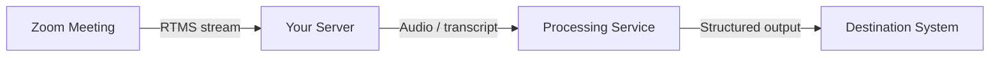

## Problem Statement

AI agents are only useful when they have the right context and the right guardrails. This sample explores how Zoom meeting, chat, and workflow context can help developers build agentic experiences that observe what happened, recommend next steps, ask for approval, and then take action.

## Architecture

<!-- Open with 1–2 paragraphs explaining the data flow, then the diagram.
     Label every component and connection. -->

## Implementation Guide

<!-- Numbered steps a developer (or coding agent) can follow WITHOUT external
     docs. Show real code with imports, configuration, and error handling —
     not isolated snippets. Include API calls, env setup, and deployment. -->

## App Manifest

 See [0-app-manifest/](https://github.com/zoom/human-in-the-loop-workplace-agent-sample/tree/main/0-app-manifest) — it contains app-manifest.json (scopes, chatbot subscription, events, webview, and redirect URIs already configured) plus a short guide to importing it in the Zoom App Marketplace. Replace example.ngrok.app with your tunnel URL, upload, and your app is configured.

