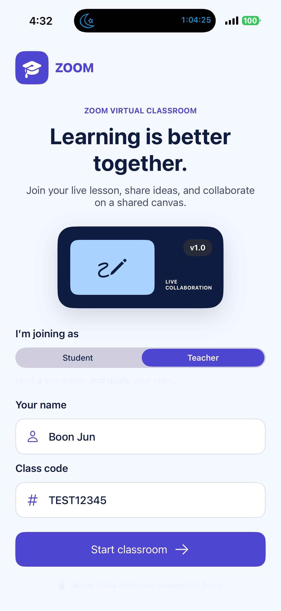
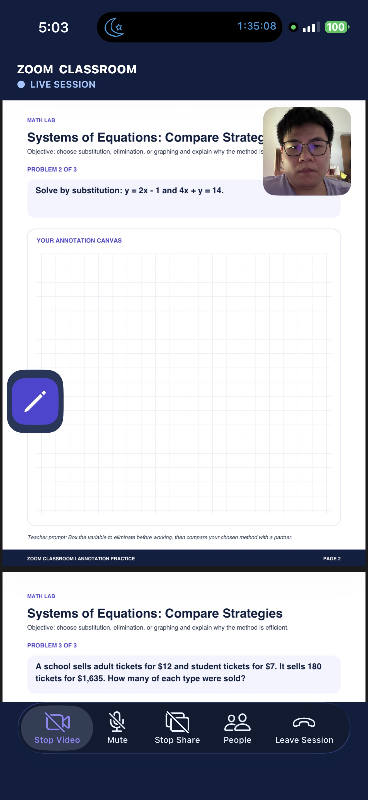
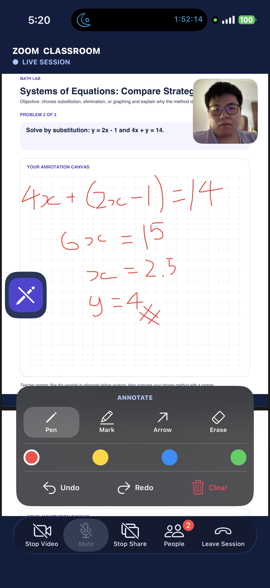
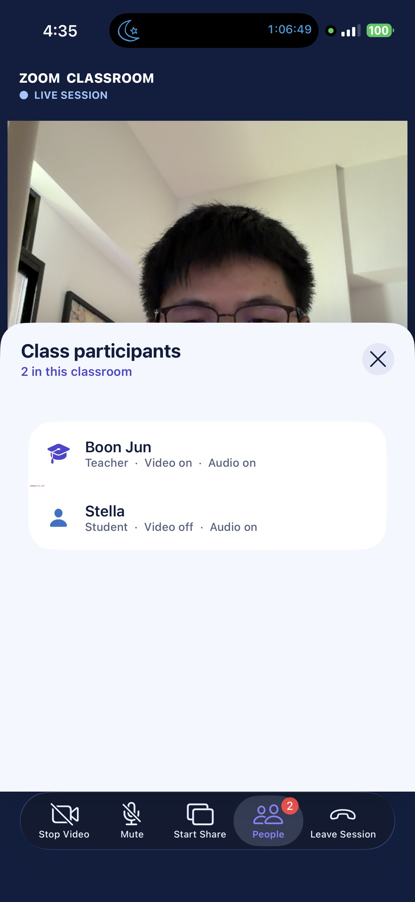

An interactive virtual classroom app built using Zoom's Video SDK with live screen sharing and annotation tools, giving teachers and students a shared visual workspace and collaborate through real-time annotations without leaving your platform.

Remote learning often falls apart at exactly this moment: the teacher is explaining something on screen, but students have no way to point, highlight, or annotate what they're seeing. Switching to a separate whiteboard tool breaks the flow and severs the real-time connection between explanation and markup.

**What you'll need:**

- Zoom developer account with Video SDK license via [get credentials](https://developers.zoom.us/docs/video-sdk/get-credentials/)
- At least 2 iPhones with iOS 15+ for test deployment

**Features:**

- **Screen sharing**: Broadcast the teacher's screen or any in-app content view to all participants in real time
- **Live annotation**: Renders a synchronized annotation canvas overlaid on the shared screen, visible to all participants
- **Rich annotation Tools**: Supports pen, highlighter, shapes, and more, along with color differentiation so contributions are easy to tell apart
- **In-session panel**: Surface everything in a tab bar visible to all participants

<div align="center">
  
  
  
</div>

**See it in action:** [Demo video](https://www.youtube.com/watch?v=)

## Architecture

### Components

| Component | Responsibility |
|-----------|----------------|
| **Zoom Video SDK** | Handles all the video, audio, screen share, annotation and participants |
| **Frontend** | Manage and display of participants' video, screen share and annotation, manage audio and participants list. |

## Implementation Guide

This guide shows how to build a UIKit-based virtual classroom using the Zoom Video SDK for iOS. It collects a participant’s (teacher/student) display name and class code, joins a Video SDK session, renders all their videos and audio, shares either the app screen or a bundled sample maths handout, and exposes Zoom’s live annotation tools in a classroom-oriented interface.

| File | Responsibility |
|------|----------------|
| StartViewController.swift | Collects the learner name and class code, initializes the SDK, and opens the session screen. |
| SessionViewController.swift | Owns Video SDK session lifecycle, video/audio/share controls, and SDK delegate callbacks. |
| SessionViewControllerExtension.swift | Builds the classroom UI, participant sheet, PDF sharing, and annotation controls. |
| Scripts/JWTGenerator.swift | A JWT generator to be used to join/start a VSDK session |
| Linear_Equations_Annotation_Lab.pdf, Quadratic_Functions_Challenge.pdf, Systems_of_Equations_Investigation.pdf | Sample PDF file used for screen sharing and annotation purpose. |

### Part 1: Start the application in StartViewController

StartViewController is the initial classroom entry screen. It owns the two user inputs that define a lesson (session) join.

```swift
private let nameField = UITextField()
private let classCodeField = UITextField()
```

The name becomes the Video SDK display name. The class code becomes the Video SDK session name. 

The controller initializes the VSDK under setupSDK() in viewDidLoad():

```swift
override func viewDidLoad() {
    super.viewDidLoad()
    setupAppearance()
    setupLayout()
    updateRoleCopy()
    setupSDK()
}
```

setupSDK() configures the Zoom domain and initializes the VSDK instance:

```swift
private func setupSDK() {
    let initParams = ZoomVideoSDKInitParams()
    initParams.domain = "zoom.us"

    let status = ZoomVideoSDK.shareInstance()?.initialize(initParams)

    if status != .Errors_Success {
        print("SDK initialization failed: \(String(describing: status))")
    }
}
```

### Part 2: Collect classroom details, validate and hand off to SessionViewController

The StartViewController has three important information required to setup the VSDK's session context which will be using to generate the JWT required to join/start a session:
- Student (role=0 : participant) or Teacher (role=1 : host, once host exist then the others will become manager) selection
- Username (display name)
- Class code (tpc)

The roleControl changes the message and button label shown in the UI:

```swift
private let roleControl = UISegmentedControl(items: ["Student", "Teacher"])
```

Zoom VSDK determines actual host and participant privileges from the JWT used to join the session, not from the selected segment. The VSDK later exposes those privileges through ZoomVideoSDKUser.isHost().

With the 3 important information, you should sign your JWT with a backend service in a production use-case. For faster JWT generation, you can navigate checkout the Scripts/JWTGenerator.swift and its README for more details on how to consume it Once you get the generated JWT, you can simple copy and paste it below. Ensure that the class code matches the session name used to generate the JWT Token.

We will proceed with handing off the information to SessionViewController which will consume these information to create the SessionViewController in order to start/join a session.

```swift
@IBAction private func enterButtonTapped(_: UIButton) {
    view.endEditing(true)

    let enteredName = nameField.text?
        .trimmingCharacters(in: .whitespacesAndNewlines) ?? ""

    let enteredSessionName = classCodeField.text?
        .trimmingCharacters(in: .whitespacesAndNewlines) ?? ""

    guard !enteredName.isEmpty, !enteredSessionName.isEmpty else {
        let alert = UIAlertController(
            title: "Complete your details",
            message: "Enter both your name and class code to join the classroom.",
            preferredStyle: .alert
        )
        alert.addAction(UIAlertAction(title: "OK", style: .default))
        present(alert, animated: true)
        return
    }

    let sessionViewController = SessionViewController()
    sessionViewController.username = enteredName
    sessionViewController.sessionname = enteredSessionName
    sessionViewController.modalPresentationStyle = .fullScreen

    present(sessionViewController, animated: false)
}
```

<div align="center">
  
</div>

### Part 3: Join the classroom

SessionViewController.swift receives the values from the entry screen.

When the controller appears, presentJWTAlert() is called from viewDidAppear(_:). For demo purpose, user can choose to copy and paste the generated JWT token in the alert popup and this will be under the userInputJWT variable. Alternatively, the jwtToken variable is used by default to construct the ZoomVideoSDKSessionContext and you can choose to use this variable for quick demo purpose only. You should sign your JWT with a backend service in a production use-case and use the same variable. 

```swift
let jwtToken = ""
var sessionname = ""
var username = ""
var userInputJWT = ""
```

joinSession() then creates ZoomVideoSDKSessionContext:

```swift
func joinSession() {
    let sessionContext = ZoomVideoSDKSessionContext()
    sessionContext.token = jwtToken.isEmpty ? userInputJWT : jwtToken
    sessionContext.sessionName = sessionname
    sessionContext.userName = username

    if ZoomVideoSDK.shareInstance()?.joinSession(sessionContext) == nil {
        showError(message: "Failed to join session", dismiss: true)
    }
}
```

The JWT must contain a tpc claim that exactly matches sessionname. If a student/teacher enters Algebra101, the JWT must be generated with Algebra101 as its session name.

Scripts/JWTGenerator.swift creates a development JWT with the required claims:

```
let payload: [String: Any] = [
    "app_key": sdkKey,
    "tpc": sessionName,
    "role_type": role,
    "version": 1,
    "iat": iat,
    "exp": exp
]
```

For production, generate and sign JWTs on a backend service. Do not embed SDK secrets in the iOS app or commit long-lived JWTs.

Output: Zoom invokes onSessionJoin() after the participant has joined successfully.

### Part 4: Build the classroom after joining

SessionViewController registers as the Zoom Video SDK delegate in viewDidLoad():

```swift
override func viewDidLoad() {
    super.viewDidLoad()
    setupUI()
    ZoomVideoSDK.shareInstance()?.delegate = self
}
```

The UI setup is implemented in MyVideoSDKApp/SessionViewControllerExtension.swift:

```swift
func setupUI() {
    setupViews()
    setupConstraints()
    setupTabBar()
    setupAnnotationPanel()
    setupParticipantsPanel()
}
```

The setupUI() composes the session screen from these persistent views:
- sessionHeader: Classroom identity and live-state header.
- scrollView and videoStackView: Camera grid.
- sharerView: Remote participant’s shared content.
- sharedPDFView: Teacher-owned PDF presentation surface.
- localViewDuringShare: Floating local picture-in-picture tile.
- tabBar: Camera, microphone, sharing, participants, and leave controls.
- annotationPanel: Annotation tools shown only when drawing is active.
- participantsPanel: Bottom sheet containing participantsTableView.

The visual hierarchy used in this app is as such:

```
SessionViewController.view
├── sessionHeader
├── scrollView
│   └── videoStackView
├── sharerView / sharedPDFView
├── localViewDuringShare
├── shareBtnStackView
├── annotationPanel
├── participantsPanel
└── tabBar
```

After the SDK joins the session, onSessionJoin() creates the local classroom view:

```swift
func onSessionJoin() {
    addLocalViewToGrid()
    actualLocalViewDuringShare = addLocalViewDuringShare()
    loadingLabel.isHidden = true
    tabBar.isHidden = false
    refreshParticipants()
}

The local camera canvas is attached to localView. A second square preview is attached to localViewDuringShare, which remains visible while a user is sharing content.


```

### Part 5: Render remote participants and maintain the participants list

When another user (teacher/student) joins, onUserJoin(_:users:) creates a tile and subscribes the SDK canvas:

```swift
remoteUserVideoCanvas.subscribe(
    with: views.view,
    aspectMode: .panAndScan,
    andResolution: ._Auto
)
```

The controller tracks each tile in:

```swift
var remoteUserViews: [Int: (view: UIView, placeholder: UIView)] = [:]
```

This gives the app a reliable way to unsubscribe and remove UI when onUserLeave(_:users:) fires.

The People tab is backed by:

```swift
var participants: [ZoomVideoSDKUser] = []
```

refreshParticipants() rebuilds the roster from the session’s current users:

```swift
participants = ([myself] + (session.getRemoteUsers() ?? [])).sorted {
    participantRoleRank($0) < participantRoleRank($1)
}
```

Hosts and managers rank first and are labelled Teacher. Other users are labelled Student.

Call refreshParticipants() whenever user state changes. The sample already does this for joins, leaves, video changes, audio changes, name changes, host changes, and manager changes.

<div align="center">
  
</div>

### Part 6: Control video, audio, sharing, and participants

The bottom tab bar uses ControlOption:

```swift
enum ControlOption: Int {
    case toggleVideo, toggleAudio, toggleShare, participants, leaveSession
}
```

tabBar(_:didSelect:) routes each item to its matching action:

```swift
switch item.tag {
case ControlOption.toggleVideo.rawValue:
    handleVideoToggle(tabBar)
case ControlOption.toggleAudio.rawValue:
    handleAudioToggle(tabBar)
case ControlOption.toggleShare.rawValue:
    handleShareToggle(tabBar)
case ControlOption.participants.rawValue:
    toggleParticipantsPanel()
case ControlOption.leaveSession.rawValue:
    ZoomVideoSDK.shareInstance()?.leaveSession(false)
default:
    break
}
```

handleVideoToggle(_:) uses ZoomVideoSDKVideoHelper to start or stop the camera. handleAudioToggle(_:) uses ZoomVideoSDKAudioHelper to start, mute, or unmute audio. 

### Part 7: Share the app or a bundled lesson

Sharing is represented by ShareSelection:

```swift
enum ShareSelection {
    case InAppScreenShare
    case ShareWithView
}
```

handleShareToggle(_:) first checks for a conflicting active share and validates that in-app screen sharing is available. It then offers two choices:
- InAppScreenShare
- Choose Math Lab PDF
handleShareSelection(with:) starts the appropriate share mode:

```swift
switch chosenShare {
case .InAppScreenShare:
    error = shareHelper.startInAppScreenShare()

case .ShareWithView:
    openBundledPDF()
    error = shareHelper.startShare(with: sharedPDFView)
}
```

The PDF route uses presentLessonPicker() to select one of the bundled resources:

```swift
let lessons = [
    ("Linear Equations", "Linear_Equations_Annotation_Lab"),
    ("Quadratic Functions", "Quadratic_Functions_Challenge"),
    ("Systems of Equations", "Systems_of_Equations_Investigation")
]
```

openBundledPDF() resolves selectedLessonPDF from the main bundle, creates a PDFDocument, and assigns it to sharedPDFView.

```swift
sharedPDFView.autoScales = true
sharedPDFView.document = pdfDoc
sharedPDFView.isHidden = false
```

onUserShareStatusChanged(_:user:shareAction:) updates the UI as sharing starts or stops. Local shares reveal the floating pencil button. Remote shares subscribe the incoming share canvas to sharerView.

<div align="center">
  
</div>

### Part 8: Start, stop, and control annotation

The floating pencil button calls toggleDraw() in MyVideoSDKApp/SessionViewControllerExtension.swift.

The method validates that annotation is supported and that a local or remote share is active. It then creates a ZoomVideoSDKAnnotationHelper.

For a local share, pass nil:

```swift
annotationHelper = shareHelper.createAnnotationHelper(nil)
```

For a remote share, pass the subscribed share view:

```swift
annotationHelper = shareHelper.createAnnotationHelper(sharerView)
```

The helper is started with:

```swift
guard annotationHelper.startAnnotation() == .Errors_Success else {
    showError(message: "Unable to start annotation.", dismiss: false)
    return
}
```

For InAppScreenShare, the application supplies the visible annotation parent view with setAnnotationView(_:).

```swift
let annotationView = isLocalShare ? view : sharerView
shareHelper.setAnnotationView(annotationView)
```

The controller then reveals annotationPanel, which contains:
- Pen
- Highlighter
- Arrow
- Eraser
- Red, yellow, blue, and green tool colours
- Undo
- Redo
- Clear all

These controls map directly to ZoomVideoSDKAnnotationHelper methods:

```swift
helper.setToolType(.pen)
helper.setToolColor(selectedAnnotationColor)
helper.undo()
helper.redo()
helper.clear(.all)
```

<div align="center">
  
</div>

### Part 9: Protect drawing from zoom annotation and PDFView gesture conflicts

Annotation and PDF navigation should not be active at the same time. The sample disables PDFKit scrolling, pan, pinch, double-tap, and conflicting share-view zoom gestures while drawing is active.

setPDFNavigationEnabled(_:) locks and restores PDFKit navigation inside sharedPDFView.

setShareZoomGesturesEnabled(_:) disables pre-existing and late-added pinch or double-tap recognizers on scrollView, sharerView, and sharedPDFView

When annotation starts:

```swift
setShareZoomGesturesEnabled(false)

if case .ShareWithView = chosenShareType {
    setPDFNavigationEnabled(false)
}
```

When annotation stops or sharing ends, resetAnnotationUI(shareHelper:) restores the normal gesture state:

```swift
setPDFNavigationEnabled(true)
setShareZoomGesturesEnabled(true)
annotationStarted = false
annotationPanel.isHidden = true
```

The active helper must be stopped before it is destroyed. Destroying a running helper leaves the SDK annotation overlay in an inconsistent state and can block taps on the pencil button or palette.

### Last step: Run the Sample

1. Add your Zoom Video SDK credentials and generate a JWT whose tpc (session name) matches the class code.
2. Use your Apple's developer account, then build and run on an iPhone iOS 15+
3. In the first view - StartViewController, enter a user name and the exact same class code (tpc).

## Related Resources

- [Zoom Video SDK](https://developers.zoom.us/docs/video-sdk/) - Zoom Video SDK reference
- [Screen Sharing Documentation](https://developers.zoom.us/docs/video-sdk/ios/share/) - Screen Sharing reference
- [Annotation Documentation](https://developers.zoom.us/docs/video-sdk/ios/share/annotation/) - Annotation reference
- [Zoom Developer Forum](https://devforum.zoom.us/) - Community support