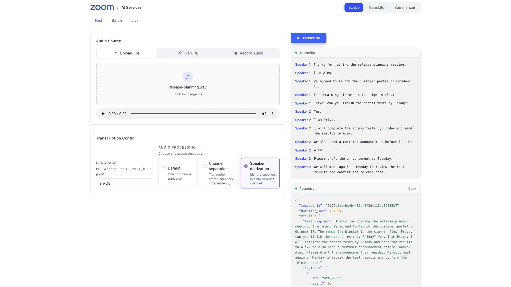
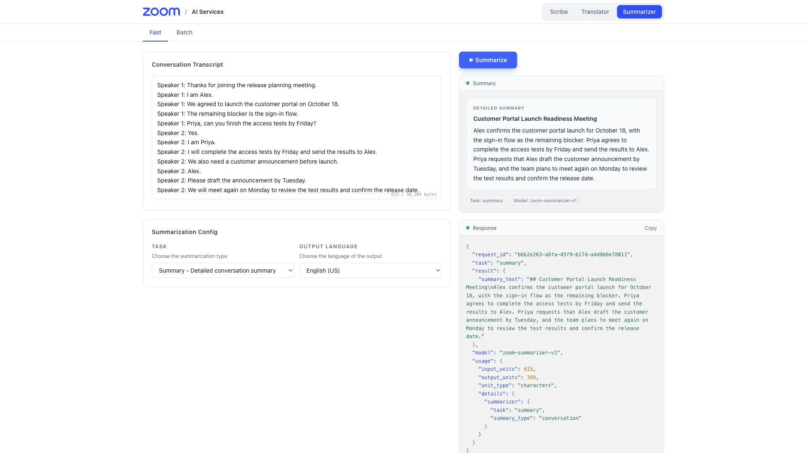
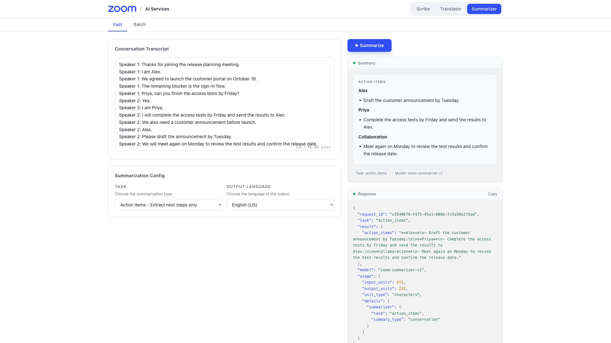
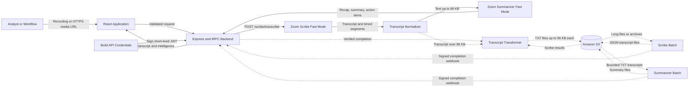

A recording intelligence pipeline transcribes meeting recordings from any platform with **[Zoom Scribe](https://developers.zoom.us/docs/ai-services/scribe/)**, then extracts a recap, detailed summary, and action items with **[Zoom Summarizer](https://developers.zoom.us/docs/ai-services/summarizer/)**.

Recordings pile up faster than anyone can replay them. This pipeline gives users a searchable transcript and a summary they can review or attach to a meeting record, CRM entry, or support ticket.

**What you'll need:**

- Transcription and summarization via [Zoom AI Services](https://developers.zoom.us/docs/ai-services/) (requires a [Zoom Build Platform](https://developers.zoom.us/docs/build/) plan with AI Services API credentials; usage is metered against Build Platform credits)
- Node.js 24 or later to run the reference app
- A backend that keeps the Zoom API key and secret outside the browser (Node.js and Express in the reference app; any server stack works)
- A meeting recording in WAV, MP3, M4A, or MP4 format for the documented Scribe fast-mode path
- A frontend or existing workflow that accepts the transcript and summary results
- Optional: Amazon S3 and short-lived AWS credentials for long recordings or archive processing in batch mode

**Features:**

- Accepts supported recordings from Zoom or another meeting platform as uploads or HTTPS media URLs
- Produces punctuated transcript text with timestamps and optional speaker diarization
- Requests a recap, detailed summary, action items, or all three in one response
- Keeps Zoom credentials and API calls on the server
- Summarizes up to 96 KB of transcript text in one synchronous request
- Supports an S3 batch extension for recording archives, with per-file status and signed webhooks

These screenshots show live Scribe and Summarizer results from the same synthetic two-speaker planning meeting. The transcript was copied between the quickstart's separate tabs.







<!-- Publication asset still needed: a demo video. -->

If your meetings run on Zoom and users only need the summary inside Zoom, use [Meeting Summary with AI Companion](https://support.zoom.com/hc/en/article?id=zm_kb&sysparm_article=KB0058013). Build this pipeline when you need to process recordings from other platforms, backfill an archive, or deliver results into your own application.

Follow along as we walk through the architecture, from a single synchronous request to the S3 batch extension.

---

## Architecture

The pipeline works on the recording file itself. It doesn't depend on which platform hosted the meeting, and it needs no bot or in-meeting app. Two server-side API calls turn a recording into a transcript and a summary, so the same flow works for a single upload or an archive backfill.

The browser sends a recording or an HTTPS media URL to the backend. A server-side coordinator then:

- Signs a Build API JWT
- Calls Scribe and receives the transcript
- Adds speaker labels to the transcript text
- Calls Summarizer and returns the transcript and summary in one response (for transcripts up to 96 KB)

The reference [AI Services Quickstart](https://github.com/zoom/ai-services-quickstart) already handles API calls and JWT signing on the server, but runs Scribe and Summarizer in separate playground tabs. The coordinator, transcript storage, and automatic handoff described here are additions to that sample.

The coordinator runs on the server so the API secret never reaches the browser, and so a failed summary can be retried from the stored transcript without transcribing the recording again.

| Component | Responsibility | Our stack (yours may differ) |
| --- | --- | --- |
| Playground | Select a recording, configure analysis, and render results | React, Vite, tRPC client |
| Request boundary | Validate input, cap body size, and return safe errors | Express and tRPC |
| AI Services authentication | Sign short-lived HS256 JWTs only on the server | Build API key and secret |
| Transcription | Convert one recording into display text and timed segments | Scribe fast mode |
| Coordinator (add to the sample) | Track analysis state and pass normalized text to Summarizer | Application service |
| Intelligence extraction | Return recap, summary, action items, or a full summary | Summarizer fast mode |
| Batch extension | Process long recordings and recording archives asynchronously | S3, batch APIs, signed webhooks |



### Processing mode selection

The coordinator selects a processing mode from the recording and transcript size:

| Input | Recommended path | Completion model |
| --- | --- | --- |
| Short recording; normalized transcript at most 96 KB | Scribe fast, then Summarizer fast | Synchronous request within the application's timeout |
| Transcript exceeds 96 KB after Scribe fast | Store it, split into bounded chunks, then Summarizer batch | Deferred summaries for each chunk |
| Long recording or archive | Scribe batch, transform and split transcripts as needed, then Summarizer batch | Jobs linked by the coordinator |
| Existing transcript | Skip Scribe; use inline text for fast mode or VTT, SRT, or TXT files for batch | Select by storage and latency needs |

Measure the normalized transcript after transcription. [Summarizer batch mode](https://developers.zoom.us/docs/ai-services/summarizer/batch-mode/) also limits each file to 96 KB. Split oversized transcripts without dropping text; switching modes alone does not remove that limit.

---

## Implementation Guide

Start with the target application's upload, identity, storage, and job systems. Reuse any that already enforce the contracts below. The [AI Services Quickstart](https://github.com/zoom/ai-services-quickstart) provides the server adapters, tRPC schemas, React playground, webhook receiver, and Docker deployment baseline.

### Agent integration map

| Required capability | Reuse when present | Add when missing |
| --- | --- | --- |
| Authenticated caller | Existing web or service identity | Application session or service-to-service authentication |
| Recording ingestion | Existing media upload or recording URL | Size-limited upload endpoint or allowlisted HTTPS fetcher |
| Secret storage | Existing secrets manager | Server-only environment variables |
| AI Services adapter | Existing API client boundary | Quickstart `createApiRequest` pattern |
| Transcript storage | Existing meeting record | Encrypted object storage plus metadata row |
| Summary destination | CRM, ticketing, knowledge base, or meeting record | Result view in the application |
| Long-running jobs | Existing queue and worker | S3 batch jobs plus verified webhook receiver |

Reuse or add the capabilities needed by the target application. Authentication, server-only credentials, input limits, processing of the full transcript, and visible failure states are required. Persistence and downstream delivery depend on the application.

### Contract A: recording intake

**Input:** an authenticated request containing either one supported media file or one HTTPS URL, plus a Scribe language and transcript-structure option.

**Output:** an internal recording descriptor with a stable application ID, source type, media type, byte size when known, and analysis configuration.

**Invariants:**

- Accept only the media formats supported by the selected Scribe mode. The documented fast-mode formats are WAV, MP3, M4A, and MP4.
- Set an application upload limit of 100 MB, matching the limit advertised by the quickstart UI. Check it before base64 encoding and again on the server. The sample's 150 MB JSON parser limit allows for base64 expansion; it does not enforce the decoded media limit.
- Choose a duration threshold that fits the application's request timeout. Route longer recordings through Scribe batch mode.
- Accept only `https:` URLs in production and restrict allowed media hosts. If the backend fetches media, also block private network addresses and revalidate redirects to prevent server-side request forgery.
- Do not log file bytes, data URIs, signed URLs, or transcript text.
- Treat client-provided media types and filenames as untrusted metadata.
- Attach one application correlation ID to the Scribe and Summarizer calls.

The quickstart [`FastTab`](https://github.com/zoom/ai-services-quickstart/blob/main/playground/src/products/scribe/tabs/FastTab.tsx) supports upload, URL, and browser recording inputs. Its [`AudioUploadZone`](https://github.com/zoom/ai-services-quickstart/blob/main/playground/src/products/scribe/components/AudioUploadZone.tsx) displays accepted formats and size guidance. Add server validation before sending media to Scribe.

### Contract B: AI Services authentication

**Input:** a server-side Build API key and API secret.

**Output:** a short-lived HS256 JWT for the `Authorization: Bearer` header.

**Invariants:**

- The API secret is available only to the server runtime.
- The JWT payload contains `iss`, `iat`, and `exp`.
- Backdate `iat` by no more than the chosen clock-skew allowance.
- Limit `exp - iat` to one hour or less and generate a new token when the current token approaches expiry.
- Never return the JWT in an application response or write it to a log.
- Make the Zoom API base URL configurable so the adapter can support the required Zoom environment.

The quickstart centralizes signing and authorized fetches in [`src/util.ts`](https://github.com/zoom/ai-services-quickstart/blob/main/src/util.ts). Keep that boundary server-only:

```typescript
import { KJUR } from "jsrsasign";

function generateJWT(apiKey: string, apiSecret: string) {
  const now = Math.floor(Date.now() / 1000);
  const issuedAt = now - 30;
  const header = { alg: "HS256", typ: "JWT" };
  const payload = {
    iss: apiKey,
    iat: issuedAt,
    exp: issuedAt + 60 * 60,
  };

  return KJUR.jws.JWS.sign(
    "HS256",
    JSON.stringify(header),
    JSON.stringify(payload),
    apiSecret,
  );
}
```

Load `ZOOM_API_KEY` and `ZOOM_API_SECRET` from a secrets manager or server environment, and fail at startup when either value is missing. The quickstart's `createApiRequest` signs a fresh JWT for each API call.

### Contract C: Scribe transcription

**Input:** the recording descriptor and a Scribe configuration.

**Output:** `text_display`, optional lexical text, duration, and timed segments with speaker or channel information when requested.

**Invariants:**

- Send the request to `POST /v2/aiservices/scribe/transcribe` from the backend.
- Use `text_display` as the human-readable fallback when segments are absent.
- Enable speaker diarization for a mixed meeting recording when speaker-attributed action items matter.
- For best diarization results, keep each recording below 20 speakers.
- Use channel separation only when the source has two intentional stereo channels, such as separate agent and customer tracks.
- Never enable diarization and channel separation together. The quickstart schema rejects that combination.
- Preserve segment order and do not infer participant identities from generic speaker labels.
- On transcription failure, stop before calling Summarizer. Mark timeouts and transient upstream failures as retryable; require corrected input or credentials for validation and authentication errors.

The quickstart implements this boundary in [`scribeRouter.transcribe`](https://github.com/zoom/ai-services-quickstart/blob/main/src/routers/scribe.ts). The React [`AsrConfigForm`](https://github.com/zoom/ai-services-quickstart/blob/main/playground/src/products/scribe/components/AsrConfig.tsx) presents default, channel-separated, and speaker-diarized modes.

Normalize speaker-aware segments into stable conversation text before summarization:

```text
Speaker 1: We will move the launch to September 18.
Speaker 2: I will update the customer and the project plan by Friday.
```

Join non-empty segments in chronological order and prefix each line with its returned speaker label. Fall back to `text_display` if no segment contains text. Keep segment IDs optional in the response schema: the documented Scribe response includes segments without `id`, while the quickstart schema requires it.

Labels such as `Speaker 1` identify voices within the recording, not participants. Summarizer can still resolve names from what speakers say: in the screenshots above, "I am Alex" and "I am Priya" become owners in the action items. Treat those names as unverified until a user confirms the mapping.

### Contract D: transcript handoff

**Input:** the successful Scribe response and the requested Summarizer task.

**Output:** normalized conversation text and a Summarizer configuration.

**Invariants:**

- Reject an empty transcript.
- Measure UTF-8 bytes with `TextEncoder`, not JavaScript character count.
- Send no more than 96 KB (98,304 UTF-8 bytes) through Summarizer fast mode.
- Preserve speaker labels, punctuation, and the full conversation order.
- Use `summary_type: "conversation"`.
- Add the application correlation ID as the Summarizer request's top-level `reference_id`. Extend the quickstart's input schema to preserve and forward that field.
- Store oversized transcripts and split them for batch processing. Keep every chunk within the same 96 KB limit.

The quickstart enforces the 96 KB boundary in [`src/routers/summarizer.ts`](https://github.com/zoom/ai-services-quickstart/blob/main/src/routers/summarizer.ts) and mirrors it in the Summarizer [`FastTab`](https://github.com/zoom/ai-services-quickstart/blob/main/playground/src/products/summarizer/tabs/FastTab.tsx).

### Contract E: Summarizer extraction

**Input:** normalized transcript text, one task, and one supported output locale.

**Output:** rendered text containing the requested recap, summary, action items, or full summary.

**Invariants:**

- Send the request to `POST /v2/aiservices/summarizer/summarize` from the backend.
- Select `full_summary` when the product needs a recap, detailed summary, and action items in one result.
- Preserve the rendered text as the source response. Normalize both the documented `result.text` field and task-keyed fields such as `result.full_summary`. Parse sections only when a downstream schema requires separate fields.
- Mark owners in extracted action items as unverified, whether they are speaker labels or names Summarizer inferred from the conversation. Require review before assigning commitments to participant records.
- Store the task, output locale, model identifier when returned, request ID, and application correlation ID with the result.
- If summarization fails after transcription succeeds, retain the transcript and expose a summary-only retry.

The quickstart implements the API adapter in [`summarizerRouter.summarize`](https://github.com/zoom/ai-services-quickstart/blob/main/src/routers/summarizer.ts). Supported tasks and locales live in [`playground/src/products/summarizer/lib/constants.ts`](https://github.com/zoom/ai-services-quickstart/blob/main/playground/src/products/summarizer/lib/constants.ts).

[Summarizer fast mode](https://developers.zoom.us/docs/ai-services/summarizer/fast-mode/) documents rendered output in `result.text`, but responses can also contain task-specific fields such as `result.full_summary`. Replace the nested `result` schema with a string record to accept either shape, then use the same extraction function in the coordinator and renderer:

```typescript
import { z } from "zod";

const resultSchema = z.record(z.string(), z.string());

const RESULT_FIELD = {
  recap: "recap",
  action_items: "action_items",
  summary: "summary_text",
  full_summary: "full_summary",
} as const;

function extractRenderedSummary(
  result: Record<string, string> | undefined,
  task: keyof typeof RESULT_FIELD,
) {
  const text = result?.text || result?.[RESULT_FIELD[task]];
  if (!text?.trim()) throw new Error("Summarizer returned no summary text");
  return text;
}
```

The quickstart accepts `result.text` but strips `result.full_summary`, and its result component does not render that key. Update the server response schema and the renderer together. An empty result must produce a summary failure rather than a completed analysis.

Add an application coordinator that composes the two adapters into one state machine:

```text
accepted → transcribing → transcript_ready → summarizing → complete
              ↘ transcription_failed        ↘ summary_failed
```

For the synchronous path, return these fields to the client:

| Field | Source |
| --- | --- |
| `analysis_id` | Application coordinator |
| `transcript.text` | Scribe `result.text_display` or normalized segments |
| `transcript.segments` | Scribe `result.segments` |
| `intelligence.task` | Requested Summarizer task |
| `intelligence.text` | Normalized Summarizer `result.text` or the task's result field |
| `request_ids` | Scribe and Summarizer responses |
| `state` | Coordinator state machine |

If the transcript needs batch processing, return `analysis_id` and the current state so the client can load the result later. Persist the transcript before submitting the summary job. A summary-only retry starts from `transcript_ready` and reuses that stored transcript.

### Contract F: result delivery

**Input:** a complete or partially complete analysis record.

**Output:** transcript and intelligence shown in the application or delivered to an authorized downstream system.

**Invariants:**

- Authorize reads against the same meeting or tenant boundary used for recording intake.
- Escape rendered content before displaying it. If the response supports Markdown, allow only a restricted Markdown subset.
- Separate transcript failure from summary failure so a successful transcript is not discarded.
- Make downstream writes idempotent by `analysis_id`.
- Record who requested the analysis, which source was processed, and where the result was sent.
- Apply retention and deletion rules to the recording, transcript, and summary independently.

The quickstart [`SummarizerResult`](https://github.com/zoom/ai-services-quickstart/blob/main/playground/src/products/summarizer/components/SummarizerResult.tsx) renders the task-dependent response. In an application, load the result from an authenticated analysis record and send downstream output through an authorized delivery boundary.

### Batch pipeline for long recordings and archives

Use batch mode for long recordings or archives. The coordinator must also handle a Scribe fast result whose transcript exceeds the Summarizer input limit.

1. Place source recordings in a private S3 prefix.
2. Submit a Scribe batch job by `SINGLE`, `PREFIX`, or `MANIFEST` input.
3. On a verified Scribe completion webhook, confirm per-file success and the expected output prefix.
4. Transform each successful Scribe JSON result into UTF-8 text. Split it at speaker turns into `.txt` chunks of at most 98,304 bytes, including labels. If one turn exceeds the limit, split at sentence or word boundaries without dropping text.
5. Store each chunk with its analysis ID, sequence number, and source segment range. Write it to a separate S3 prefix and submit a Summarizer batch job for those files.
6. On verified Summarizer completion, match each output to its chunk and reconcile per-file state. Return summaries in source order and identify them as partial summaries. Mark the analysis complete only when every required chunk succeeds.

The quickstart exposes batch submission, status, file-listing, and cancellation procedures in both [`src/routers/scribe.ts`](https://github.com/zoom/ai-services-quickstart/blob/main/src/routers/scribe.ts) and [`src/routers/summarizer.ts`](https://github.com/zoom/ai-services-quickstart/blob/main/src/routers/summarizer.ts). Its [`src/routers/shared.ts`](https://github.com/zoom/ai-services-quickstart/blob/main/src/routers/shared.ts) resolves S3 job input and output. The sample does not automatically chain the two jobs; add that coordinator to the target application.

Scribe batch output is JSON; [Summarizer batch](https://developers.zoom.us/docs/ai-services/summarizer/batch-mode/) accepts VTT, SRT, or TXT files up to 96 KB each. Convert the files before handoff. This extension returns partial summaries in source order. Review decisions that span chunks against the full transcript.

Use short-lived, least-privilege AWS credentials for each job. Grant Scribe read access to the recording prefix and write access only to the Scribe output prefix. Give the transformation worker access only to the Scribe output and normalized-transcript prefixes. Grant Summarizer read access to the normalized-transcript prefix and write access only to the summary prefix.

Set `notifications.webhook_url` to the application's HTTPS callback and `notifications.secret` to the same value as the receiver's `WEBHOOK_SECRET`. Verify the signature against the raw body and reject timestamps outside a five-minute window:

```typescript
import crypto from "node:crypto";

function verifyZoomWebhook(
  rawBody: Buffer,
  timestampHeader: string,
  signature: string,
  secret: string,
) {
  if (!secret || !/^\d+$/.test(timestampHeader)) return false;
  if (!/^sha256=[a-f0-9]{64}$/.test(signature)) return false;
  const timestamp = Number(timestampHeader);
  const now = Math.floor(Date.now() / 1000);
  if (!Number.isSafeInteger(timestamp) || Math.abs(now - timestamp) > 300) return false;

  const message = `v0:${timestampHeader}:${rawBody.toString("utf8")}`;
  const expected = `sha256=${crypto
    .createHmac("sha256", secret)
    .update(message)
    .digest("hex")}`;
  const received = Buffer.from(signature);
  const calculated = Buffer.from(expected);

  return received.length === calculated.length
    && crypto.timingSafeEqual(received, calculated);
}
```

**Other languages:** In Python, use `hmac.compare_digest`; in Go, use `crypto/subtle.ConstantTimeCompare`.

Register webhook routes before `express.json()` so the handler receives raw bytes, as in [`src/index.ts`](https://github.com/zoom/ai-services-quickstart/blob/main/src/index.ts). The sample skips verification when `WEBHOOK_SECRET` is absent and does not reject stale timestamps. Require the secret and use the timestamp check above before a callback can change analysis state.

### Deploy

| Platform | What you get |
|----------|--------------|
| [**Deploy to Render**](https://render.com/deploy?repo=https://github.com/zoom/ai-services-quickstart) | Backend and playground as one web service |
| [**Deploy to Railway**](https://railway.com/deploy/zoom-ai-services-playground?referralCode=HTPdHX&utm_medium=integration&utm_source=template&utm_campaign=generic) | Backend and playground as one web service |

**Deploy anywhere:** The repo includes a platform-agnostic [`Dockerfile`](https://github.com/zoom/ai-services-quickstart/blob/main/Dockerfile) for deployment to any container platform. Adjust environment variables for your platform.

Render uses [`render.yaml`](https://github.com/zoom/ai-services-quickstart/blob/main/render.yaml); Railway uses the `Dockerfile`. Both build the backend and playground as one web service, so the playground's relative `/trpc` calls reach the backend on the same origin. Set the values from [Build Platform Configuration](#build-platform-configuration) in the hosting platform's environment settings.

The sample's tRPC procedures do not authenticate callers. Add application authentication before exposing the service to other users. Set hosting request timeouts to match the chosen fast-mode duration threshold; use batch jobs for work that exceeds it.

### Run the Sample

Use the separate Scribe and Summarizer tabs to verify the API calls before adding the coordinator.

<details>
<summary><strong>Local setup</strong></summary>

Clone and install the backend:

```bash
git clone https://github.com/zoom/ai-services-quickstart.git
cd ai-services-quickstart
npm install
cp .env.example .env
```

Set `ZOOM_API_KEY` and `ZOOM_API_SECRET` in `.env`, then run `npm start`. In another terminal, start the playground from the repository root:

```bash
cd playground
npm install
npm run dev
```

</details>

Open `http://localhost:5173` and upload a supported meeting recording in Scribe fast mode. Enable speaker diarization for a mixed recording. For a quick recap, paste `text_display` into Summarizer. For speaker-attributed action items, first format the returned segments as speaker-labeled lines using Contract C; the display transcript alone may omit those labels. Select `full_summary` after checking response compatibility in Contract E.

Compare the summary against the same recording: check each decision, commitment, and speaker attribution. The coordinator automates the transcript handoff once both API calls work.

<details>
<summary><strong>Run with Docker</strong></summary>

The multi-stage [Dockerfile](https://github.com/zoom/ai-services-quickstart/blob/main/Dockerfile) compiles the backend and playground on `node:24-slim`, then copies only production dependencies and build output into the runtime image. Build and run it from the repository root:

```bash
docker build -t ai-services-quickstart .
docker run --rm --env-file .env -p 4000:4000 ai-services-quickstart
```

Open `http://localhost:4000`. The repo's `.dockerignore` keeps `.env` out of the image, so supply credentials at runtime with `--env-file`. The server binds `PORT` when the platform injects it and falls back to `4000`.

</details>

---

## Build Platform Configuration

Configure Build API credentials on the server. AI Services uses JWT authentication and per-job callback URLs, so this blueprint does not require a Zoom App manifest.

| Configuration | Purpose | Storage |
| --- | --- | --- |
| `ZOOM_API_KEY` | JWT `iss` claim | Server secrets manager |
| `ZOOM_API_SECRET` | HS256 signing key | Server secrets manager |
| `AWS_ACCESS_KEY_ID` | Optional S3 batch access | Prefer temporary job credentials |
| `AWS_SECRET_ACCESS_KEY` | Optional S3 batch access | Prefer temporary job credentials |
| `AWS_SESSION_TOKEN` | Optional STS session | Server runtime only |
| `WEBHOOK_SECRET` | Required for batch webhook verification | Server secrets manager |
| `PORT` | Express listener; defaults to `4000` | Runtime configuration |

Create API credentials for your AI Services project in [Zoom Platform Studio](https://platform.zoom.us/) and store development and production credentials separately. AI Services requests consume metered Build Platform credits. Rotate secrets on a defined schedule and expose them only to the application environment that sends requests.

---

## Acceptance Criteria

- A supported recording exported from a non-Zoom meeting platform produces a non-empty transcript before Summarizer runs.
- Speaker diarization and channel separation cannot be enabled together.
- Build credentials and generated JWTs are absent from browser bundles, application responses, and logs.
- Every Summarizer fast request and batch input file is at most 98,304 UTF-8 bytes. Splitting an oversized transcript preserves all source text and speaker labels.
- `full_summary` returns recap, summary, and action-item content for a representative meeting.
- A Scribe failure does not create a Summarizer request.
- A Summarizer failure preserves the successful transcript and supports a summary-only retry.
- Action-item owners, including names Summarizer infers from the conversation, stay unverified until a user confirms them.
- A chunked analysis remains partial until every required chunk succeeds; failed chunks can be retried independently.
- Every result retains application correlation data and upstream request IDs.
- Only authorized users or services can read the source recording, transcript, or summary.
- Batch webhooks fail closed on a missing secret, missing or invalid signature, or timestamp outside the five-minute window.
- Repeated webhooks and downstream deliveries are idempotent.

<details>
<summary><strong>Production considerations</strong></summary>

- **Privacy and consent:** Tell participants when recordings will be analyzed. Follow consent, privacy, and works-council requirements before processing.
- **Data minimization:** Delete uploaded media as soon as the retention policy allows. Avoid sending unrelated attachments or meeting metadata to the pipeline.
- **Human review:** Require a person to review summaries and assigned action items before they inform employment, legal, medical, financial, or compliance decisions.
- **Reliability:** Retry only transient upstream failures with bounded exponential backoff and jitter. Do not retry validation or authentication failures without a configuration change.
- **Observability:** Record duration, processing mode, response status, latency, and request IDs. Do not record media, transcript, summary, credentials, or signed URLs in telemetry.
- **Batch reconciliation:** Run a periodic reconciler in addition to webhooks. It should query jobs left in non-terminal states and repair missed callbacks without duplicating delivery.
- **Storage isolation:** Use different prefixes or buckets for recordings, transcripts, and summaries. Encrypt them, enforce tenant boundaries, and set lifecycle policies for each artifact type.

</details>

---

## Related Resources

- [AI Services Quickstart](https://github.com/zoom/ai-services-quickstart): Reference Node.js and React application
- [Zoom AI Services](https://developers.zoom.us/docs/ai-services/): Product overview
- [Scribe API](https://developers.zoom.us/docs/ai-services/scribe/): Transcription modes and capabilities
- [Scribe fast mode](https://developers.zoom.us/docs/ai-services/scribe/fast-mode/): Synchronous recording transcription
- [Summarizer API](https://developers.zoom.us/docs/ai-services/summarizer/): Conversation summarization and supported locales
- [Summarizer fast mode](https://developers.zoom.us/docs/ai-services/summarizer/fast-mode/): Synchronous tasks and 96 KB input limit
- [Summarizer batch mode](https://developers.zoom.us/docs/ai-services/summarizer/batch-mode/): S3 jobs, limits, and webhooks
- [Zoom Developer Forum](https://devforum.zoom.us/)
