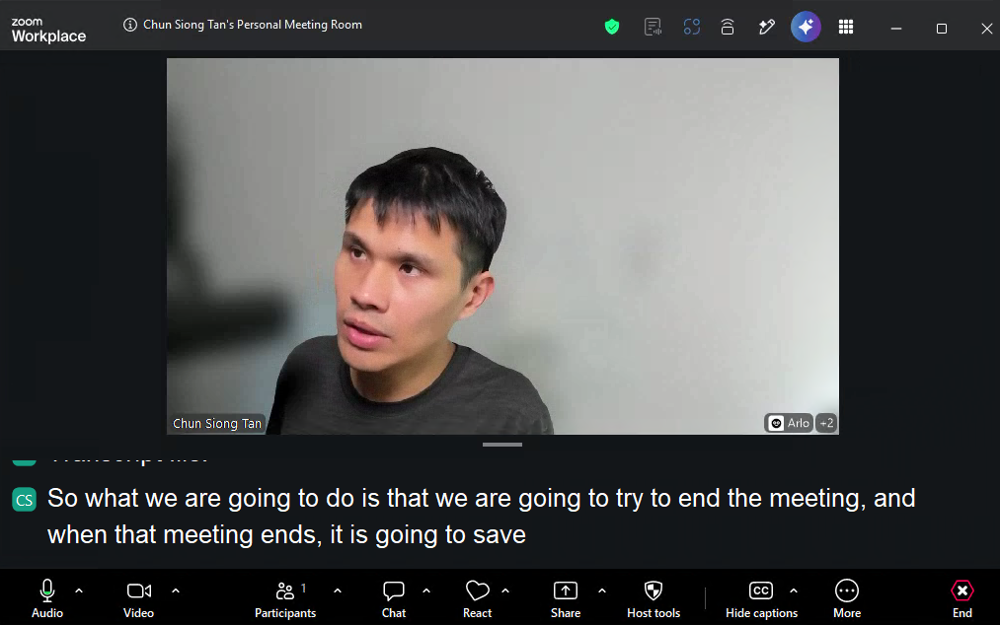
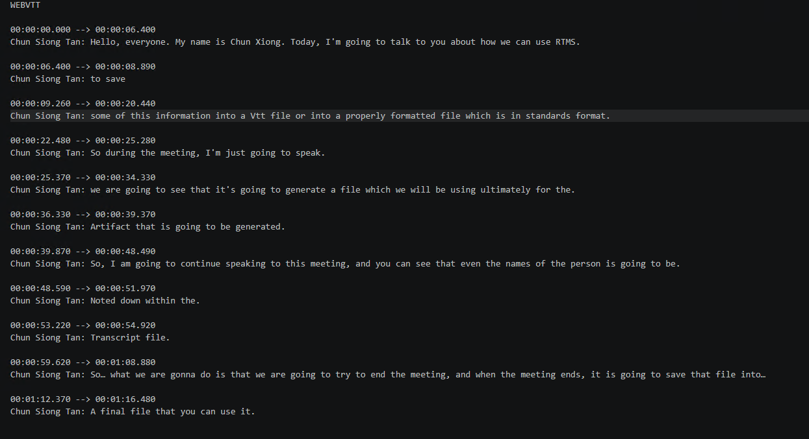
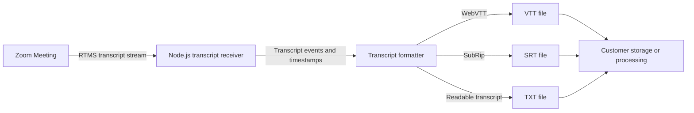

Build the transcript foundation for a knowledge base that can turn live Zoom Meeting conversations into searchable, reviewable records. Teams can use those records to find past decisions, summarize customer conversations, review service quality, and support retention or supervision workflows. The linked implementation does not include the knowledge-base application.

[Zoom Realtime Media Streams (RTMS)](https://developers.zoom.us/docs/rtms/) sends transcript text while the meeting is running. The reference implementation stores a canonical JSON Lines event log plus [WebVTT](https://www.w3.org/TR/webvtt1/), SubRip (SRT), and plain-text projections. It preserves meeting, stream, speaker, and timing context without adding a bot participant.

The reference implementation stops at durable local files. This Blueprint shows the next boundaries to add: approved storage, a permission-aware search index, structured summaries and review outputs, and policy controls for retention, deletion, legal hold, and audit. These additions are architecture contracts, not features already implemented by the linked repository.

**What you'll need:**

- A [Zoom Developer Pack](https://zoom.us/pricing/developer) with RTMS transcript access
- A backend that can receive Zoom webhooks and RTMS transcript events
- Writable local storage for the reference implementation
- Customer-managed object or document storage and a search service for the knowledge-base extension
- Defined access, retention, deletion, and review policies for meeting content
- A Zoom Meeting with RTMS enabled for testing

**Features:**

- Receive a live transcript without adding a participant bot.
- Create a canonical JSONL event log plus VTT, SRT, TXT, and metadata files for each stream.
- Isolate concurrent meetings, suppress duplicate events, and recover projections after restart.
- Publish completed transcript records to customer-managed storage and indexing services through an adapter you add.
- Preserve meeting, speaker, timestamp, tenant, and policy metadata for search, summarization, review, and compliance workflows.

If built-in meeting summaries meet your needs, [Zoom AI Companion](https://zoom.us/ai) provides them without a custom transcript pipeline. Build this workflow when you need customer-controlled records, search infrastructure, retention, or review policy.

Follow along as we walk through the architecture.

These screenshots show the reference implementation receiving a transcript and writing the generated subtitle files. The search, summary, review, and compliance interfaces described later require customer-specific integrations and are not shown here.





## Architecture

### The reusable pattern

Zoom tells your webhook when RTMS starts and stops. A transcript service connects to RTMS, receives timestamped segments, and creates one canonical record per stream. A completion workflow copies that record to durable storage and sends authorized representations to search, summarization, review, and policy services.

Keep the canonical transcript separate from its projections. Search chunks, summaries, review findings, and subtitle files can be rebuilt. The event record and its policy metadata remain the source of truth.

### How the reference implementation handles it

The linked [Node.js reference implementation](https://github.com/zoom/rtms-samples/tree/main/transcript/save_transcript_js) uses Express and RTMSManager. It writes an append-only `events.jsonl` record and rebuildable VTT, SRT, TXT, and metadata files beneath a meeting and stream directory. Writes are asynchronous and serialized per stream. Separate meetings can write concurrently.

The store suppresses recent duplicate events, repairs an incomplete JSONL tail, rebuilds projections after restart, and removes inactive stream folders according to a configurable retention period. It still uses local disk and one configured Zoom app. It does not upload records, build a search index, call a model, provide a review UI, enforce legal holds, or prove compliance with a regulation.



The transcript receiver and local record are implemented by the linked repository. The storage adapter, completion event, search index, model workers, policy engine, and user experience are the knowledge-base extension described in this Blueprint.

### Business workflows enabled by the record

| Workflow | Business question | Required extension |
| --- | --- | --- |
| Search | Where did we discuss this customer, decision, incident, or commitment? | Chunked lexical or semantic index with tenant and meeting access filters |
| Summarization | What was decided, promised, or assigned? | Structured summary worker with evidence links to transcript timestamps |
| Review | Which conversations need coaching, escalation, or quality review? | Rules or model-based classification plus an authorized review queue |
| Compliance operations | Which records must be retained, deleted, exported, supervised, or placed on hold? | Policy metadata, immutable audit events, retention jobs, and legal-hold controls |

The transcript record can support these workflows, but storing a transcript does not by itself make an application compliant. The customer must define the applicable notice, consent, access, residency, retention, deletion, supervision, and legal-hold requirements.

### Agent integration map

Check what your application already provides before adding components:

| Required capability | Reuse when present | Add when missing |
| --- | --- | --- |
| Webhook endpoint | Existing public API route | HTTPS endpoint for RTMS lifecycle events |
| Signature verification | Existing Zoom webhook middleware | Raw-body HMAC verification and replay protection |
| RTMS session manager | Existing stream registry | State keyed by `rtms_stream_id` |
| Transcript normalizer | Existing event schema | Speaker, text, timing, stream identity, and event identity normalization |
| Canonical transcript store | Existing append-only meeting record | JSONL event log with meeting, stream, speaker, timing, and event identity |
| Format writer | Existing export service | Rebuildable VTT, SRT, TXT, and metadata projections |
| Completion workflow | Existing event bus or job system | Idempotent transcript-completed event after the stream closes |
| Durable storage | Existing object or document storage | Encrypted customer-managed storage with tenant isolation |
| Search index | Existing enterprise search platform | Permission-aware chunks and metadata linked to the canonical record |
| Summary and review workers | Existing AI or rules pipeline | Structured outputs with transcript evidence and model provenance |
| Policy controls | Existing records-management service | Retention, deletion, legal hold, export, and audit enforcement |

## Implementation Guide

### Part 1: Build the transcript pipeline

#### 1. Connect RTMS transcript events to the writer

The source registers an asynchronous `TranscriptStore` writer for every transcript event. See [`save_transcript_js/index.js`](https://github.com/zoom/rtms-samples/blob/main/transcript/save_transcript_js/index.js) for the Node.js implementation. The same pipeline can publish to object storage, a database, a queue, or another transcript format. Keep the meeting identifier, stream identifier, speaker, start time, end time, event timestamp, and text when replacing or extending the local writer.

#### 2. Create a Zoom General App

Create a General App in the [Zoom App Marketplace](https://marketplace.zoom.us/) and add your public webhook URL.

| Setting | Value |
| --- | --- |
| Scope | `meeting:read:meeting_transcript` |
| Events | `meeting.rtms_started`, `meeting.rtms_stopped` |
| Webhook URL | `https://example.ngrok.app/webhook` |

Enable RTMS for the account and meeting. Use `manifest.json` as a starting point and verify it in the target Marketplace account.

#### 3. Receive RTMS lifecycle events

Make the webhook available over HTTPS. The reference implementation preserves the raw request body, verifies signed deliveries with a five-minute default replay window, and returns HTTP 200 before passing the lifecycle event to RTMSManager. When `meeting.rtms_stopped` arrives, it waits for queued writes and repairs the projections if an earlier write failed.

Keep signature verification concrete because it protects the entry point:

```javascript
import crypto from 'node:crypto';

function verifyZoomWebhook(rawBody, timestamp, signature, secret) {
  const now = Math.floor(Date.now() / 1000);
  if (Math.abs(now - Number(timestamp)) > 300) return false;
  const message = `v0:${timestamp}:${rawBody.toString('utf8')}`;
  const expected = `v0=${crypto.createHmac('sha256', secret).update(message).digest('hex')}`;
  const received = Buffer.from(signature);
  const computed = Buffer.from(expected);
  return received.length === computed.length && crypto.timingSafeEqual(received, computed);
}
```

Use the raw request bytes, handle endpoint validation separately, and reply before file work begins.

**Input:** Valid `meeting.rtms_started` or `meeting.rtms_stopped` event

**Output:** One active transcript session or a completed session cleanup

**Invariants:**

- Deduplicate start events by `rtms_stream_id`
- Register handlers before joining the RTMS stream
- Keep counters, timing origins, and output paths isolated by stream
- Finish queued writes and remove session state when RTMS stops

### Part 2: Create a durable transcript record

#### 4. Write transcript formats

[`writeTranscriptToVtt.js`](https://github.com/zoom/rtms-samples/blob/main/transcript/save_transcript_js/writeTranscriptToVtt.js) creates a separate meeting and stream folder. It appends each normalized event to `events.jsonl`, then writes VTT, SRT, TXT, and metadata projections. State and write queues are isolated by `rtms_stream_id`, so separate meetings can write concurrently.

The JSONL record is canonical. On restart, the store removes an incomplete trailing record, restores the configured duplicate-detection window, and rebuilds the projections. Directory names include hashes to prevent sanitized meeting or stream identifiers from colliding.

Confirm that:

- VTT and SRT cues have monotonic timestamps.
- Repeated transcript events do not create unwanted duplicate cues.
- Speaker labels are escaped before writing subtitle files.
- Interrupted connections do not overwrite an existing transcript unexpectedly.

Local files are useful for verifying capture. For a knowledge base, move the canonical event log and metadata to storage that your organization manages and backs up. Keep the projections reproducible so a formatter or indexing change does not alter the source record.

**Input:** Normalized segment with meeting ID, stream ID, speaker, text, start time, end time, and event timestamp

**Output:** Canonical JSONL event plus matching VTT cue, SRT cue, plain-text line, and updated metadata

**Invariants:**

- Cue times are monotonic and end times do not precede start times
- SRT indexes increase within one stream and restart only for a new stream
- Retries and duplicate events do not create duplicate cues
- Untrusted speaker labels and text cannot break the output format or path
- A partial write is detected and can be recovered without overwriting completed content

### Part 3: Build the knowledge-base workflows

The following components are not included in the reference implementation. Add them in the customer implementation and test them against the organization's identity, data, and policy systems.

#### 5. Publish a completed transcript record

When RTMS stops and queued writes finish, publish an idempotent completion event. The event should point to the canonical transcript rather than carry the full meeting content through every queue.

**Input:** Closed RTMS stream with canonical transcript URI, meeting ID, stream ID, tenant ID, host or owner, start and end times, content language, and policy labels

**Output:** One durable transcript record and one idempotent completion event

**Invariants:**

- Encrypt the record in transit and at rest.
- Authorize storage paths by tenant and meeting ownership.
- Use a stable event ID so retries do not create duplicate records or jobs.
- Do not declare the transcript complete until queued writes have finished.
- Record the retention class and legal-hold state before starting downstream jobs.

#### 6. Build a permission-aware search index

Split the transcript into chunks that preserve speaker names, timestamps, meeting identity, and links back to the canonical record. The reference implementation does not prescribe a database or search product. Use the lexical, vector, or hybrid search service already approved for the customer environment.

Possible platforms include [Azure AI Search](https://learn.microsoft.com/en-us/azure/search/hybrid-search-overview), [Amazon OpenSearch Service](https://docs.aws.amazon.com/opensearch-service/latest/developerguide/vector-search.html), [Elasticsearch](https://www.elastic.co/docs/solutions/search/vector), or an equivalent managed or self-hosted service. These are examples, not dependencies of this Blueprint. Choose based on the customer's existing cloud, identity integration, metadata-filtering requirements, tenant isolation, data residency, deletion workflow, operational model, and cost controls.

**Input:** Canonical transcript plus tenant, meeting, participant, time, and access metadata

**Output:** Searchable chunks that return the matching text, speaker, timestamp, meeting, and source URI

**Invariants:**

- Apply the caller's meeting permissions during retrieval, not only when indexing.
- Keep tenant and account filters mandatory for every query.
- Treat embeddings and indexes as derived data covered by deletion and retention rules.
- Preserve an evidence link from every result to the canonical transcript and timestamp.
- Re-index idempotently when transcript formatting or chunking changes.

Useful searches include customer commitments, product decisions, incident discussions, policy exceptions, and prior answers from subject-matter experts.

#### 7. Add summarization and review outputs

Run summarization after a stable transcript record is available. Ask the selected model or rules engine for structured fields such as decisions, action items, owners, risks, customer commitments, review reasons, and supporting timestamps. Store the model, prompt version, processing time, and evidence references with every result.

**Input:** Authorized transcript chunks and a versioned summary or review policy

**Output:** Structured summary, review finding, or work-queue item linked to transcript evidence

**Invariants:**

- Keep generated conclusions separate from the source transcript.
- Require evidence timestamps for material findings.
- Do not let transcript text change system policy or tool permissions.
- Route low-confidence or policy-sensitive findings through the organization's review process.
- Reprocess outputs when the prompt, model, or review policy changes without rewriting the canonical transcript.

This supports meeting recaps, account handoffs, support-quality review, coaching queues, risk escalation, and decision tracking. The application team chooses the model, rules engine, and review interface that fit its environment.

#### 8. Enforce records and compliance policy

Apply policy to the canonical record and every derived copy, including subtitle files, search chunks, embeddings, summaries, exports, and review findings. Transcript capture can support compliance operations, but it does not certify that the resulting system meets a law, regulation, or internal policy.

Zoom displays [RTMS disclosures and App Activity Notifications](https://developers.zoom.us/docs/rtms/meetings/ux-participant/) when an RTMS-enabled app accesses meeting content. The application owner still needs to evaluate any additional notice, consent, and data-handling requirements for its users and jurisdictions.

**Input:** Record classification, jurisdiction, participant or account context, retention schedule, deletion request, and legal-hold state

**Output:** Authorized access decision and auditable retain, delete, export, supervise, or hold action

**Invariants:**

- Apply meeting notice and consent requirements defined by the organization.
- Prevent normal retention cleanup from deleting records under legal hold.
- Propagate deletion to indexes, embeddings, summaries, caches, and exports.
- Log access and policy actions without copying transcript text into audit events.
- Test residency, backup deletion, incident response, and administrator access before production use.

### Part 4: Run the reference implementation

#### 9. Install, configure, and start

```bash
git clone https://github.com/zoom/rtms-samples.git
cd rtms-samples/transcript/save_transcript_js
npm install
cp .env.example .env
```

Set the following values in `.env`:

```dotenv
ZOOM_CLIENT_ID=YOUR_ZOOM_CLIENT_ID
ZOOM_CLIENT_SECRET=YOUR_ZOOM_CLIENT_SECRET
ZOOM_SECRET_TOKEN=YOUR_ZOOM_WEBHOOK_SECRET_TOKEN
PORT=3000
WEBHOOK_PATH=/webhook
```

The checked-in `.env.example` and application both use `/webhook`. Keep production credentials in a managed secret store. Configure `TRANSCRIPT_OUTPUT_DIR`, `TRANSCRIPT_RETENTION_DAYS`, `TRANSCRIPT_CLEANUP_INTERVAL_HOURS`, and `TRANSCRIPT_DEDUP_WINDOW_EVENTS` for the test environment.

Run:

```bash
node index.js
```

Expose port `3000` through an HTTPS tunnel for local development, then use the resulting `/webhook` URL in Marketplace.

The linked repository includes a multi-stage Dockerfile. Build it from the `rtms-samples` repository root because it copies the shared JavaScript RTMS library:

```bash
docker build -f transcript/save_transcript_js/Dockerfile -t rtms-save-transcript .
```

Mount persistent storage at `/app/recordings` when running the container. The Dockerfile packages the capture service; it does not create cloud storage, a search index, model workers, policy infrastructure, or Marketplace configuration.

#### Hosted deployment

The Render deployment card creates the Docker service and a 10 GB persistent disk at `/app/recordings`. It runs the transcript capture and local persistence layer only. It does not provision Azure AI Search, Amazon OpenSearch Service, object storage, summary workers, or compliance-policy infrastructure.

Supply the Zoom credentials and public webhook domain. The deployment definitions are ready for platform testing but have not been verified with a production Zoom account. Render creates its persistent disk from `render.yaml`. On Railway, attach a volume at `/app/recordings`; the application recognizes `RAILWAY_VOLUME_MOUNT_PATH` automatically. Verify webhook delivery and restart recovery against the mounted volume before using it for production. A published Railway template is still needed to make volume creation part of the one-click flow.

#### 10. Test a complete meeting

Run the service and start RTMS in two overlapping test meetings. Stop RTMS and inspect `events.jsonl`, `metadata.json`, VTT, SRT, and TXT for both streams. Replay one event and restart the process to verify deduplication and projection recovery. Check punctuation, participant names, silence, reconnection, retention cleanup, and what happens when a meeting ends unexpectedly.

### Production considerations

- Encrypt transcript files in transit and at rest.
- Define retention and deletion rules before collecting customer meetings.
- Use a queue and durable object or document store instead of relying on ephemeral application disk.
- Restrict access by meeting and tenant; do not expose sequential file paths publicly.
- Apply the same access and deletion policy to search chunks, embeddings, summaries, caches, and exports.
- Keep generated summaries and review findings separate from the canonical transcript.
- Version chunking rules, prompts, models, review policies, and index schemas.
- Monitor missing segments, reconnects, completion jobs, storage failures, indexing failures, model failures, policy actions, and end-to-end lag.
- Test restore, legal hold, deletion propagation, and tenant isolation before production use.

## App Manifest

The [`manifest.json`](manifest.json) in this directory follows the current Zoom Marketplace manifest structure and pre-configures live transcript capture: the transcript scope, development and production OAuth callback placeholders, and RTMS lifecycle subscriptions. Replace `example.ngrok.app` and `blueprint.example.ngrok.app` with HTTPS domains controlled by the app owner before importing it.

### Scopes

- `meeting:read:meeting_transcript`

### Event subscriptions

- `meeting.rtms_started`
- `meeting.rtms_stopped`

### Structure

The manifest contains the app identity, transcript scope, OAuth callback placeholder, and the public lifecycle webhook. It does not configure transcript storage or retention; those are application responsibilities.

Before publication, the app owner must import it into the target Zoom Marketplace account, confirm the permissions and current schema, complete endpoint validation, and test it with an RTMS-enabled meeting. Passing repository validation only proves that the JSON is present and parseable; it is not Marketplace approval.

## Acceptance Criteria

- [ ] Invalid or stale webhook signatures are rejected before RTMS work begins.
- [ ] Two simultaneous meetings write to separate state and output directories.
- [ ] One test meeting produces readable VTT, SRT, and TXT files.
- [ ] Each stream produces a canonical JSONL log and metadata file in an isolated directory.
- [ ] VTT and SRT timestamps remain monotonic across pauses and reconnections.
- [ ] Duplicate transcript events do not create duplicate cues.
- [ ] A stopped or failed stream releases its session state and file resources.
- [ ] Restarting the service repairs projections from the canonical event log without duplicating events.
- [ ] A completed transcript event creates one durable record and one set of downstream jobs despite retries.
- [ ] Search results enforce tenant and meeting permissions and link to transcript evidence.
- [ ] Summaries and review findings identify their model or rules version and supporting timestamps.
- [ ] Retention, deletion, export, and legal-hold actions cover the canonical record and every derived copy.
- [ ] Production storage, retention, encryption, and deletion behavior are documented for the target environment.

## Related Resources

- [Zoom RTMS documentation](https://developers.zoom.us/docs/rtms/)
- [RTMS JavaScript SDK reference](https://zoom.github.io/rtms/js/)
- [Save-transcript reference implementation](https://github.com/zoom/rtms-samples/tree/main/transcript/save_transcript_js)
- [WebVTT specification](https://www.w3.org/TR/webvtt1/)
