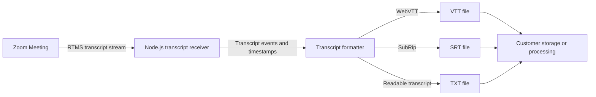

Build a live transcript pipeline that produces VTT, SRT, and plain-text files before a cloud recording is processed. The resulting files can feed meeting search, quality review, notes, storage, or an AI workflow.

[Zoom Realtime Media Streams (RTMS)](https://developers.zoom.us/docs/rtms/) sends transcript text while the meeting is running. This quickstart saves it as [WebVTT](https://www.w3.org/TR/webvtt1/), SubRip (SRT), and plain text. It keeps the timing and speaker information, and it does not add a bot to the meeting.

These files are a starting point. Search them, summarize them, attach them to a support case, or move them to your approved storage system.

**What you'll need:**

- Transcript access through [RTMS](https://developers.zoom.us/docs/rtms/)
- A backend that can receive Zoom webhooks and RTMS transcript events
- Writable local storage for the quickstart, or customer-managed storage for production
- A Zoom Meeting with RTMS enabled for testing

**Features:**

- Receive a live transcript without adding a participant bot.
- Create one VTT, SRT, and TXT file for the meeting.
- Preserve speaker labels and relative subtitle timing.
- Append each received transcript event to readable local files.

Follow along as we walk through the architecture.

## Architecture

### The reusable pattern

Zoom tells your webhook when RTMS starts and stops. A transcript service connects to RTMS, receives timestamped segments, orders them, and writes or forwards them in the formats the next system expects.

### How the reference implementation handles it

The linked [Node.js reference implementation](https://github.com/zoom/rtms-samples/tree/main/transcript/save_transcript_js) uses Express and RTMSManager. It appends each transcript event to three local files beneath `recordings/<meeting-uuid>/`. It uses process-wide timing and SRT counters, synchronous file writes, and local disk. Treat it as a learning implementation for one meeting at a time, not as a multi-tenant transcript store.



### Agent integration map

Check what your application already provides before adding components:

| Required capability | Reuse when present | Add when missing |
| --- | --- | --- |
| Webhook endpoint | Existing public API route | HTTPS endpoint for RTMS lifecycle events |
| Signature verification | Existing Zoom webhook middleware | Raw-body HMAC verification and replay protection |
| RTMS session manager | Existing stream registry | State keyed by `rtms_stream_id` |
| Transcript normalizer | Existing event schema | Speaker, text, timing, and sequence normalization |
| Format writer | Existing export service | VTT, SRT, and TXT serializers |
| Storage | Existing object or document storage | Local filesystem for the quickstart |

## Implementation Guide

### Part 1: Build the transcript pipeline

#### 1. Connect RTMS transcript events to the writer

The source registers one synchronous writer for every transcript event. See [`save_transcript_js/index.js`](https://github.com/zoom/rtms-samples/blob/main/transcript/save_transcript_js/index.js) for the Node.js implementation. The same pipeline can write to object storage, a database, a queue, or another transcript format. Keep the meeting identifier, speaker, start time, end time, and text when replacing the local writer.

#### 2. Create a Zoom General App

Create a General App in the [Zoom App Marketplace](https://marketplace.zoom.us/) and add your public webhook URL.

| Setting | Value |
| --- | --- |
| Scope | `meeting:read:meeting_transcript` |
| Events | `meeting.rtms_started`, `meeting.rtms_stopped` |
| Webhook URL | `https://YOUR_DOMAIN.example.com/webhook` |

Enable RTMS for the account and meeting. Use `manifest.json` as a starting point and verify it in the target Marketplace account.

#### 3. Receive RTMS lifecycle events

Make the webhook available over HTTPS. Check every request and reply quickly. `WebhookManager` passes lifecycle events to RTMSManager, which manages the RTMS connection. The application logs `meeting.rtms_stopped`; because every transcript event is appended synchronously, this implementation has no separate text buffer to flush. Add per-meeting cleanup and call `resetTranscriptSession()` when introducing reusable session state.

Keep signature verification concrete because it protects the entry point:

```javascript
import crypto from 'node:crypto';

function verifyZoomWebhook(rawBody, timestamp, signature, secret) {
  const now = Math.floor(Date.now() / 1000);
  if (Math.abs(now - Number(timestamp)) > 300) return false;
  const message = `v0:${timestamp}:${rawBody.toString('utf8')}`;
  const expected = `v0=${crypto.createHmac('sha256', secret).update(message).digest('hex')}`;
  const received = Buffer.from(signature);
  const computed = Buffer.from(expected);
  return received.length === computed.length && crypto.timingSafeEqual(received, computed);
}
```

Use the raw request bytes, handle endpoint validation separately, and reply before file work begins.

**Input:** Valid `meeting.rtms_started` or `meeting.rtms_stopped` event

**Output:** One active transcript session or a completed session cleanup

**Invariants:**

- Deduplicate start events by `rtms_stream_id`
- Register handlers before joining the RTMS stream
- Keep counters, timing origins, and output paths isolated by stream
- Close file handles and remove session state when RTMS stops

### Part 2: Write usable transcript files

#### 4. Write transcript formats

[`writeTranscriptToVtt.js`](https://github.com/zoom/rtms-samples/blob/5c39fca2ed97d75bcbdb318cf246a037835f7d37/transcript/save_transcript_js/writeTranscriptToVtt.js) creates `recordings/<meeting-uuid>/`, writes a `WEBVTT` header once, and appends all three formats synchronously. Its `srtIndex` and `sessionStartTime` values are process-wide. Although the file exports `resetTranscriptSession()`, the current application does not call it. Before supporting concurrent meetings, move those values into state keyed by meeting and stream.

Confirm that:

- VTT and SRT cues have monotonic timestamps.
- Repeated transcript events do not create unwanted duplicate cues.
- Speaker labels are escaped before writing subtitle files.
- Interrupted connections do not overwrite an existing transcript unexpectedly.

Local files are fine for a quickstart. In production, copy completed text or files to storage that your organization manages and backs up. Replace the process-wide counters with state keyed by meeting and stream before handling concurrent meetings.

**Input:** Normalized segment with meeting ID, sequence, speaker, text, start time, and end time

**Output:** Matching VTT cue, SRT cue, and plain-text line

**Invariants:**

- Cue times are monotonic and end times do not precede start times
- SRT indexes increase within one stream and restart only for a new stream
- Retries and duplicate events do not create duplicate cues
- Untrusted speaker labels and text cannot break the output format or path
- A partial write is detected and can be recovered without overwriting completed content

### Part 3: Run the reference implementation

#### 5. Install, configure, and start

```bash
git clone https://github.com/zoom/rtms-samples.git
cd rtms-samples/transcript/save_transcript_js
npm install
cp .env.example .env
```

Set the following values in `.env`:

```dotenv
ZOOM_CLIENT_ID=YOUR_ZOOM_CLIENT_ID
ZOOM_CLIENT_SECRET=YOUR_ZOOM_CLIENT_SECRET
ZOOM_SECRET_TOKEN=YOUR_ZOOM_WEBHOOK_SECRET_TOKEN
PORT=3000
WEBHOOK_PATH=/webhook
```

The checked-in `.env.example` uses `/`, while the application defaults to `/webhook`. Use one path consistently in `.env` and Marketplace. Keep production values in a managed secret store.

Run:

```bash
node index.js
```

Expose port `3000` through an HTTPS tunnel for local development, then use the resulting `/webhook` URL in Marketplace. The linked repository does not include a tested deployment template.

#### 6. Test a complete meeting

Run the service and start RTMS in a test meeting with at least two people speaking. Stop RTMS and open all three output files. Check punctuation, participant names, silence, reconnection, and what happens when a meeting ends unexpectedly.

### Production considerations

- Encrypt transcript files in transit and at rest.
- Define retention and deletion rules before collecting customer meetings.
- Use a queue or object store instead of relying on ephemeral application disk.
- Restrict access by meeting and tenant; do not expose sequential file paths publicly.
- Monitor missing segments, reconnects, storage failures, and end-to-end lag.

## App Manifest

The [`manifest.json`](manifest.json) in this directory is a candidate Zoom General App manifest and pre-configures live transcript capture: transcript scope, an OAuth callback placeholder, and RTMS lifecycle subscriptions. Import it when creating the app, replacing `YOUR_DOMAIN` with an HTTPS domain controlled by the app owner.

### Scopes

- `meeting:read:meeting_transcript`

### Event subscriptions

- `meeting.rtms_started`
- `meeting.rtms_stopped`

### Structure

The manifest contains the app identity, transcript scope, OAuth callback placeholder, and the public lifecycle webhook. It does not configure transcript storage or retention; those are application responsibilities.

Before publication, the app owner must import it into the target Zoom Marketplace account, confirm the permissions and current schema, complete endpoint validation, and test it with an RTMS-enabled meeting. Passing repository validation only proves that the JSON is present and parseable; it is not Marketplace approval.

## Acceptance Criteria

- [ ] Invalid or stale webhook signatures are rejected before RTMS work begins.
- [ ] Two simultaneous meetings write to separate state and output directories.
- [ ] One test meeting produces readable VTT, SRT, and TXT files.
- [ ] VTT and SRT timestamps remain monotonic across pauses and reconnections.
- [ ] Duplicate transcript events do not create duplicate cues.
- [ ] A stopped or failed stream releases its session state and file resources.
- [ ] Restarting the service does not overwrite a completed transcript unexpectedly.
- [ ] Production storage, retention, encryption, and deletion behavior are documented for the target environment.

## Related Resources

- [Zoom RTMS documentation](https://developers.zoom.us/docs/rtms/)
- [RTMS JavaScript SDK reference](https://zoom.github.io/rtms/js/)
- [Save-transcript reference implementation](https://github.com/zoom/rtms-samples/tree/main/transcript/save_transcript_js)
