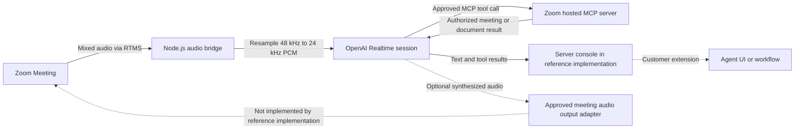

Build a listening agent that understands spoken requests in a Zoom Meeting and can search approved Zoom content while the conversation is active. It streams meeting audio to OpenAI Realtime and returns text and tool results without waiting for a recording.

This Blueprint connects [Zoom Realtime Media Streams (RTMS)](https://developers.zoom.us/docs/rtms/) audio from a Zoom Meeting, not a Video SDK session, to the [OpenAI Realtime API](https://developers.openai.com/api/docs/guides/realtime). The reference implementation changes the audio into the format OpenAI expects, sends it to the realtime model, and lets the model call approved tools on [Zoom's hosted MCP server](https://developers.zoom.us/docs/mcp/zoom-mcp-server/).

The current implementation listens to speech and returns text and tool results. It cannot play the assistant's voice back into the Zoom Meeting. A two-way voice agent still needs an approved way to join or speak in the meeting. Until then, this remains a listening implementation.

**What you'll need:**

- A [Zoom Developer Pack](https://zoom.us/pricing/developer) with RTMS audio access
- A backend that can maintain RTMS and OpenAI Realtime WebSocket sessions
- Access to an [OpenAI Realtime model](https://developers.openai.com/api/docs/guides/realtime)
- A user-authorized Zoom OAuth token when Zoom MCP tools are enabled
- A destination for text and tool results, if server logs are not enough

**Features:**

- Receive mixed meeting audio through RTMS.
- Resample 48 kHz L16 audio to 24 kHz PCM for OpenAI Realtime.
- Detect speech turns and produce text responses.
- Allowlist Zoom MCP search, retrieval, and Zoom Docs tools.
- Log model usage, tool calls, tool results, and text responses.

It does not send text to a user interface or play assistant audio into the meeting.

Follow along as we walk through the architecture.

## Features

The reference implementation reports the OpenAI Realtime session, text
responses, approved Zoom MCP tool calls, and bounded usage metadata through
server logs.


## Architecture

### The reusable pattern

Your backend receives mixed meeting audio through RTMS, converts it to the model's required format, and keeps one model session associated with each meeting stream. The model may call a small set of tools using a user-authorized token. A separate response adapter decides where text or approved actions appear.

### How the reference implementation handles it

The linked [Node.js reference implementation](https://github.com/zoom/rtms-samples/tree/main/audio/send_audio_to_openai_realtime_api) uses RTMSManager and a server-to-server WebSocket connection to OpenAI. Its default model is [`gpt-realtime-2`](https://developers.openai.com/api/docs/models/gpt-realtime-2), with text-only output and optional input transcription. It registers the Zoom MCP server as a remote tool and writes results to the server console.

The model supports audio output, but the reference implementation requests text and has no path for assistant audio to enter the Zoom Meeting. Treat spoken output as separate work that needs a supported Zoom design and architecture review.



### Agent integration map

Check what your application already provides before adding components:

| Required capability | Reuse when present | Add when missing |
| --- | --- | --- |
| Webhook endpoint | Existing public API route | HTTPS endpoint for RTMS lifecycle events |
| Signature verification | Existing Zoom webhook middleware | Raw-body HMAC verification and replay protection |
| RTMS audio receiver | Existing media service | Mixed-audio handler keyed by stream |
| Audio conversion | Existing media pipeline | 48 kHz L16 to 24 kHz PCM conversion |
| Realtime client | Existing OpenAI connection manager | One server-side session per RTMS stream |
| MCP authorization | Existing user OAuth and policy layer | Tool allowlist and approval boundary |
| Result delivery | Existing UI or workflow adapter | Text and tool-result destination |

## Implementation Guide

### Part 1: Build the live audio bridge

#### 1. Start with the supported reference boundary

Start with voice input, text output, and tool calls. Test those parts before adding spoken replies. Do not describe the app as a two-way voice agent until an approved audio-output path works in a real meeting.

[`openaiRealtime.js`](https://github.com/zoom/rtms-samples/blob/main/audio/send_audio_to_openai_realtime_api/openaiRealtime.js) keeps buffered source audio with the meeting session, slices fixed-size chunks, resamples each chunk, and sends it to the matching OpenAI session. The same meeting-to-session boundary is required if the audio transport or model provider changes.

**Input:** Timestamped 48 kHz L16 mixed audio associated with an RTMS stream

**Output:** Ordered 24 kHz PCM chunks appended to the matching OpenAI Realtime session

**Invariants:**

- One active model session is associated with one `rtms_stream_id`
- Audio order is preserved across buffering and resampling
- Queue size and end-to-end delay have explicit upper bounds
- Old audio is dropped when processing falls behind the allowed latency
- Buffered audio and model sessions are removed when RTMS stops

#### 2. Create the Zoom app

Create a Zoom General App in the [Zoom App Marketplace](https://marketplace.zoom.us/) with permission to read RTMS audio. Add only the user permissions needed by the Zoom MCP tools you plan to use.

| Capability | Candidate scopes |
| --- | --- |
| Live meeting audio | `meeting:read:meeting_audio` |
| Search meetings | `meeting:read:search` |
| Read meeting assets | `meeting:read:assets` |
| List recordings | `cloud_recording:read:list_user_recordings` |
| Read recording content | `cloud_recording:read:content` |
| Create or import Zoom Docs | `docs:write:import` |
| Read or export Zoom Docs | `docs:read:export` |

Subscribe the webhook to `meeting.rtms_started` and `meeting.rtms_stopped`. Remove every MCP scope whose tools are disabled. Verify the combined app design and scopes in Marketplace before use.

Verify webhook signatures over the raw request body, enforce a replay window, and use a timing-safe comparison. Reply before opening RTMS, OpenAI, or MCP connections.

```javascript
import crypto from 'node:crypto';

function verifyZoomWebhook(rawBody, timestamp, signature, secret) {
  if (Math.abs(Math.floor(Date.now() / 1000) - Number(timestamp)) > 300) return false;
  const message = `v0:${timestamp}:${rawBody.toString('utf8')}`;
  const expected = `v0=${crypto.createHmac('sha256', secret).update(message).digest('hex')}`;
  const received = Buffer.from(signature);
  const computed = Buffer.from(expected);
  return received.length === computed.length && crypto.timingSafeEqual(received, computed);
}
```

Handle Zoom endpoint validation separately because that request follows a different path.

#### 3. Bridge meeting audio to the realtime session

Check the RTMS webhook and reply quickly. Open the RTMS media connection, receive the mixed audio, and convert it from 48 kHz to 24 kHz PCM before sending it to OpenAI.

Set a maximum queue size. If the service falls behind, drop old audio instead of letting the delay keep growing. Keep track of which meeting, RTMS stream, and OpenAI session belong together, and close them when RTMS stops.

### Part 2: Configure the agent and tools

#### 4. Configure turns and response modalities

The reference implementation uses server-side voice detection with a 600 ms silence duration, 300 ms prefix padding, and text-only output. Treat those values as reference settings. Test them with the languages, microphones, overlap, and room noise expected in your meetings.

These values are source-backed in `buildSessionUpdateEvent()`, which sets `output_modalities: ['text']`, 24 kHz PCM input, server VAD, and automatic response creation. The configured model defaults to `gpt-realtime-2`. Official OpenAI documentation confirms that this model accepts and returns text and audio and supports tool use; this Blueprint describes only the modalities enabled by the linked code.

Make it clear when the agent is listening, and give participants a simple way to stop it.

For a later spoken-answer test, turn on audio output in OpenAI and capture the returned audio. This proves that OpenAI can create speech. It still does not provide a supported way to play that speech in the Zoom Meeting.

**Input:** Realtime session configuration, converted audio, and turn-detection settings

**Output:** Text response events and optional tool requests for the matching meeting stream

**Invariants:**

- The configured input format matches the bytes sent by the audio bridge
- Output remains text-only until a supported meeting audio-output path is implemented
- Turn settings are tested for the expected languages, overlap, and room noise
- Session errors close or replace only the affected stream session
- Model name, duration, rate, and spend limits come from deployment configuration

#### 5. Restrict MCP tools

Connect to Zoom's hosted MCP server only after the user signs in and gives permission. Enable as few tools as possible. Route content creation and lasting changes through the customer's approval workflow.

The reference implementation defaults MCP approval to `never` and only logs approval requests; it does not include an approval UI. Keep automatic execution only for tools you are willing to run without another prompt. Put write tools behind an approval flow before production.

Do not blindly trust tool descriptions, inputs, or results. Check IDs and permissions, set timeouts, and remove sensitive information from logs.

**Input:** Model-requested tool name and arguments plus user authorization context

**Output:** Authorized Zoom MCP result, approval request, or structured denial

**Invariants:**

- Tool execution uses a user-authorized token with the required granular scopes
- The configured allowlist overrides model requests
- Tool arguments and returned identifiers are validated
- Write tools require the selected approval policy
- Token expiry or tool failure does not interrupt RTMS audio ingestion

#### 6. Design the response experience

The reference implementation logs text and tool results. Add a response adapter if the customer needs a dashboard, CRM, automation, or separate Zoom App. If the agent must speak in the meeting, choose the design with Zoom product and security owners. Decide how the agent appears, how it tells people what it is, how it avoids echo, how people interrupt it, what it can do, and what happens when it fails.

Do not call the agent complete by using an undocumented or unsupported audio trick.

### Part 3: Run the reference implementation

#### 7. Install, configure, and start

```bash
git clone https://github.com/zoom/rtms-samples.git
cd rtms-samples/audio/send_audio_to_openai_realtime_api
npm install
cp .env.example .env
```

Set the Zoom, OpenAI, and Zoom MCP values in `.env`:

```dotenv
ZOOM_CLIENT_ID=YOUR_ZOOM_CLIENT_ID
ZOOM_CLIENT_SECRET=YOUR_ZOOM_CLIENT_SECRET
ZOOM_SECRET_TOKEN=YOUR_ZOOM_WEBHOOK_SECRET_TOKEN
ZOOM_MCP_ACCESS_TOKEN=YOUR_USER_AUTHORIZED_ZOOM_MCP_TOKEN
ZOOM_MCP_ALLOWED_TOOLS=search_meetings,get_meeting_assets
ZOOM_MCP_REQUIRE_APPROVAL=never
OPENAI_API_KEY=YOUR_OPENAI_API_KEY
OPENAI_REALTIME_MODEL=gpt-realtime-2
AUDIO_SAMPLE_RATE=48000
OPENAI_AUDIO_SAMPLE_RATE=24000
PORT=5050
WEBHOOK_PATH=/
```

The Zoom MCP token acts for a user, so obtain it through the approved OAuth sign-in flow. Never log it or put it in browser code. Keep the allowed-tool list as small as the workflow permits. Then run:

```bash
npm start
```

Expose port `5050` over HTTPS and set the Marketplace event endpoint to the configured webhook path. The repository does not include a tested deployment template or a user-facing response application.

#### 8. Test end to end

Test people talking over each other, silence, interruptions, different accents, poor connections, slow MCP tools, expired tokens, model disconnects, and meetings that end suddenly. Measure how long the first answer takes and how often an answer arrives too late. Check that the agent cannot call tools outside your approved list.

### Production considerations

- Provide clear notice that meeting audio is sent to an external AI provider.
- Review provider retention, regional processing, safety controls, and contractual terms.
- Keep tool permissions separate from prompts. A prompt is not permission.
- Add rate, duration, and spend limits per meeting and tenant.
- Review the prompts, voice, participant notice, and escalation steps with the product and security owners before rollout.

## App Manifest

The [`manifest.json`](manifest.json) in this directory follows the current Zoom Marketplace manifest structure and pre-configures a listening agent: the RTMS audio scope, selected Zoom MCP scopes, development and production OAuth callback placeholders, and RTMS lifecycle subscriptions. Remove unused scopes and replace `your-development-domain` and `your-production-domain` before importing it.

### RTMS scope

- `meeting:read:meeting_audio`

### MCP scopes

The manifest lists the granular scopes used by the reference implementation's full default tool allowlist. Remove scopes for tools you disable. Read-only meeting, recording, and Zoom Docs scopes should stay separate from `docs:write:import`.

| Scope | Default tool use |
| --- | --- |
| `meeting:read:search` | `search_meetings` |
| `meeting:read:assets` | `get_meeting_assets` |
| `cloud_recording:read:list_user_recordings` | `recordings_list` |
| `cloud_recording:read:content` | `get_recording_resource` |
| `docs:read:export` | `get_file_content` |
| `docs:write:import` | `create_new_file_with_markdown` |

The `search_zoom` tool searches more than one Zoom product. Its additional scope requirements depend on the entity types enabled for the deployment and are not guessed in this manifest. Add only the entity-specific scopes returned by Marketplace or the live MCP authorization error, or remove `search_zoom` from `ZOOM_MCP_ALLOWED_TOOLS`.

### Event subscriptions

- `meeting.rtms_started`
- `meeting.rtms_stopped`

The app owner must verify the current Zoom Marketplace schema, the app type and OAuth flow, each granular scope, endpoint validation, and the hosted MCP authorization behavior. OpenAI project owners must verify the selected realtime model and data controls. Any mechanism intended to deliver synthesized audio into a Zoom Meeting requires Zoom architecture approval because that path is not implemented by the linked reference implementation.

## Acceptance Criteria

- [ ] Invalid or stale Zoom webhook signatures are rejected before audio processing begins.
- [ ] Each RTMS stream has its own audio buffer and OpenAI Realtime session.
- [ ] 48 kHz L16 input is converted to the configured 24 kHz PCM format without unbounded buffering.
- [ ] Speech produces a text response while the reference implementation remains text-only.
- [ ] The model cannot call a Zoom MCP tool outside the configured allowlist.
- [ ] Expired OAuth tokens, slow tools, and model disconnects do not close the RTMS stream unexpectedly.
- [ ] Session, audio buffer, and token state is removed when a meeting stream ends.
- [ ] Participant notice, provider data handling, tool permissions, rate limits, and spend limits match the target policy.
- [ ] The implementation is not described as a two-way voice agent unless a supported meeting audio-output path is tested.

## Related Resources

- [Zoom RTMS documentation](https://developers.zoom.us/docs/rtms/)
- [OpenAI Realtime guide](https://developers.openai.com/api/docs/guides/realtime)
- [GPT-Realtime-2 model reference](https://developers.openai.com/api/docs/models/gpt-realtime-2)
- [Zoom MCP Server documentation](https://developers.zoom.us/docs/mcp/zoom-mcp-server/)
- [Meeting-audio reference implementation](https://github.com/zoom/rtms-samples/tree/main/audio/send_audio_to_openai_realtime_api)
