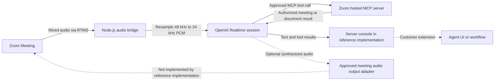

Teams want meeting agents that understand a spoken request right away. They may also need the agent to find useful meeting information without waiting for a recording. Voice feels natural during a conversation, but the agent must respond quickly, handle interruptions, respect permissions, and clearly tell people when it is listening.

This Blueprint connects [Zoom Realtime Media Streams (RTMS)](https://developers.zoom.us/docs/rtms/) audio from a Zoom Meeting, not a Video SDK session, to the [OpenAI Realtime API](https://developers.openai.com/api/docs/guides/realtime). The reference implementation changes the audio into the format OpenAI expects, sends it to the realtime model, and lets the model call approved tools on [Zoom's hosted MCP server](https://developers.zoom.us/docs/mcp/zoom-mcp-server/).

The current implementation listens to speech and returns text and tool results. It cannot play the assistant's voice back into the Zoom Meeting. A two-way voice agent still needs an approved way to join or speak in the meeting. Until then, this remains a listening implementation.

## Features

The reference implementation can:

- Receive mixed meeting audio through RTMS.
- Resample 48 kHz L16 audio to 24 kHz PCM for OpenAI Realtime.
- Detect speech turns and produce text responses.
- Allowlist Zoom MCP search, retrieval, and Zoom Docs tools.
- Log model usage, tool calls, tool results, and text responses.

It does not send text to a user interface or play assistant audio into the meeting.

## Architecture

### The reusable pattern

Your backend receives mixed meeting audio through RTMS, converts it to the model's required format, and keeps one model session associated with each meeting stream. The model may call a small set of tools using a user-authorized token. A separate response adapter decides where text or approved actions appear.

### How the reference implementation handles it

The linked [Node.js reference implementation](https://github.com/zoom/rtms-samples/tree/main/audio/send_audio_to_openai_realtime_api) uses RTMSManager and a server-to-server WebSocket connection to OpenAI. Its default model is [`gpt-realtime-2`](https://developers.openai.com/api/docs/models/gpt-realtime-2), with text-only output and optional input transcription. It registers the Zoom MCP server as a remote tool and writes results to the server console.

The model supports audio output, but the reference implementation requests text and has no path for assistant audio to enter the Zoom Meeting. Treat spoken output as separate work that needs a supported Zoom design and architecture review.



## Implementation Guide

### Part 1: Build the live audio bridge

#### 1. Start with the supported reference boundary

Start with voice input, text output, and tool calls. Test those parts before adding spoken replies. Do not describe the app as a two-way voice agent until an approved audio-output path works in a real meeting.

Use the Node.js version required by the reference implementation.

```bash
git clone https://github.com/zoom/rtms-samples.git
cd rtms-samples/audio/send_audio_to_openai_realtime_api
npm install
```

#### 2. Create the Zoom app

Create a Zoom General App in the [Zoom App Marketplace](https://marketplace.zoom.us/) with permission to read RTMS audio. Add only the user permissions needed by the Zoom MCP tools you plan to use.

| Capability | Candidate scopes |
| --- | --- |
| Live meeting audio | `meeting:read:meeting_audio` |
| Search meetings | `meeting:read:search` |
| Read meeting assets | `meeting:read:assets` |
| List recordings | `cloud_recording:read:list_user_recordings` |
| Read recording content | `cloud_recording:read:content` |
| Create or import Zoom Docs | `docs:write:import` |
| Read or export Zoom Docs | `docs:read:export` |

Subscribe the webhook to `meeting.rtms_started` and `meeting.rtms_stopped`. Remove every MCP scope whose tools are disabled. Verify the combined app design and scopes in Marketplace before use.

#### 3. Configure server-side credentials

<details>
<summary><strong>Environment variables</strong></summary>

Use managed secrets in deployment.

```dotenv
ZOOM_CLIENT_ID=YOUR_ZOOM_CLIENT_ID
ZOOM_CLIENT_SECRET=YOUR_ZOOM_CLIENT_SECRET
ZOOM_SECRET_TOKEN=YOUR_ZOOM_WEBHOOK_SECRET_TOKEN
ZOOM_MCP_ACCESS_TOKEN=YOUR_USER_AUTHORIZED_ZOOM_MCP_TOKEN
OPENAI_API_KEY=YOUR_OPENAI_API_KEY
OPENAI_REALTIME_MODEL=YOUR_APPROVED_REALTIME_MODEL
PORT=5050
WEBHOOK_PATH=/
```

The Zoom MCP token acts for a user, so get it through the approved OAuth sign-in flow. Never log the token or put it in browser code. Keep the OpenAI model name in configuration and check that the model is available to your project and region.

</details>

#### 4. Bridge meeting audio to the realtime session

Check the RTMS webhook and reply quickly. Open the RTMS media connection, receive the mixed audio, and convert it from 48 kHz to 24 kHz PCM before sending it to OpenAI.

Set a maximum queue size. If the service falls behind, drop old audio instead of letting the delay keep growing. Keep track of which meeting, RTMS stream, and OpenAI session belong together, and close them when RTMS stops.

### Part 2: Configure the agent and tools

#### 5. Configure turns and response modalities

The reference implementation uses server-side voice detection with a 600 ms silence duration, 300 ms prefix padding, and text-only output. Treat those values as reference settings. Test them with the languages, microphones, overlap, and room noise expected in your meetings.

Make it clear when the agent is listening, and give participants a simple way to stop it.

For a later spoken-answer test, turn on audio output in OpenAI and capture the returned audio. This proves that OpenAI can create speech. It still does not provide a supported way to play that speech in the Zoom Meeting.

#### 6. Restrict MCP tools

Connect to Zoom's hosted MCP server only after the user signs in and gives permission. Enable as few tools as possible. Route content creation and lasting changes through the customer's approval workflow.

The reference implementation defaults MCP approval to `never` and only logs approval requests; it does not include an approval UI. Keep automatic execution only for tools you are willing to run without another prompt. Put write tools behind an approval flow before production.

Do not blindly trust tool descriptions, inputs, or results. Check IDs and permissions, set timeouts, and remove sensitive information from logs.

#### 7. Design the response experience

The reference implementation logs text and tool results. Add a response adapter if the customer needs a dashboard, CRM, automation, or separate Zoom App. If the agent must speak in the meeting, choose the design with Zoom product and security owners. Decide how the agent appears, how it tells people what it is, how it avoids echo, how people interrupt it, what it can do, and what happens when it fails.

Do not call the agent complete by using an undocumented or unsupported audio trick.

### Part 3: Run the reference implementation

#### 8. Start the service

Copy `.env.example` to `.env`, set the Zoom, OpenAI, and Zoom MCP values, then run:

```bash
npm start
```

Expose port `5050` over HTTPS and set the Marketplace event endpoint to the configured webhook path. The repository does not include a tested deployment template or a user-facing response application.

#### 9. Test end to end

Test people talking over each other, silence, interruptions, different accents, poor connections, slow MCP tools, expired tokens, model disconnects, and meetings that end suddenly. Measure how long the first answer takes and how often an answer arrives too late. Check that the agent cannot call tools outside your approved list.

### Production considerations

- Provide clear notice that meeting audio is sent to an external AI provider.
- Review provider retention, regional processing, safety controls, and contractual terms.
- Keep tool permissions separate from prompts. A prompt is not permission.
- Add rate, duration, and spend limits per meeting and tenant.
- Review the prompts, voice, participant notice, and escalation steps with the product and security owners before rollout.

## App Manifest

The [`manifest.json`](manifest.json) in this directory is a candidate Zoom General App manifest and pre-configures a listening agent: RTMS audio scope, selected Zoom MCP scopes, an OAuth callback placeholder, and RTMS lifecycle subscriptions. Import it when creating the app, removing unused scopes and replacing `YOUR_DOMAIN` first.

### RTMS scope

- `meeting:read:meeting_audio`

### Optional MCP scopes

The manifest lists the granular scopes used by the reference implementation's full default tool allowlist. Remove scopes for tools you disable. Read-only meeting, recording, and Zoom Docs scopes should stay separate from `docs:write:import`.

### Event subscriptions

- `meeting.rtms_started`
- `meeting.rtms_stopped`

The app owner must verify the current Zoom Marketplace schema, the app type and OAuth flow, each granular scope, endpoint validation, and the hosted MCP authorization behavior. OpenAI project owners must verify the selected realtime model and data controls. Any mechanism intended to deliver synthesized audio into a Zoom Meeting requires Zoom architecture approval because that path is not implemented by the linked reference implementation.

## Related Resources

- [Zoom RTMS documentation](https://developers.zoom.us/docs/rtms/)
- [OpenAI Realtime guide](https://developers.openai.com/api/docs/guides/realtime)
- [GPT-Realtime-2 model reference](https://developers.openai.com/api/docs/models/gpt-realtime-2)
- [Zoom MCP Server documentation](https://developers.zoom.us/docs/mcp/zoom-mcp-server/)
- [Meeting-audio reference implementation](https://github.com/zoom/rtms-samples/tree/main/audio/send_audio_to_openai_realtime_api)

## What Will You Build?

This Blueprint shows one path: mixed meeting audio sent to OpenAI Realtime, with text and tool results logged on the backend. The same architecture supports many variations:

- Show text results in a Zoom App or dashboard.
- Restrict the agent to read-only Zoom MCP tools.
- Add a narrow write action behind an approval workflow.
- Replace the model or response destination.
- Add spoken output after selecting a supported Zoom audio path.

RTMS provides the live audio. The agent behavior, tool policy, and response experience are yours to build.
