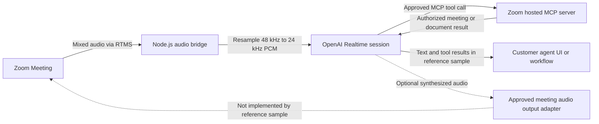

## Problem Statement

Teams want meeting agents that understand a spoken request right away. They may also need the agent to find useful meeting information without waiting for a recording. Voice feels natural during a conversation, but the agent must respond quickly, handle interruptions, respect permissions, and clearly tell people when it is listening.

This blueprint connects **Zoom Realtime Media Streams (RTMS)** audio from a Zoom Meeting—not a Video SDK session—to the OpenAI Realtime API. The sample changes the audio into the format OpenAI expects, sends it to the realtime model, and lets the model call approved tools on Zoom's hosted MCP server.

The current sample listens to speech and returns text and tool results. It cannot play the assistant's voice back into the Zoom Meeting. A two-way voice agent still needs an approved way to join or speak in the meeting. Until then, the sample remains a listening demo.

## Architecture

Your backend receives mixed meeting audio through RTMS. It converts the audio from 48 kHz to the 24 kHz PCM format used by the realtime session. OpenAI detects when someone has finished speaking and prepares an answer. When it needs more information, it calls one of the Zoom MCP tools you allow, using a token approved by the user. The backend receives the answer as text or a tool result.

The OpenAI realtime model can create audio, but the linked Zoom sample asks for text and has no way to send assistant audio into the meeting. Treat spoken output as a separate piece of work that needs a Zoom architecture review.



## Implementation Guide

### 1. Start with the supported reference boundary

Start with voice input, text output, and tool calls. Test those parts before adding spoken replies. Do not describe the app as a two-way voice agent until an approved audio-output path works in a real meeting.

Use the Node.js version required by the sample.

```bash
git clone https://github.com/zoom/rtms-samples.git
cd rtms-samples/audio/send_audio_to_openai_realtime_api
npm install
```

### 2. Create the Zoom app

Create a Zoom General App with permission to read RTMS audio. Add only the user permissions needed by the Zoom MCP tools you plan to use.

| Capability | Candidate scopes |
| --- | --- |
| Live meeting audio | `meeting:read:meeting_audio` |
| Search meetings | `meeting:read:search` |
| Read meeting assets | `meeting:read:assets` |
| List recordings | `cloud_recording:read:list_user_recordings` |
| Read recording content | `cloud_recording:read:content` |
| Create or import Zoom Docs | `docs:write:import` |
| Read or export Zoom Docs | `docs:read:export` |

Subscribe the webhook to `meeting.rtms_started` and `meeting.rtms_stopped`. Remove every MCP scope whose tools are disabled. Verify the combined app design and scopes in Marketplace before use.

### 3. Configure server-side credentials

Use managed secrets in deployment.

```dotenv
ZOOM_CLIENT_ID=YOUR_ZOOM_CLIENT_ID
ZOOM_CLIENT_SECRET=YOUR_ZOOM_CLIENT_SECRET
ZOOM_SECRET_TOKEN=YOUR_ZOOM_WEBHOOK_SECRET_TOKEN
ZOOM_MCP_ACCESS_TOKEN=YOUR_USER_AUTHORIZED_ZOOM_MCP_TOKEN
OPENAI_API_KEY=YOUR_OPENAI_API_KEY
OPENAI_REALTIME_MODEL=YOUR_APPROVED_REALTIME_MODEL
```

The Zoom MCP token acts for a user, so get it through the approved OAuth sign-in flow. Never log the token or put it in browser code. Keep the OpenAI model name in configuration and check that the model is available to your project and region.

### 4. Bridge meeting audio to the realtime session

Check the RTMS webhook and reply quickly. Open the RTMS media connection, receive the mixed audio, and convert it from 48 kHz to 24 kHz PCM before sending it to OpenAI.

Set a maximum queue size. If the service falls behind, drop old audio instead of letting the delay keep growing. Keep track of which meeting, RTMS stream, and OpenAI session belong together, and close them when RTMS stops.

### 5. Configure turns and response modalities

Start with OpenAI's server-side voice detection and the sample's text output. Make it clear when the agent is listening, and give participants a simple way to stop it.

For a later spoken-answer test, turn on audio output in OpenAI and capture the returned audio. This proves that OpenAI can create speech. It still does not provide a supported way to play that speech in the Zoom Meeting.

### 6. Restrict MCP tools

Connect to Zoom's hosted MCP server only after the user signs in and gives permission. Enable as few tools as possible. Ask for confirmation before creating content or making a lasting change.

Do not blindly trust tool descriptions, inputs, or results. Check IDs and permissions, set timeouts, and remove sensitive information from logs.

### 7. Design the response experience

The sample can send text and tool results to a dashboard, CRM, automation, or separate Zoom App. If the agent must speak in the meeting, choose the design with Zoom product and security owners. Decide how the agent appears, how it tells people what it is, how it avoids echo, how people interrupt it, what it can do, and what happens when it fails.

Do not call the agent complete by using an undocumented or unsupported audio trick.

### 8. Test end to end

Test people talking over each other, silence, interruptions, different accents, poor connections, slow MCP tools, expired tokens, model disconnects, and meetings that end suddenly. Measure how long the first answer takes and how often an answer arrives too late. Check that the agent cannot call tools outside your approved list.

### Production considerations

- Provide clear notice that meeting audio is sent to an external AI provider.
- Review provider retention, regional processing, safety controls, and contractual terms.
- Keep tool permissions separate from prompts. A prompt is not permission.
- Add rate, duration, and spend limits per meeting and tenant.
- Ask people to review the prompts, voice, participant notice, and escalation steps.

## App Manifest

[`manifest.json`](manifest.json) is a candidate manifest for RTMS audio, selected Zoom MCP scopes, OAuth redirect, and RTMS lifecycle subscriptions. Remove unused scopes before import and replace `YOUR_DOMAIN`.

A human app owner must verify the current Zoom Marketplace schema, the app type and OAuth flow, each granular scope, endpoint validation, and the hosted MCP authorization behavior. OpenAI project owners must verify the selected realtime model and data controls. A Zoom architecture owner must approve any mechanism intended to deliver synthesized audio into a Zoom Meeting because that path is not implemented by the linked sample.
