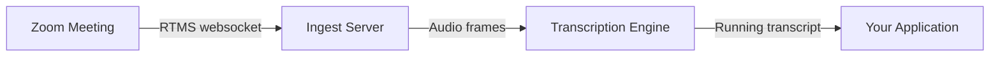

## Problem Statement

Enterprises record meetings and wait — for the recording to process, for the
transcript to land, for someone to read it. The value of a conversation decays
by the hour. <!-- Expand: real use-case grounding, business outcome framing. -->

## Architecture

<!-- Expand: component-by-component walkthrough. -->

## Implementation Guide

<!-- Expand: numbered steps from rtms-samples base. -->

1. Create a Server-to-Server OAuth app and enable RTMS scopes.

## App Manifest

The `manifest.json` in this directory configures the required RTMS scopes and
event subscriptions for one-click app creation. <!-- Expand once manifest
schema is confirmed. -->
