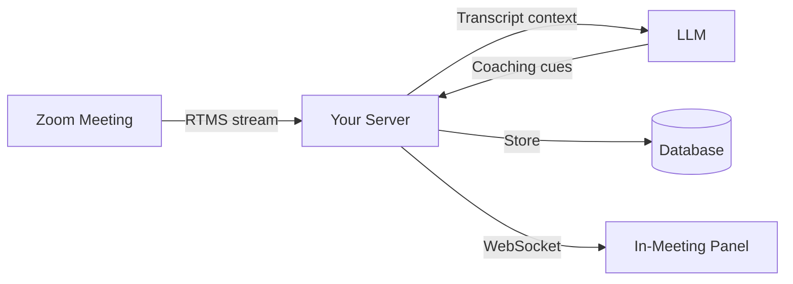

## Problem Statement

Sales coaching happens after the call. Managers review recordings, flag missed opportunities, and share feedback in CRM notes or 1:1s. By the time a rep hears "you didn't ask about budget," the prospect has moved on. The competitor may have already followed up.

Revenue intelligence platforms help by analyzing recorded calls and surfacing patterns. But the insight still arrives too late. The value of a conversation decays by the hour. A coaching moment that could have saved the deal becomes a lesson for next time.

The underlying problem is timing. Reps need coaching during the call, not after it. The moment a prospect raises an objection is exactly when a seller needs the right response. The moment a competitor gets mentioned is when context matters most.

This blueprint puts coaching inside the meeting.

**RTMS** streams the live transcript to your backend with sub-second latency. No bot joins the call. No recording delay. Your application analyzes the conversation as it unfolds and pushes coaching cues directly into an in-meeting panel that only the seller sees.

The result: reps respond to objections with confidence, qualification signals get tracked automatically, and managers coach without watching every call.

### What You'll Build

A real-time sales coaching application that:

- Streams live transcripts from Zoom meetings using RTMS
- Analyzes conversation for qualification signals (budget, authority, need, timeline)
- Detects competitor mentions and surfaces relevant battlecards
- Tracks commitments and next steps as they're spoken
- Displays coaching cues in a Surface App panel visible only to the seller

<div align="center">
  
  
</div>

### See It In Action

Watch a 3-minute demo of the sales coaching experience:

[](https://www.youtube.com/watch?v=LKpZAe5_A8o)

---

## Architecture

Arlo runs as a **Zoom Surface App** inside the meeting. The seller sees a sidebar panel. The prospect sees nothing different.

**RTMS** handles the connection between the meeting and your backend. When the host enables transcription, RTMS streams transcript segments over a WebSocket. Your backend receives each segment as it's spoken, typically within 300-500ms.



### Component Walkthrough

**1. RTMS Transcript Stream**

When a meeting starts and the user enables Arlo, the Zoom client calls `startRTMS` through the Zoom Apps SDK. This triggers a webhook to your backend with connection details. Your backend then opens a WebSocket to receive transcript segments.

Each segment includes:
- Speaker ID and display name
- Transcript text
- Start and end timestamps (milliseconds)
- Sequence number for ordering

**2. Backend Processing (Node/Express)**

The backend maintains a WebSocket connection to RTMS for each active meeting. As segments arrive, it:

- Buffers segments for 2-3 seconds to handle out-of-order delivery
- Normalizes speaker labels
- Persists to Postgres for post-meeting retrieval
- Broadcasts to connected frontend clients

**3. AI Orchestration**

The sales coaching logic lives in the Intelligence Layer. When enough conversation context accumulates (or on explicit request), the backend:

- Builds a prompt with recent transcript context
- Calls an LLM (OpenRouter, Anthropic, or OpenAI)
- Parses the response for qualification signals, competitor mentions, and coaching cues
- Pushes results to the frontend via WebSocket

**4. In-Meeting Surface App (React)**

The frontend is a React application embedded in the Zoom client via the Zoom Apps SDK. It connects to the backend over WebSocket and renders:

- Live transcript with speaker labels
- Qualification tracker (BANT signals)
- Competitor mention alerts
- Commitment and next-step tracking
- AI-generated coaching suggestions

The panel updates in real time as the conversation progresses.

### Why No Bot Participant?

Traditional meeting assistants work by joining the meeting as a participant. A third-party app appears in the participant list alongside your attendees. For some use cases, that's fine. For sales calls, it can change the dynamic.

RTMS takes a different approach. The transcript stream comes directly from Zoom's infrastructure rather than from a separate participant. The standard transcription notice still appears to all attendees. The difference is in how the experience feels: no unfamiliar name in the participant list, no "who invited that?" moment.

This isn't about hiding transcription. It's about keeping the meeting focused on the conversation.

---

## Implementation Guide

This guide walks through setting up Arlo's sales coaching functionality locally. By the end, you'll have a working in-meeting sales coach connected to live Zoom meetings.

### Prerequisites

Before starting, ensure you have:

| Requirement | Purpose |
|-------------|---------|
| [Node.js 20+](https://nodejs.org/) | Runtime for backend services |
| [Docker Desktop](https://www.docker.com/products/docker-desktop/) | Runs Postgres and all services |
| [ngrok](https://ngrok.com/) | Exposes local server for Zoom webhooks |
| [Zoom Account](https://marketplace.zoom.us/) | To create and configure your Zoom App |
| RTMS Access | [Request access](https://www.zoom.com/en/realtime-media-streams/#form) if you don't have it |

### Step 1: Clone and Configure

Clone the Arlo repository:

```bash
git clone https://github.com/zoom/arlo.git
cd arlo
```

Copy the environment template:

```bash
cp .env.example .env
```

### Step 2: Set Up ngrok

Start ngrok to create a public URL for Zoom webhooks:

```bash
ngrok http 3000 --domain=your-subdomain.ngrok-free.app
```

If you don't have a static domain, get one free at [ngrok dashboard](https://dashboard.ngrok.com/domains). Static domains prevent reconfiguration every time ngrok restarts.

Keep this terminal running and note your URL.

### Step 3: Create Your Zoom App

1. Go to [Zoom Marketplace](https://marketplace.zoom.us/) and sign in
2. Click **Develop** > **Build App**
3. Select **General App** and name it (e.g., "Sales Coach")
4. Copy your **Client ID** and **Client Secret**

### Step 4: Configure Environment Variables

Edit `.env` with your values:

```bash
# From Zoom Marketplace
ZOOM_CLIENT_ID=your_client_id
ZOOM_CLIENT_SECRET=your_client_secret

# Your ngrok URL
PUBLIC_URL=https://your-subdomain.ngrok-free.app

# Generate these (run the commands, paste the output)
SESSION_SECRET=       # node -e "console.log(require('crypto').randomBytes(32).toString('hex'))"
REDIS_ENCRYPTION_KEY= # node -e "console.log(require('crypto').randomBytes(16).toString('hex'))"
```

### Step 5: Configure Zoom App Settings

In the Zoom Marketplace, configure your app:

**Basic Information:**
- OAuth Redirect URL: `https://YOUR-NGROK-URL/api/auth/callback`
- OAuth Allow List: `https://YOUR-NGROK-URL`

**Scopes:**
- `meeting:read` (read meeting details)
- `user:read` (read user profile)

**Zoom App SDK:**
- Click **Add APIs** and enable required capabilities
- Enable **RTMS > Transcripts**

**Surface:**
- Home URL: `https://YOUR-NGROK-URL`
- Domain Allow List: `https://YOUR-NGROK-URL`

**Event Subscriptions:**
- Event notification endpoint: `https://YOUR-NGROK-URL/api/rtms/webhook`
- Events: `meeting.rtms_started`, `meeting.rtms_stopped`

### Step 6: Start the Application

```bash
docker-compose up --build
```

Wait for all services to start:
- Postgres database (port 5432)
- Backend API (port 3000)
- Frontend (port 3001)
- RTMS service (port 3002)

### Step 7: Test in a Meeting

1. Start or join a Zoom meeting
2. Click **Apps** in the meeting toolbar
3. Find and open your app
4. Select the **Sales** vertical when prompted
5. Click **Start Arlo** to begin transcription
6. Watch the qualification tracker update as you discuss budget, timeline, and decision-makers

### Selecting the Sales Vertical

Arlo supports multiple verticals (Healthcare, Legal, Sales, Support, Notes). Each vertical customizes the UI and AI prompts for its domain.

To switch to Sales mode:

1. Open Arlo in a meeting
2. Click the **Settings** icon
3. Select **Sales** from the vertical picker
4. The interface updates to show qualification tracking, competitor detection, and sales-specific coaching

### Customizing Coaching Prompts

The sales coaching prompts live in the backend. You can customize them for your sales methodology (BANT, MEDDIC, SPICED, etc.).

Key files to modify:

| File | Purpose |
|------|---------|
| `backend/prompts/sales-qualification.js` | Defines what signals to detect |
| `backend/prompts/competitor-analysis.js` | Configures competitor battlecard triggers |
| `backend/prompts/next-steps.js` | Shapes how action items are extracted |

The prompts receive recent transcript context and return structured JSON that the frontend renders.

---

## App Manifest

The `manifest.json` in this directory defines a Zoom App with in-meeting panel capabilities and RTMS transcription access. Use it as a starting point for your own sales coaching application.

### Required Scopes

| Scope | Purpose |
|-------|---------|
| `meeting:read` | Access meeting metadata (ID, host, participants) |
| `user:read` | Read authenticated user's profile |
| `zoomapp:inmeeting` | Render the Surface App panel inside meetings |

### RTMS Configuration

RTMS access is configured separately from OAuth scopes. In your Zoom App settings:

1. Navigate to **Features** > **Zoom App SDK**
2. Enable **Real-Time Media Streams**
3. Select **Transcripts** (audio streaming is also available but not required for this blueprint)

### Event Subscriptions

The app subscribes to two webhook events:

| Event | When It Fires |
|-------|---------------|
| `meeting.rtms_started` | RTMS transcription begins in a meeting |
| `meeting.rtms_stopped` | RTMS transcription ends |

Your webhook endpoint receives these events and manages the WebSocket connections accordingly.

### Manifest Structure

```json
{
  "name": "Sales Coach",
  "version": "1.0.0",
  "appType": "generalApp",
  "scopes": ["meeting:read", "user:read"],
  "surfaces": {
    "inMeeting": {
      "main": {
        "defaultWindowSize": { "width": 400, "height": 600 }
      }
    }
  },
  "rtms": {
    "transcripts": true
  },
  "webhooks": {
    "events": ["meeting.rtms_started", "meeting.rtms_stopped"],
    "endpoint": "https://your-domain.com/api/rtms/webhook"
  }
}
```

This is a simplified representation. See the full manifest in [`manifest.json`](./manifest.json) or the complete Zoom App manifest in the [Arlo repository](https://github.com/zoom/arlo/blob/main/zoom-app-manifest.json).

---

## Production Considerations

Arlo is a reference implementation designed for learning and prototyping. Before deploying to production, consider:

| Area | Development | Production |
|------|-------------|------------|
| **Credentials** | `.env` file | Secrets manager (AWS, Vault, Azure) |
| **Token Storage** | Postgres with AES | Add encryption at rest |
| **Sessions** | In-memory | Redis or database-backed |
| **WebSockets** | Single instance | Redis pub/sub for horizontal scaling |
| **HTTPS** | ngrok tunnel | Load balancer with TLS termination |

### Scaling WebSocket Connections

Each active meeting maintains a WebSocket connection for RTMS streaming. For high-volume deployments:

- Use Redis pub/sub to broadcast transcript segments across multiple backend instances
- Implement connection affinity or sticky sessions at the load balancer
- Monitor connection counts and implement graceful degradation

### Data Retention

Transcript data may contain sensitive business information. Consider:

- Retention policies aligned with your compliance requirements
- User controls for deleting meeting data
- Encryption for data at rest and in transit

---

## Related Resources

- [Arlo Repository](https://github.com/zoom/arlo) - Full source code and documentation
- [RTMS Documentation](https://developers.zoom.us/docs/rtms/) - API reference for Real-Time Media Streams
- [Zoom Apps SDK](https://developers.zoom.us/docs/zoom-apps/) - Building in-meeting experiences
- [Zoom Developer Forum](https://devforum.zoom.us/) - Community support and discussions

---

## What Will You Build?

This blueprint shows one path: real-time sales coaching delivered through a Surface App. The same architecture supports many variations:

- Push qualification signals to your CRM instead of (or in addition to) the in-meeting panel
- Route competitor mentions to Slack for immediate team awareness
- Feed conversation context to an autonomous agent that drafts follow-up emails
- Build a manager dashboard that shows live deal health across all active calls

RTMS provides the stream. The Intelligence Layer belongs to you.
