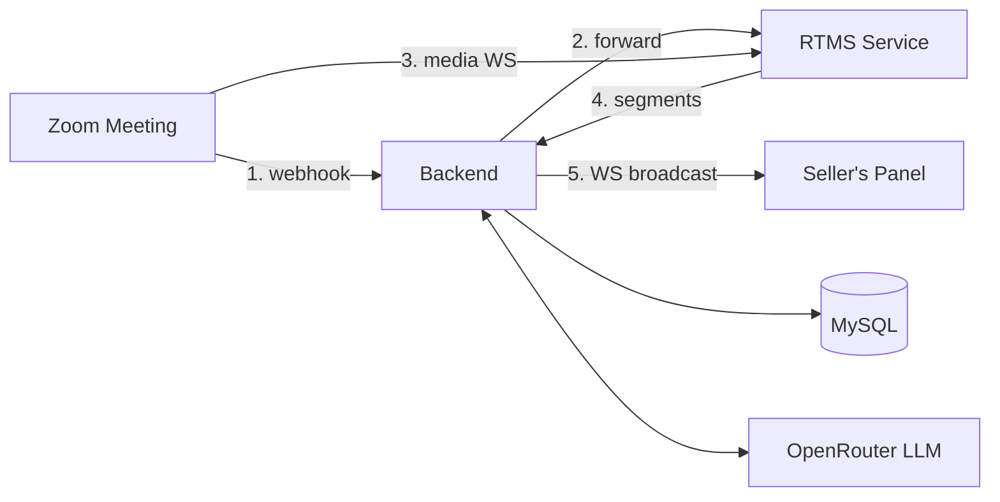

Give every sales rep a coach that sits inside the meeting. This blueprint builds an in-meeting panel that reads the live transcript and tracks deal qualification, competitor mentions, and commitments while the conversation is happening, so reps respond to objections in the moment and managers coach without watching every call.

Most coaching arrives after the call, once a manager has reviewed the recording. By then the prospect has moved on, and the competitor may have already followed up. The value of that feedback decays by the hour.

The build uses **RTMS** (Real-Time Media Streams) to stream the live transcript straight from Zoom's infrastructure, with no bot joining the call, and a **Zoom App** panel that only the seller sees. It's based on [Arlo](https://github.com/zoom/arlo), an open-source meeting assistant with a sales mode. Arlo provides the transcript pipeline, the panel UI, and the AI plumbing; this guide walks through how each piece works, then builds the live sales intelligence on top of them.

## Features

The finished application:

- Streams live meeting transcripts over RTMS, with no bot participant in the roster
- Tracks deal qualification (budget, authority, need, timeline) with a live score, detected signals, and suggested discovery questions
- Watches a configurable competitor list and logs each mention with sentiment
- Captures commitments and next steps as they're spoken
- Alerts the rep to filler-word streaks in real time
- Generates summaries, action items, and transcript Q&A from the same stream

Arlo ships the sales panels pre-filled with demo data so you can explore the target experience in any meeting. The [Implementation Guide](#implementation-guide) below replaces that demo data with live AI extraction.

<div align="center">
  
  
</div>

Watch a 3-minute demo of the sales coaching experience:

[](https://www.youtube.com/watch?v=LKpZAe5_A8o)

---

## Architecture

### The No-Bot Advantage

Traditional meeting assistants join as participants, which means an unfamiliar name in the roster and a "who invited that?" moment at the top of the call. On a sales call, that changes the dynamic.

RTMS streams the transcript directly from Zoom's infrastructure, so nothing joins the meeting. The standard transcription notice still appears, but the roster shows only the people in the conversation. The seller sees the coaching panel as a Zoom App sidebar; the prospect's view doesn't change.

### Three Services

Arlo is an npm-workspaces monorepo with three services plus a MySQL database:

| Service | Stack | Responsibility |
|---------|-------|----------------|
| `frontend/` | React 18 + Zoom Apps SDK | The Surface App panel: live transcript, sales workspace, vertical-specific features |
| `backend/` | Express + Prisma (MySQL) | OAuth (PKCE), REST API, WebSocket broadcast to panels, AI orchestration via OpenRouter |
| `rtms/` | `@zoom/rtms` SDK | Joins RTMS streams, receives transcript callbacks, hands segments to the backend |



When RTMS starts in a meeting, Zoom sends a webhook to the backend, which verifies it and forwards it to the RTMS service. The RTMS service opens the media WebSocket to Zoom and receives transcript segments as each phrase is spoken. Segments flow to the backend, which broadcasts them to the seller's panel over its own WebSocket and persists them in the background. End-to-end latency is under a second, which is fast enough to coach with.

### The Intelligence Layer

The backend is the orchestration point, and it's yours to customize: swap LLM providers, add CRM integrations, or route competitor mentions to Slack. Arlo calls models through [OpenRouter](https://openrouter.ai/) (free models work without an API key; premium models like Claude or GPT-4o need one), and all AI features follow the same shape:

1. **Collect** recent transcript context from the live segment stream
2. **Extract** with a structured-output prompt that returns JSON
3. **Deliver** the parsed result to the panel

The sales extraction you'll build in the Implementation Guide follows the exact pattern Arlo's healthcare vertical already uses for live SOAP-note extraction.

---

## Implementation Guide

This guide has three parts: how Arlo's transcript pipeline works (the real code, so you can rebuild the pattern in your own stack), how to build the sales intelligence layer on top of it, and a condensed setup section to run the sample.

### Part 1: How the Transcript Pipeline Works

#### Verify and route the webhook

When a user starts transcription, Zoom sends `meeting.rtms_started` to the backend's webhook endpoint. Before anything else, the backend proves the request came from Zoom: an HMAC-SHA256 signature over `v0:{timestamp}:{rawBody}` using your app's webhook secret token, with a five-minute replay window and a timing-safe comparison. From [`backend/src/routes/rtms.js`](https://github.com/zoom/arlo/blob/main/backend/src/routes/rtms.js):

```javascript
function verifyWebhookSignature(rawBody, timestamp, signature) {
  const secret = config.zoomWebhookToken;
  if (!signature || !timestamp) return false;

  // Reject if timestamp is more than 5 minutes old (replay protection)
  const now = Math.floor(Date.now() / 1000);
  const reqTimestamp = parseInt(timestamp, 10);
  if (isNaN(reqTimestamp) || Math.abs(now - reqTimestamp) > 300) return false;

  const message = `v0:${timestamp}:${rawBody.toString('utf8')}`;
  const expectedSignature = 'v0=' + crypto
    .createHmac('sha256', secret)
    .update(message)
    .digest('hex');

  if (signature.length !== expectedSignature.length) return false;
  return crypto.timingSafeEqual(Buffer.from(signature), Buffer.from(expectedSignature));
}
```

Two details matter here. The route uses `express.raw()` because the signature is computed over the exact bytes Zoom sent; re-serialized JSON would produce a different signature. And Zoom's `endpoint.url_validation` challenge is handled before signature verification, since validation requests carry no signature.

The backend then forwards verified `rtms_started`/`rtms_stopped` events to the RTMS service over the internal Docker network with an `x-arlo-internal` header, so the RTMS service can trust them without re-verifying reserialized bytes.

#### Join the stream

The RTMS service creates one `@zoom/rtms` client per stream and registers its transcript handler before joining. From [`rtms/src/index.js`](https://github.com/zoom/arlo/blob/main/rtms/src/index.js):

```javascript
const rtmsModule = require('@zoom/rtms');
const rtms = rtmsModule.default;

async function handleRTMSStarted(payload) {
  const { meeting_uuid, rtms_stream_id, server_urls } = payload;

  // Same stream ID again means a duplicate webhook: ignore it
  if (activeSessions.has(rtms_stream_id)) return;

  const client = new rtms.Client();

  // Register handlers BEFORE joining
  client.onTranscriptData((data, size, timestamp, metadata) => {
    const text = data.toString('utf-8');
    handleTranscript(meeting_uuid, {
      text,
      timestamp,                  // microseconds, Zoom-provided
      userId: metadata?.userId,
      userName: metadata?.userName,
    }).catch(err => console.error('Error handling transcript:', err));
  });

  client.onLeave(() => activeSessions.delete(rtms_stream_id));

  activeSessions.set(rtms_stream_id, {
    client,
    meetingUuid: meeting_uuid,
    seqCounter: 0,              // per-session transcript sequence numbers
    startTime: new Date(),
  });

  client.join({ meeting_uuid, rtms_stream_id, server_urls });
}
```

Sessions are keyed by `rtms_stream_id`, not `meeting_uuid`, and that choice carries the failover logic: if Zoom's media server fails over, the same meeting arrives with a new stream ID, so the service tears down the old session and joins the new one. A repeated stream ID is a duplicate webhook and gets ignored. The service also handles `meeting.rtms_interrupted` by cleaning up and waiting for Zoom to send a fresh `rtms_started` when reconnection is possible.

#### Normalize and hand off

Each transcript callback becomes a segment with a per-session sequence number and millisecond timestamps (Zoom sends microseconds):

```javascript
async function handleTranscript(meetingId, transcript) {
  const { text, timestamp, userId, userName } = transcript;
  const session = findSessionByMeetingUuid(meetingId)?.session;
  const seqNo = session ? ++session.seqCounter : Date.now();
  const tStartMs = typeof timestamp === 'number' ? Math.floor(timestamp / 1000) : Date.now();

  const segment = {
    speakerId: userId ? String(userId) : 'unknown',
    speakerLabel: userName || (userId ? `Speaker ${userId}` : 'Speaker'),
    text: text || '',
    tStartMs,
    tEndMs: tStartMs,
    seqNo,
  };

  await broadcastSegment(meetingId, segment);  // POST to backend /api/rtms/broadcast
}
```

#### Broadcast first, persist in the background

The backend prioritizes latency: it pushes each segment to connected panels immediately and saves to the database asynchronously. Ordering and duplicates are handled by the sequence number rather than buffering. The `TranscriptSegment` table has a unique constraint on `(meetingId, seqNo)`, and writes are upserts, so retries and duplicate deliveries are idempotent:

```javascript
router.post('/broadcast', async (req, res) => {
  const { meetingId, segment } = req.body;

  // Broadcast to WebSocket clients immediately
  const sentCount = broadcastTranscriptSegment(meetingId, segment);

  // Save in the background; don't block the response
  saveTranscriptSegment(meetingId, segment).catch(err => {
    console.error('Failed to save transcript segment:', err.message);
  });

  res.status(200).json({ received: true, broadcast: sentCount });
});

// Inside saveTranscriptSegment: idempotent write keyed by sequence number
await prisma.transcriptSegment.upsert({
  where: { meetingId_seqNo: { meetingId: dbMeetingId, seqNo: BigInt(segment.seqNo) } },
  create: { meetingId: dbMeetingId, speakerId: speaker?.id, tStartMs, tEndMs,
            seqNo: BigInt(segment.seqNo), text: segment.text || '' },
  update: { text: segment.text || '', tEndMs },
});
```

#### Deliver to the panel

The backend runs a WebSocket server (in [`backend/src/services/websocket.js`](https://github.com/zoom/arlo/blob/main/backend/src/services/websocket.js)) that requires a JWT on every connection; there is no anonymous access. The protocol is small:

```
Connection:      ws://host/ws?meeting_id={uuid}&token={jwt}
Client → Server: { type: 'subscribe', meetingId }
Server → Client: { type: 'transcript.segment', data: { meetingId, segment } }
Server → Client: { type: 'meeting.status',     data: { meetingId, status } }
```

The React panel subscribes on mount and appends segments in `seqNo` order, which is why the pipeline doesn't need a reorder buffer.

### Part 2: Build the Sales Intelligence Layer

Arlo's sales panels (`frontend/src/features/sales/`) ship wired to demo data behind a `showDemoData` flag, so the UI is ready but the detection is not. The healthcare vertical shows the live pattern to follow: `SOAPNotesPanel` posts recent transcript to an extraction endpoint on a debounce and merges the structured result into panel state. This section builds the same loop for sales.

#### Add the extraction service

Add a `extractSalesSignals` function to [`backend/src/services/openrouter.js`](https://github.com/zoom/arlo/blob/main/backend/src/services/openrouter.js), following the house pattern (`callOpenRouter`, strip code fences, parse JSON with a safe fallback):

```javascript
/**
 * Extract sales signals from a live sales-call transcript
 * @param {string} transcript - Recent transcript text
 * @param {object} currentState - Current qualification state (for incremental updates)
 * @param {string[]} watchList - Competitor names to watch for
 * @returns {Promise<object>} Qualification, competitor, and commitment signals
 */
async function extractSalesSignals(transcript, currentState = {}, watchList = []) {
  const systemPrompt = `You are a real-time sales coaching assistant analyzing a live sales call.
Extract three kinds of signals from the transcript.

1. Qualification (budget, authority, need, timeline). For each criterion:
   - status: "confirmed" | "unclear" | "missing" | "unknown"
   - signals: array of { "text": "the relevant quote", "seqNo": number or null }
2. Competitor mentions. Watch list: ${JSON.stringify(watchList)}.
   Also detect competitors not on the list. For each mention:
   { "name": "competitor", "text": "the quote", "sentiment": "positive|negative|neutral|mixed" }
3. Commitments and next steps, from either side:
   { "text": "what was committed", "owner": "who said it", "due": "timeframe or null" }

Format your response as JSON:
{
  "qualification": { "budget": {...}, "authority": {...}, "need": {...}, "timeline": {...} },
  "competitors": [...],
  "commitments": [...]
}
Only report signals actually present in the transcript. Only output valid JSON, no markdown.`;

  const prompt = `Recent transcript:

${transcript}

${Object.keys(currentState).length ? `Current qualification state (update, don't regress confirmed criteria):
${JSON.stringify(currentState)}` : ''}`;

  try {
    const response = await callOpenRouter(prompt, systemPrompt, { maxTokens: 1536 });
    const cleaned = response.replace(/^```(?:json)?\s*\n?/i, '').replace(/\n?```\s*$/i, '').trim();
    try {
      const parsed = JSON.parse(cleaned);
      return {
        qualification: parsed.qualification || {},
        competitors: Array.isArray(parsed.competitors) ? parsed.competitors : [],
        commitments: Array.isArray(parsed.commitments) ? parsed.commitments : [],
      };
    } catch {
      console.warn('⚠️ Could not parse sales signals JSON');
      return { qualification: {}, competitors: [], commitments: [] };
    }
  } catch (error) {
    console.error('❌ Sales signal extraction failed:', error.message);
    throw error;
  }
}

// Add to module.exports
module.exports = { /* ...existing exports... */ extractSalesSignals };
```

#### Expose the route

Add the endpoint to [`backend/src/routes/ai.js`](https://github.com/zoom/arlo/blob/main/backend/src/routes/ai.js), mirroring the existing `/extract-soap` route:

```javascript
const { extractSalesSignals } = require('../services/openrouter');

/**
 * POST /api/ai/sales-signals
 * Extract qualification, competitor, and commitment signals from live transcript
 */
router.post('/sales-signals', optionalAuth, async (req, res) => {
  const { transcript, currentState, watchList } = req.body;

  if (!config.aiEnabled) {
    return res.status(503).json({ error: 'AI features are disabled' });
  }
  if (!transcript || typeof transcript !== 'string' || transcript.trim().length < 50) {
    return res.status(400).json({ error: 'transcript is required (min 50 chars)' });
  }

  try {
    const signals = await extractSalesSignals(
      transcript.trim(),
      currentState || {},
      Array.isArray(watchList) ? watchList : []
    );
    res.json(signals);
  } catch (error) {
    console.error('❌ Sales signal extraction error:', error.message);
    res.status(500).json({ error: 'Sales signal extraction failed' });
  }
});
```

#### Wire the panels

On the frontend, extract the live loop into a hook and feed the three sales panels from it. The debounce matters: you want analysis roughly every 30 seconds of new conversation, not on every segment.

```javascript
// frontend/src/features/sales/useSalesSignals.js
import { useState, useEffect, useRef, useCallback } from 'react';

const ANALYZE_DEBOUNCE_MS = 30000;

export default function useSalesSignals(segments, isLive, watchList) {
  const [signals, setSignals] = useState({ qualification: {}, competitors: [], commitments: [] });
  const lastProcessedCount = useRef(0);

  const analyze = useCallback(async () => {
    if (!segments?.length || segments.length === lastProcessedCount.current) return;

    const transcript = segments
      .slice(-100)  // recent context is enough; the prompt carries prior state
      .map(s => `[${s.speakerLabel}]: ${s.text}`)
      .join('\n');

    try {
      const res = await fetch('/api/ai/sales-signals', {
        method: 'POST',
        headers: { 'Content-Type': 'application/json' },
        credentials: 'include',
        body: JSON.stringify({ transcript, currentState: signals.qualification, watchList }),
      });
      if (!res.ok) return;
      const data = await res.json();
      setSignals(prev => ({
        qualification: { ...prev.qualification, ...data.qualification },
        competitors: mergeMentions(prev.competitors, data.competitors),
        commitments: dedupeByText(prev.commitments, data.commitments),
      }));
      lastProcessedCount.current = segments.length;
    } catch (err) {
      console.error('Sales signal fetch failed:', err);
    }
  }, [segments, signals.qualification, watchList]);

  useEffect(() => {
    if (!isLive || segments.length === 0) return;
    const timer = setTimeout(analyze, ANALYZE_DEBOUNCE_MS);
    return () => clearTimeout(timer);
  }, [segments.length, isLive, analyze]);

  return signals;
}
```

Then pass live data into the existing components in `InMeetingView` instead of their demo state: `QualificationSignals` takes the qualification map, `CompetitorMentions` takes the mention list, and `CommitmentsPanel` takes the commitments, with `showDemoData` switched off for the sales vertical. Each detected signal carries a `seqNo` when the model can identify one, which is what makes the "jump to transcript" links work.

#### Tune the extraction

The system prompt in `extractSalesSignals` is the customization point. To coach against MEDDIC or SPICED instead of BANT, change the criteria list in the prompt and the `QUALIFICATION_CRITERIA` array in `frontend/src/features/sales/QualificationSignals.js`, which also holds the suggested discovery questions per criterion. The competitor watch list is user-editable in the panel and flows through the request body, so battlecard-style responses can key off the `name` field in each mention.

### Part 3: Run the Sample

#### One-click deploy

| Platform | What you get |
|----------|--------------|
| [Deploy to Render](https://render.com/deploy?repo=https://github.com/zoom/arlo) | Backend, frontend, RTMS service, managed database |
| [Deploy to Railway](https://railway.app/new?repo=https://github.com/zoom/arlo) | Backend, frontend, RTMS service, managed database |

Both platforms offer free tiers. After deploying, create a Zoom App in the [Marketplace](https://marketplace.zoom.us/) (next section), add `ZOOM_CLIENT_ID`, `ZOOM_CLIENT_SECRET`, and `ZOOM_WEBHOOK_TOKEN` to the environment, and point your app's OAuth redirect URL at the deployed backend.

#### Local setup

| Requirement | Purpose |
|-------------|---------|
| [Node.js 20+](https://nodejs.org/) | Runtime for all three services |
| [Docker Desktop](https://www.docker.com/products/docker-desktop/) | Runs MySQL, Redis, and the services |
| [ngrok](https://ngrok.com/) | Public HTTPS URL for Zoom webhooks and the app |
| [Zoom account](https://marketplace.zoom.us/) | To create and configure your Zoom App |
| RTMS access | [Request access](https://www.zoom.com/en/realtime-media-streams/#form) if you don't have it |

1. **Clone and configure.**

   ```bash
   git clone https://github.com/zoom/arlo.git
   cd arlo
   cp .env.example .env
   ```

2. **Start ngrok** and note your URL. A [free static domain](https://dashboard.ngrok.com/domains) saves reconfiguring on every restart.

   ```bash
   ngrok http 3000 --domain=your-subdomain.ngrok-free.app
   ```

3. **Create your Zoom App.** In the [Marketplace](https://marketplace.zoom.us/), go to **Develop** > **Build App** > **General App**. Then configure:
   - **OAuth Redirect URL:** `https://YOUR-NGROK-URL/api/auth/callback`
   - **Scopes:** `meeting:read:meeting`; optionally `user:read` and `meeting:write:open_app`
   - **Zoom App SDK:** add the SDK APIs, then enable **RTMS** > **Transcripts**
   - **Surface:** Home URL `https://YOUR-NGROK-URL`; add `appssdk.zoom.us` to the domain allow list
   - **Event Subscriptions:** endpoint `https://YOUR-NGROK-URL/api/rtms/webhook`, events `meeting.rtms_started` and `meeting.rtms_stopped`; copy the **Secret Token**

4. **Fill in `.env`.** From the Marketplace: `ZOOM_CLIENT_ID`, `ZOOM_CLIENT_SECRET`, and `ZOOM_WEBHOOK_TOKEN` (the Event Subscriptions secret token, not the client secret). Set `PUBLIC_URL` to your ngrok URL, then generate the two security keys:

   ```bash
   # SESSION_SECRET and TOKEN_ENCRYPTION_KEY (run once each)
   node -e "console.log(require('crypto').randomBytes(32).toString('hex'))"
   ```

   An `OPENROUTER_API_KEY` is optional; free models work without one at lower rate limits.

5. **Start everything and test.**

   ```bash
   docker-compose up --build
   ```

   Services come up on MySQL 3306, backend 3000, frontend 3001, RTMS 3002 (internal only). Then start a Zoom meeting, open **Apps** in the toolbar, open your app, pick the **Sales** vertical, and start transcription. Arlo supports five verticals (Notes, Healthcare, Legal, Sales, Support); switch anytime from Settings. Demo data is on by default so the panels are full immediately; turn it off in Settings once your live extraction from Part 2 is wired in.

---

## App Manifest

The [`manifest.json`](./manifest.json) in this directory follows the Zoom App manifest schema and pre-configures a sales coaching app: OAuth scopes, Surface App capabilities, RTMS transcript access, and event subscriptions. Upload it when creating your app (manifest support is in beta) to skip most of the manual Marketplace configuration, replacing the placeholder URLs first.

### Scopes

| Scope | Required | Purpose |
|-------|----------|---------|
| `zoomapp:inmeeting` | Yes | Render the panel inside meetings |
| `meeting:read:meeting` | Yes | Meeting metadata and the upcoming-meetings list |
| `user:read` | Optional | Profile info; without it, Arlo decodes the user from the access token |
| `meeting:write:open_app` | Optional | Auto-open the app when a meeting starts |

### RTMS Configuration

RTMS access is a Zoom App SDK feature, configured separately from OAuth scopes: in your app settings, go to **Features** > **Zoom App SDK**, enable **Real-Time Media Streams**, and select **Transcripts**. Audio and video streams are also available but not needed for this blueprint. RTMS requires access approval from Zoom.

### Event Subscriptions

| Event | When it fires |
|-------|---------------|
| `meeting.rtms_started` | Transcription begins; payload carries the stream ID and media server URLs |
| `meeting.rtms_stopped` | Transcription ends |

The webhook endpoint is `/api/rtms/webhook` on the backend, which verifies the HMAC signature (Part 1) before acting on either event.

### Structure

The manifest follows Zoom's real schema. The relevant sections, trimmed:

```json
{
  "display_information": {
    "display_name": "Sales Coach",
    "description": "Real-time sales coaching powered by RTMS transcription"
  },
  "oauth_information": {
    "usage": "USER_OPERATION",
    "development_redirect_uri": "https://YOUR-NGROK-URL/api/auth/callback",
    "scopes": [
      { "scope": "zoomapp:inmeeting", "optional": false },
      { "scope": "meeting:read:meeting", "optional": false },
      { "scope": "user:read", "optional": true }
    ]
  },
  "features": {
    "products": ["ZOOM_MEETING"],
    "in_client_feature": {
      "zoom_app_api": { "enable": true, "zoom_app_apis": ["getMeetingContext", "getMeetingUUID", "..."] }
    },
    "event_subscription": {
      "enable": true,
      "events": ["meeting.rtms_started", "meeting.rtms_stopped"]
    }
  }
}
```

See the full [`manifest.json`](./manifest.json) here, or Arlo's own [`zoom-app-manifest.json`](https://github.com/zoom/arlo/blob/main/zoom-app-manifest.json) for the complete SDK API list.

---

<details>
<summary><strong>Production Considerations</strong></summary>

Arlo is a reference implementation designed for learning and prototyping. Before deploying to production:

| Area | Development | Production |
|------|-------------|------------|
| **Credentials** | `.env` file | Secrets manager (AWS, Vault, Azure) |
| **Token storage** | AES-256-GCM in MySQL (built in) | Same, plus key rotation policy |
| **PKCE + sessions** | In-memory store | Redis; the in-memory store doesn't survive restarts or scale to replicas |
| **WebSockets** | Single instance | Set `REDIS_URL` to enable pub/sub broadcast across instances |
| **HTTPS** | ngrok tunnel | Load balancer with TLS termination |

Transcript data may contain sensitive business information. Plan retention policies aligned with your compliance requirements, user controls for deleting meeting data, and encryption at rest. Arlo already gates transcript logging behind `LOG_LEVEL=debug`, enforces per-user row ownership on every meeting query, and keeps the RTMS service off the public network; keep those properties as you customize.

</details>

---

## Related Resources

- [Arlo Repository](https://github.com/zoom/arlo) - Full source code and documentation
- [RTMS Documentation](https://developers.zoom.us/docs/rtms/) - API reference for Real-Time Media Streams
- [Zoom Apps SDK](https://developers.zoom.us/docs/zoom-apps/) - Building in-meeting experiences
- [Zoom Developer Forum](https://devforum.zoom.us/) - Community support and discussions

---

## What Will You Build?

This blueprint shows one path: real-time sales coaching delivered through a Surface App. The same architecture supports many variations:

- Push qualification signals to your CRM instead of (or in addition to) the in-meeting panel
- Route competitor mentions to Slack for immediate team awareness
- Feed conversation context to an autonomous agent that drafts follow-up emails
- Build a manager dashboard that shows live deal health across all active calls
