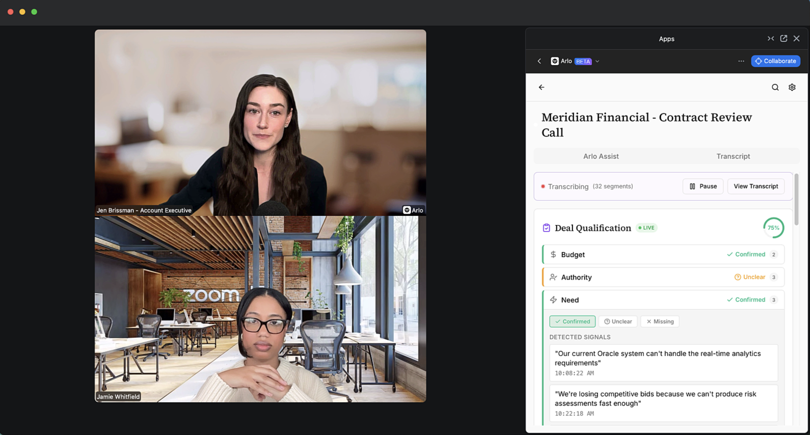
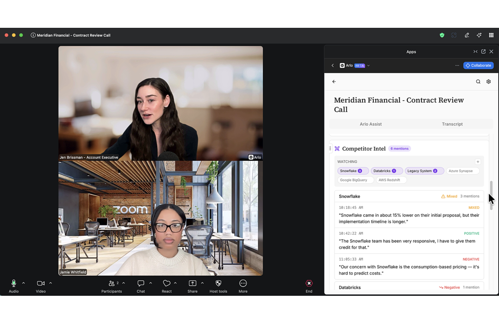
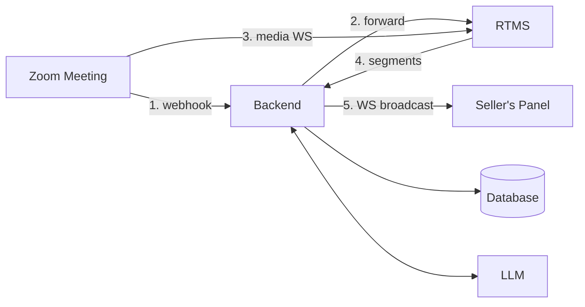

A real-time sales coach streams meeting transcripts from RTMS, passes them to an LLM, and displays qualification signals, competitor mentions, and next-step prompts in a panel visible only to the seller. The rep sees coaching cues while the prospect is still talking.

Sales coaching usually happens after the call, once a manager reviews the recording. By then the deal has moved on. A real-time coach catches those signals while the rep can still act.

**What you'll need:**

- Transcript access via [RTMS](https://developers.zoom.us/docs/rtms/) ([pricing](https://zoom.us/pricing/developer))
- A backend to receive webhooks, persist transcripts, and call an LLM (Node/Express in this guide; any stack works)
- A [Zoom Surface App](https://developers.zoom.us/docs/zoom-apps/guides/building-a-surface/) to render the coaching panel in-meeting
- An LLM for signal extraction (OpenRouter, OpenAI, Anthropic, or self-hosted)

**Features:**

- Live transcript stream with sub-second latency
- Deal qualification tracker (BANT, MEDDIC, or custom criteria) with detected signals and suggested questions
- Competitor mention detection with sentiment and configurable watch list
- Commitment and next-step capture as they're spoken
- Filler-word alerts
- Post-call summary and action items

If you'd rather buy than build, Zoom offers [AI Companion](https://zoom.us/ai) and [Revenue Accelerator](https://zoom.us/revenue-accelerator) with similar capabilities.

Follow along as we walk through the architecture.

<div align="center">
  
  
</div>

[Watch a 3-minute demo](https://www.youtube.com/watch?v=LKpZAe5_A8o)

---

## Architecture

RTMS streams transcripts directly from Zoom's infrastructure. The transcript appears in the seller's panel without a separate participant joining the meeting. The standard transcription notice displays; the roster stays clean.

### Components

| Component | Responsibility | Our stack (yours may differ) |
|-----------|----------------|------------------------------|
| **Transcript access** | Receive RTMS webhooks, join streams, normalize segments | Node service using `@zoom/rtms` SDK |
| **Backend** | Persist transcripts, orchestrate LLM calls, broadcast to clients | Express + Prisma (MySQL) + OpenRouter |
| **Frontend** | Display transcript, qualification tracker, competitor mentions | React Surface App via Zoom Apps SDK |



When transcription starts, Zoom sends a webhook to the backend. The backend verifies it, forwards it to the RTMS service, which opens a WebSocket to Zoom and receives transcript segments phrase by phrase. Segments flow to the backend, which broadcasts them to the panel and persists them. End-to-end latency is under a second.

**Our stack vs. your options:** We use Node/Express, but Python/FastAPI, Go, or Ruby work the same way. The requirements are a webhook endpoint Zoom can reach, a WebSocket client for RTMS, an LLM, and a way to push updates to the frontend.

### How extraction works

The backend collects recent transcript context, sends it to an LLM with a structured-output prompt, parses the JSON response, and pushes the result to the panel. We use [OpenRouter](https://openrouter.ai/) (free models work without an API key; Claude or GPT-4o need one). All extraction features follow the same pattern:

1. Collect recent transcript segments
2. Prompt the LLM for structured JSON output
3. Parse and broadcast the result

### Agent integration map

If you're grafting this into an existing codebase, check what you already have before adding anything:

| Required capability | Reuse when present | Add when missing |
|--------------------|--------------------|------------------|
| Webhook endpoint | Existing API routes | Express router or equivalent |
| Signature verification | Existing HMAC middleware | `verifyWebhookSignature()` |
| WebSocket server | Existing real-time layer | ws or Socket.io server |
| Database | Existing Postgres/MySQL | Prisma schema for transcripts |
| LLM client | Existing OpenAI/Anthropic setup | OpenRouter client |
| Auth/JWT | Existing session tokens | JWT signing for WebSocket auth |

---

## Implementation Guide

Three parts: the transcript pipeline, the sales intelligence layer, and running the reference implementation.

Code examples are from [Arlo](https://github.com/zoom/arlo), but the patterns transfer to any stack.

### Part 1: Building the Transcript Pipeline

#### Verify the webhook

When transcription starts, Zoom sends `meeting.rtms_started` to your webhook endpoint. Verify the request came from Zoom: compute an HMAC-SHA256 signature over `v0:{timestamp}:{rawBody}` using your webhook secret token, enforce a five-minute replay window, and use timing-safe comparison.

```javascript
function verifyWebhookSignature(rawBody, timestamp, signature) {
  const secret = config.zoomWebhookToken;
  if (!signature || !timestamp) return false;

  const now = Math.floor(Date.now() / 1000);
  const reqTimestamp = parseInt(timestamp, 10);
  if (isNaN(reqTimestamp) || Math.abs(now - reqTimestamp) > 300) return false;

  const message = `v0:${timestamp}:${rawBody.toString('utf8')}`;
  const expectedSignature = 'v0=' + crypto
    .createHmac('sha256', secret)
    .update(message)
    .digest('hex');

  if (signature.length !== expectedSignature.length) return false;
  return crypto.timingSafeEqual(Buffer.from(signature), Buffer.from(expectedSignature));
}
```

Use `express.raw()` to preserve the exact bytes Zoom sent; re-serialized JSON produces a different signature. Handle Zoom's `endpoint.url_validation` challenge before signature verification, since validation requests carry no signature.

**Other languages:** In Python, use `hmac.compare_digest`; in Go, use `crypto/subtle.ConstantTimeCompare`.

#### Stream session management

**Input:** `meeting.rtms_started` webhook payload with `meeting_uuid`, `rtms_stream_id`, `server_urls`

**Output:** Active RTMS session registered, client connected, transcript handler receiving segments

**Invariants:**

- Deduplicate by `rtms_stream_id`, not `meeting_uuid`
- If same meeting arrives with new stream ID (media server failover), tear down old session and join new
- Register transcript handlers before calling `join()`
- Clean up session on `onLeave` callback
- Track sequence counter per session for segment ordering

**Other languages:** The `@zoom/rtms` SDK is Node-only. For other stacks, implement the WebSocket protocol directly; the [RTMS documentation](https://developers.zoom.us/docs/rtms/) covers the wire format.

See [Arlo's RTMS service](https://github.com/zoom/arlo/tree/main/services/rtms) for the reference implementation.

#### Transcript segment handling

**Input:** Raw transcript callback with `text`, `timestamp` (microseconds), `userId`, `userName`

**Output:** Normalized segment with `speakerId`, `speakerLabel`, `text`, `tStartMs`, `seqNo`

**Invariants:**

- Assign monotonic sequence number per session
- Convert timestamp from microseconds to milliseconds
- Broadcast to clients immediately (don't block on persistence)
- Persist asynchronously with upsert on `(meetingId, seqNo)` for idempotency
- Handle missing userId/userName gracefully with defaults

**Other databases:** Works with Postgres, MongoDB, or a time-series database.

#### WebSocket delivery

**Input:** Client connection with `meeting_id` and JWT token

**Output:** Real-time transcript segments and extraction updates pushed to connected clients

**Invariants:**

- Require valid JWT on every connection
- Client sends `{ type: 'subscribe', meetingId }` after connecting
- Server broadcasts `{ type: 'transcript.segment', data }` and `{ type: 'sales_signals', data }`
- Clean up subscriptions on disconnect
- Panel appends segments in `seqNo` order

### Part 2: Building the Sales Intelligence Layer

With transcripts flowing, extract sales signals: qualification criteria, competitor mentions, and commitments.

#### Sales signal extraction

**Input:** Recent transcript context (last 100 segments or last N minutes), current qualification state, competitor watch list

**Output:** JSON with `qualification` (BANT status + signals), `competitors` (mentions + sentiment), `commitments` (task + owner + due)

**Invariants:**

- Run on debounce interval (30 seconds), not on every segment
- Track last processed sequence number to avoid redundant calls
- Parse JSON response, strip markdown fences if present
- Validate minimum transcript length before calling LLM
- Merge results incrementally (don't replace, dedupe by text)

**Prompt structure** (customize for MEDDIC, SPICED, or your criteria):

```
You are a sales coaching assistant analyzing a live call.
Extract:

1. Qualification (budget, authority, need, timeline). For each:
   - status: "confirmed" | "unclear" | "missing" | "unknown"
   - signals: array of { "text": "quote", "seqNo": number or null }
2. Competitor mentions. Watch list: [your competitors].
   { "name": "competitor", "text": "quote", "sentiment": "positive|negative|neutral" }
3. Commitments:
   { "text": "what was committed", "owner": "who", "due": "timeframe or null" }

Return JSON only:
{
  "qualification": { "budget": {...}, "authority": {...}, "need": {...}, "timeline": {...} },
  "competitors": [...],
  "commitments": [...]
}
```

**Other LLMs:** Works with OpenAI, Anthropic, or self-hosted models. For reliability, use the provider's JSON mode or function calling.

See [Arlo's AI routes](https://github.com/zoom/arlo/tree/main/backend/routes/ai) for the reference implementation.

#### Frontend state management

**Input:** WebSocket stream of segments and extraction updates

**Output:** React state for transcript, qualification tracker, competitor mentions, commitments

**Invariants:**

- Append segments in `seqNo` order
- Dedupe action items by task text
- Dedupe competitor mentions by quote text
- Show existing state on reconnect, then apply incremental updates
- Trigger extraction on debounce interval while `isLive` is true

**Other frameworks:** Works with Vue, Svelte, or vanilla JS. The Surface App runs inside the Zoom client via iframe; standard web tech applies.

### Part 3: Running the Reference Implementation ([Arlo](https://github.com/zoom/arlo))

Arlo implements everything above. Use it to see the patterns working, then fork or reference for your own build.

#### One-click deploy

| Platform | What you get |
|----------|--------------|
| [Deploy to Render](https://render.com/deploy?repo=https://github.com/zoom/arlo) | Backend, frontend, RTMS service, database |
| [Deploy to Railway](https://railway.app/new?repo=https://github.com/zoom/arlo) | Backend, frontend, RTMS service, database |

Both have free tiers. After deploying, create a Zoom App in the [Marketplace](https://marketplace.zoom.us/), add `ZOOM_CLIENT_ID`, `ZOOM_CLIENT_SECRET`, and `ZOOM_WEBHOOK_TOKEN`, and set the OAuth redirect URL to your backend.

#### Local setup

| Requirement | Purpose |
|-------------|---------|
| [Node.js 20+](https://nodejs.org/) | Runtime |
| [Docker Desktop](https://www.docker.com/products/docker-desktop/) | MySQL, Redis, services |
| [ngrok](https://ngrok.com/) | Public URL for webhooks |
| [Zoom account](https://marketplace.zoom.us/) | App configuration |
| RTMS access | [Request here](https://www.zoom.com/en/realtime-media-streams/#form) |

1. Clone and configure:
   ```bash
   git clone https://github.com/zoom/arlo.git && cd arlo && cp .env.example .env
   ```

2. Start ngrok:
   ```bash
   ngrok http 3000 --domain=your-subdomain.ngrok-free.app
   ```

3. Create your Zoom App at [marketplace.zoom.us](https://marketplace.zoom.us/):
   - OAuth Redirect URL: `https://YOUR-NGROK-URL/api/auth/callback`
   - Scopes: `meeting:read:meeting`
   - Zoom App SDK: enable RTMS > Transcripts
   - Surface: Home URL `https://YOUR-NGROK-URL`
   - Event Subscriptions: endpoint `https://YOUR-NGROK-URL/api/rtms/webhook`, events `meeting.rtms_started` and `meeting.rtms_stopped`

4. Fill `.env` with `ZOOM_CLIENT_ID`, `ZOOM_CLIENT_SECRET`, `ZOOM_WEBHOOK_TOKEN`, `PUBLIC_URL`. Generate secrets:
   ```bash
   node -e "console.log(require('crypto').randomBytes(32).toString('hex'))"
   ```

5. Start:
   ```bash
   docker-compose up --build
   ```

Services: MySQL 3306, backend 3000, frontend 3001, RTMS 3002. Join a meeting, open Apps, select your app, pick the Sales vertical, start transcription.

---

## App Manifest

The [`manifest.json`](./manifest.json) pre-configures OAuth scopes, Surface App capabilities, RTMS transcript access, and event subscriptions. Upload it when creating your app to skip manual configuration.

### Scopes

| Scope | Required | Purpose |
|-------|----------|---------|
| `zoomapp:inmeeting` | Yes | Render panel in meetings |
| `meeting:read:meeting` | Yes | Meeting metadata |
| `user:read` | Optional | Profile info |

### RTMS Configuration

In app settings: **Features** > **Zoom App SDK** > enable **Real-Time Media Streams** > select **Transcripts**. RTMS requires approval from Zoom.

### Event Subscriptions

| Event | Trigger |
|-------|---------|
| `meeting.rtms_started` | Transcription begins |
| `meeting.rtms_stopped` | Transcription ends |

---

<details>
<summary><strong>Production Considerations</strong></summary>

| Area | Development | Production |
|------|-------------|------------|
| Credentials | `.env` file | Secrets manager |
| Sessions | In-memory | Redis |
| WebSockets | Single instance | Redis pub/sub for horizontal scaling |
| HTTPS | ngrok | Load balancer with TLS |

Transcript data may contain sensitive information. Plan retention policies, user deletion controls, and encryption at rest.

</details>

---

## Acceptance Criteria

Use this checklist to verify the implementation:

- [ ] Webhook signature verification rejects invalid or stale requests
- [ ] Duplicate `rtms_stream_id` webhooks are ignored
- [ ] Stream failover (new `rtms_stream_id`, same meeting) tears down old session and joins new
- [ ] Transcript segments broadcast to clients before persisting to database
- [ ] WebSocket connections require valid JWT
- [ ] WebSocket cleanup runs on disconnect, navigation, and page unload
- [ ] LLM extraction runs on interval, not on every segment
- [ ] Extraction results parse as valid JSON and handle malformed responses
- [ ] Panel renders existing signals on connect and updates on new extractions
- [ ] No SDK credentials in client bundles or logs

---

## Related Resources

- [Arlo](https://github.com/zoom/arlo) - Reference implementation
- [RTMS Documentation](https://developers.zoom.us/docs/rtms/)
- [Zoom Apps SDK](https://developers.zoom.us/docs/zoom-apps/)
- [Zoom Developer Forum](https://devforum.zoom.us/)
