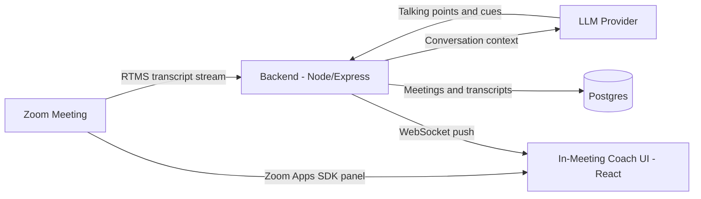

## Problem Statement

Sales coaching happens after the call — in reviews, recordings, and CRM
notes — when the deal has already moved on. The moment a prospect raises an
objection is exactly when a rep needs the right talk track, not the day
after. <!-- Expand: real use-case grounding (revenue intelligence pattern),
business outcome framing, why in-meeting beats post-call. -->

## Architecture

Arlo runs **as a Zoom App inside the meeting** — no bot joins the call.
**RTMS** streams the live transcript to the backend, which analyzes the
conversation and pushes coaching cues back into the in-meeting panel.

<!-- Expand: component walkthrough (RTMS webhook → WebSocket ingest, AI
     orchestration, coaching-cue loop), per docs/ARCHITECTURE.md in the
     arlo repo. -->

## Implementation Guide

<!-- Expand: numbered steps from the arlo Sales vertical — quick start,
     RTMS enablement, vertical selection, coaching prompt customization.
     Sales demo video: https://youtu.be/LKpZAe5_A8o -->

1. Clone [zoom/arlo](https://github.com/zoom/arlo) and follow the Quick
   Start to run the backend and Zoom App locally.

## App Manifest

The `manifest.json` in this directory mirrors arlo's `zoom-app-manifest.json`
— a Zoom App with in-meeting panel and RTMS-backed transcription scopes.
<!-- Expand: scope-by-scope explanation and one-click creation via the
     Marketplace manifests API. -->
