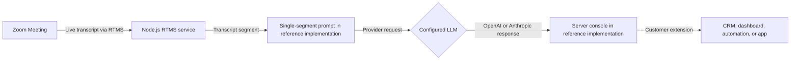

Teams often need answers during a meeting, not after the recording has been processed. A support lead may want help answering an objection. An operations team may want to spot a risk while the people in the meeting can still explain it. A post-meeting transcript arrives too late for either case.

[Zoom Realtime Media Streams (RTMS)](https://developers.zoom.us/docs/rtms/) sends live transcript text to your backend without adding a bot to the participant list. You choose the AI provider, write the prompt, decide how much conversation to include, and choose where the answer goes. This Blueprint includes paths for [OpenAI](https://developers.openai.com/api/docs/) and [Anthropic](https://docs.anthropic.com/), but the design is not tied to either provider.

The transcript is only the starting point. Change the prompt, send the answer to a CRM, start an automation, or show recommendations in your own app.

## Features

Use this checklist to confirm the full path works:

- Receive live transcript segments without adding a meeting participant.
- Keep Zoom and model-provider credentials on the backend.
- Send each model request with a defined prompt and bounded context.
- Keep model errors from interrupting the RTMS stream.
- Route the answer to a destination the customer controls.

## Architecture

### The reusable pattern

When RTMS starts, Zoom sends an event to your webhook. Your backend connects to RTMS and listens for transcript text. A production implementation collects enough conversation for the task, sends bounded context to the chosen model, and forwards the answer to an app or business system.

Keep provider credentials on the server. Never expose them in a browser or commit them to source control.

### How the reference implementation handles it

The linked [RTMS reference implementations](https://github.com/zoom/rtms-samples) use Node.js, Express, and RTMSManager. One calls OpenAI; the other calls Anthropic. Each implementation sends one incoming transcript segment to the provider and writes the answer to the server console. It does not keep conversation history or deliver answers to a CRM, dashboard, automation, or frontend. Those are the next layers you add for your use case.



## Implementation Guide

### Part 1: Build the transcript pipeline

#### 1. Choose a reference implementation

The RTMS repository contains two equivalent starting points:

| Provider | Reference code |
| --- | --- |
| OpenAI | [`transcript/send_transcript_to_openai_js`](https://github.com/zoom/rtms-samples/tree/main/transcript/send_transcript_to_openai_js) |
| Anthropic | [`transcript/send_transcript_to_claude_js`](https://github.com/zoom/rtms-samples/tree/main/transcript/send_transcript_to_claude_js) |

Use the Node.js version required by the reference implementation. Clone the repository, open the folder for your chosen provider, and install the dependencies.

```bash
git clone https://github.com/zoom/rtms-samples.git
cd rtms-samples/transcript/send_transcript_to_openai_js
npm install
```

The Anthropic path uses `send_transcript_to_claude_js` instead. Both implementations use the same RTMS pipeline, so a different language or framework still needs the same webhook, RTMS connection, transcript handler, and provider boundary.

#### 2. Create a Zoom General App

Create a General App in the [Zoom App Marketplace](https://marketplace.zoom.us/). Give it permission to read RTMS transcripts, then subscribe your public webhook to the RTMS start and stop events.

| Setting | Value |
| --- | --- |
| Scope | `meeting:read:meeting_transcript` |
| Events | `meeting.rtms_started`, `meeting.rtms_stopped` |
| Webhook URL | `https://YOUR_DOMAIN.example.com/webhook` |

Enable RTMS for the account and for the meeting used in the test. Import `manifest.json` as a starting point, then verify it in Marketplace before publishing.

#### 3. Configure server-side credentials

<details>
<summary><strong>Environment variables</strong></summary>

Create the local environment file expected by the selected implementation. Use placeholders in documentation and secret storage in deployed environments.

```dotenv
ZOOM_CLIENT_ID=YOUR_ZOOM_CLIENT_ID
ZOOM_CLIENT_SECRET=YOUR_ZOOM_CLIENT_SECRET
ZOOM_SECRET_TOKEN=YOUR_ZOOM_WEBHOOK_SECRET_TOKEN
OPENAI_API_KEY=YOUR_OPENAI_API_KEY
PORT=3000
WEBHOOK_PATH=/webhook
```

For the Anthropic implementation, replace `OPENAI_API_KEY` with `ANTHROPIC_API_KEY`. Keep the model name configurable so a maintained model can be selected without changing application code.

</details>

#### 4. Accept the webhook quickly

Check that every webhook request really came from Zoom and reply to it right away. Start the RTMS connection after sending the reply. Never make Zoom wait while you call the AI provider. Reject requests with an invalid signature or secret token.

#### 5. Receive transcript segments

Configure RTMSManager to receive transcripts. The reference implementation passes the `text` field directly to the model call. It does not include the speaker name, timestamp, or earlier conversation in the request.

Before using this pattern for meeting-wide analysis, decide which transcript events are final enough for your use case. Add the speaker name and timestamp when they help, and prevent duplicate or still-changing segments from starting repeated requests.

Limit the context by time, number of turns, or tokens. Without a limit, every request gets slower and more expensive as the meeting continues. Summarize older discussion when the agent needs a longer memory.

### Part 2: Add the analysis layer

#### 6. Call the selected model safely

The OpenAI implementation uses the Chat Completions API and a fixed model name in `chatWithOpenAI.js`. The Anthropic implementation follows the same shape in `chatWithClaude.js`. Move the model name, prompt, timeout, and output limit into configuration before adapting either implementation.

Give the model a clear task and ask for a predictable response format. Retry temporary failures only. If an answer can trigger an action, check it against a list of allowed actions first.

Do not send sensitive meeting content to a provider until the customer has approved the provider, region, retention policy, and data-processing terms.

#### 7. Add the customer destination

The reference implementation prints the answer to the server console. Replace that log statement with an adapter for your destination. The linked repository does not include a database, queue, CRM client, or frontend. Add only the components your workflow needs, and keep the model integration independent from the destination.

### Part 3: Run the reference implementation

#### 8. Start and verify end to end

Copy `.env.example` to `.env`, set the values, and run:

```bash
node index.js
```

Start the service, expose the webhook over HTTPS, start RTMS in a test meeting, and speak several complete sentences. Verify:

- The webhook receives both lifecycle events.
- Transcript segments retain their order and speaker context.
- Model failures do not disconnect the RTMS stream.
- No transcript or credential appears in unrestricted logs.
- The selected destination receives a useful, bounded response.

The repository does not include a tested deployment template for these two implementations. Deploy the Node.js service on a platform that supports a long-running HTTPS webhook process, then supply the Zoom credentials, provider key, public domain, and secret storage for that environment.

### Production considerations

- Put AI requests in a separate queue so a slow provider cannot block RTMS.
- Define consent, retention, deletion, and data-residency behavior before production use.
- Redact sensitive fields before provider calls when the use case permits it.
- Track end-to-end latency, model error rates, token usage, and dropped transcript segments.
- Treat model output as untrusted. Route high-impact actions through the customer's approval workflow.

## App Manifest

The [`manifest.json`](manifest.json) in this directory is a candidate Zoom General App manifest and pre-configures live transcript analysis: transcript scope, an OAuth callback placeholder, and RTMS lifecycle subscriptions. Import it when creating the app, replacing `YOUR_DOMAIN` first.

### Scopes

- `meeting:read:meeting_transcript`

### Event subscriptions

- `meeting.rtms_started`
- `meeting.rtms_stopped`

### Structure

The manifest contains the app name, description, transcript scope, OAuth callback placeholder, and a webhook endpoint with both lifecycle events. Provider credentials do not belong in the Zoom manifest.

Marketplace schema and account policy can change. The app owner must import the manifest in the target account, confirm the exact scope names and event subscriptions, review the requested permissions, and complete Marketplace validation before this Blueprint moves beyond draft.

## Related Resources

- [Zoom RTMS documentation](https://developers.zoom.us/docs/rtms/)
- [RTMS JavaScript SDK reference](https://zoom.github.io/rtms/js/)
- [OpenAI reference implementation](https://github.com/zoom/rtms-samples/tree/main/transcript/send_transcript_to_openai_js)
- [Anthropic reference implementation](https://github.com/zoom/rtms-samples/tree/main/transcript/send_transcript_to_claude_js)

## What Will You Build?

This Blueprint shows one path: live transcript segments sent to OpenAI or Anthropic, with responses written to the server console. The same architecture supports many variations:

- Flag support risks in a dashboard while the meeting is active.
- Draft structured CRM notes from bounded transcript context.
- Route an approved action to an automation.
- Replace the provider without changing RTMS ingestion.
- Deliver answers to a Zoom App or another customer-owned interface.

RTMS provides the live transcript. The prompt, model, and destination are yours to build.
