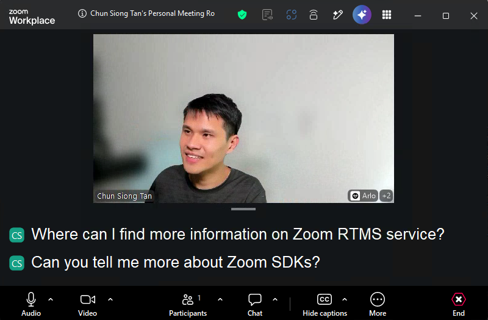
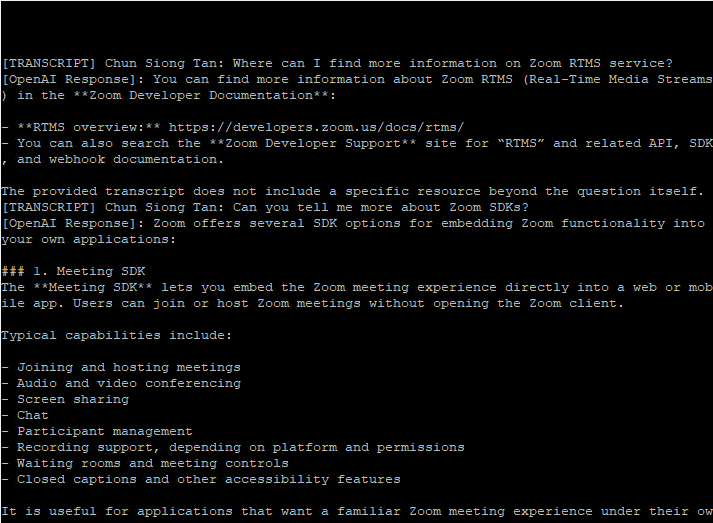
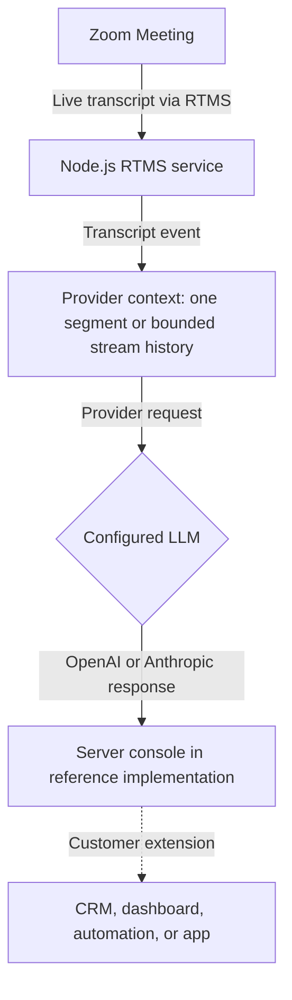

Build a live analysis path that turns meeting speech into useful answers while the conversation is still happening. A support lead can investigate an objection immediately. An operations team can flag a risk while the people in the meeting can still explain it.

[Zoom Realtime Media Streams (RTMS)](https://developers.zoom.us/docs/rtms/) sends live transcript text to your backend without adding a bot to the participant list. You choose the AI provider, write the prompt, decide how much conversation to include, and choose where the answer goes. This Blueprint includes paths for [OpenAI](https://developers.openai.com/api/docs/) and [Anthropic](https://docs.anthropic.com/), but the design is not tied to either provider.

The transcript is only the starting point. Change the prompt, send the answer to a CRM, start an automation, or show recommendations in your own app.

**What you'll need:**

- A [Zoom Developer Pack](https://zoom.us/pricing/developer) with RTMS transcript access
- A backend that can receive webhooks and maintain one session per RTMS stream
- An OpenAI or Anthropic account, or another approved model provider
- A destination for the results, such as a dashboard, CRM, or automation

**Features:**

- Receive live transcript segments without adding a meeting participant.
- Keep Zoom and model-provider credentials on the backend.
- Send each OpenAI request with a defined prompt and one transcript segment.
- Keep Claude conversation history isolated by RTMS stream and within configured size limits.
- Keep model errors from interrupting the RTMS stream.
- Route the answer to a destination the customer controls.

If you need built-in meeting summaries and questions answered from meeting content, [Zoom AI Companion](https://zoom.us/ai) may meet the need without a custom model pipeline. Build this workflow when you need your own provider, prompt, destination, or data policy.

Follow along as we walk through the architecture.

The reference implementations show the live Zoom Meeting transcript and the
model response produced from that transcript.

<div align="center">
  
  
</div>

## Architecture

### The reusable pattern

When RTMS starts, Zoom sends an event to your webhook. Your backend connects to RTMS and listens for transcript text. A production implementation collects enough conversation for the task, sends bounded context to the chosen model, and forwards the answer to an app or business system.

Keep provider credentials on the server. Never expose them in a browser or commit them to source control.

### How the reference implementation handles it

The linked [RTMS reference implementations](https://github.com/zoom/rtms-samples) use Node.js, Express, and RTMSManager. Both call the provider for each incoming transcript event and write the answer to the server console. The OpenAI path sends one segment without history. The Anthropic path keeps bounded conversation history for each RTMS stream. Neither path delivers answers to a CRM, dashboard, automation, or frontend.



### Agent integration map

Check what your application already provides before adding components:

| Required capability | Reuse when present | Add when missing |
| --- | --- | --- |
| Webhook endpoint | Existing public API route | HTTPS endpoint for RTMS lifecycle events |
| Signature verification | Existing Zoom webhook middleware | Raw-body HMAC verification and replay protection |
| RTMS session manager | Existing stream registry | State keyed by `rtms_stream_id` |
| Transcript context | Existing conversation store | Bounded per-meeting segment buffer |
| Model client | Existing approved AI provider | OpenAI, Anthropic, or equivalent adapter |
| Result delivery | Existing CRM, queue, or UI integration | Destination adapter with retry and idempotency |

## Implementation Guide

### Part 1: Build the transcript pipeline

#### 1. Connect transcript events to a provider boundary

The RTMS repository contains two equivalent starting points:

| Provider | Reference code |
| --- | --- |
| OpenAI | [`transcript/send_transcript_to_openai_js`](https://github.com/zoom/rtms-samples/tree/main/transcript/send_transcript_to_openai_js) |
| Anthropic | [`transcript/send_transcript_to_claude_js`](https://github.com/zoom/rtms-samples/tree/main/transcript/send_transcript_to_claude_js) |

Both implementations register the provider call on RTMSManager's `transcript` event. See [`send_transcript_to_openai_js/index.js`](https://github.com/zoom/rtms-samples/blob/main/transcript/send_transcript_to_openai_js/index.js) for the Node.js implementation. A different language or framework still needs the same lifecycle event, transcript handler, provider boundary, and failure isolation.

#### 2. Create a Zoom General App

Create a General App in the [Zoom App Marketplace](https://marketplace.zoom.us/). Give it permission to read RTMS transcripts, then subscribe your public webhook to the RTMS start and stop events.

| Setting | Value |
| --- | --- |
| Scope | `meeting:read:meeting_transcript` |
| Events | `meeting.rtms_started`, `meeting.rtms_stopped` |
| Webhook URL | `https://YOUR-NGROK-URL/webhook` |

Enable RTMS for the account and for the meeting used in the test. Import `manifest.json` as a starting point, then verify it in Marketplace before publishing.

#### 3. Accept the webhook quickly

Check that every webhook request really came from Zoom and reply to it right away. Start the RTMS connection after sending the reply. Never make Zoom wait while you call the AI provider. Reject requests with an invalid signature or secret token.

Keep signature verification concrete because it protects the entry point:

```javascript
import crypto from 'node:crypto';

function verifyZoomWebhook(rawBody, timestamp, signature, secret) {
  const now = Math.floor(Date.now() / 1000);
  if (Math.abs(now - Number(timestamp)) > 300) return false;

  const message = `v0:${timestamp}:${rawBody.toString('utf8')}`;
  const expected = `v0=${crypto
    .createHmac('sha256', secret)
    .update(message)
    .digest('hex')}`;

  const received = Buffer.from(signature);
  const computed = Buffer.from(expected);
  return received.length === computed.length &&
    crypto.timingSafeEqual(received, computed);
}
```

Use the raw request bytes, handle endpoint validation separately, and compare signatures with a timing-safe function.

#### 4. Receive transcript segments

Configure RTMSManager to receive transcripts. Both paths pass the `text` field directly to the model call without speaker or timestamp metadata. OpenAI sends only that segment. Anthropic adds it to conversation history keyed by `rtms_stream_id` before making the request.

Before using this pattern for meeting-wide analysis, decide which transcript events are final enough for your use case. Add the speaker name and timestamp when they help, and prevent duplicate or still-changing segments from starting repeated requests.

Limit the context by time, number of turns, or tokens. Without a limit, every request gets slower and more expensive as the meeting continues. Summarize older discussion when the agent needs a longer memory.

**Input:** RTMS transcript event with stream ID, speaker, timestamp, and text

**Output:** Normalized transcript segment stored in the correct meeting context

**Invariants:**

- Key state by `rtms_stream_id`
- Deduplicate repeated events before calling a model
- Preserve speaker and timing metadata needed by the use case
- Bound context by time, turns, tokens, or a combination of them
- Remove session state when RTMS stops or the connection closes

### Part 2: Add the analysis layer

#### 5. Call the selected model safely

The OpenAI implementation uses the Responses API and defaults to `gpt-4.1-mini` in [`chatWithOpenAI.js`](https://github.com/zoom/rtms-samples/blob/main/transcript/send_transcript_to_openai_js/chatWithOpenAI.js). The Anthropic implementation keeps bounded per-stream history in [`chatWithClaude.js`](https://github.com/zoom/rtms-samples/blob/main/transcript/send_transcript_to_claude_js/chatWithClaude.js). Both read the model name, timeout, and output limit from configuration. Review those defaults for the deployment's latency, quality, and cost requirements.

Give the model a clear task and ask for a predictable response format. Retry temporary failures only. If an answer can trigger an action, check it against a list of allowed actions first.

Do not send sensitive meeting content to a provider until the customer has approved the provider, region, retention policy, and data-processing terms.

**Input:** Bounded transcript context, task instructions, and current workflow state

**Output:** Validated provider-neutral result for the selected destination

**Invariants:**

- Model, timeout, output limit, and retry policy come from configuration
- Provider-specific response parsing stays behind an adapter
- Invalid or incomplete output does not interrupt RTMS ingestion
- Retries apply only to temporary failures and remain bounded
- High-impact actions require an explicit application policy outside the prompt

#### 6. Add the customer destination

The reference implementation prints the answer to the server console. Replace that log statement with an adapter for your destination. The linked repository does not include a database, queue, CRM client, or frontend. Add only the components your workflow needs, and keep the model integration independent from the destination.

**Input:** Validated analysis result plus meeting and request identifiers

**Output:** Result delivered to a dashboard, CRM, queue, automation, or application

**Invariants:**

- A destination failure does not close the RTMS session
- Delivery retries are idempotent
- Logs exclude credentials and unnecessary transcript content
- Authorization is checked again before any lasting external action

### Part 3: Run the reference implementation

#### 7. Install, configure, and start

Clone the repository, open the folder for the selected provider, and install its dependencies:

```bash
git clone https://github.com/zoom/rtms-samples.git
cd rtms-samples/transcript/send_transcript_to_openai_js
npm install
```

Use `send_transcript_to_claude_js` for the Anthropic path. Copy `.env.example` to `.env`, then use these values as the working configuration:

```dotenv
ZOOM_CLIENT_ID=YOUR_ZOOM_CLIENT_ID
ZOOM_CLIENT_SECRET=YOUR_ZOOM_CLIENT_SECRET
ZOOM_SECRET_TOKEN=YOUR_ZOOM_WEBHOOK_SECRET_TOKEN
OPENAI_API_KEY=YOUR_OPENAI_API_KEY
PORT=3000
WEBHOOK_PATH=/webhook
```

For Anthropic, replace `OPENAI_API_KEY` with `ANTHROPIC_API_KEY`. The checked-in `.env.example` uses `/`, while the application and README default to `/webhook`; keep this value identical to the Marketplace event endpoint.

#### 8. Verify end to end

Run:

```bash
node index.js
```

Start the service, expose the webhook over HTTPS, start RTMS in a test meeting, and speak several complete sentences. Verify:

- The webhook receives both lifecycle events.
- Transcript events arrive in the expected order and the application log identifies the speaker.
- Model failures do not disconnect the RTMS stream.
- No transcript or credential appears in unrestricted logs.
- The selected destination receives a useful, bounded response.

#### Hosted deployment

[The source deployment PR](https://github.com/zoom/rtms-samples/pull/11) adds separate Render and Railway configurations for the OpenAI and Claude implementations. Each configuration builds one public Docker service from the monorepo root and uses `/health` for deployment checks. Treat these definitions as pending until that source PR is merged and tested.

On Render, register the `render.yaml` beneath the selected implementation as the Blueprint path. On Railway, create the service from the repository root and apply that implementation's `railway.json`. Supply the Zoom credentials, selected provider key, public domain, and production secret storage. Publish a one-click button only after the provider-specific deployment has been tested in the Zoom-owned platform account.

### Production considerations

- Put AI requests in a separate queue so a slow provider cannot block RTMS.
- Define consent, retention, deletion, and data-residency behavior before production use.
- Redact sensitive fields before provider calls when the use case permits it.
- Track end-to-end latency, model error rates, token usage, and dropped transcript segments.
- Treat model output as untrusted. Route high-impact actions through the customer's approval workflow.

## App Manifest

The [`manifest.json`](manifest.json) in this directory follows the current Zoom Marketplace manifest structure and pre-configures live transcript analysis: the transcript scope, development and production OAuth callback placeholders, and RTMS lifecycle subscriptions. Replace `YOUR-NGROK-URL` and `YOUR-PRODUCTION-URL` before importing it.

### Scopes

- `meeting:read:meeting_transcript`

### Event subscriptions

- `meeting.rtms_started`
- `meeting.rtms_stopped`

### Structure

The manifest contains the app name, description, transcript scope, OAuth callback placeholder, and a webhook endpoint with both lifecycle events. Provider credentials do not belong in the Zoom manifest.

Marketplace schema and account policy can change. The app owner must import the manifest in the target account, confirm the exact scope names and event subscriptions, review the requested permissions, and complete Marketplace validation before this Blueprint moves beyond draft.

## Acceptance Criteria

- [ ] A valid Zoom webhook starts one RTMS session, while invalid or stale signatures are rejected.
- [ ] Transcript state is isolated by stream and removed when the stream ends.
- [ ] Duplicate segments do not create duplicate model requests or destination actions.
- [ ] Model context stays within the configured time, turn, or token limit.
- [ ] Provider timeouts and malformed responses do not interrupt transcript ingestion.
- [ ] The configured destination receives a validated result with meeting context.
- [ ] Zoom and provider credentials stay on the backend and out of logs.
- [ ] Data handling, retention, and provider use match the customer's approved policy.

## Related Resources

- [Zoom RTMS documentation](https://developers.zoom.us/docs/rtms/)
- [RTMS JavaScript SDK reference](https://zoom.github.io/rtms/js/)
- [OpenAI reference implementation](https://github.com/zoom/rtms-samples/tree/main/transcript/send_transcript_to_openai_js)
- [Anthropic reference implementation](https://github.com/zoom/rtms-samples/tree/main/transcript/send_transcript_to_claude_js)
