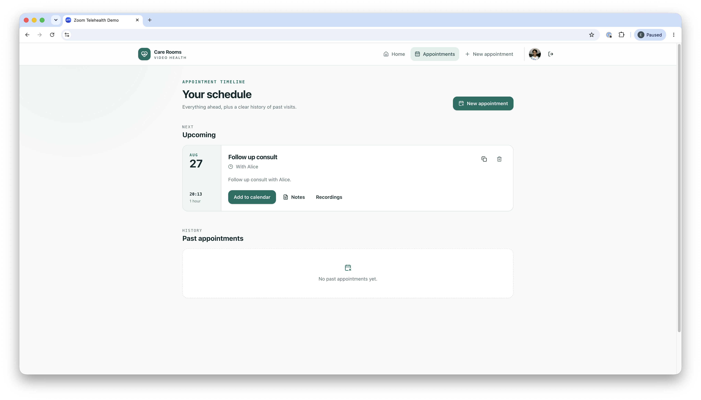
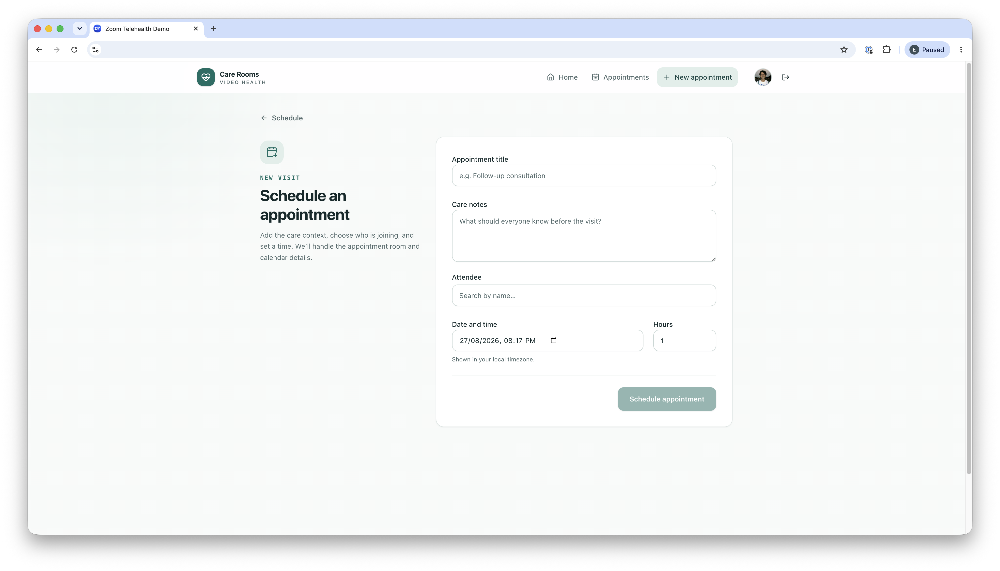
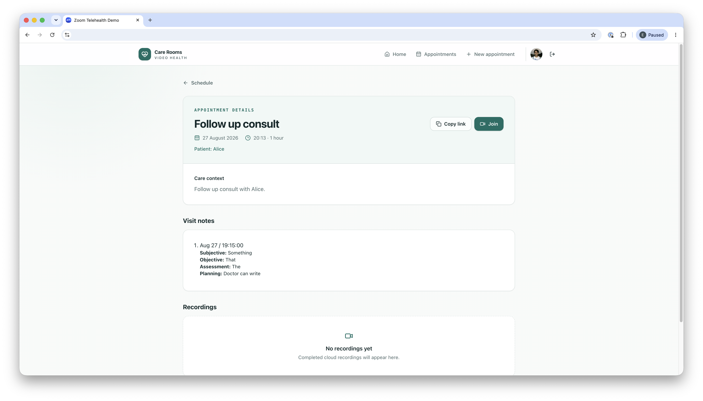
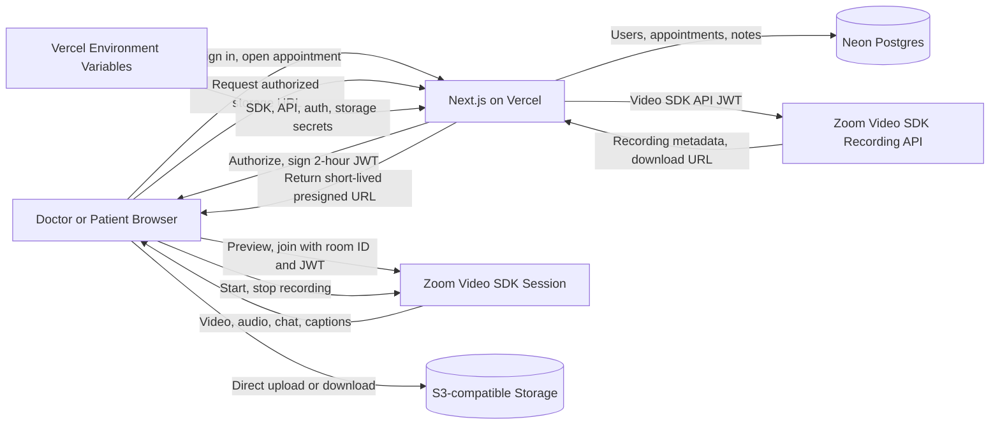
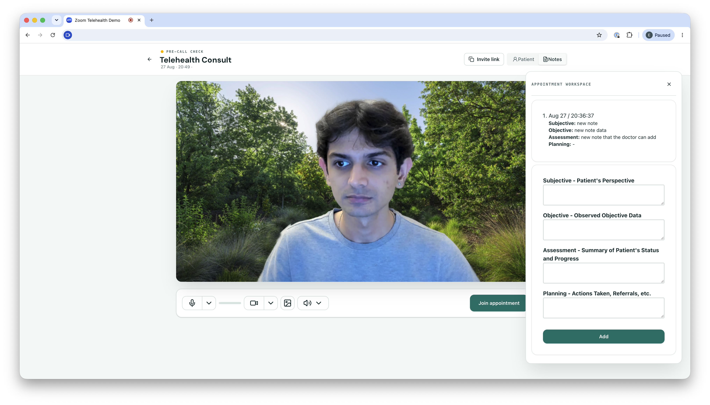
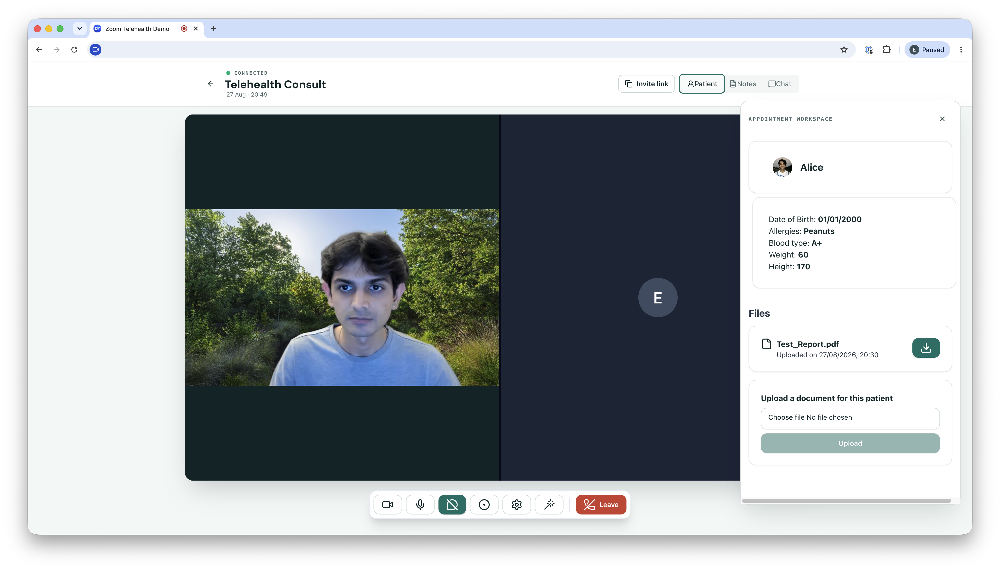
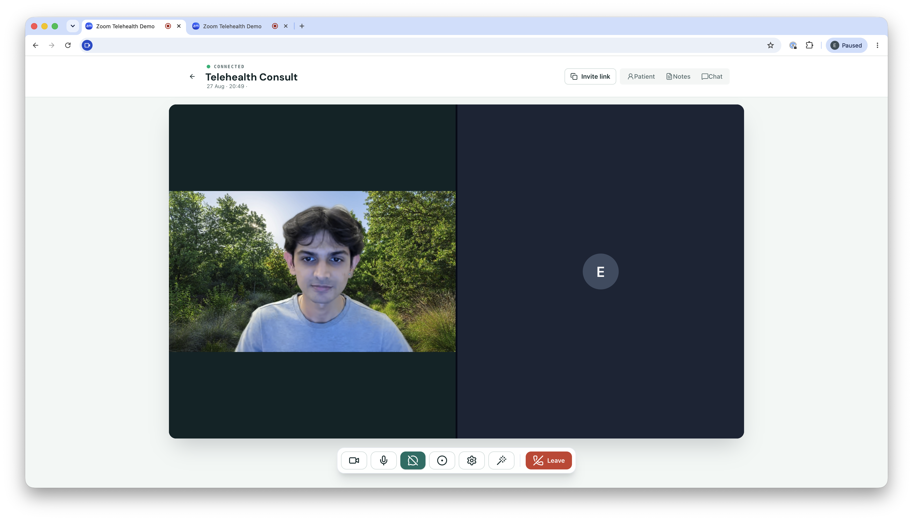

Run telehealth video visits inside your own application, built on the [Zoom Video SDK for Web](https://developers.zoom.us/docs/video-sdk/web/). Patients open an appointment in your app, confirm their camera, microphone, and speaker in a device-ready check, then join a private session with their clinician. No Zoom account or separate meeting client is required on either side.



External video apps pull patients out of the portal. A native waiting room keeps the visit inside your product, identity model, and pre-call flow.

**What you'll need:**

- [Video SDK credentials](https://developers.zoom.us/docs/video-sdk/get-credentials/): SDK key and secret, plus API key and secret for recording
- A backend to authorize appointments and issue short-lived session JWTs
- A frontend for the waiting room and video session (Next.js on Vercel in this guide; any stack works)
- A PostgreSQL database and private object store for appointments, notes, and patient documents
- Optional: EHR or scheduler integration for patient context

## Features

- Device-ready waiting room with camera, microphone, and speaker preview
- Role-based session access derived from the appointment record
- In-session video, audio, chat, and live captions
- Patient context and SOAP-format notes beside the call
- Patient document uploads through time-limited storage URLs
- Optional cloud recording with consent

If you'd rather buy than build, Zoom offers [Zoom for Healthcare](https://www.zoom.com/en/industry/healthcare/) with telehealth video visits out of the box, and [Clinical Note](https://www.zoom.com/en/industry/healthcare/solutions/clinical-notes/) for visit documentation. Use Video SDK when the visit must live inside your own portal, identity model, and clinical workflow.

<iframe width="560" height="315" src="https://www.youtube-nocookie.com/embed/pqXgNJAejQk?si=CvxzH1mUiDtH9Srq" title="YouTube video player" frameborder="0" allow="accelerometer; autoplay; clipboard-write; encrypted-media; gyroscope; picture-in-picture; web-share" referrerpolicy="strict-origin-when-cross-origin" allowfullscreen></iframe>

---

## Architecture

### Session model

The appointment record is the control plane. It stores the clinician, invited patient, scheduled time, and clinical artifacts. The first authorized participant starts the [Video SDK session](https://developers.zoom.us/docs/video-sdk/web/sessions/) on demand, using the appointment ID as the session topic.



When a user opens an appointment, the Next.js backend checks the authenticated user against the room creator and invite list. Only then does it sign a short-lived Video SDK JWT. The room ID becomes the session topic (`tpc`), so both participants receive tokens for the same isolated session. The appointment creator, normally the clinician, receives host role `1`. The invited participant receives role `0`.





### Waiting room

The waiting room owns pre-call device state. It calls `ZoomVideo.getDevices()`, creates local audio and video tracks, and lets the participant:

- Preview the selected camera
- Confirm microphone input
- Play a speaker test
- Change input and output devices
- Choose whether to join with audio or video enabled
- Apply a virtual background before the visit



Stop local preview tracks before `client.join()` starts. That avoids leaving the camera attached to two media flows and carries the participant's device choices into the call.

### Clinical data layer

Video SDK carries the live conversation. Your application owns the clinical workflow. The reference stack stores users, appointments, role-specific profiles, SOAP notes, transcripts, file metadata, and Zoom session IDs in Neon Postgres. A private Amazon S3 or Cloudflare R2 bucket holds patient documents.



The media adapter reads the appointment ID and authorized role without owning clinical data. These contracts let you use an EHR-backed appointment service, another PostgreSQL provider, or another approved object store in place of Neon and the selected bucket.

---

## Implementation Guide

Map these capabilities onto the target codebase before changing it. Preserve existing identity and appointment systems, then add the missing boundaries. The [Zoom Telehealth Sample App](https://github.com/zoom/VideoSDK-Web-Telehealth/tree/main) demonstrates the core Next.js flow. Before handling sensitive data, add neutral authorization failures, scheduled access windows, appointment-level checks for notes, files, and recordings, and one cleanup path for every session exit.

### Reference stack

The reference stack uses:

| Boundary          | Default                                             | Responsibility                                                |
| ----------------- | --------------------------------------------------- | ------------------------------------------------------------- |
| Web application   | Next.js on Vercel                                   | Patient portal, clinician workspace, server APIs              |
| Identity          | Existing clinical identity provider through Auth.js | Authentication, MFA, session lifecycle                        |
| Application data  | Neon Postgres with Drizzle                          | Users, roles, appointments, notes, file metadata              |
| Patient documents | Private Amazon S3 or Cloudflare R2 bucket           | Encrypted object storage through presigned URLs               |
| Secrets           | Vercel environment variables                        | Video SDK, Video SDK API, auth, database, and storage secrets |
| Real-time media   | Zoom Video SDK for Web                              | Preview, video, audio, chat, captions, recording controls     |


Each default maps to a separate contract. An existing portal may retain its framework, identity provider, EHR appointment store, and approved object storage when they implement those contracts. Do not replace a working system to match the sample repository.

### Agent integration map

Before changing code, inventory the target application and produce a mapping for each capability:

| Required capability            | Reuse when present                  | Add when missing                                              |
| ------------------------------ | ----------------------------------- | ------------------------------------------------------------- |
| Authenticated user ID          | Existing server session             | Auth.js provider and server session                           |
| Clinician/patient relationship | EHR or portal authorization service | Appointment membership table                                  |
| Appointment ID and time window | Existing scheduler or EHR encounter | PostgreSQL appointment record                                 |
| Server-only secret access      | Existing secrets manager            | Vercel environment variables                                  |
| Pre-call route                 | Existing appointment detail page    | `/appointments/:id/join` surface                              |
| Clinical workspace             | Existing chart or encounter panel   | Role-gated patient context and SOAP notes                     |
| File storage                   | Approved document service           | Private Amazon S3 or Cloudflare R2 bucket with presigned URLs |


Document which components the implementation reuses, adapts, creates, or omits. Recording, captions, notes, and documents are optional. Identity, appointment authorization, server-side token issuance, device preview, session cleanup, and visible failure states are required.

### Contract A: appointment authorization

**Input:** an authenticated user ID and appointment ID.

**Output:** an authorized session descriptor containing `sessionName`, a short-lived `videoSdkJwt`, the user's Video SDK role, display name, and the minimum appointment metadata needed by the waiting room.

**Invariants:**

- The server derives identity from the authenticated session.
- The server loads appointment membership from the application database or EHR.
- The creator or assigned clinician receives role `1`; invited participants receive role `0`.
- The client cannot submit or override its Video SDK role.
- The same ownership rule protects patient context, notes, documents, recordings, and appointment mutation.
- Restrict production access to an organization-defined window around the scheduled visit.

Return the same unavailable response when an appointment does not exist or the user is not a member, and return no Video SDK JWT in either case. Record the reason in a server-side audit event without disclosing it to the client. The reference [`session` router](https://github.com/zoom/VideoSDK-Web-Telehealth/blob/main/src/server/api/routers/session.ts) and [database schema](https://github.com/zoom/VideoSDK-Web-Telehealth/blob/main/src/server/db/schema.ts) show room membership and server-side token signing with tRPC and Drizzle. The example adds neutral errors, scheduled access windows, and audit events.

Use one server-side authorization function for the session and every related artifact. Return a neutral client error and keep the specific denial reason in the server audit log:

```typescript
async function authorizeAppointment(userId: string, appointmentId: string) {
  const appointment = await loadAppointment(appointmentId);
  const isCreator = appointment?.creatorId === userId;
  const isInvited = appointment?.participantIds.includes(userId) ?? false;
  const isInWindow = appointment ? canJoinAt(appointment.scheduledAt) : false;

  if (!appointment || (!isCreator && !isInvited) || !isInWindow) {
    await writeAuditEvent({
      userId,
      appointmentId,
      outcome: "denied",
      reason: !appointment
        ? "not_found"
        : !isCreator && !isInvited
          ? "not_a_member"
          : "outside_join_window",
    });
    throw new TRPCError({ code: "NOT_FOUND", message: "Appointment unavailable" });
  }

  return { appointment, role: isCreator ? 1 : 0 } as const;
}
```

Call this boundary before returning appointment metadata, signing a session token, reading or changing notes, issuing a storage URL, or querying a recording.

### Contract B: server-side session token service

Use the [Video SDK SDK key and secret](https://developers.zoom.us/docs/video-sdk/get-credentials/) only in the server runtime. The token service receives an already-authorized appointment and emits a signed JWT with these claims:

| Claim       | Required value                                                   |
| ----------- | ---------------------------------------------------------------- |
| `app_key`   | Video SDK SDK key from a server-only Vercel environment variable |
| `tpc`       | Stable appointment ID; must equal the client `sessionName`       |
| `role_type` | Server-derived `1` for host or `0` for participant               |
| `version`   | `1`                                                              |
| `iat`       | Current server time with a small clock-skew allowance            |
| `exp`       | No more than two hours after issue in this architecture          |

The SDK secret never enters a `NEXT_PUBLIC_*` variable, browser bundle, log, database row, or error response. Only server functions that call recording APIs load the separate Video SDK API credentials.

The reference app uses `jsrsasign`. Validate the secrets at startup, then sign only the topic and role derived by the server:

```typescript
import { KJUR } from "jsrsasign";

function signVideoSdkJwt(sessionName: string, role: 0 | 1) {
  const iat = Math.floor(Date.now() / 1000) - 30;
  const payload = {
    app_key: env.ZOOM_SDK_KEY,
    tpc: sessionName,
    role_type: role,
    version: 1,
    iat,
    exp: iat + 2 * 60 * 60,
  };

  return KJUR.jws.JWS.sign(
    "HS256",
    JSON.stringify({ alg: "HS256", typ: "JWT" }),
    JSON.stringify(payload),
    env.ZOOM_SDK_SECRET,
  );
}
```

### Contract C: device-ready waiting room

The waiting room owns pre-call media state. It initializes one Video SDK client, enumerates devices with `ZoomVideo.getDevices()`, and uses local audio and video tracks for tests. It exposes:

- Camera preview and camera selector
- Microphone input confirmation and microphone selector
- Speaker test and output selector where the browser supports it
- Join-with-audio and join-with-video state
- Privacy notice before the explicit join action
- Actionable permission and unsupported-browser errors
- Optional virtual background selection

Preview tracks, microphone testers, and speaker testers are disposable. Stop them when a device changes, when the component unmounts, and before `client.join()`. Carry the chosen device and mute state into the live session. The reference behavior is in [`Preview.tsx`](https://github.com/zoom/VideoSDK-Web-Telehealth/blob/main/src/components/videocall/Preview.tsx).

### Contract D: Video SDK session adapter

The session adapter is the only browser module that owns the live Video SDK client. Its lifecycle is:

```text
authorized → previewing → joining → connected → leaving → destroyed
                              ↘ failed ↗
```

The adapter registers listeners before joining, calls `client.join()` with the authorized `sessionName` and JWT, starts the selected media, renders users who are already present, and reacts to later `peer-video-state-change` events. Chat subscribes to `chat-on-message` and sends through `getChatClient()`.

On failure or exit, it unregisters every listener, stops local media, detaches rendered video elements, and calls `client.leave()`. Connection changes, host termination, route navigation, and page unload must all converge on this cleanup path.

The reference app implements this with the [`useSession`](https://www.npmjs.com/package/@zoom/videosdk-react) hook from `@zoom/videosdk-react`, which owns the client and handles join on mount and leave on unmount. Pass it the authorized `sessionName` and JWT with the chosen audio and video options; it surfaces join and media errors as state, and `useSessionUsers()` tracks who is present. See [`Videocall.tsx`](https://github.com/zoom/VideoSDK-Web-Telehealth/blob/main/src/components/videocall/Videocall.tsx). Listeners you register yourself, such as `connection-change`, must still be unregistered on teardown.



If you drive the core `@zoom/videosdk` client directly instead of the hook, make cleanup idempotent so simultaneous route, connection, and component events cannot leave twice:

```typescript
let cleanupPromise: Promise<void> | undefined;

function cleanupSession() {
  cleanupPromise ??= (async () => {
    client.off("chat-on-message", onChatMessage);
    client.off("connection-change", onConnectionChange);

    const stream = client.getMediaStream();
    await Promise.allSettled([stream.stopVideo(), stream.stopAudio()]);
    detachAllVideoPlayers();

    if (client.getSessionInfo()?.isInMeeting) await client.leave();
  })();
  return cleanupPromise;
}
```

Register `connection-change` before joining and run `cleanupSession()` from every teardown path. The core client also accepts `leaveOnPageUnload: true` at `init()` to leave on browser or tab close; the reference app does not set it.

### Contract E: clinical data modules

Clinical data remains outside the media session. Use this minimum model whether it lives in PostgreSQL or behind an existing EHR service:


| Entity                | Required relationships and data                          |
| --------------------- | -------------------------------------------------------- |
| User                  | Stable identity ID and application role                  |
| Appointment           | Creator, invited users, scheduled time, duration, status |
| Clinical note         | Appointment ID, clinician ID, SOAP fields, timestamps    |
| Patient document      | Patient ID, object key, media type, timestamps           |
| Zoom session instance | Appointment ID, Zoom session ID, start/end state         |


Clinicians may read patient context only when the appointment relationship permits it. Patients may manage only their own documents. The server issues short-lived Amazon S3 or Cloudflare R2 URLs; bucket credentials never reach the browser. Each module defines its own retention and audit events.

Resolve documents from server-owned metadata instead of accepting an arbitrary object key from the browser:

```typescript
async function createDocumentDownload(userId: string, appointmentId: string, fileId: string) {
  await authorizeAppointment(userId, appointmentId);
  const file = await loadAppointmentDocument(appointmentId, fileId);
  if (!file) throw new TRPCError({ code: "NOT_FOUND", message: "Document unavailable" });

  await writeAuditEvent({ userId, appointmentId, fileId, outcome: "downloaded" });
  return getSignedUrl(s3, new GetObjectCommand({
    Bucket: env.S3_BUCKET,
    Key: file.objectKey,
  }), { expiresIn: 300 });
}
```

Live captions use the Video SDK live transcription client and `caption-message` events. Treat them as an accessibility aid. Do not use the sample captions as clinical documentation. If automated documentation is the primary requirement, evaluate [Zoom Workplace for Clinicians: Clinical Note](https://www.zoom.com/en/industry/healthcare/solutions/clinical-notes/) before building a custom notes pipeline.

### Contract F: optional cloud recording

[Cloud recording](https://developers.zoom.us/docs/video-sdk/web/recording/) is opt-in. Enable it only when the account has the required plan and the organization has approved recording, consent, retention, and access policies.

An authorized host starts and stops recording through the SDK. The application stores the Zoom session instance ID against the appointment. A server-only recording service uses a short-lived Video SDK API JWT to query the [Video SDK Recording API](https://developers.zoom.us/docs/api/video-sdk/).

The sample retrieves recordings on demand and includes no recording-completed webhook. If you add webhook processing, verify each request and apply appointment authorization before exposing metadata or download URLs. Never proxy a recording download to an unauthorized participant.

### Vercel deployment

[](https://vercel.com/new/clone?repository-url=https%3A%2F%2Fgithub.com%2Fzoom%2FVideoSDK-Web-Telehealth%2Ftree%2Fmain&env=AUTH_SECRET%2CGITHUB_CLIENT_ID%2CGITHUB_CLIENT_SECRET%2CZOOM_SDK_KEY%2CZOOM_SDK_SECRET%2CZOOM_API_KEY%2CZOOM_API_SECRET&envDescription=Auth.js%2C%20Zoom%20Video%20SDK%2C%20and%20Zoom%20API%20credentials%20required%20by%20the%20app.&envLink=https%3A%2F%2Fgithub.com%2Fzoom%2FVideoSDK-Web-Telehealth%2Ftree%2Fmain%23environment-variables&project-name=zoom-telehealth&repository-name=zoom-telehealth&stores=%5B%7B%22type%22%3A%22integration%22%2C%22protocol%22%3A%22storage%22%2C%22productSlug%22%3A%22neon%22%2C%22integrationSlug%22%3A%22neon%22%7D%2C%7B%22type%22%3A%22blob%22%2C%22access%22%3A%22private%22%7D%5D&skippable-integrations=0)

Vercel builds and hosts the Next.js app. The deploy flow provisions [Neon Postgres](https://vercel.com/marketplace/neon) and a private [Vercel Blob](https://vercel.com/docs/vercel-blob) store, injects `DATABASE_URL` and `BLOB_READ_WRITE_TOKEN`, applies the committed Drizzle migrations, and seeds demo accounts during the build. Seeding is a no-op once the database has users, so later deploys are unaffected.

<details>
<summary><strong>Vercel configuration</strong></summary>

The Deploy Button collects two groups of environment variables:


| Service        | Values                                                    |
| -------------- | --------------------------------------------------------- |
| GitHub OAuth   | `AUTH_SECRET`, `GITHUB_CLIENT_ID`, `GITHUB_CLIENT_SECRET` |
| Zoom Video SDK | SDK key and secret; API key and secret for recording      |


Enter these values in the Deploy Button's environment-variable form. If the form does not appear (Vercel can omit it when a Marketplace integration is included), let the initial build finish, then add the values under **Project Settings → Environment Variables** for Production, Preview, and Development and redeploy. Generate `AUTH_SECRET` with `npx auth secret`; Neon supplies `DATABASE_URL`.

File storage needs no manual setup: the Deploy Button provisions a **private** Vercel Blob store and connects it over OIDC, injecting `BLOB_STORE_ID` (no long-lived token). The app detects the store and switches to Blob automatically. Uploads and downloads both go through auth-gated Functions that authenticate via OIDC — `/api/blob/upload` verifies the caller and streams the file to the store with the SDK's `put()`, and `/api/blob/download` re-checks appointment ownership before calling `get()`. Private blobs are never publicly readable. Uploads pass through the Function, so keep files under the ~4.5 MB body limit (or switch to client uploads, which need `BLOB_READ_WRITE_TOKEN`). Review Blob's data-residency region and your BAA obligations before storing real PHI.

To use Amazon S3 or Cloudflare R2 instead — for an existing bucket — leave Blob unprovisioned and set the `S3_ENDPOINT`, `S3_BUCKET`, `S3_ACCESS_KEY_ID`, and `S3_SECRET_ACCESS_KEY` variables manually. `S3_REGION` defaults to `auto` (correct for R2); set the bucket's AWS region for S3. Review the bucket CORS policy and restrict it to the application origin before production.

In GitHub, open **Settings → Developer settings → OAuth Apps** and create or edit the OAuth App. Set **Homepage URL** to `https://YOUR_PRODUCTION_DOMAIN` and **Authorization callback URL** to `https://YOUR_PRODUCTION_DOMAIN/api/auth/callback/github`, then add its client ID and secret to `GITHUB_CLIENT_ID` and `GITHUB_CLIENT_SECRET` environment variables in Vercel.

</details>

### Acceptance criteria

The implementation must pass these checks:

- An unauthenticated user receives no appointment data and no Video SDK JWT.
- An authenticated non-member cannot infer whether a private appointment is active or retrieve any related clinical artifact.
- The server derives every host and participant role.
- SDK and API secrets are absent from browser bundles and client-visible logs.
- Camera, microphone, and speaker failures produce actionable recovery paths.
- The waiting room releases preview resources before the live session starts.
- Existing and newly joined participants render correctly.
- Leaving, navigation, connection failure, and host termination all clean up listeners and media resources.
- Clinician notes, patient files, and recordings enforce appointment-level authorization in addition to role checks.
- Omitting recording or captions leaves no related controls or background work.
- Audit events cover authorization denial, consent, note changes, document access, and the lifecycle of every enabled recording module.

<details>
<summary><strong>Reference implementation appendix</strong></summary>

The sample on the `main` branch uses Next.js, Auth.js, tRPC, Drizzle, PostgreSQL, and Amazon S3 or Cloudflare R2. It expects database, auth provider, Video SDK, Video SDK API, and storage credentials in server-side environment variables. For local development, the current branch uses these commands:

```bash
bun install
bun run db:push
bun run db:seed
bun run dev
```

</details>

---

## Before production

The sample repository is **not built for protected health information (PHI)** and is not HIPAA compliant as shipped. Zoom Video SDK can support HIPAA obligations for eligible providers with a signed BAA and the right controls, but compliance depends on your full application. Review identity, consent, retention, and auditability with your security and legal teams before production.

## Related Resources

- [Telehealth Sample App](https://github.com/zoom/VideoSDK-Web-Telehealth) - Reference implementation
- [Zoom Video SDK for Web](https://developers.zoom.us/docs/video-sdk/web/) - SDK documentation
- [Video SDK Recording API](https://developers.zoom.us/docs/api/video-sdk/) - Cloud recording REST API
- [Zoom for Healthcare](https://www.zoom.com/en/industry/healthcare/) - Build vs. buy
- [Zoom Developer Forum](https://devforum.zoom.us/)
