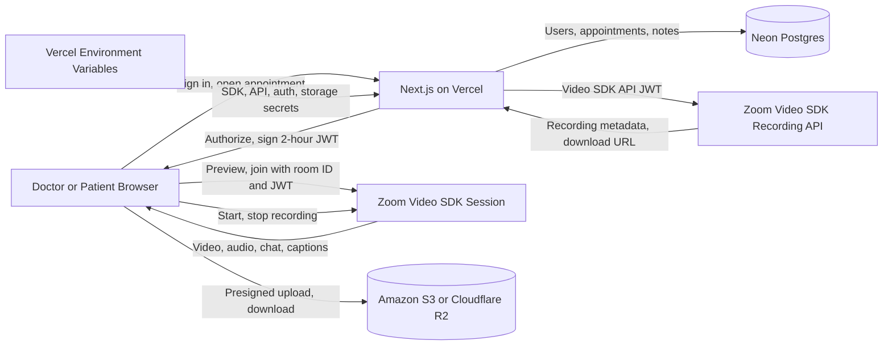

A telehealth waiting room built on the [Zoom Video SDK for Web](https://developers.zoom.us/docs/video-sdk/web/) keeps the entire visit inside your patient portal: appointment check-in, privacy notice, device test, and the live video call. It gates each session by appointment role, so only the assigned clinician and invited patient join.

A separate meeting handoff adds friction while patients are checking permissions, choosing devices, and confirming that they have the right appointment. Keeping those steps in the portal preserves the existing identity and appointment controls.

**What you'll need:**

- A [Zoom Video SDK](https://developers.zoom.us/docs/video-sdk/get-credentials/) account with SDK key and secret (plus API key and secret for recording)
- A web app with server-side auth and an appointment/identity model (Next.js on Vercel in this guide; any stack works)
- A PostgreSQL database for users, appointments, and notes (Neon in this guide)
- A private object store for patient documents (Amazon S3 or Cloudflare R2)

> Create your SDK and API credentials in the [Zoom Video SDK dashboard](https://developers.zoom.us/docs/video-sdk/get-credentials/)

**Features:**

- Doctor and patient onboarding with separate permissions
- Appointment scheduling and calendar invitations
- A reusable device preview with camera, microphone, speaker, and virtual background controls
- In-session video, audio, chat, live captions, and cloud recording controls
- Patient context and SOAP-format notes beside the call
- Patient document uploads through time-limited S3 URLs
- Post-visit access to cloud recordings


Teams that can use a standard patient experience should evaluate [Zoom for Healthcare](https://www.zoom.com/en/industry/healthcare/), which includes telehealth and healthcare collaboration capabilities. For visit documentation, [Zoom Workplace for Clinicians: Clinical Note](https://www.zoom.com/en/industry/healthcare/solutions/clinical-notes/) can generate clinical note drafts and connect them to EHR workflows. Use Video SDK when the visit must live inside your own portal, identity model, and clinical workflow.

[Watch the demo](https://www.youtube.com/watch?v=pqXgNJAejQk)

Follow along as we walk through the architecture.

---

## Architecture

### Session model

The appointment record is the control plane. It stores the clinician, invited patient, scheduled time, and clinical artifacts. It does **not** pre-create a Zoom session. [Video SDK sessions](https://developers.zoom.us/docs/video-sdk/web/sessions/) start on demand when the first authorized participant joins.

When a user opens an appointment, the Next.js backend checks the authenticated user against the room creator and invite list. Only then does it sign a short-lived Video SDK JWT. The room ID becomes the session topic (`tpc`), so both participants receive tokens for the same isolated session. The appointment creator, normally the clinician, receives host role `1`. The invited participant receives role `0`.



### Waiting room

The waiting room owns pre-call device state. It calls `ZoomVideo.getDevices()`, creates local audio and video tracks, and lets the participant:

- Preview the selected camera
- Confirm microphone input
- Play a speaker test
- Change input and output devices
- Choose whether to join with audio or video enabled
- Apply a virtual background before the visit

Stop local preview tracks before `client.join()` starts. That avoids leaving the camera attached to two media flows and carries the participant's device choices into the call.

### Clinical data layer

Video SDK carries the live conversation. Your application owns the clinical workflow. In the recommended path, Neon Postgres stores users, appointments, role-specific profiles, SOAP notes, transcripts, file metadata, and Zoom session IDs. A private Amazon S3 or Cloudflare R2 bucket holds patient documents.

The media adapter reads the appointment ID and authorized role without owning clinical data. The contracts below allow an EHR-backed appointment service, another PostgreSQL provider, or another approved object store in place of Neon and the selected bucket.

---

## Implementation Guide

Map these capabilities onto the target codebase before changing it. Preserve existing identity and appointment systems, then add the missing boundaries. The [Zoom Telehealth Sample App](https://github.com/zoom/VideoSDK-Web-Telehealth/tree/update) implements the same contracts in Next.js.

### Reference stack

The reference stack uses:

| Boundary          | Default                                             | Responsibility                                                |
| ----------------- | --------------------------------------------------- | ------------------------------------------------------------- |
| Web application   | Next.js on Vercel                                   | Patient portal, clinician workspace, server APIs              |
| Identity          | Existing clinical identity provider through Auth.js | Authentication, MFA, session lifecycle                        |
| Application data  | Neon Postgres with Drizzle                          | Users, roles, appointments, notes, file metadata              |
| Patient documents | Private Amazon S3 or Cloudflare R2 bucket           | Encrypted object storage through presigned URLs               |
| Secrets           | Vercel environment variables                        | Video SDK, Video SDK API, auth, database, and storage secrets |
| Real-time media   | Zoom Video SDK for Web                              | Preview, video, audio, chat, captions, recording controls     |

Each default maps to a separate contract. An existing portal may retain its framework, identity provider, EHR appointment store, and approved object storage when they implement those contracts. Do not replace a working system to match the sample repository.

### Agent integration map

Before changing code, inventory the target application and produce a mapping for each capability:

| Required capability            | Reuse when present                  | Add when missing                                              |
| ------------------------------ | ----------------------------------- | ------------------------------------------------------------- |
| Authenticated user ID          | Existing server session             | Auth.js provider and server session                           |
| Clinician/patient relationship | EHR or portal authorization service | Appointment membership table                                  |
| Appointment ID and time window | Existing scheduler or EHR encounter | PostgreSQL appointment record                                 |
| Server-only secret access      | Existing secrets manager            | Vercel environment variables                                  |
| Pre-call route                 | Existing appointment detail page    | `/appointments/:id/join` surface                              |
| Clinical workspace             | Existing chart or encounter panel   | Role-gated patient context and SOAP notes                     |
| File storage                   | Approved document service           | Private Amazon S3 or Cloudflare R2 bucket with presigned URLs |

Document which components the implementation reuses, adapts, creates, or omits. Recording, captions, notes, and documents are optional. Require identity, appointment authorization, server-side token issuance, device preview, session cleanup, and visible failure states.

### Contract A: appointment authorization

**Input:** an authenticated user ID and appointment ID.

**Output:** an authorized session descriptor containing `sessionName`, a short-lived `videoSdkJwt`, the user's Video SDK role, display name, and the minimum appointment metadata needed by the waiting room.

**Invariants:**

- The server derives identity from the authenticated session.
- The server loads appointment membership from the application database or EHR.
- The creator or assigned clinician receives role `1`; invited participants receive role `0`.
- The client cannot submit or override its Video SDK role.
- The same ownership rule protects patient context, notes, documents, recordings, and appointment mutation.
- Restrict production access to an organization-defined window around the scheduled visit.

Return the same not-available response when an appointment does not exist or the user is not a member, and return no Video SDK JWT in either case. Record the actual reason in a server-side audit event without disclosing it to the client. The reference [`session` router](https://github.com/zoom/VideoSDK-Web-Telehealth/blob/update/src/server/api/routers/session.ts) and [database schema](https://github.com/zoom/VideoSDK-Web-Telehealth/blob/update/src/server/db/schema.ts) show this boundary with tRPC and Drizzle.

### Contract B: server-side session token service

Use the [Video SDK SDK key and secret](https://developers.zoom.us/docs/video-sdk/get-credentials/) only in the server runtime. The token service receives an already-authorized appointment and emits a signed JWT with these claims:

| Claim       | Required value                                                   |
| ----------- | ---------------------------------------------------------------- |
| `app_key`   | Video SDK SDK key from a server-only Vercel environment variable |
| `tpc`       | Stable appointment ID; must equal the client `sessionName`       |
| `role_type` | Server-derived `1` for host or `0` for participant               |
| `version`   | `1`                                                              |
| `iat`       | Current server time with a small clock-skew allowance            |
| `exp`       | No more than two hours after issue in this architecture          |

The SDK secret never enters a `NEXT_PUBLIC_*` variable, browser bundle, log, database row, or error response. Only server functions that call recording APIs load the separate Video SDK API credentials.

### Contract C: device-ready waiting room

The waiting room owns pre-call media state. It initializes one Video SDK client, enumerates devices with `ZoomVideo.getDevices()`, and uses local audio and video tracks for tests. It exposes:

- Camera preview and camera selector
- Microphone input confirmation and microphone selector
- Speaker test and output selector where the browser supports it
- Join-with-audio and join-with-video state
- Privacy notice before the explicit join action
- Actionable permission and unsupported-browser errors
- Optional virtual background selection

Preview tracks, microphone testers, and speaker testers are disposable. Stop them when a device changes, when the component unmounts, and before `client.join()`. Carry the chosen device and mute state into the live session. The reference behavior is in [`Preview.tsx`](https://github.com/zoom/VideoSDK-Web-Telehealth/blob/update/src/components/videocall/Preview.tsx).

### Contract D: Video SDK session adapter

The session adapter is the only browser module that owns the live Video SDK client. Its lifecycle is:

```text
authorized → previewing → joining → connected → leaving → destroyed
                              ↘ failed ↗
```

The adapter registers listeners before joining, calls `client.join()` with the authorized `sessionName` and JWT, starts the selected media, renders users who are already present, and reacts to later `peer-video-state-change` events. Chat subscribes to `chat-on-message` and sends through `getChatClient()`.

On failure or exit, it unregisters every listener, stops local media, detaches rendered video elements, and calls `client.leave()`. Connection changes, host termination, route navigation, and page unload must all converge on this cleanup path. See [`Videocall.tsx`](https://github.com/zoom/VideoSDK-Web-Telehealth/blob/update/src/components/videocall/Videocall.tsx) for the direct Web Video SDK pattern.

### Contract E: clinical data modules

Clinical data remains outside the media session. Use this minimum model whether it lives in PostgreSQL or behind an existing EHR service:

| Entity                | Required relationships and data                          |
| --------------------- | -------------------------------------------------------- |
| User                  | Stable identity ID and application role                  |
| Appointment           | Creator, invited users, scheduled time, duration, status |
| Clinical note         | Appointment ID, clinician ID, SOAP fields, timestamps    |
| Patient document      | Patient ID, object key, media type, timestamps           |
| Zoom session instance | Appointment ID, Zoom session ID, start/end state         |

Clinicians may read patient context only when the appointment relationship permits it. Patients may manage only their own documents. The server issues short-lived Amazon S3 or Cloudflare R2 URLs; bucket credentials never reach the browser. Each module defines its own retention and audit events.

Live captions use the Video SDK live transcription client and `caption-message` events. Treat them as an accessibility aid. Do not use the sample captions as clinical documentation. If automated documentation is the primary requirement, evaluate [Zoom Workplace for Clinicians: Clinical Note](https://www.zoom.com/en/industry/healthcare/solutions/clinical-notes/) before building a custom notes pipeline.

### Contract F: optional cloud recording

[Cloud recording](https://developers.zoom.us/docs/video-sdk/web/recording/) is opt-in. Enable it only when the account has the required plan and the organization has approved recording, consent, retention, and access policies.

An authorized host starts and stops recording through the SDK. The application stores the Zoom session instance ID against the appointment. A server-only recording service uses a short-lived Video SDK API JWT to query the [Video SDK Recording API](https://developers.zoom.us/docs/api/video-sdk/). Prefer the recording-completed webhook over client polling for post-session processing. Never proxy a recording download to an unauthorized participant.

### Vercel deployment

[](https://vercel.com/new/clone?repository-url=https%3A%2F%2Fgithub.com%2Fzoom%2FVideoSDK-Web-Telehealth%2Ftree%2Fupdate&env=AUTH_SECRET%2CGITHUB_CLIENT_ID%2CGITHUB_CLIENT_SECRET%2CZOOM_SDK_KEY%2CZOOM_SDK_SECRET%2CZOOM_API_KEY%2CZOOM_API_SECRET%2CS3_ENDPOINT%2CS3_BUCKET%2CS3_ACCESS_KEY_ID%2CS3_SECRET_ACCESS_KEY&stores=%5B%7B%22type%22%3A%22integration%22%2C%22integrationSlug%22%3A%22neon%22%2C%22productSlug%22%3A%22neon%22%2C%22protocol%22%3A%22storage%22%7D%5D&project-name=videosdk-telehealth)

Vercel builds and hosts the Next.js app. The deploy flow also provisions [Neon Postgres](https://vercel.com/marketplace/neon) and injects `DATABASE_URL`.

<details>
<summary><strong>Vercel configuration</strong></summary>

The deploy form asks for three groups of values:

| Service                                                                                                                                                              | Values                                                    |
| -------------------------------------------------------------------------------------------------------------------------------------------------------------------- | --------------------------------------------------------- |
| GitHub OAuth                                                                                                                                                         | `AUTH_SECRET`, `GITHUB_CLIENT_ID`, `GITHUB_CLIENT_SECRET` |
| Zoom Video SDK                                                                                                                                                       | SDK key and secret; API key and secret for recording      |
| [Cloudflare R2](https://developers.cloudflare.com/r2/get-started/s3/) or [Amazon S3](https://docs.aws.amazon.com/AmazonS3/latest/userguide/using-presigned-url.html) | Endpoint, bucket, access key, secret                      |

R2 works with the sample's current `region: "auto"` setting. For Amazon S3, replace `auto` with the bucket's AWS region or read it from `S3_REGION`.

After the first deployment, apply the database schema once:

```bash
vercel link
vercel env run -e production -- bun run db:push
```

Register `https://YOUR_PRODUCTION_DOMAIN/api/auth/callback/github` as the GitHub OAuth callback. The application already reads the domain that Vercel supplies. The existing `next.config.js` supplies the Video SDK headers; S3 and R2 uploads already use presigned URLs.

</details>

### Acceptance criteria

The implementation must pass these checks:

- An unauthenticated user receives no appointment data and no Video SDK JWT.
- An authenticated non-member cannot infer whether a private appointment is active or retrieve any related clinical artifact.
- The server derives every host and participant role.
- SDK and API secrets are absent from browser bundles and client-visible logs.
- Camera, microphone, and speaker failures produce actionable recovery paths.
- The waiting room releases preview resources before the live session starts.
- Existing and newly joined participants render correctly.
- Leaving, navigation, connection failure, and host termination all clean up listeners and media resources.
- Clinician notes, patient files, and recordings enforce appointment-level authorization in addition to role checks.
- Omitting recording or captions leaves no related controls or background work.
- Audit events cover authorization denial, consent, note changes, document access, and the lifecycle of every enabled recording module.

<details>
<summary><strong>Reference implementation appendix</strong></summary>

The sample on the `update` branch uses Next.js, Auth.js, tRPC, Drizzle, PostgreSQL, and Amazon S3 or Cloudflare R2. It expects database, auth provider, Video SDK, Video SDK API, and storage credentials in server-side environment variables. The current branch uses these verification commands:

```bash
bun install
bun run db:push
bun run db:seed
bun run dev
```

The older blog and parts of the repository README reference Prisma. The `update` branch uses Drizzle; its package scripts are authoritative. Use the sample to verify reference behavior. In an existing portal, implement the contracts above in place.

</details>

---

The sample repository is **not designed for protected health information (PHI)** and must not be treated as HIPAA compliant. Before a production launch, work with your privacy, security, and legal teams on identity, consent, data retention, auditability, vendor agreements, and applicable healthcare rules. Zoom Video SDK can help eligible providers meet HIPAA obligations when the required arrangements, including a BAA, are in place; compliance still depends on the complete application and operating model.

## Related Resources

- [Telehealth Sample App](https://github.com/zoom/VideoSDK-Web-Telehealth) - Reference implementation
- [Zoom Video SDK for Web](https://developers.zoom.us/docs/video-sdk/web/) - SDK documentation
- [Video SDK Recording API](https://developers.zoom.us/docs/api/video-sdk/) - Cloud recording REST API
- [Zoom for Healthcare](https://www.zoom.com/en/industry/healthcare/) - Build vs. buy
- [Zoom Developer Forum](https://devforum.zoom.us/)
