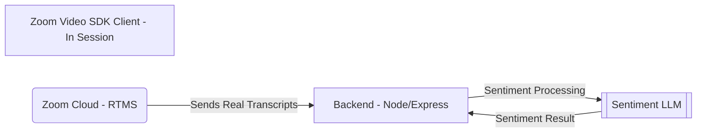
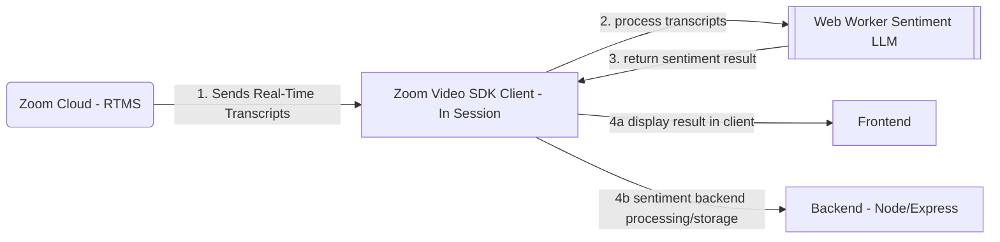

Support teams and product owners often rely on delayed surveys, ticket notes,
    and post-conversation reviews to understand how people feel about an
    experience. By the time negative sentiment is identified, the customer is
    already frustrated, and the opportunity to respond in the moment is gone.
Sentiment analysis makes live or transcribed feedback easier to understand at
scale. <!-- Expand: a real use case,
grounding, business outcome framing, why in-meeting beats post-call. -->


Requirements:
- A Zoom Video SDK account with an SDK key and secret
- RTMS and Live Transcription enabled for your Video SDK account
  
> Create your SDK and API credentials in the [Zoom Video SDK dashboard](https://developers.zoom.us/docs/video-sdk/get-credentials/)

## Architecture


### Server-Side with RTMS
A Zoom session is started through the Video SDK. Once audio is connected and participants begin to speak,
**RTMS** streams the live transcript to the backend. The backend processes the received transcripts
and sends them to the sentiment LLM for analysis. The analysis result is returned to the backend.




### Client-Side with Live Transcription
A Zoom session is started through the Video SDK. Once audio is connected and participants begin to speak,
the Zoom Cloud sends transcripts to the client device through the SDK transcript listener. These transcripts
are sent as strings to a web worker, which runs the sentiment LLM locally. The sentiment worker analyzes the
transcripts and returns the result to either the main thread or the backend.



<!-- Expand: component walkthrough (RTMS webhook → WebSocket ingest, AI
     orchestration, coaching-cue loop), per docs/ARCHITECTURE.md in the
     arlo repo. -->

## Implementation Guide (Work in Progress)

Reference this [Sentiment Analysis Walkthrough](https://developers.zoom.us/blog/sentiment-analysis-with-live-transcriptions/) to access the GitHub repository and set up the app.

### Server-Side with RTMS

#### Front End - Video SDK Implementation
Implement the Video SDK with at least audio capabilities for the host and session participants. You will also need a `generateSignature` function to generate the JWT required to join or start the Zoom session.
```js
import ZoomVideo, { VideoClient } from "@zoom/videosdk";

const client = ZoomVideo.createClient() as typeof VideoClient;
await client.init("en-US", "Global", { patchJsMedia: true });

const startCall = async () => {
    const token: string = generateSignature(sessionName, role, sdkKey, sdkSecret);
    await client.join(sessionName, token, username);
    const mediaStream = client.getMediaStream();
    await mediaStream.startAudio();
}
await startCall();
```

The existing sample uses plain vanilla JavaScript and can be run with the following commands after dependencies are installed:
```bash
npm install
bun dev
```

#### Backend - RTMS Implementation
On the backend Node.js server, implement RTMS using the RTMS SDK. This example demonstrates the configuration by mounting the RTMS SDK webhook handler on the HTTP server:
```js
// Import the RTMS SDK
import express from 'express';
import dotenv from 'dotenv';
import cors from 'cors';
import rtms from "@zoom/rtms";

dotenv.config({ quiet: true });
const PORT = process.env.PORT || 3012;
const ZoomSecretToken = process.env.ZOOM_SECRET_TOKEN;
const ZoomClientId = process.env.ZOOM_VIDEO_SDK_KEY;
const ZoomClientSecret = process.env.ZOOM_VIDEO_SDK_SECRET;
const WordThreshold = parseInt(process.env.WORD_THRESHOLD || '35');

if (!ZoomClientId || !ZoomClientSecret || !ZoomSecretToken) {
  console.error('Missing required environment variables:');
  if (!ZoomClientId) console.error('  - ZOOM_VIDEO_SDK_CLIENT');
  if (!ZoomClientSecret) console.error('  - ZOOM_VIDEO_SDK_SECRET');
  if (!ZoomSecretToken) console.error('  - ZOOM_SECRET_TOKEN');
  process.exit(1);
}

const app = express();
app.use(cors());

// Create a webhook handler that can be mounted on your existing server
const webhookHandler = rtms.createWebhookHandler(
    (payload) => {
        console.log(`Received webhook: ${util.inspect(payload, {depth: null, colors: true })}`);

        if (payload.event === "session.rtms_started") {
            const client = new rtms.Client();
            const { session_id, rtms_stream_id, server_urls } = payload.payload;

            client.onTranscriptData((buffer, size, timestamp, metadata) => {
              const text = buffer.toString('utf8');
              console.log(`Transcript from ${metadata.userName}: ${text}`);
              if (text.length > WordThreshold) {
                // TODO: Run Sentiment Analysis here via worker thread
              }
            });

            client.join({
              client: ZoomClientId,
              secret: ZoomClientSecret,
              session_id,
              rtms_stream_id,
              server_urls,
            });
        }
    },
    '/zoom/webhook'
);

app.post('/zoom/webhook', webhookHandler);
app.use(express.json());

app.get('/', (req, res) => {
  console.log('Root endpoint hit');
  res.send('RTMS for Video SDK Sample Server Running.');
});

const server = http.createServer(app);

server.listen(PORT, () => {
  console.log(`Server running at http://localhost:${PORT}`)
});
```

#### Model Integration on the Server Side
On the backend Node.js server, implement, train, and integrate your model in a separate worker thread so the main event loop is not bottlenecked by sentiment processing.
```js
// Example logic for the TODO line from the previous step
if (text.length > WordThreshold) {
  const workerPath = path.resolve(__dirname, 'transcript-sentiment.js');
    
    // Spawn the worker thread and pass data, such as the transcript
    const worker = new Worker(workerPath, {
        workerData: { transcript: text }
    });

    // Listen for the result from the worker thread
    worker.on('message', (result) => {
        console.log(`Sentiment Result: ${result.sentiment}`);
    });

    // Handle potential errors in the worker
    worker.on('error', (error) => {
        console.log(`Error from Worker: ${error.message}`);
    });

    // Handle unexpected worker exits
    worker.on('exit', (code) => {
        if (code !== 0) {
            console.error(`Worker stopped with exit code ${code}`);
        }
    });
}
```

### Client-Side with Live Transcription

#### Frontend - Video SDK Configuration
Implement the Video SDK with at least audio and live transcription capabilities for the host and session participants. Configure the Video SDK `caption-message` listener to receive transcript text as a `string` and run sentiment analysis on it. You will also need a `generateSignature` function to generate the JWT required to join or start the Zoom session.
```js
import ZoomVideo, { VideoClient } from "@zoom/videosdk";

const client = ZoomVideo.createClient() as typeof VideoClient;
await client.init("en-US", "Global", { patchJsMedia: true });

const startCall = async () => {
    const token: string = generateSignature(sessionName, role, sdkKey, sdkSecret);
    await client.join(sessionName, token, username);
    const mediaStream = client.getMediaStream();
    await mediaStream.startAudio();

    client.on("caption-message", async (payload) => {
        if (payload.done) {
            runSentiment(payload.text);
        }
    });

    const liveTranscriptionTranslation = client.getLiveTranscriptionClient();
    await liveTranscriptionTranslation.startLiveTranscription();
    liveTranscriptionTranslation.setSpeakingLanguage(LiveTranscriptionLanguage.English);
}

await startCall();
```

### Model Integration via Web Worker
Configure a web worker to handle sentiment processing. It can either run the model in the web worker with TensorFlow.js or make a web request to a secure backend that handles the analysis.
```js
// In main.ts, the worker is launched when the site loads and is ready to receive transcripts
const launchAI = async () => {
    sentimentWorker = new Worker(window.location.origin + "/transcript-sentiment.js");
    sentimentWorker.onmessage = (e: any) => {
        const {event, payload: {allWords, wordReference, result}} = e.data;
        switch(event) {
            case 'model-inited':
                localStorage.setItem("allWords", allWords);
                localStorage.setItem("wordReference", wordReference);
                processingPaused = false;
                aiBtn.innerHTML = 'Reset AI';
                aiBtn.disabled = false;
                break;
            case 'sentiment-result':
                sentimentOutput.innerHTML = `Detected Sentiment: ${result}`;
        }
    }
};
```

**The following sections apply to both client-side and server-side.**

### Use a Transcription Buffer for Better Contextual Understanding
It is recommended that you store received transcripts in a buffer, concatenating them into a single string rather than sending each one for analysis as soon as it arrives. This gives the LLM more context and can produce more accurate results.

### JWT Generation
Use the [Video SDK key and secret](https://developers.zoom.us/docs/video-sdk/get-credentials/) only in the server runtime. The required claims for this application are as follows:

| Claim       | Required value                                                   |
| ----------- | ---------------------------------------------------------------- |
| `app_key`   | Your Zoom Video SDK key                                          |
| `tpc`       | The topic matching the specified 'tpc' in SDK join function      |
| `role_type` | Server-derived `1` for host or `0` for participant               |
| `version`   | `1`                                                              |
| `iat`       | Current server time with a small clock-skew allowance            |
| `exp`       | No more than two hours after issue in this architecture          |

This JWT is generated with functions similar to the below:
```js
function generateSignature(
	sessionName: string,
	role: number,
	expiresInHours: number = 2,
): string {
	const iat = Math.round(new Date().getTime() / 1000) - 30;
	const exp = iat + 60 * 60 * expiresInHours;
	const oHeader = { alg: "HS256", typ: "JWT" };
	const oPayload = {
		app_key: sdkKey,
		tpc: sessionName,
		role_type: role,
		version: 1,
		iat: iat,
		exp: exp,
	};
	const sHeader = JSON.stringify(oHeader);
	const sPayload = JSON.stringify(oPayload);
	const sdkJWT = KJUR.KJUR.jws.JWS.sign("HS256", sHeader, sPayload, sdkSecret!);
	return sdkJWT;
}
```
**Do not expose your credentials to the client. When using the Video SDK in production, use a backend service to sign tokens. Do not store credentials in plain text. The sample app uses a `.env` file for simplicity.**

### Model Training
The sample app trains a simple model on server startup using TensorFlow.js, based on this [sentiment example](https://github.com/tensorflow/tfjs-examples/tree/master/sentiment).


## Related Resources
- [Sentiment Analysis with RTMS Walkthrough](https://github.com/zoom/videosdk-rtms-sentiment-analysis/tree/main)
- [Sentiment Analysis with Live Transcriptions Walkthrough](https://developers.zoom.us/blog/sentiment-analysis-with-live-transcriptions/)
- [Zoom Video SDK for Web](https://developers.zoom.us/docs/video-sdk/web/) - SDK documentation
- [Zoom Video SDK Agent Skills](https://github.com/zoom/skills/tree/main/skills/video-sdk)
- [Realtime Media Streams](https://developers.zoom.us/docs/rtms/)
- [Zoom Developer Forum](https://devforum.zoom.us/)
- [Video SDK Session Lifecycle](https://developers.zoom.us/docs/video-sdk/web/sessions/)
  
## Acceptance Criteria

**General**
- [ ] Ensure SDK credentials are not exposed when producing a JWT. Keep token generation off the frontend; store credentials only on the backend and never in plain text.
- [ ] Do not log credentials or JWTs.
- [ ] Use a transcription buffer for better context.
- [ ] Properly implement the [Video SDK Session Lifecycle](https://developers.zoom.us/docs/video-sdk/web/sessions/).

**Server-side**
- [ ] WebSocket connections require valid JWT
- [ ] WebSocket cleanup runs on disconnect, navigation, and page unload 
- [ ] Duplicate `rtms_stream_id` webhooks are ignored
- [ ] Stream failover (new `rtms_stream_id`, same meeting) tears down old session and joins new

**Client-side**
- [ ] Check `payload.done` before sending the transcript to the sentiment worker.
- [ ] Release and tear down the web worker.
- [ ] Properly delete transcription data from browser storage.

