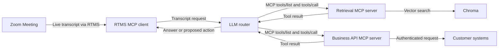

Build a meeting agent that turns live speech into retrieval and tool requests while the meeting is active. The agent can search approved knowledge or propose a business action without coupling transcript ingestion to one database or API.

This design combines [Zoom Realtime Media Streams (RTMS)](https://developers.zoom.us/docs/rtms/) with the [Model Context Protocol (MCP)](https://modelcontextprotocol.io/docs/getting-started/intro). Live transcript text goes to an MCP client that you host. An AI router decides whether it can answer directly or needs one of the tools you allow. Separate MCP servers provide search and business actions.

MCP connects the pieces, but it does not give the agent permission to do anything it wants. You choose the tools, sign in to each connected system, check every input, and route sensitive actions through your approval workflow.

**What you'll need:**

- Transcript access through [RTMS](https://developers.zoom.us/docs/rtms/)
- A backend that can receive webhooks and maintain RTMS sessions
- One or more MCP servers with tools your application is allowed to call
- An approved model provider for routing requests
- Authentication and authorization for every connected business system

**Features:**

- Turn live transcript text into an MCP request.
- Discover tools from the MCP servers configured in `MCP_URLS`.
- Keep retrieval and business actions behind separate tool contracts.
- Log tool arguments and tool results.
- Continue receiving transcripts when a model or tool is unavailable.

Follow along as we walk through the architecture.

## Architecture

### The reusable pattern

The reusable design has four responsibilities: transcript ingestion, model routing, MCP tool hosting, and downstream authorization. The MCP contract lets you replace a search engine or business API without changing how the agent discovers and calls tools.

### How the reference implementation handles it

The linked [RTMS MCP client reference implementation](https://github.com/zoom/rtms-samples/tree/main/rtms_mcp_client) uses TypeScript, [Anthropic](https://docs.anthropic.com/), the MCP TypeScript SDK, and [Chroma](https://docs.trychroma.com/) for vector search. It runs an RTMS client, an LLM router, a retrieval tool server, and a demonstration Zoom OpenAPI tool server as separate processes. Chroma runs as a fifth local service.

The included Zoom OpenAPI tool server is a demo and returns mock data. Replace it with real, authenticated API calls before using customer data.



### Agent integration map

Check what your application already provides before adding components:

| Required capability | Reuse when present | Add when missing |
| --- | --- | --- |
| Webhook endpoint | Existing public API route | HTTPS endpoint for RTMS lifecycle events |
| Signature verification | Existing Zoom webhook middleware | Raw-body HMAC verification and replay protection |
| RTMS session manager | Existing stream registry | State keyed by `rtms_stream_id` |
| Model router | Existing agent orchestration | Provider adapter with bounded context |
| MCP client | Existing MCP connection manager | Tool discovery and invocation boundary |
| Tool authorization | Existing policy and identity layer | Per-tool allowlist, tenant checks, and approval |
| Audit trail | Existing security event store | Durable record of tool request and outcome |

## Implementation Guide

### Part 1: Build the transcript-to-MCP path

#### 1. Separate transcript ingestion from tool routing

The RTMS client buffers at most two adjacent transcript messages before calling the router's `ask-llm` tool. See [`mcp_client/src/index.ts`](https://github.com/zoom/rtms-samples/blob/main/rtms_mcp_client/zoom-rtms-mcp-client/mcp_client/src/index.ts) for the TypeScript implementation. Its error boundary prevents a failed tool call from terminating the media message handler. A production design should also bound queued work and record enough context to retry safely.

The reference runs these processes:

| Service | Purpose | Suggested local port |
| --- | --- | --- |
| `zoom-rtms-mcp-client/mcp_client` | RTMS webhook and transcript ingress | `3001` |
| `llm-router-server` | LLM reasoning and tool routing | `3000` |
| `tools-chroma-server` | Retrieval tools | `5000` |
| `tools-zoom-openapi-server` | Example business API tools | `5001` |
| Chroma | Vector storage | `8000` |

The source defaults both the client and router to port `3000`. The run section sets the client to `3001` so both processes can run together.

**Input:** RTMS transcript event with stream ID, speaker, timestamp, and text

**Output:** Bounded request submitted to the model router without blocking RTMS ingestion

**Invariants:**

- State and queued work are isolated by `rtms_stream_id`
- Duplicate or superseded transcript events do not start duplicate tool work
- Queue depth and context size have explicit limits
- A router failure does not close the RTMS stream

#### 2. Create the Zoom app

Create a Zoom General App in the [Zoom App Marketplace](https://marketplace.zoom.us/) with the RTMS transcript scope. Subscribe its public webhook to the lifecycle events below.

| Setting | Value |
| --- | --- |
| Scope | `meeting:read:meeting_transcript` |
| Events | `meeting.rtms_started`, `meeting.rtms_stopped` |
| Webhook URL | `https://YOUR_DOMAIN.example.com/webhook` |

Enable RTMS for the account and test meeting. Import `manifest.json` only as a starting point and verify it in Marketplace.

Verify webhook signatures over the raw request body, enforce a replay window, and use a timing-safe comparison. Reply before starting RTMS or MCP work.

```javascript
import crypto from 'node:crypto';

function verifyZoomWebhook(rawBody, timestamp, signature, secret) {
  if (Math.abs(Math.floor(Date.now() / 1000) - Number(timestamp)) > 300) return false;
  const message = `v0:${timestamp}:${rawBody.toString('utf8')}`;
  const expected = `v0=${crypto.createHmac('sha256', secret).update(message).digest('hex')}`;
  const received = Buffer.from(signature);
  const computed = Buffer.from(expected);
  return received.length === computed.length && crypto.timingSafeEqual(received, computed);
}
```

Handle Zoom endpoint validation separately because that request follows a different path.

### Part 2: Add controlled tools

#### 3. Register configured MCP tools

At startup, [`llm-router-server/src/index.ts`](https://github.com/zoom/rtms-samples/blob/5c39fca2ed97d75bcbdb318cf246a037835f7d37/rtms_mcp_client/zoom-rtms-mcp-client/llm-router-server/src/index.ts) reads each server URL from `MCP_URLS`, fetches its `/.well-known/mcp.json`, converts the advertised input schema to Zod, and registers a forwarding handler. A failed server connection is logged and the router continues loading the others.

The reference code does not authenticate its local MCP servers, check per-tool permissions, request approval, or persist an audit record. Add those controls before replacing the mock business tools. Code added for those controls should land and be tested in the external implementation before this Blueprint describes them as working.

**Input:** Configured MCP server endpoints and the authenticated application context

**Output:** Tool catalog containing only the tools the current tenant and workflow may use

**Invariants:**

- Tool discovery failure is isolated to the unavailable server
- Tool names and schemas are validated before registration
- Credentials and tenant filters stay outside model-visible arguments
- The allowlist is authoritative even when the model requests another tool
- Mutating tools require the configured approval policy

#### 4. Start the tool layer

Start Chroma, ingest a small non-sensitive test collection, then start the retrieval MCP server. Start the business API MCP server with mock operations first.

Before connecting a real business system, add:

- Per-tool authentication and authorization.
- Input validation for every tool argument.
- Timeouts, safe retries, and protection against running the same action twice.
- An allowlist of operations the meeting agent may request.
- The customer's approval workflow for actions that change or delete data.

The reference implementation uses Chroma for semantic storage. You may use another vector database or search service if it can implement the same retrieval tool contract. Keep credentials and tenant filters inside the tool server, not in the model prompt.

#### 5. Start the router and RTMS client

Start the AI router on port `3000`, then start the RTMS client on `3001`. Only the webhook needs to be public over HTTPS. Keep the MCP services on a private network unless you have added strong authentication.

The webhook must check every request and reply quickly. Handle transcripts and tool calls in the background so a slow tool cannot block RTMS.

#### 6. Test tool selection

Start RTMS in a test meeting. Say something that should get a direct answer, something that should search the knowledge base, and something that should suggest a business action. Check that the router picks only the expected tools and rejects invalid inputs.

For each call, record the relevant transcript text, chosen tool, checked inputs, permission result, response time, and outcome. Remove confidential content from logs.

**Input:** Model-selected tool name and arguments plus user and tenant context

**Output:** Authorized tool result or a structured denial or failure

**Invariants:**

- Every call is authorized again inside the tool boundary
- Tool arguments are validated against the registered schema
- Timeouts and retries are bounded
- Mutating retries use an idempotency key
- Tool output is treated as untrusted before it returns to the model

#### 7. Replace demonstration tools

The reference implementation's Zoom OpenAPI tool server is not ready for production. Replace its mock answers with an approved API client and the correct OAuth sign-in flow. Request only the permissions needed by the MCP tools you keep.

You can replace Chroma or Anthropic too. Keep the MCP tool definitions stable so each part can change without forcing you to rebuild everything else.

### Part 3: Run the reference implementation

#### 8. Install and configure the services

```bash
git clone https://github.com/zoom/rtms-samples.git
cd rtms-samples/rtms_mcp_client/zoom-rtms-mcp-client
```

Run `npm install` in `mcp_client`, `llm-router-server`, and each tool server you plan to start. Configure the RTMS client with the exact source variable names:

```dotenv
ZOOM_CLIENT_ID=YOUR_ZOOM_CLIENT_ID
ZOOM_CLIENT_SECRET=YOUR_ZOOM_CLIENT_SECRET
ZOOM_SECRET_TOKEN=YOUR_ZOOM_WEBHOOK_SECRET_TOKEN
WEBHOOK_PATH=/webhook
LLM_MCP_SERVER_URL=http://localhost:3000/mcp
PORT=3001
```

Configure the router separately:

```dotenv
ANTHROPIC_API_KEY=YOUR_ANTHROPIC_API_KEY
MCP_URLS=http://localhost:5000,http://localhost:5001
```

The router's `.env.example` lists `ANTHROPIC_MODEL`, but the current source hardcodes `claude-3-5-sonnet-20241022` for both model calls. Make the source read the variable before presenting the model as configurable. The Chroma tool server similarly hardcodes `http://localhost:8000`; `CHROMA_URL` is not implemented. Change the source before using a managed Chroma endpoint. Use managed secrets in deployed environments.

#### 9. Start the services in order

Start Chroma, then open a terminal in each service directory and run `npm start` in this order: `tools-chroma-server`, `tools-zoom-openapi-server`, `llm-router-server`, and `mcp_client`. Keep the router on port `3000` and the RTMS client on port `3001` so they do not conflict.

Only expose the RTMS client's webhook. Keep the router, MCP servers, and Chroma on a private network. The repository does not include a tested deployment template, service authentication, or production process supervisor for this reference implementation.

#### 10. Verify the boundary

Confirm that retrieval works against test data and that business actions still return mock values. The reference implementation demonstrates transcript routing and model-selected MCP tool calls with local services. It does not prove production Zoom API calls, downstream OAuth, write-action approval, tenant isolation, per-tool authorization, or durable audit storage.

### Production considerations

- Treat transcripts, AI answers, tool details, and tool results as untrusted input.
- Separate read-only and mutating tools; require explicit approval for the latter.
- Use separate credentials for each customer and check permissions again inside the tool server.
- Define consent, retention, redaction, and data-residency requirements.
- Make sure an unavailable model or tool does not interrupt RTMS.

## App Manifest

The [`manifest.json`](manifest.json) in this directory is a candidate Zoom General App manifest and pre-configures the transcript-to-MCP path: transcript scope, an OAuth callback placeholder, and RTMS lifecycle subscriptions. Import it when creating the app, replacing `YOUR_DOMAIN` first. It does not grant permissions to the systems behind the MCP servers; configure those credentials and scopes independently.

### Zoom scope

- `meeting:read:meeting_transcript`

### Event subscriptions

- `meeting.rtms_started`
- `meeting.rtms_stopped`

### Structure

The Zoom manifest configures transcript ingestion only. MCP server credentials, tool schemas, model access, and downstream scopes belong in the external application and connected systems.

The app owner must verify the manifest in the target Zoom Marketplace account, replace the callback and webhook domains, confirm the current scope and event names, and review the final permission set. The production owner must also approve every MCP tool contract and downstream authorization model.

## Acceptance Criteria

- [ ] Invalid or stale Zoom webhook signatures are rejected before RTMS work begins.
- [ ] Transcript and queue state is isolated by RTMS stream and cleaned up when it ends.
- [ ] The router discovers only configured MCP servers and survives one server being unavailable.
- [ ] A direct-answer request does not call a tool.
- [ ] A retrieval request calls only the expected read-only tool with validated arguments.
- [ ] An unauthorized or unlisted tool request is denied and recorded.
- [ ] A mutating tool cannot run without the configured approval and idempotency controls.
- [ ] Tool, model, and storage failures do not interrupt RTMS transcript ingestion.
- [ ] The production implementation replaces mock business responses and isolates customer credentials and data.

## Related Resources

- [Zoom RTMS documentation](https://developers.zoom.us/docs/rtms/)
- [Model Context Protocol documentation](https://modelcontextprotocol.io/docs/getting-started/intro)
- [RTMS MCP client reference implementation](https://github.com/zoom/rtms-samples/tree/main/rtms_mcp_client)
- [MCP TypeScript SDK](https://github.com/modelcontextprotocol/typescript-sdk)
