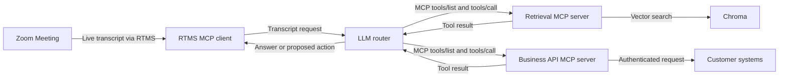

A transcript can tell you what someone said, but it cannot look up a customer, search a knowledge base, or complete a task. A meeting agent needs a safe way to turn a spoken request into a tool call. Your team still needs to control the tools, permissions, and activity log.

This design combines [Zoom Realtime Media Streams (RTMS)](https://developers.zoom.us/docs/rtms/) with the [Model Context Protocol (MCP)](https://modelcontextprotocol.io/docs/getting-started/intro). Live transcript text goes to an MCP client that you host. An AI router decides whether it can answer directly or needs one of the tools you allow. Separate MCP servers provide search and business actions.

MCP connects the pieces, but it does not give the agent permission to do anything it wants. You choose the tools, sign in to each connected system, check every input, and route sensitive actions through your approval workflow.

## Features

The first end-to-end build should:

- Turn live transcript text into an MCP request.
- Discover only the tools configured for that agent.
- Keep retrieval and business actions behind separate tool contracts.
- Log the selected tool, checked arguments, permission result, and outcome.
- Continue receiving transcripts when a model or tool is unavailable.

## Architecture

### The reusable pattern

The reusable design has four responsibilities: transcript ingestion, model routing, MCP tool hosting, and downstream authorization. The MCP contract lets you replace a search engine or business API without changing how the agent discovers and calls tools.

### How the reference implementation handles it

The linked [RTMS MCP client reference implementation](https://github.com/zoom/rtms-samples/tree/main/rtms_mcp_client) uses TypeScript, [Anthropic](https://docs.anthropic.com/), the MCP TypeScript SDK, and [Chroma](https://docs.trychroma.com/) for vector search. It runs an RTMS client, an LLM router, a retrieval tool server, and a demonstration Zoom OpenAPI tool server as separate processes. Chroma runs as a fifth local service.

The included Zoom OpenAPI tool server is a demo and returns mock data. Replace it with real, authenticated API calls before using customer data.



## Implementation Guide

### Part 1: Build the transcript-to-MCP path

#### 1. Install the reference services

Use the Node.js version required by the reference implementation and a local or managed Chroma database.

```bash
git clone https://github.com/zoom/rtms-samples.git
cd rtms-samples/rtms_mcp_client
```

Install dependencies separately in these directories:

| Service | Purpose | Suggested local port |
| --- | --- | --- |
| `zoom-rtms-mcp-client` | RTMS webhook and transcript ingress | `3001` |
| `llm-router-server` | LLM reasoning and tool routing | `3000` |
| `tools-chroma-server` | Retrieval tools | `5000` |
| `tools-zoom-openapi-server` | Example business API tools | `5001` |
| Chroma | Vector storage | `8000` |

The source defaults both the client and router to port `3000`. Set the client to `3001` so the processes can run together. Each TypeScript project has its own `package.json`; run `npm install` in each project you plan to start.

#### 2. Create the Zoom app

Create a Zoom General App in the [Zoom App Marketplace](https://marketplace.zoom.us/) with the RTMS transcript scope. Subscribe its public webhook to the lifecycle events below.

| Setting | Value |
| --- | --- |
| Scope | `meeting:read:meeting_transcript` |
| Events | `meeting.rtms_started`, `meeting.rtms_stopped` |
| Webhook URL | `https://YOUR_DOMAIN.example.com/webhook` |

Enable RTMS for the account and test meeting. Import `manifest.json` only as a starting point and verify it in Marketplace.

#### 3. Configure each process

<details>
<summary><strong>Environment variables</strong></summary>

Give each service its own environment file or set of secrets. The linked reference implementation lists the exact variable names. You will need values like these:

```dotenv
ZOOM_CLIENT_ID=YOUR_ZOOM_CLIENT_ID
ZOOM_CLIENT_SECRET=YOUR_ZOOM_CLIENT_SECRET
ZOOM_SECRET_TOKEN=YOUR_ZOOM_WEBHOOK_SECRET_TOKEN
ANTHROPIC_API_KEY=YOUR_ANTHROPIC_API_KEY
CHROMA_URL=http://localhost:8000
LLM_ROUTER_URL=http://localhost:3000
PORT=3001
```

Never copy key-shaped example values from reference implementation files into Blueprint content. Use managed secrets in deployed environments.

</details>

### Part 2: Add controlled tools

#### 4. Start the tool layer

Start Chroma, ingest a small non-sensitive test collection, then start the retrieval MCP server. Start the business API MCP server with mock operations first.

Before connecting a real business system, add:

- Per-tool authentication and authorization.
- Input validation for every tool argument.
- Timeouts, safe retries, and protection against running the same action twice.
- An allowlist of operations the meeting agent may request.
- The customer's approval workflow for actions that change or delete data.

The reference implementation uses Chroma for semantic storage. You may use another vector database or search service if it can implement the same retrieval tool contract. Keep credentials and tenant filters inside the tool server, not in the model prompt.

#### 5. Start the router and RTMS client

Start the AI router on port `3000`, then start the RTMS client on `3001`. Only the webhook needs to be public over HTTPS. Keep the MCP services on a private network unless you have added strong authentication.

The webhook must check every request and reply quickly. Handle transcripts and tool calls in the background so a slow tool cannot block RTMS.

#### 6. Test tool selection

Start RTMS in a test meeting. Say something that should get a direct answer, something that should search the knowledge base, and something that should suggest a business action. Check that the router picks only the expected tools and rejects invalid inputs.

For each call, record the relevant transcript text, chosen tool, checked inputs, permission result, response time, and outcome. Remove confidential content from logs.

#### 7. Replace demonstration tools

The reference implementation's Zoom OpenAPI tool server is not ready for production. Replace its mock answers with an approved API client and the correct OAuth sign-in flow. Request only the permissions needed by the MCP tools you keep.

You can replace Chroma or Anthropic too. Keep the MCP tool definitions stable so each part can change without forcing you to rebuild everything else.

### Part 3: Run the reference implementation

#### 8. Start the services in order

Start Chroma, the retrieval server, the mock business-tool server, the LLM router, and the RTMS client. The linked README contains the per-directory commands; each Node.js process starts with `npm start`.

Only expose the RTMS client's webhook. Keep the router, MCP servers, and Chroma on a private network. The repository does not include a tested deployment template, service authentication, or production process supervisor for this reference implementation.

#### 9. Verify the boundary

Confirm that retrieval works against test data and that business actions still return mock values. The reference implementation proves transcript routing and MCP tool selection. It does not prove production Zoom API calls, downstream OAuth, write-action approval, tenant isolation, or durable audit storage.

### Production considerations

- Treat transcripts, AI answers, tool details, and tool results as untrusted input.
- Separate read-only and mutating tools; require explicit approval for the latter.
- Use separate credentials for each customer and check permissions again inside the tool server.
- Define consent, retention, redaction, and data-residency requirements.
- Make sure an unavailable model or tool does not interrupt RTMS.

## App Manifest

The [`manifest.json`](manifest.json) in this directory is a candidate Zoom General App manifest and pre-configures the transcript-to-MCP path: transcript scope, an OAuth callback placeholder, and RTMS lifecycle subscriptions. Import it when creating the app, replacing `YOUR_DOMAIN` first. It does not grant permissions to the systems behind the MCP servers; configure those credentials and scopes independently.

### Zoom scope

- `meeting:read:meeting_transcript`

### Event subscriptions

- `meeting.rtms_started`
- `meeting.rtms_stopped`

### Structure

The Zoom manifest configures transcript ingestion only. MCP server credentials, tool schemas, model access, and downstream scopes belong in the external application and connected systems.

The app owner must verify the manifest in the target Zoom Marketplace account, replace the callback and webhook domains, confirm the current scope and event names, and review the final permission set. The production owner must also approve every MCP tool contract and downstream authorization model.

## Related Resources

- [Zoom RTMS documentation](https://developers.zoom.us/docs/rtms/)
- [Model Context Protocol documentation](https://modelcontextprotocol.io/docs/getting-started/intro)
- [RTMS MCP client reference implementation](https://github.com/zoom/rtms-samples/tree/main/rtms_mcp_client)
- [MCP TypeScript SDK](https://github.com/modelcontextprotocol/typescript-sdk)

## What Will You Build?

This Blueprint shows one path: live transcripts routed through Anthropic to retrieval and business tools exposed over MCP. The same architecture supports many variations:

- Replace one mock tool with a read-only operation from a business system.
- Replace Chroma with an existing search platform.
- Add a narrow write action behind an approval workflow.
- Use another model without changing the MCP tool contracts.

RTMS provides the live transcript. The MCP tool contracts and downstream authorization are yours to build.
