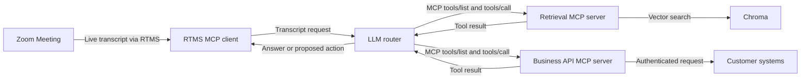

## Problem Statement

A transcript can tell you what someone said, but it cannot look up a customer, search a knowledge base, or complete a task. A meeting agent needs a safe way to turn a spoken request into a tool call. Your team still needs to control the tools, permissions, and activity log.

This design combines **Zoom Realtime Media Streams (RTMS)** with the Model Context Protocol (MCP). Live transcript text goes to an MCP client that you host. An AI router decides whether it can answer directly or needs one of the tools you allow. Separate MCP servers provide search and business actions.

MCP connects the pieces, but it does not give the agent permission to do anything it wants. You choose the tools, sign in to each connected system, check every input, and decide which actions need a person to approve them.

## Architecture

The sample runs four TypeScript services and a Chroma database. The RTMS client receives the live transcript and sends useful text to the AI router. The router checks which MCP tools are available, calls one when needed, and returns the result.

The included Zoom OpenAPI tool server is a demo and returns mock data. Replace it with real, authenticated API calls before using customer data.



## Implementation Guide

### 1. Install the reference services

Use the Node.js version required by the sample and a local or managed Chroma database.

```bash
git clone https://github.com/zoom/rtms-samples.git
cd rtms-samples/rtms_mcp_client
```

Install dependencies separately in these directories:

| Service | Purpose | Suggested local port |
| --- | --- | --- |
| `zoom-rtms-mcp-client` | RTMS webhook and transcript ingress | `3001` |
| `llm-router-server` | LLM reasoning and tool routing | `3000` |
| `tools-chroma-server` | Retrieval tools | `5000` |
| `tools-zoom-openapi-server` | Example business API tools | `5001` |
| Chroma | Vector storage | `8000` |

The source defaults both the client and router to port `3000`. Set the client to `3001` so the processes can run together.

### 2. Create the Zoom app

Create a Zoom General App with the RTMS transcript scope. Subscribe its public webhook to the lifecycle events below.

| Setting | Value |
| --- | --- |
| Scope | `meeting:read:meeting_transcript` |
| Events | `meeting.rtms_started`, `meeting.rtms_stopped` |
| Webhook URL | `https://YOUR_DOMAIN.example.com/webhook` |

Enable RTMS for the account and test meeting. Import `manifest.json` only as a starting point and verify it in Marketplace.

### 3. Configure each process

Give each service its own environment file or set of secrets. The linked sample lists the exact variable names. You will need values like these:

```dotenv
ZOOM_CLIENT_ID=YOUR_ZOOM_CLIENT_ID
ZOOM_CLIENT_SECRET=YOUR_ZOOM_CLIENT_SECRET
ZOOM_SECRET_TOKEN=YOUR_ZOOM_WEBHOOK_SECRET_TOKEN
ANTHROPIC_API_KEY=YOUR_ANTHROPIC_API_KEY
CHROMA_URL=http://localhost:8000
LLM_ROUTER_URL=http://localhost:3000
PORT=3001
```

Never copy key-shaped example values from sample files into Blueprint content. Use managed secrets in deployed environments.

### 4. Start the tool layer

Start Chroma, ingest a small non-sensitive test collection, then start the retrieval MCP server. Start the business API MCP server with mock operations first.

Before connecting a real business system, add:

- Per-tool authentication and authorization.
- Input validation for every tool argument.
- Timeouts, safe retries, and protection against running the same action twice.
- An allowlist of operations the meeting agent may request.
- Human approval for actions that change or delete data.

### 5. Start the router and RTMS client

Start the AI router on port `3000`, then start the RTMS client on `3001`. Only the webhook needs to be public over HTTPS. Keep the MCP services on a private network unless you have added strong authentication.

The webhook must check every request and reply quickly. Handle transcripts and tool calls in the background so a slow tool cannot block RTMS.

### 6. Test tool selection

Start RTMS in a test meeting. Say something that should get a direct answer, something that should search the knowledge base, and something that should suggest a business action. Check that the router picks only the expected tools and rejects invalid inputs.

For each call, record the relevant transcript text, chosen tool, checked inputs, permission result, response time, and outcome. Remove confidential content from logs.

### 7. Replace demonstration tools

The sample's Zoom OpenAPI tool server is not ready for production. Replace its mock answers with an approved API client and the correct OAuth sign-in flow. Request only the permissions needed by the MCP tools you keep.

You can replace Chroma or Anthropic too. Keep the MCP tool definitions stable so each part can change without forcing you to rebuild everything else.

### Production considerations

- Treat transcripts, AI answers, tool details, and tool results as untrusted input.
- Separate read-only and mutating tools; require explicit approval for the latter.
- Use separate credentials for each customer and check permissions again inside the tool server.
- Define consent, retention, redaction, and data-residency requirements.
- Make sure an unavailable model or tool does not interrupt RTMS.

## App Manifest

[`manifest.json`](manifest.json) is a candidate General App manifest for live transcript access and RTMS lifecycle events. It does not grant permissions to the systems behind the MCP servers; configure those credentials and scopes independently.

A human app owner must verify the manifest in the target Zoom Marketplace account, replace the callback and webhook domains, confirm the current scope and event names, and review the final permission set. The production owner must also approve every MCP tool contract and downstream authorization model.
